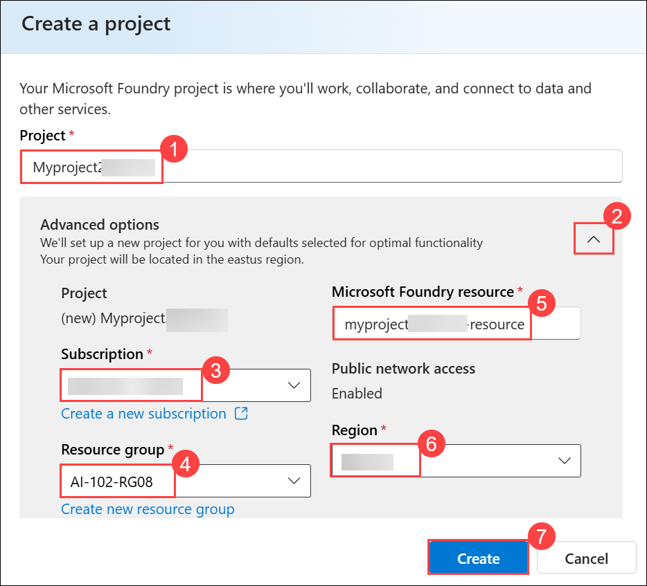
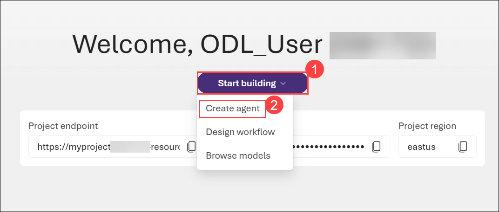
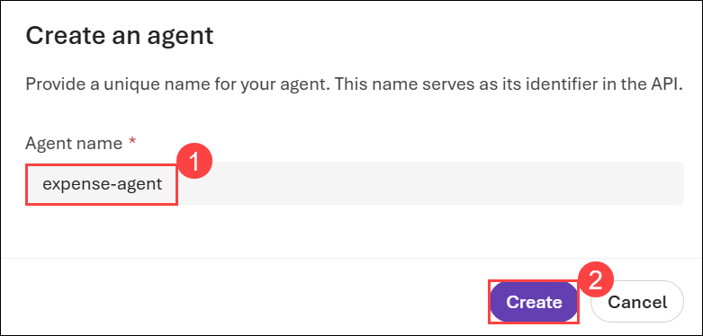
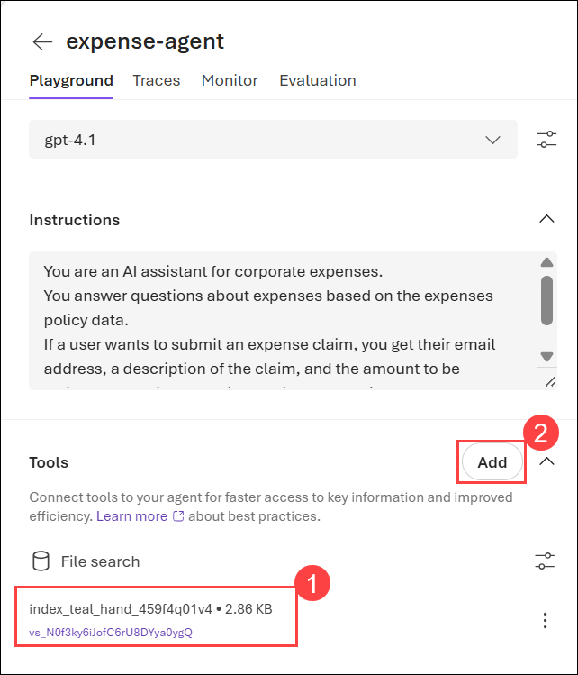

# Lab 01: Explore AI Agent development

### Estimated Duration: 30 Minutes

## Overview

In this exercise, you use the Azure AI Agent service in the Microsoft Foundry portal to create a simple AI agent that assists employees with expense claims.

> **Note:** Some of the technologies used in this exercise are in preview or in active development. You may experience some unexpected behavior, warnings, or errors.

## Lab Objectives

In this lab, you'll perform the following tasks:

- **Task 1:** Create a Foundry project and agent

- **Task 2:** Configure your agent

- **Task 3:** Test your agent

## Task 1: Create a Foundry project and agent

Let's start by creating a Foundry project.

1. Open a new tab in the browser, right-click on the following link [Azure AI Foundry portal](https://ai.azure.com)[https://ai.azure.com/], then **Copy link** and paste it in a browser tab to log in to **Azure AI Foundry portal**.

1. Click on **Sign in**.
 
    

1. If prompted, provide the credentials below:
 
   - **Email/Username:** <inject key="AzureAdUserEmail"></inject>
    
     

   - **Password:** <inject key="AzureAdUserPassword"></inject>
    
     

1. When the **Stay signed in?** window appears, select **No**.

    

    >**Note:** Close any tips or quick start panes that are opened the first time you sign in, and if necessary use the **Foundry** logo at the top left to navigate to the home page, which looks similar to the following image (close the **Help** pane if it's open):

1. At the top of the **Microsoft Foundry** portal, enable the **New Foundry toggle (1)** to switch to the latest Foundry user interface.

1. From the **Select a project to continue** dialog, click the drop-down under **Select or search for a project**, and then select **Create a new project (2)**.

     

1. In the **Create a project** window, enter **Myproject<inject key="DeploymentID"></inject> (1)** as the project name. Open the **Advanced options (2)** drop-down, fill in the following details, and then click **Create (7)**:

    * Subscription: **Choose Default Subscription (3)**
    * Resource group: **AI-102-RG08 (4)**
    * Azure AI Foundry resource: **Keep as Default (5)**
    * Region: **<inject key="Region"></inject> (6)**

      

      >**Note:** Some Azure AI resources are constrained by regional model quotas. In the event of a quota limit being exceeded later in the exercise, there's a possibility you may need to create another resource in a different region.

1. When your project is created, select **Start building (1)**, and select **Create agent (2)** from the drop-down menu.

    

1. On the **Create an agent** page, enter **expense-agent (1)** in the **Agent name** field, and then select **Create (2)**.

     

The playground will open for your newly created agent. You'll see that an available deployed model is already selected for you.

> **Congratulations** on completing the task! Now, it's time to validate it. Here are the steps:
>
> - Hit the Validate button for the corresponding task. If you receive a success message, you can proceed to the next task.
> - If not, carefully read the error message and retry the step, following the instructions in the lab guide.
> - If you need any assistance, please contact us at cloudlabs-support@spektrasystems.com. We are available 24/7 to help.
 
<validation step="74c732c7-ce7d-4057-aa11-9eb0f6b77ac8" />


## Task 2: Configure your agent

Now that you have an agent crated, you're ready to configure it. In this exercise, you'll configure a simple agent that answers questions based on a corporate expense policy. You'll download the expenses policy document, and use it as *grounding* data for the agent.

1. Open another browser tab, and download [Expenses_policy.docx](https://raw.githubusercontent.com/MicrosoftLearning/mslearn-ai-agents/main/Labfiles/01-agent-fundamentals/Expenses_Policy.docx) from `https://raw.githubusercontent.com/MicrosoftLearning/mslearn-ai-agents/main/Labfiles/01-agent-fundamentals/Expenses_Policy.docx` and save it locally. This document contains details of the expenses policy for the fictional Contoso corporation.

1. Return to the browser tab where you have the playground open for your expense agent.

1. In **Instructions (1)**, enter the provided prompt text

    ```prompt
   You are an AI assistant for corporate expenses.
   You answer questions about expenses based on the expenses policy data.
   If a user wants to submit an expense claim, you get their email address, a description of the claim, and the amount to be claimed and write the claim details to a text file that the user can download.
    ```

1. Below the **Instructions**, expand the **Tools** section. Select **Upload files**

    

1. Keep the default values for the **Index option** and **Vector index name**.

1. Select the **browse for files** option to upload the **Expenses_policy.docx** local file that you downloaded previously.

      

1. In the **Open dialog** box, select **Downloads (1)**, choose the **expenses_policy file (2)**, and then select **Open (3)** to upload the file.

    

1. When your file is successfully uploaded, select **Attach**.

    

1. In the **Tools** section, verify that a new **File search (1)** is listed and shown as containing 1 file.

1. In the **Tools** section, select **Add (2)**.

    

1. In the **Select a tool** dialog box, select **Code interpreter (1)** and then select **Add tool (2)** (you do not need to upload any files for the code interpreter).

    

Your agent will use the document you uploaded as its knowledge source to *ground* its responses (in other words, it will answer questions based on the contents of this document). It will use the code interpreter tool as required to perform actions by generating and running its own Python code.

## Task 3: Test your agent

Now that you've created an agent, you can test it in the playground chat.

1. In the **Playground** chat box, enter `What's the maximum I can claim for meals?` **(1)**, and then select **Send (2)**.

    

1. Review the agent’s response and confirm it is based on the uploaded **Expenses_Policy.docx** knowledge source.

    

    > **Note:** If the agent fails to respond because the rate limit is exceeded. Wait a few seconds and try again. If there is insufficient quota available in your subscription, the model may not be able to respond. If the problem persists, try to increase the quota for your model on the **Models** page.

1. Try the following follow-up prompt: `I'd like to submit a claim for a meal.` and review the response. The agent should ask you for the required information to submit a claim.

    

1. Provide the agent with an email address; for example, `fred@contoso.com`. The agent should acknowledge the response and request the remaining information required for the expense claim (description and amount)

    

1. Submit a prompt that describes the claim and the amount; for example, `Breakfast cost me $20`.

1. The agent should use the code interpreter to prepare the expense claim text file, and provide a link so you can download it.

    

1. Download and open the text document to see the expense claim details.

## Optional: Explore the code

After experimenting with your agent in the playground, you may want to integrate it into your own client application. The **Code** tab provides sample code that shows how to interact with your agent programmatically.

1. In the agent playground, select the **Code** tab to view the sample code.

    

1. Review the Python code. This code demonstrates how to:
    - Connect to your agent using the Azure AI Projects SDK
    - Send messages to the agent
    - Retrieve and process responses
    
1. Select **.env variables** to view the environment variables you need to run this code.

    

1. You can use this code as a starting point for building your own client application that interacts with the agent you created.

1. Optionally, select **Open in VS Code for the Web** to launch a preconfigured workspace with the sample code ready to run.

    > **Note:** It may take a few minutes for the workspace to be prepared. Follow the instructions provided in the workspace to successfully run the code.

## Summary

### You have successfully completed the Hands-on Lab!