# Lab 02: Develop an AI agent

### Estimated Duration: 30 Minutes

## Overview

In this lab, you'll use the Microsoft Foundry SDK for Python to build a client app that connects to your existing Foundry project and interacts with an AI data analysis agent. You’ll upload a dataset and configure an agent that uses the Code Interpreter tool to perform statistical analysis, generate insights, and create visualizations. By the end, you’ll run a stateful conversation with the agent, enabling dynamic data analysis through multiple user prompts.

> **Tip:** The code used in this exercise is based on the for Microsoft Foundry SDK for Python. You can develop similar solutions using the SDKs for Microsoft .NET, JavaScript, and Java. Refer to [Microsoft Foundry SDK client libraries](https://learn.microsoft.com/azure/ai-foundry/how-to/develop/sdk-overview) for details.

> **Note:** Some of the technologies used in this exercise are in preview or in active development. You may experience some unexpected behavior, warnings, or errors.

## Lab Objectives

- **Task 1:** Create an agent client app

- **Task 2:** Configure the application settings

- **Task 3:** Write code for an agent app

- **Task 4:** Sign into Azure and run the app

## Task 1: Create an agent client app

In this task, you will prepare a client application environment in Azure Cloud Shell by cloning the provided GitHub repository and reviewing the project files. By the end of this task, you will have the application code and supporting files ready for configuration.

1. Open a new browser tab (keeping the Microsoft Foundry portal open in the existing tab). Then in the new tab, browse to the [Azure portal](https://portal.azure.com) at `https://portal.azure.com`.

1. If prompted, provide the credentials below:

    - **Email/Username:** <inject key="AzureAdUserEmail"></inject>

    - **Password:** <inject key="AzureAdUserPassword"></inject> 

      >**Note:** Close any welcome notifications to see the Azure portal home page.

1. On the **Azure portal** homepage, click the **\[>\_] Cloud Shell (1)** button located to the right of the **Copilot** tab at the top. This opens a new Cloud Shell session. In the **Welcome to Azure Cloud Shell** window, choose **PowerShell (2)**.

    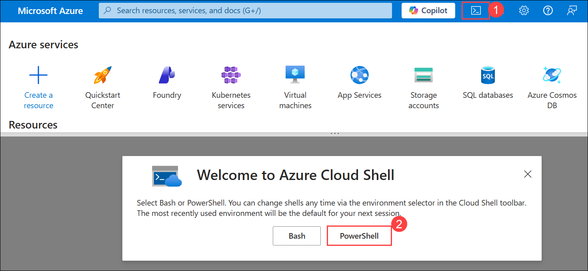

    >**Note:** The cloud shell provides a command-line interface in a pane at the bottom of the Azure portal. You can resize or maximize this pane to make it easier to work in.

    > **Note:** If you have previously created a cloud shell that uses a **Bash** environment, switch it to **PowerShell**.

1. In the **Getting started** window, ensure **No storage account required (1)** is selected. From the **Subscription** drop-down, choose **Default subscription (2)**, then click **Apply (3)**.

    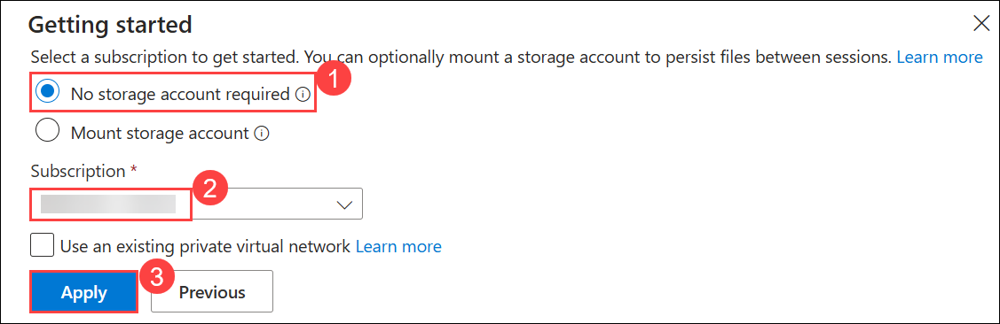

1. In the Cloud Shell toolbar, open the **Settings (1)** menu and choose **Go to Classic version (2)** from the drop-down.

    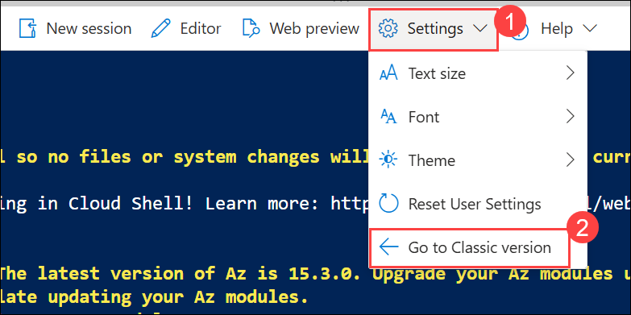

    >**Note:** **Ensure you've switched to the classic version of the cloud shell before continuing.**

1. In the Cloud Shell pane, run the following commands to clone the GitHub repository with the code files for this exercise. You can type the command directly, or copy it to the clipboard, then right-click in the command line and paste it as plain text.

    ```
   rm -r ai-agents -f
   git clone https://github.com/MicrosoftLearning/mslearn-ai-agents ai-agents
    ```

    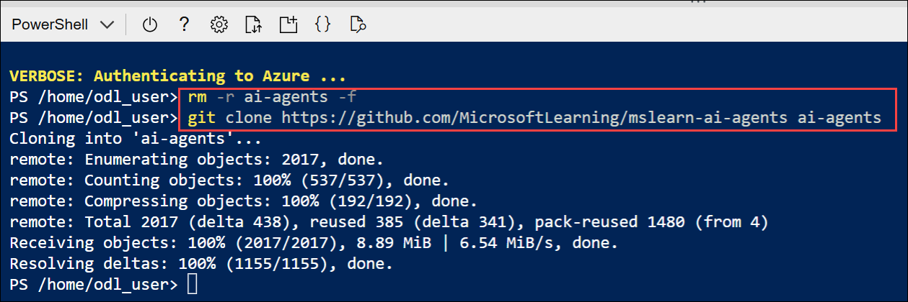

    > **Tip:** As you enter commands into the cloudshell, the output may take up a large amount of the screen buffer and the cursor on the current line may be obscured. You can clear the screen by entering the `cls` command to make it easier to focus on each task.

1. Once the repository is cloned, go to the folder with the chat application code files and open them to view their contents.

    ```
   cd ai-agents/Labfiles/02-build-ai-agent/Python
   ls -a -l
    ```
    
    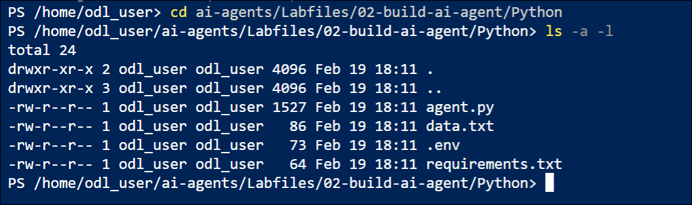

1. The folder contains application code, configuration settings, and data.


## Task 2: Configure the application settings

In this task, you will install the required Python dependencies, update the configuration file with your Foundry project endpoint and model deployment name, and save the changes. By the end of this task, your application will be properly configured to connect to your Foundry project.

1. In the cloud shell command-line pane, enter the following command to install the libraries you'll use:

    ```
   python -m venv labenv
   ./labenv/bin/Activate.ps1
   pip install -r requirements.txt
    ```

    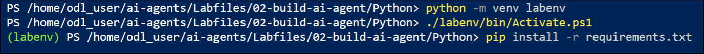

    > **Tip:** As you enter commands into the cloudshell, the output may take up a large amount of the screen buffer and the cursor on the current line may be obscured. You can clear the screen by entering the `cls` command to make it easier to focus on each task.

1. Enter the following command to edit the configuration file that has been provided:

    ```
   code .env
    ```

1. In the code file, replace the placeholder values with the correct details for your project:

    * PROJECT\_ENDPOINT: **Foundry project endpoint**
    * MODEL\_DEPLOYMENT\_NAME: **gpt-4.1**

        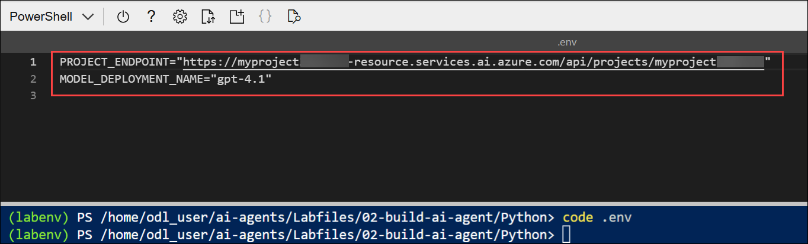

        > **Note:** Paste the project endpoint you copied in Lab 1 – Task 1.

1. After replacing the placeholders, save your changes in the code editor using **CTRL+S** or **Right-click > Save**. Then close the editor with **CTRL+Q** or **Right-click > Quit**, leaving the Cloud Shell command line open.

## Task 3: Write code for an agent app

In this task, you will complete the application code to connect to your Microsoft Foundry project, upload a data file, create a Code Interpreter tool, and define an AI agent. By the end of this task, the application will be capable of running a stateful conversation with the agent and performing data analysis.

> **Tip:** As you add code, be sure to maintain the correct indentation. Use the comment indentation levels as a guide.

1. Enter the following command to edit the code file that has been provided:

    ```
   code agent.py
    ```

    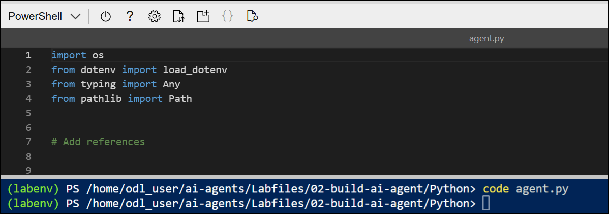

1. Review the existing code, which retrieves the application configuration settings and loads data from *data.txt* to be analyzed. The rest of the file includes comments where you'll add the necessary code to implement your data analysis agent.

1. Find the comment **Add references** and add the following code to import the classes you'll need to build an Azure AI agent that uses the built-in code interpreter tool:

    ```python
   # Add references
   from azure.identity import DefaultAzureCredential
   from azure.ai.projects import AIProjectClient
   from azure.ai.projects.models import PromptAgentDefinition, CodeInterpreterTool, CodeInterpreterToolAuto

    ```

    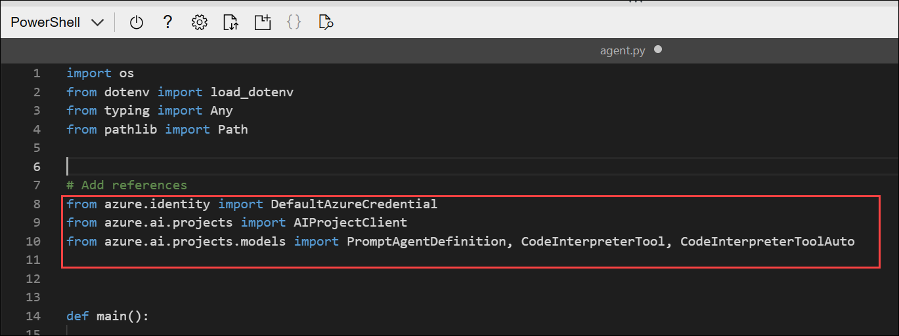

1. Find the comment **Connect to the AI Project and OpenAI clients** and add the following code to connect to the Azure AI project.

    > **Tip:** Be careful to maintain the correct indentation level.

    ```python
   # Connect to the AI Project and OpenAI clients
   with (
       DefaultAzureCredential(
           exclude_environment_credential=True,
           exclude_managed_identity_credential=True) as credential,
        AIProjectClient(endpoint=project_endpoint, credential=credential) as project_client,
        project_client.get_openai_client() as openai_client
   ):
    ```
    
    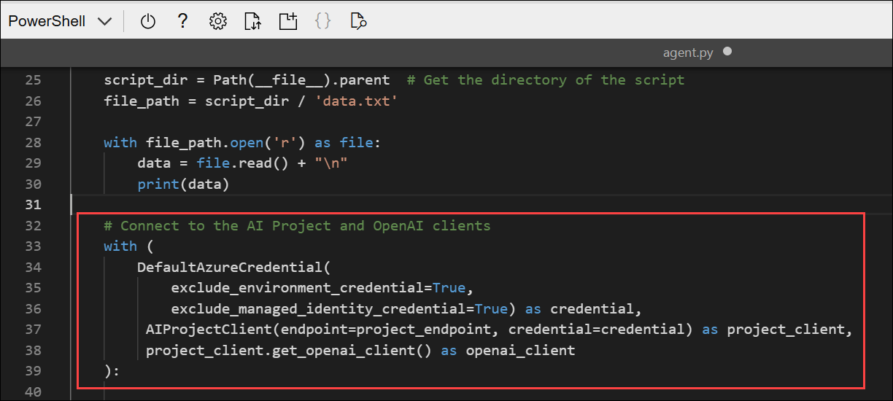

    - The code connects to the Foundry project using the current Azure credentials. The final *with agent_client* statement starts a code block that defines the scope of the client, ensuring it's cleaned up when the code within the block is finished.

1. Find the comment **Upload the data file and create a CodeInterpreterTool**, within the *with agent_client* block, and add the following code to upload the data file to the project and create a CodeInterpreterTool that can access the data in it:

    ```python
   # Upload the data file and create a CodeInterpreterTool
   file = openai_client.files.create(
       file=open(file_path, "rb"), purpose="assistants"
   )
   print(f"Uploaded {file.filename}")

   code_interpreter = CodeInterpreterTool(
       container=CodeInterpreterToolAuto(file_ids=[file.id])
   )

    ```

    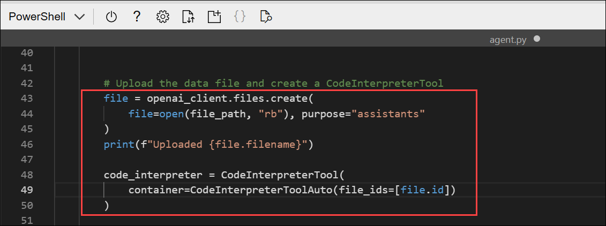
    
1. Find the comment **Define an agent that uses the CodeInterpreterTool** and add the following code to define an AI agent that analyzes data and can use the code interpreter tool you defined previously:

    ```python
   # Define an agent that uses the CodeInterpreterTool
   agent = project_client.agents.create_version(
       agent_name="data-agent",
       definition=PromptAgentDefinition(
           model=model_deployment,
           instructions="You are an AI agent that analyzes the data in the file that has been uploaded. Use Python to calculate statistical metrics as necessary.",
           tools=[code_interpreter],
       ),
   )
   print(f"Using agent: {agent.name}")
    ```

    

1. Find the comment **Create a conversation for the chat session** and add the following code to start a thread on which the chat session with the agent will run:

    ```python
   # Create a conversation for the chat session
   conversation = openai_client.conversations.create()
    ```

    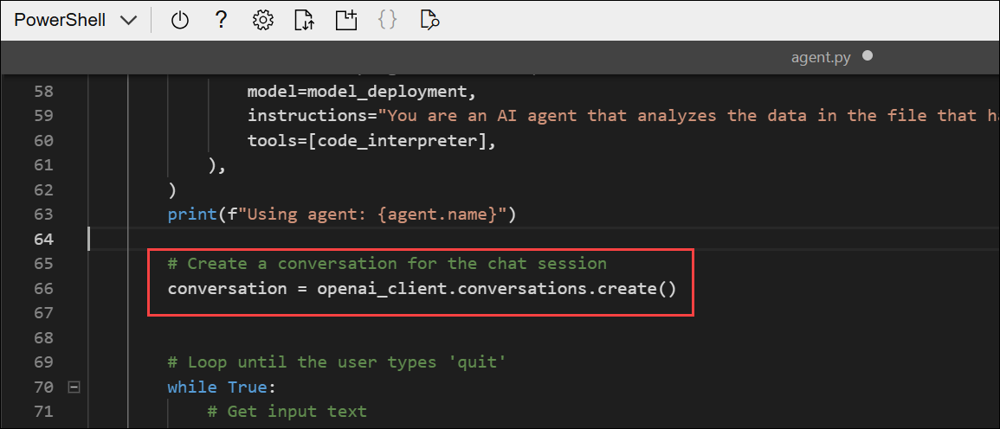
    
1. Note that the next section of code sets up a loop for a user to enter a prompt, ending when the user enters "quit".

1. Find the comment **Send a prompt to the agent** and add the following code to add a user message to the prompt (along with the data from the file that was loaded previously), and then run thread with the agent.

    ```python
   # Send a prompt to the agent
   openai_client.conversations.items.create(
       conversation_id=conversation.id,
       items=[{"type": "message", "role": "user", "content": user_prompt}],
   )

   response = openai_client.responses.create(
       conversation=conversation.id,
       extra_body={"agent": {"name": agent.name, "type": "agent_reference"}},
       input="",
   )
    ```

    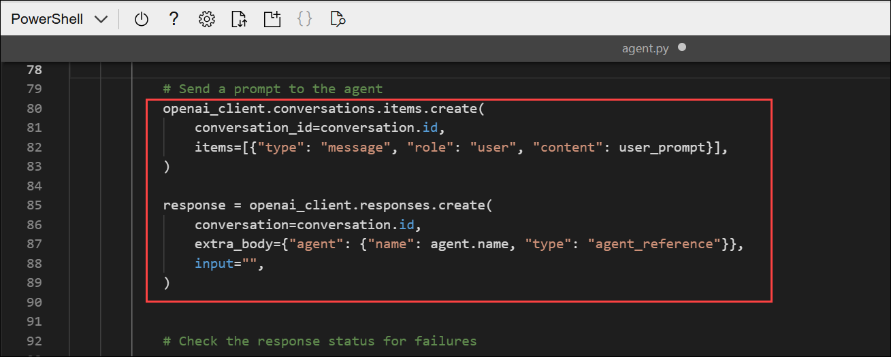

1. Find the comment **Check the response status for failures** and add the following code to check for any errors.

    ```python
   # Check the response status for failures
   if response.status == "failed":
       print(f"Response failed: {response.error}")
    ```

1. Find the comment **Show the latest response from the agent** and add the following code to retrieve the messages from the completed thread and display the last one that was sent by the agent.

    ```python
   # Show the latest response from the agent
   print(f"Agent: {response.output_text}")
    ```

    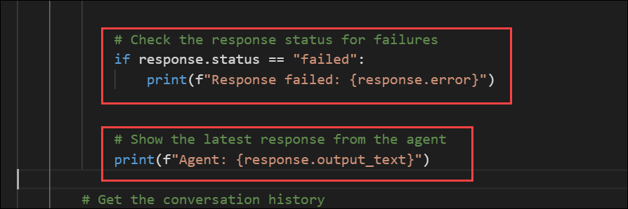

1. Find the comment **Get the conversation history**, which is after the loop ends, and add the following code to print out the messages from the conversation thread; reversing the order to show them in chronological sequence

    ```python
    # Get the conversation history
    print("\nConversation Log:\n")
    items = openai_client.conversations.items.list(conversation_id=conversation.id)
    for item in items:
        if item.type == "message":
            print(f"item.content[0].type = {item.content[0].type}")
            role = item.role.upper()
            content = item.content[0].text
            print(f"{role}: {content}\n")
    ```

    

1. Find the comment **Clean up** and add the following code to delete the agent and thread when no longer needed.

    ```python
   # Clean up
   openai_client.conversations.delete(conversation_id=conversation.id)
   print("Conversation deleted")

   project_client.agents.delete_version(agent_name=agent.name, agent_version=agent.version)
   print("Agent deleted")
    ```

    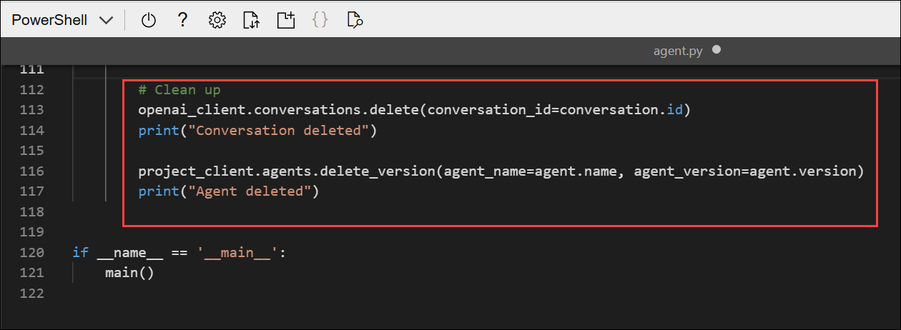

1. Review the code, using the comments to understand how it:
    - Connects to the AI Foundry project.
    - Uploads the data file and creates a code interpreter tool that can access it.
    - Creates a new agent that uses the code interpreter tool and has explicit instructions to use Python as necessary for statistical analysis.
    - Runs a thread with a prompt message from the user along with the data to be analyzed.
    - Checks the status of the run in case there's a failure
    - Retrieves the messages from the completed thread and displays the last one sent by the agent.
    - Displays the conversation history
    - Deletes the agent and thread when they're no longer required.

1. Save the code file **CTRL+S** when you have finished. You can also close the code editor **CTRL+Q** though you may want to keep it open in case you need to make any edits to the code you added. In either case, keep the cloud shell command-line pane open.

## Task 4: Sign into Azure and run the app

In this task, you will authenticate to Azure using the Azure CLI and run the client application. You will interact with the agent by submitting prompts, reviewing responses, and validating its ability to analyze data and generate results dynamically.

1. In the cloud shell command-line pane, enter the following command to sign into Azure. Click on the **Link (1)** and copy the **code (2)** provided.

    ```
    az login
    ```

    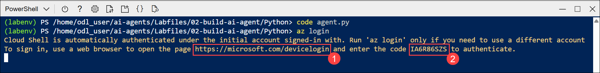

    > **Note:** In most scenarios, just using *az login* will be sufficient. However, if you have subscriptions in multiple tenants, you may need to specify the tenant by using the *--tenant* parameter. See [Sign into Azure interactively using the Azure CLI](https://learn.microsoft.com/cli/azure/authenticate-azure-cli-interactively) for details.

1. In the new browser tab, when the **Enter code to allow access (1)** window appears, paste the copied code and select **Next (2)**.

    

1. In the **Pick an account** dialog box, choose **ODL_User<inject key="DeploymentID"></inject>**. 

    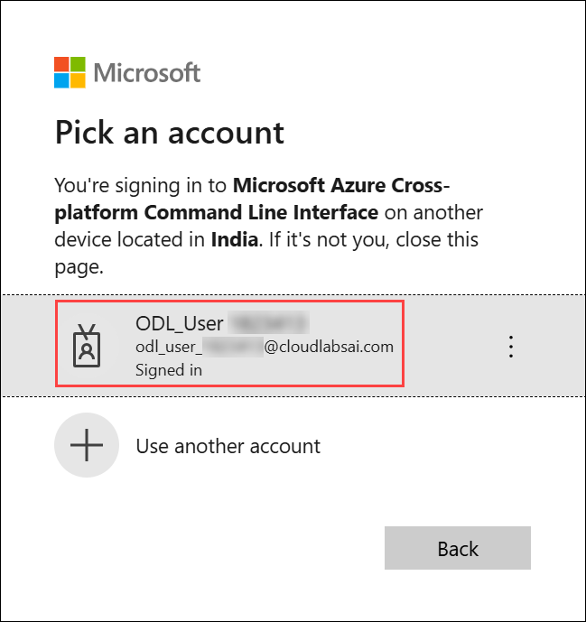

1. In the **Are you trying to sign in to Microsoft Azure CLI?** dialog box, click **Continue**.

    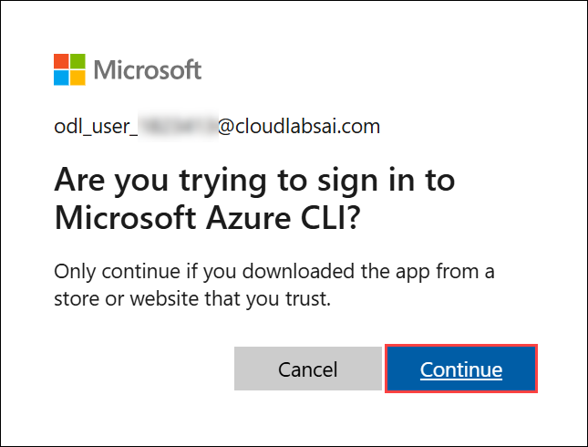

1. When the **Microsoft Azure Cross-platform Command Line Interface** window pops up, return to the browser tab with Cloud Shell open. 

    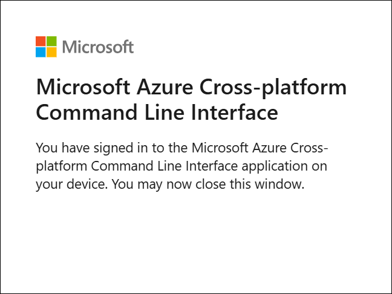

1. In the Cloud Shell console, press **Enter** to select the only available subscription.

    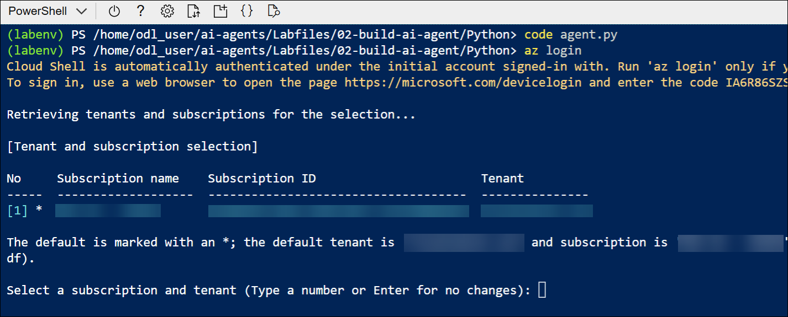

1. After you have signed in, enter the following command to run the application:

    ```
    python agent.py
    ```

    
    
    - The application runs using the credentials for your authenticated Azure session to connect to your project and create and run the agent.

1. When prompted, view the data that the app has loaded from the *data.txt* text file. Then enter a prompt such as:

    ```
   What's the category with the highest cost?
    ```

    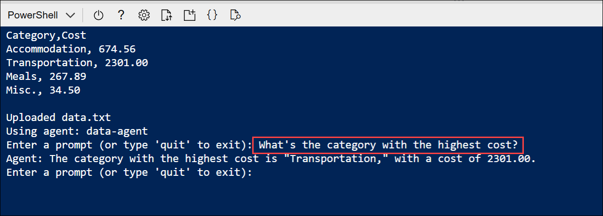

    > **Tip:** If the app fails because the rate limit is exceeded. Wait a few seconds and try again. If there is insufficient quota available in your subscription, the model may not be able to respond.

1. View the response. Then enter another prompt, this time requesting a visualization:

    ```
   Create a text-based bar chart showing cost by category
    ```

    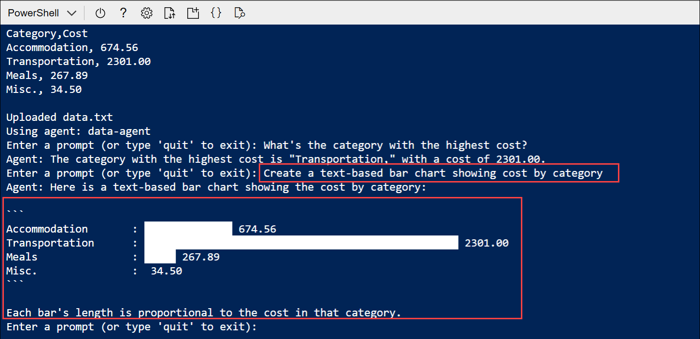

1. View the response. Then enter another prompt, this time requesting a statistical metric:

    ```
   What's the standard deviation of cost?
    ```

    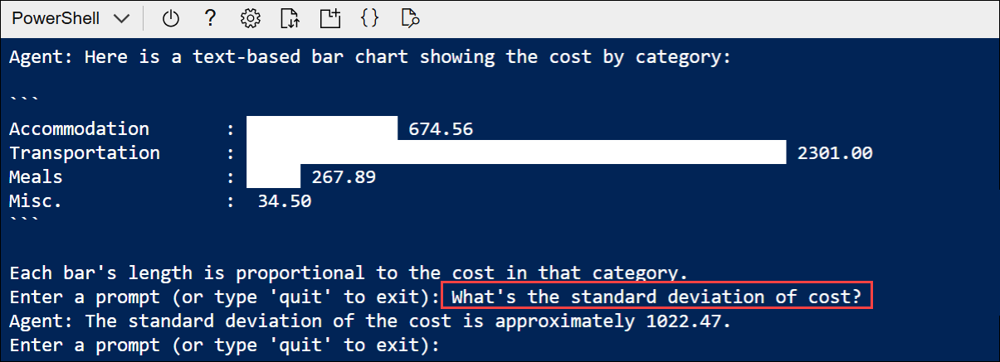

1. You can continue the conversation if you like. The thread is *stateful*, so it retains the conversation history - meaning that the agent has the full context for each response. Enter `quit` when you're done.

1. Review the conversation messages that were retrieved from the thread - which may include messages the agent generated to explain its steps when using the code interpreter tool.

1. In the Cloud Shell window, select the **Close (X)** icon to exit Cloud Shell before proceeding to the next lab.

    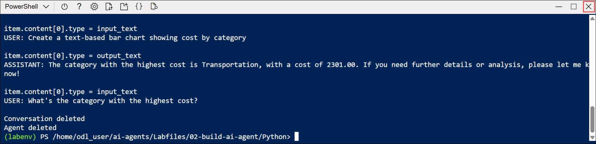

## Summary

In this lab, you used the Microsoft Foundry SDK for Python to build a client application that connects to your existing Foundry project and runs an AI data analysis agent. You configured the application, uploaded a dataset, and created an agent with the Code Interpreter tool to analyze data, generate insights, and support stateful conversations. You then authenticated to Azure, executed the application, and interacted with the agent to produce visualizations and statistical results from the dataset.

### You have successfully completed the lab. Click on **Next >>** to proceed with the next Lab.

   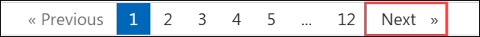