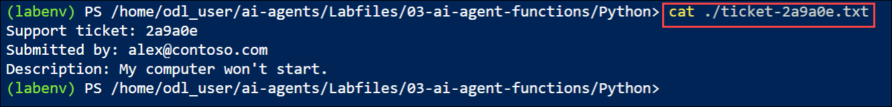
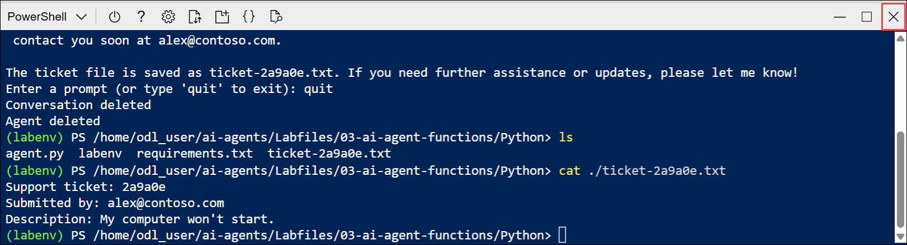

# Lab 04: Use a custom function in an AI agent

### Estimated Duration : 30 Minutes

## Overview

In this lab, you will build a technical support AI agent using the Microsoft Foundry SDK for Python and integrate a custom function tool to automate ticket creation. You will configure your project in Azure Cloud Shell, connect to your Foundry project, and implement function-calling logic within the agent. Finally, you will authenticate to Azure, run the application, and verify that the agent collects issue details and generates support ticket files automatically.

> **Tip:** The code used in this exercise is based on the for Microsoft Foundry SDK for Python. You can develop similar solutions using the SDKs for Microsoft .NET, JavaScript, and Java. Refer to [Microsoft Foundry SDK client libraries](https://learn.microsoft.com/azure/ai-foundry/how-to/develop/sdk-overview) for details.

> **Note:** Some of the technologies used in this exercise are in preview or in active development. You may experience some unexpected behavior, warnings, or errors.

## Lab Objectives

- **Task 1:** Develop an agent that uses function tools

- **Task 2:** Sign into Azure and run the app

## Task 1: Develop an agent that uses function tools

In this task, you will use the Microsoft Azure portal to access Azure Cloud Shell and prepare the development environment. You will clone the provided GitHub repository and configure the application files required to build an AI agent that uses custom function tools.

1. In the **Azure portal**, select the **Cloud Shell** icon in the top navigation bar to open a new Cloud Shell session.

    

1. In the Cloud Shell toolbar, open the **Settings (1)** menu and choose **Go to Classic version (2)** from the drop-down.

    

    >**Note:** **Ensure you've switched to the classic version of the cloud shell before continuing.**

1. In the cloud shell pane, enter the following commands to clone the GitHub repo containing the code files for this exercise (type the command, or copy it to the clipboard and then right-click in the command line and paste as plain text):

    ```
   rm -r ai-agents -f
   git clone https://github.com/MicrosoftLearning/mslearn-ai-agents ai-agents
    ```

    

    > **Tip:** As you enter commands into the cloudshell, the output may take up a large amount of the screen buffer and the cursor on the current line may be obscured. You can clear the screen by entering the `cls` command to make it easier to focus on each task.

1. Enter the following command to change the working directory to the folder containing the code files and list them all.

    ```
   cd ai-agents/Labfiles/03-ai-agent-functions/Python
   ls -a -l
    ```

    

    - The provided files include application code and a file for configuration settings.

### Task 1.1: Configure the application settings

In this task, you will set up the Python environment and install required libraries. You will also update the configuration file with your Microsoft Foundry project details.

1. In the cloud shell command-line pane, enter the following command to install the libraries you'll use:

    ```
   python -m venv labenv
   ./labenv/bin/Activate.ps1
   pip install -r requirements.txt
    ```

    >**Note:** You can ignore any warning or error messages displayed during the library installation.

    > **Tip:** As you enter commands into the cloudshell, the output may take up a large amount of the screen buffer and the cursor on the current line may be obscured. You can clear the screen by entering the `cls` command to make it easier to focus on each task.

1. Enter the following command to edit the configuration file that has been provided:

    ```
   code .env
    ```

1. In the code file, replace the placeholder values with the correct details for your project:

    * PROJECT\_ENDPOINT: **Foundry project endpoint**
    * MODEL\_DEPLOYMENT\_NAME: **gpt-4.1**

         

        > **Note:** Paste the project endpoint you copied in Lab 1 – Task 1.

1. After you've replaced the placeholder, use the **CTRL+S** command to save your changes and then use the **CTRL+Q** command to close the code editor while keeping the cloud shell command line open.

### Task 1.2: Create a function for the agent to use

In this task, you will edit the agent code to define a custom function that generates and saves support tickets. This function will be used by the AI agent to handle user requests.

> **Tip:** As you add code, be sure to maintain the correct indentation. Use the comment indentation levels as a guide.

1. Enter the following command to begin editing the agent code.

    ```
    code agent.py
    ```

    

    > **Tip:** As you add code to the code file, be sure to maintain the correct indentation.

1. Review the existing code, which retrieves the application configuration settings and sets up a loop in which the user can enter prompts for the agent. The rest of the file includes comments where you'll add the necessary code to implement your technical support agent.

1. Find the comment **Add references** and add the following code to import the classes you'll need to build an Azure AI agent that uses a function tool:

    ```python
   # Add references
   import json
   import uuid
   from pathlib import Path
   from azure.identity import DefaultAzureCredential
   from azure.ai.projects import AIProjectClient
   from azure.ai.projects.models import PromptAgentDefinition, FunctionTool
   from openai.types.responses.response_input_param import FunctionCallOutput, ResponseInputParam
    ```

    

1. Find the comment **Create a function to submit a support ticket** and add the following code:

    ```python
   # Create a function to submit a support ticket
   def submit_support_ticket(email_address: str, description: str) -> str:
       script_dir = Path(__file__).parent  # Get the directory of the script
       ticket_number = str(uuid.uuid4()).replace('-', '')[:6]
       file_name = f"ticket-{ticket_number}.txt"
       file_path = script_dir / file_name
       text = f"Support ticket: {ticket_number}\nSubmitted by: {email_address}\nDescription: {description}"
       file_path.write_text(text)

       message_json = json.dumps({"message": f"Support ticket {ticket_number} submitted. The ticket file is saved as {file_name}"})
       return message_json
    ```

    

    - This code defines a function that generates a ticket number, saves the support ticket as a text file, and returns a message indicating that the ticket was submitted.

### Task 1.3: Connect to the Foundry project

In this task, you will connect your application to the Microsoft Foundry project using the AI Project client.

1. Find the comment **Connect to the AI Project client** and add the following code to connect to the Azure AI project.

    > **Tip:** Be careful to maintain the correct indentation level.

    ```python
   # Connect to the AI Project client
   with (
       DefaultAzureCredential(
           exclude_environment_credential=True,
           exclude_managed_identity_credential=True) as credential,
       AIProjectClient(endpoint=project_endpoint, credential=credential) as project_client,
       project_client.get_openai_client() as openai_client,
   ):
    ```

    

### Task 1.4: Define the function tool

In this task, you will define a FunctionTool that allows the AI agent to call your custom support ticket function.

> **Tip:** As you add code, be sure to maintain the correct indentation. Use the comment indentation levels as a guide.

1. Find the comment **Create a FunctionTool definition** and add the following code to define a function tool that uses your custom function:

    ```python
   # Create a FunctionTool definition
   tool = FunctionTool(
       name="submit_support_ticket",
       parameters={
           "type": "object",
           "properties": {
               "email_address": {"type": "string", "description": "The user's email address"},
               "description": {"type": "string", "description": "A description of the technical issue"},
            },
            "required": ["email_address", "description"],
            "additionalProperties": False,
       },
       description="Submit a support ticket for a technical issue",
       strict=True,
   )
    ```

    

    - The **FunctionTool** object uses a JSON schema to define the parameters that the function accepts, and a description of what the function does.

### Task 1.5: Create the agent that uses the function tool

In this task, you will create an AI agent and configure it to use the FunctionTool for handling support requests.

> **Tip:** As you add code, be sure to maintain the correct indentation. Use the comment indentation levels as a guide.

1. Find the comment **Initialize the agent with the FunctionTool** section, and add the following code to create an agent that can use the function tool you defined:

    ```python
   # Initialize the agent with the FunctionTool
   agent = project_client.agents.create_version(
       agent_name="support-agent",
       definition=PromptAgentDefinition(
           model=model_deployment,
           instructions="""You are a technical support agent.
                            When a user has a technical issue, you get their email address and a description of the issue.
                            Then you use those values to submit a support ticket using the function available to you.
                            If a file is saved, tell the user the file name.
                         """,
           tools=[tool],
       ),
   )
   print(f"Using agent: {agent.name} (version: {agent.version})")
    ```

    

### Task 1.6: Send a message to the agent and process the response

In this task, you will create a conversation thread, send user prompts to the agent, and retrieve its responses while handling any errors.

> **Tip:** As you add code, be sure to maintain the correct indentation. Use the comment indentation levels as a guide.

1. Find the comment **Create a thread for the chat session** and add the following code:

    ```python
   # Create a thread for the chat session
   conversation = openai_client.conversations.create()
   print(f"Created conversation (id: {conversation.id})")
    ```

    

1. Find the comment **Send a prompt to the agent** and add the following code to add the user's prompt as a message.

    ```python
   # Send a prompt to the agent
   openai_client.conversations.items.create(
       conversation_id=conversation.id,
       items=[{"type": "message", "role": "user", "content": user_prompt}],
   )
    ```

1. Find the comment **Get the agent's response** and add the following code to retrieve the agent's response.

    ```python
   # Get the agent's response
   response = openai_client.responses.create(
       conversation=conversation.id,
       extra_body={"agent": {"name": agent.name, "type": "agent_reference"}},
       input="",
   )
    ```

1. Find the comment **Check the run status for failures** and add the following code to show any errors that occur.

    ```python
   # Check the run status for failures
   if response.status == "failed":
       print(f"Response failed: {response.error}")
    ```

    

### Task 1.7: Process function calls and display the agent's response

In this task, you will handle any function calls made by the agent, return the results, display the responses, and clean up the conversation and agent resources.

> **Tip:** As you add code, be sure to maintain the correct indentation. Use the comment indentation levels as a guide.

1. Find the comment **Process function calls** and add the following code to handle any function calls made by the agent:

    ```python
   # Process function calls
   input_list: ResponseInputParam = []
   for item in response.output:
       if item.type == "function_call":
           if item.name == "submit_support_ticket":
               # Execute the function logic for submit_support_ticket
               result = submit_support_ticket(**json.loads(item.arguments))

               # Provide function call results to the model
               input_list.append(
                   FunctionCallOutput(
                       type="function_call_output",
                       call_id=item.call_id,
                       output=result,
                   )
               )
    ```

    

    - This code checks for function calls in the agent's response, executes the corresponding function, and prepares the results to be sent back to the agent.

1. Find the comment **If there are function call outputs, send them back to the model** and add the following:

    ```python
   # If there are function call outputs, send them back to the model
   if input_list:
       response = openai_client.responses.create(
           input=input_list,
           previous_response_id=response.id,
           extra_body={"agent": {"name": agent.name, "type": "agent_reference"}},
       )

   print(f"Agent response: {response.output_text}")
    ```

    

    - This code sends the function call results back to the agent and prints the agent's response.

1. Find the comment **Clean up** and add the following code to delete the agent and thread when no longer needed.

    ```python
   # Clean up
   openai_client.conversations.delete(conversation_id=conversation.id)
   print("Conversation deleted")

   project_client.agents.delete_version(agent_name=agent.name, agent_version=agent.version)
   print("Agent deleted")
    ```

    

1. Review the complete code you've added to the file. It should now include sections that:
   - Import necessary libraries
   - Define a function to submit support tickets
   - Connect to the Foundry project and AI Project client
   - Define a function tool using your custom function
   - Create an agent that can use the function tool
   - Create a conversation thread for the chat session
   - Send user prompts to the agent and retrieve responses
   - Process any function calls made by the agent
   - Send function call results back to the agent and display responses
   - Clean up resources by deleting the conversation and agent

1. Save the code file **CTRL+S** when you have finished. You can also close the code editor **CTRL+Q** though you may want to keep it open in case you need to make any edits to the code you added. In either case, keep the cloud shell command-line pane open.

## Task 2: Sign into Azure and run the app

In this task, you will sign into Azure from Cloud Shell and run the agent application. You will interact with the agent, provide issue details, and verify that support tickets are generated correctly.

1. In the cloud shell command-line pane, enter the following command to sign into Azure. Click on the **Link (1)** and copy the **code (2)** provided.

    ```
    az login
    ```

    

    > **Note:** In most scenarios, just using *az login* will be sufficient. However, if you have subscriptions in multiple tenants, you may need to specify the tenant by using the *--tenant* parameter. See [Sign into Azure interactively using the Azure CLI](https://learn.microsoft.com/cli/azure/authenticate-azure-cli-interactively) for details.

1. In the new browser tab, when the **Enter code to allow access** window appears, paste the copied code and select **Next**.

    

1. In the **Pick an account** dialog box, choose **ODL_User<inject key="DeploymentID"></inject>**. 

    

1. In the **Are you trying to sign in to Microsoft Azure CLI?** dialog box, click **Continue**.

    

1. When the **Microsoft Azure Cross-platform Command Line Interface** window pops up, return to the browser tab with Cloud Shell open. 

    

1. In the Cloud Shell console, press **Enter** to select the only available subscription.

    

1. After you have signed in, enter the following command to run the application:

    ```
   python agent.py
    ```
    
    - The application runs using the credentials for your authenticated Azure session to connect to your project and create and run the agent.

1. When prompted, enter a prompt such as:

    ```
   I have a technical problem
    ```

    

    > **Tip:** If the app fails because the rate limit is exceeded. Wait a few seconds and try again. If there is insufficient quota available in your subscription, the model may not be able to respond.

1. View the response. The agent may ask for your email address and a description of the issue. You can use any email address (for example, `alex@contoso.com`) and any issue description (for example `my computer won't start`)

    

    - When it has enough information, the agent should choose to use your function as required.

1. Review the messages that were retrieved from the conversation, and the tickets that were generated.

1. Enter `quit` when you're done.

1. The tool should have saved support tickets in the app folder. You can use the `ls` command to check, and then use the `cat` command to view the file contents, like this:

    

    ```
   cat ticket-<ticket_num>.txt
    ```

    

1. In the Cloud Shell window, select the **Close (X)** icon to exit Cloud Shell before proceeding to the next lab.

    

## Summary

In this lab, you created a technical support agent using the Microsoft Foundry SDK for Python and connected it to your existing Foundry project. You defined and integrated a custom function tool that generated and saved support ticket files based on user input. You authenticated to Azure, ran the application, and validated that the agent successfully collected issue details and automated ticket creation.

### You have successfully completed the lab. Click on **Next >>** to proceed with the next Lab.

   