# Lab 03: Use a custom function in an AI agent

### Estimated Duration : 30 Minutes

## Overview

In this lab, you'll explore creating an agent that can use custom functions as a tool to complete tasks. You'll build a simple technical support agent that can collect details of a technical problem and generate a support ticket.

> **Tip:** The code used in this exercise is based on the for Microsoft Foundry SDK for Python. You can develop similar solutions using the SDKs for Microsoft .NET, JavaScript, and Java. Refer to [Microsoft Foundry SDK client libraries](https://learn.microsoft.com/azure/ai-foundry/how-to/develop/sdk-overview) for details.

> **Note:** Some of the technologies used in this exercise are in preview or in active development. You may experience some unexpected behavior, warnings, or errors.

## Lab Objectives

- **Task 1:** Create a Foundry project

- **Task 2:** Develop an agent that uses function tools

- **Task 3:** Sign into Azure and run the app

## Task 1: Create a Foundry project

Let's start by creating a Foundry project.

1. Open a new tab in the browser, right-click on the following link [Azure AI Foundry portal](https://ai.azure.com)[https://ai.azure.com/], then **Copy link** and paste it in a browser tab to log in to **Azure AI Foundry portal**.

1. Click on **Sign in**.
 
    

1. If prompted, provide the credentials below:
 
   - **Email/Username:** <inject key="AzureAdUserEmail"></inject>
    
     

   - **Password:** <inject key="AzureAdUserPassword"></inject>
    
     

1. When the **Stay signed in?** window appears, select **No**.

    
    
    >**Note:** Close any tips or quick start panes that are opened the first time you sign in, and if necessary use the **Foundry** logo at the top left to navigate to the home page, which looks similar to the following image (close the **Help** pane if it's open):

1. At the top of the **Microsoft Foundry** portal, enable the **New Foundry toggle (1)** to switch to the latest Foundry user interface.

1. From the **Select a project to continue** dialog, click the drop-down under **Select or search for a project**, and then select **Create a new project (2)**.

     

1. In the **Create a project** window, enter **Myproject<inject key="DeploymentID"></inject> (1)** as the project name. Open the **Advanced options (2)** drop-down, fill in the following details, and then click **Create (7)**:

    * Subscription: **Choose Default Subscription (3)**
    * Resource group: **AI-102-RG08 (4)**
    * Microsoft Foundry resource: **Keep as Default (5)**
    * Region: **<inject key="Region"></inject> (6)**

      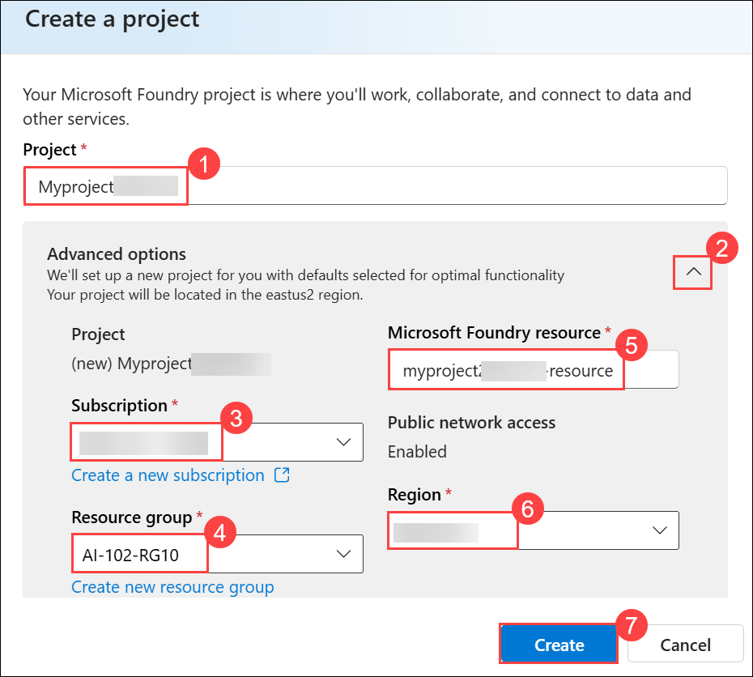

      >**Note:** Some Azure AI resources are constrained by regional model quotas. In the event of a quota limit being exceeded later in the exercise, there's a possibility you may need to create another resource in a different region.

1. On the **Microsoft Foundry** home page, click **Start building (1)**, and then select **Browse models (2)** from the drop-down menu.

     

1. On the **Models** page, search for **gpt-4.1 (1)** in the search bar, and then select the **gpt-4.1 (2)** model from the search results.

     

1. On the **gpt-4.1** model details page, click **Deploy (1)**, and then select **Default settings (2)** to deploy the model using the standard configuration.

    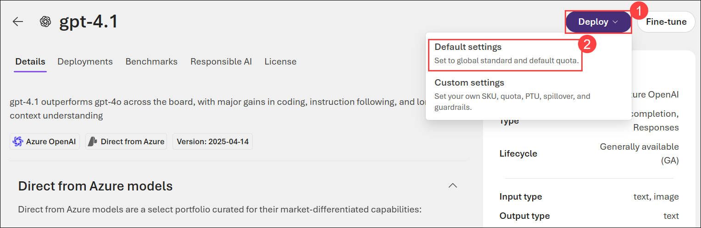

1. In the navigation bar on the left, select **Microsoft Foundry** to return to the Foundry home page.

     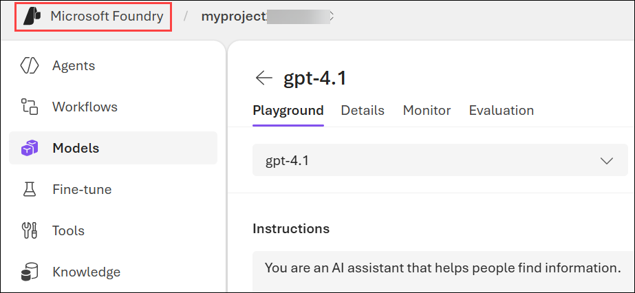

1. Copy the **Project endpoint** value to a notepad, as you'll use them to connect to your project in a client application.

     

> **Congratulations** on completing the task! Now, it's time to validate it. Here are the steps:
>
> - Hit the Validate button for the corresponding task. If you receive a success message, you can proceed to the next task.
> - If not, carefully read the error message and retry the step, following the instructions in the lab guide.
> - If you need any assistance, please contact us at cloudlabs-support@spektrasystems.com. We are available 24/7 to help.
 
<validation step="b046143b-76f6-49ca-ad60-fef1518f2bf9" />

## Task 2: Develop an agent that uses function tools

Now that you've created your project in AI Foundry, let's develop an app that implements an agent using custom function tools.

1. Open a new browser tab (keeping the Azure AI Foundry portal open in the existing tab). Then in the new tab, browse to the [Azure portal](https://portal.azure.com) at `https://portal.azure.com`.

1. If prompted, provide the credentials below:

    - **Email/Username:** <inject key="AzureAdUserEmail"></inject>

    - **Password:** <inject key="AzureAdUserPassword"></inject> 

      >**Note:** Close any welcome notifications to see the Azure portal home page.

1. On the **Azure portal** homepage, click the **\[>\_] Cloud Shell (1)** button located to the right of the **Copilot** tab at the top. This opens a new Cloud Shell session. In the **Welcome to Azure Cloud Shell** window, choose **PowerShell (2)**.

    

    >**Note:** The cloud shell provides a command-line interface in a pane at the bottom of the Azure portal. You can resize or maximize this pane to make it easier to work in.

    > **Note:** If you have previously created a cloud shell that uses a **Bash** environment, switch it to **PowerShell**.

1. In the **Getting started** window, ensure **No storage account required (1)** is selected. From the **Subscription** drop-down, choose **Default subscription (2)**, then click **Apply (3)**.

    

1. In the Cloud Shell toolbar, open the **Settings (1)** menu and choose **Go to Classic version (2)** from the drop-down.

    

    >**Note:** **<font color="red">Ensure you've switched to the classic version of the cloud shell before continuing.</font>**

1. In the cloud shell pane, enter the following commands to clone the GitHub repo containing the code files for this exercise (type the command, or copy it to the clipboard and then right-click in the command line and paste as plain text):

    ```
   rm -r ai-agents -f
   git clone https://github.com/MicrosoftLearning/mslearn-ai-agents ai-agents
    ```

    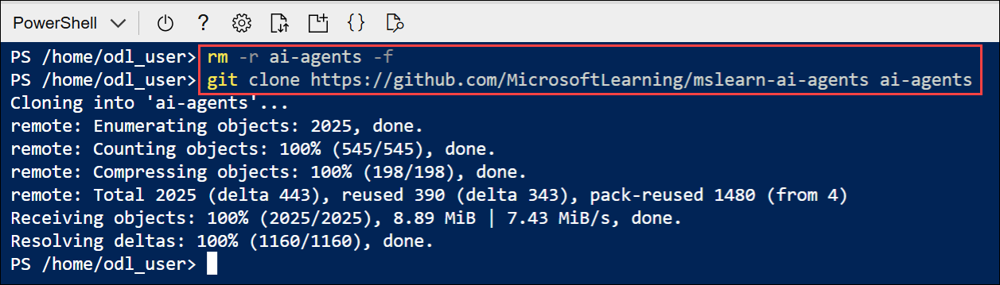

    > **Tip:** As you enter commands into the cloudshell, the output may take up a large amount of the screen buffer and the cursor on the current line may be obscured. You can clear the screen by entering the `cls` command to make it easier to focus on each task.

1. Enter the following command to change the working directory to the folder containing the code files and list them all.

    ```
   cd ai-agents/Labfiles/03-ai-agent-functions/Python
   ls -a -l
    ```

    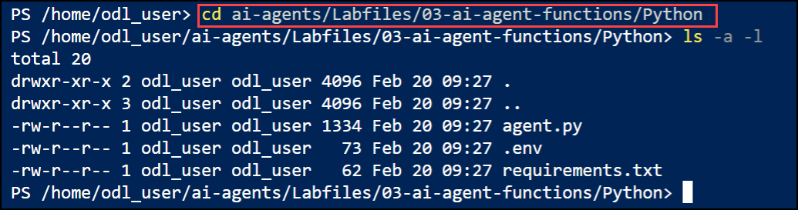

    - The provided files include application code and a file for configuration settings.

### Task 2.1: Configure the application settings

1. In the cloud shell command-line pane, enter the following command to install the libraries you'll use:

    ```
   python -m venv labenv
   ./labenv/bin/Activate.ps1
   pip install -r requirements.txt
    ```

    >**Note:** You can ignore any warning or error messages displayed during the library installation.

1. Enter the following command to edit the configuration file that has been provided:

    ```
   code .env
    ```

1. In the code file, replace the placeholder values with the correct details for your project:

    * PROJECT\_ENDPOINT : **Foundry project endpoint**
    * MODEL\_DEPLOYEMNT\_NAME : **gpt-4.1**

         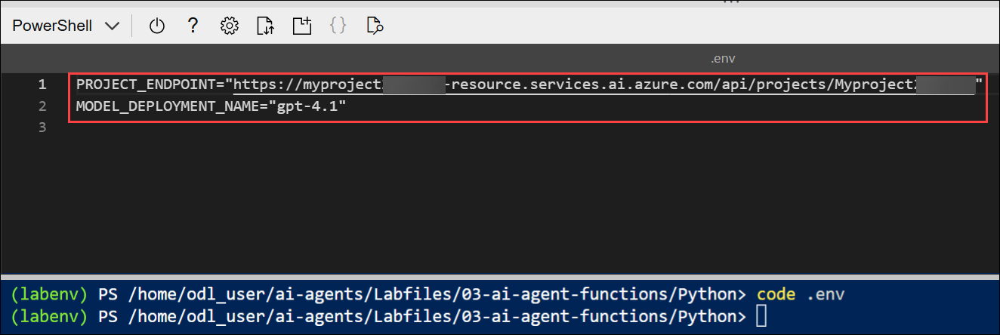

        > **Note:** Paste the project endpoint you copied in the previous task.

1. After you've replaced the placeholder, use the **CTRL+S** command to save your changes and then use the **CTRL+Q** command to close the code editor while keeping the cloud shell command line open.

### Task 2.2: Create a function for the agent to use

1. Enter the following command to begin editing the agent code.

    ```
    code agent.py
    ```

    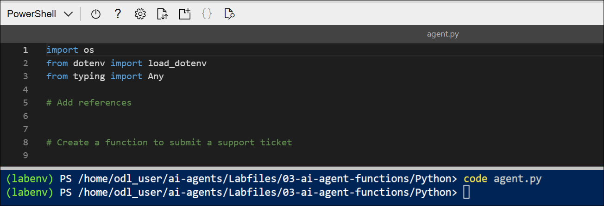

    > **Tip:** As you add code to the code file, be sure to maintain the correct indentation.

1. Review the existing code, which retrieves the application configuration settings and sets up a loop in which the user can enter prompts for the agent. The rest of the file includes comments where you'll add the necessary code to implement your technical support agent.

1. Find the comment **Add references** and add the following code to import the classes you'll need to build an Azure AI agent that uses a function tool:

    ```python
   # Add references
   import json
   import uuid
   from pathlib import Path
   from azure.identity import DefaultAzureCredential
   from azure.ai.projects import AIProjectClient
   from azure.ai.projects.models import PromptAgentDefinition, FunctionTool
   from openai.types.responses.response_input_param import FunctionCallOutput, ResponseInputParam
    ```

    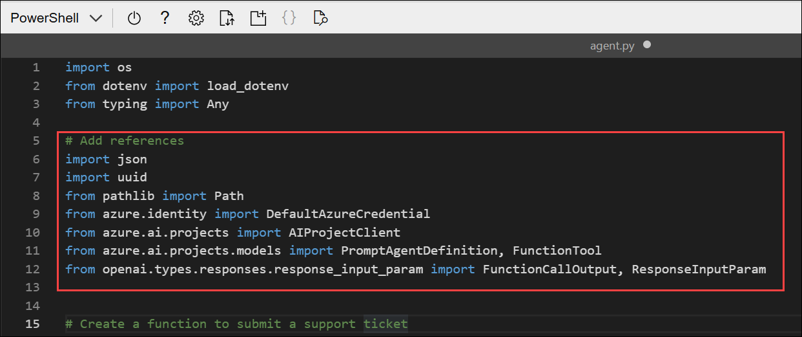

1. Find the comment **Create a function to submit a support ticket** and add the following code:

    ```python
   # Create a function to submit a support ticket
   def submit_support_ticket(email_address: str, description: str) -> str:
       script_dir = Path(__file__).parent  # Get the directory of the script
       ticket_number = str(uuid.uuid4()).replace('-', '')[:6]
       file_name = f"ticket-{ticket_number}.txt"
       file_path = script_dir / file_name
       text = f"Support ticket: {ticket_number}\nSubmitted by: {email_address}\nDescription: {description}"
       file_path.write_text(text)

       message_json = json.dumps({"message": f"Support ticket {ticket_number} submitted. The ticket file is saved as {file_name}"})
       return message_json
    ```

    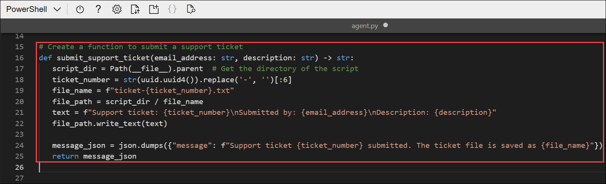

    - This code defines a function that generates a ticket number, saves the support ticket as a text file, and returns a message indicating that the ticket was submitted.

### Task 2.3: Connect to the Foundry project

1. Find the comment **Connect to the AI Project client** and add the following code to connect to the Azure AI project.

    > **Tip:** Be careful to maintain the correct indentation level.

    ```python
   # Connect to the AI Project client
   with (
       DefaultAzureCredential(
           exclude_environment_credential=True,
           exclude_managed_identity_credential=True) as credential,
       AIProjectClient(endpoint=project_endpoint, credential=credential) as project_client,
       project_client.get_openai_client() as openai_client,
   ):
    ```

    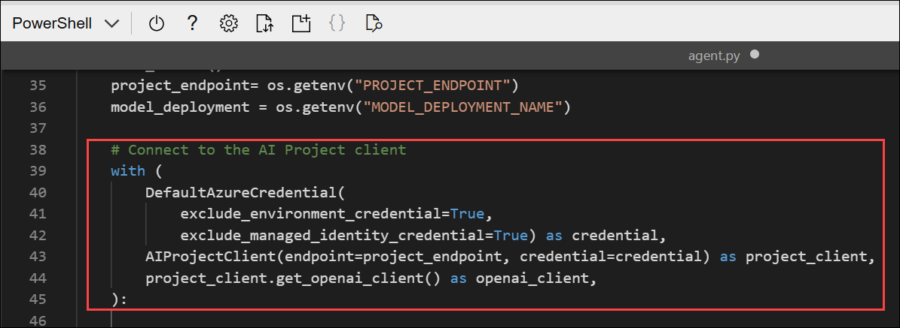

### Task 2.4: Define the function tool

1. Find the comment **Create a FunctionTool definition** and add the following code to define a function tool that uses your custom function:

    ```python
   # Create a FunctionTool definition
   tool = FunctionTool(
       name="submit_support_ticket",
       parameters={
           "type": "object",
           "properties": {
               "email_address": {"type": "string", "description": "The user's email address"},
               "description": {"type": "string", "description": "A description of the technical issue"},
            },
            "required": ["email_address", "description"],
            "additionalProperties": False,
       },
       description="Submit a support ticket for a technical issue",
       strict=True,
   )
    ```

    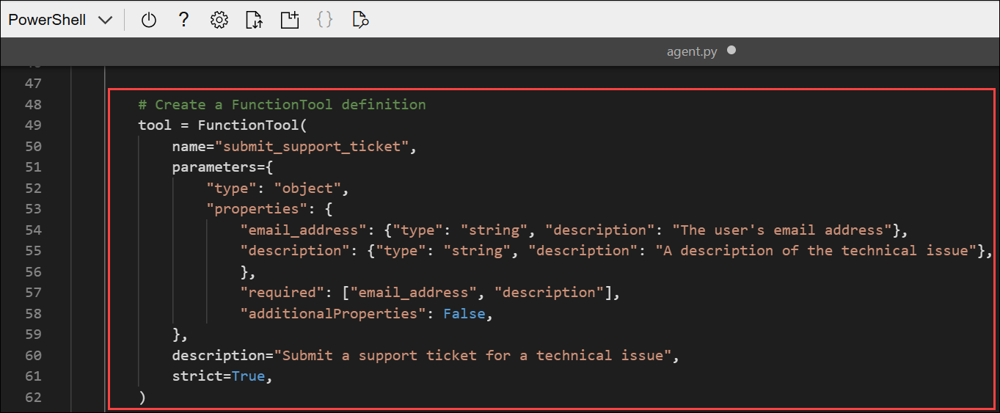

    - The **FunctionTool** object uses a JSON schema to define the parameters that the function accepts, and a description of what the function does.

### Task 2.5: Create the agent that uses the function tool

1. Find the comment **Initialize the agent with the FunctionTool** section, and add the following code to create an agent that can use the function tool you defined:

    ```python
   # Initialize the agent with the FunctionTool
   agent = project_client.agents.create_version(
       agent_name="support-agent",
       definition=PromptAgentDefinition(
           model=model_deployment,
           instructions="""You are a technical support agent.
                            When a user has a technical issue, you get their email address and a description of the issue.
                            Then you use those values to submit a support ticket using the function available to you.
                            If a file is saved, tell the user the file name.
                         """,
           tools=[tool],
       ),
   )
   print(f"Using agent: {agent.name} (version: {agent.version})")
    ```

    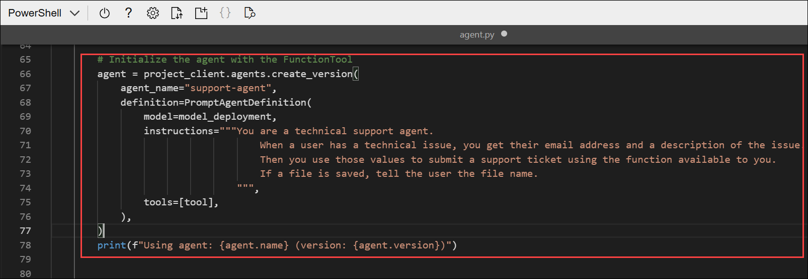

### Task 2.6: Send a message to the agent and process the response

1. Find the comment **Create a thread for the chat session** and add the following code:

    ```python
   # Create a thread for the chat session
   conversation = openai_client.conversations.create()
   print(f"Created conversation (id: {conversation.id})")
    ```

    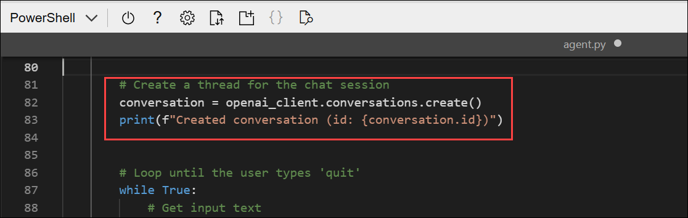

1. Find the comment **Send a prompt to the agent** and add the following code to add the user's prompt as a message.

    ```python
   # Send a prompt to the agent
   openai_client.conversations.items.create(
       conversation_id=conversation.id,
       items=[{"type": "message", "role": "user", "content": user_prompt}],
   )
    ```

1. Find the comment **Get the agent's response** and add the following code to retrieve the agent's response.

    ```python
   # Get the agent's response
   response = openai_client.responses.create(
       conversation=conversation.id,
       extra_body={"agent": {"name": agent.name, "type": "agent_reference"}},
       input="",
   )
    ```

1. Find the comment **Check the run status for failures** and add the following code to show any errors that occur.

    ```python
   # Check the run status for failures
   if response.status == "failed":
       print(f"Response failed: {response.error}")
    ```

    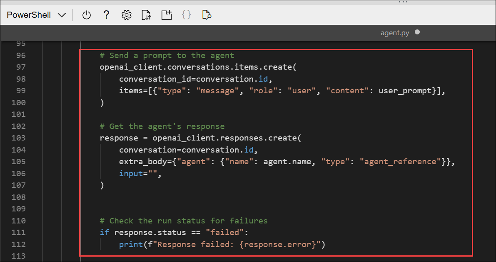

### Task 2.7: Process function calls and display the agent's response

1. Find the comment **Process function calls** and add the following code to handle any function calls made by the agent:

    ```python
   # Process function calls
   input_list: ResponseInputParam = []
   for item in response.output:
       if item.type == "function_call":
           if item.name == "submit_support_ticket":
               # Execute the function logic for submit_support_ticket
               result = submit_support_ticket(**json.loads(item.arguments))

               # Provide function call results to the model
               input_list.append(
                   FunctionCallOutput(
                       type="function_call_output",
                       call_id=item.call_id,
                       output=result,
                   )
               )
    ```

    

    - This code checks for function calls in the agent's response, executes the corresponding function, and prepares the results to be sent back to the agent.

1. Find the comment **If there are function call outputs, send them back to the model** and add the following:

    ```python
   # If there are function call outputs, send them back to the model
   if input_list:
       response = openai_client.responses.create(
           input=input_list,
           previous_response_id=response.id,
           extra_body={"agent": {"name": agent.name, "type": "agent_reference"}},
       )

   print(f"Agent response: {response.output_text}")
    ```

    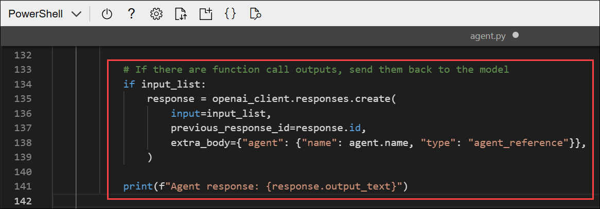

    - This code sends the function call results back to the agent and prints the agent's response.

1. Find the comment **Clean up** and add the following code to delete the agent and thread when no longer needed.

    ```python
   # Clean up
   openai_client.conversations.delete(conversation_id=conversation.id)
   print("Conversation deleted")

   project_client.agents.delete_version(agent_name=agent.name, agent_version=agent.version)
   print("Agent deleted")
    ```

    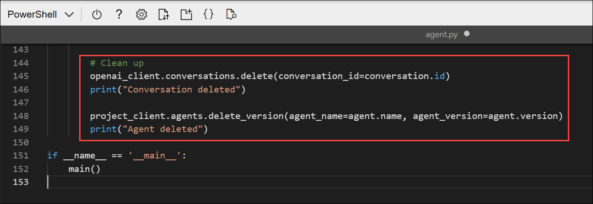

1. Review the complete code you've added to the file. It should now include sections that:
   - Import necessary libraries
   - Define a function to submit support tickets
   - Connect to the Foundry project and AI Project client
   - Define a function tool using your custom function
   - Create an agent that can use the function tool
   - Create a conversation thread for the chat session
   - Send user prompts to the agent and retrieve responses
   - Process any function calls made by the agent
   - Send function call results back to the agent and display responses
   - Clean up resources by deleting the conversation and agent

1. Save the code file **CTRL+S** when you have finished. You can also close the code editor **CTRL+Q** though you may want to keep it open in case you need to make any edits to the code you added. In either case, keep the cloud shell command-line pane open.

## Task 3: Sign into Azure and run the app

1. In the cloud shell command-line pane, enter the following command to sign into Azure. Click on the **Link (1)** and copy the **code (2)** provided.

    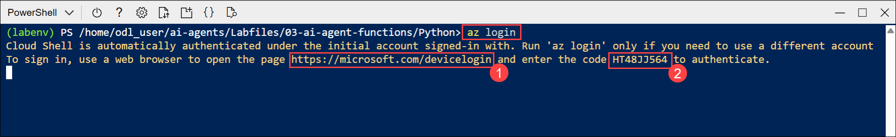

    > **Note:** In most scenarios, just using *az login* will be sufficient. However, if you have subscriptions in multiple tenants, you may need to specify the tenant by using the *--tenant* parameter. See [Sign into Azure interactively using the Azure CLI](https://learn.microsoft.com/cli/azure/authenticate-azure-cli-interactively) for details.

1. In the new browser tab, when the **Enter code to allow access** window appears, paste the copied code and select **Next**.

    

1. In the **Pick an account** dialog box, choose **ODL_User<inject key="DeploymentID"></inject>**. 

    

1. In the **Are you trying to sign in to Microsoft Azure CLI?** dialog box, click **Continue**.

    

1. When the **Microsoft Azure Cross-platform Command Line Interface** window pops up, return to the browser tab with Cloud Shell open. 

    

1. In the Cloud Shell console, press **Enter** to select the only available subscription.

    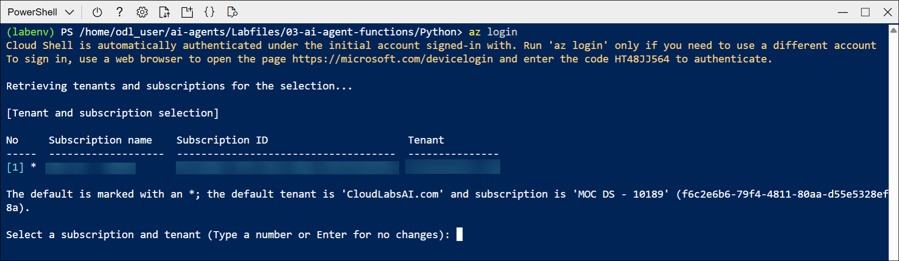

1. After you have signed in, enter the following command to run the application:

    ```
   python agent.py
    ```
    
    - The application runs using the credentials for your authenticated Azure session to connect to your project and create and run the agent.

1. When prompted, enter a prompt such as:

    ```
   I have a technical problem
    ```

    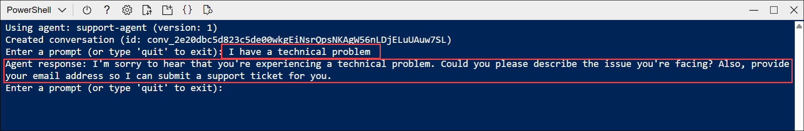

    > **Tip:** If the app fails because the rate limit is exceeded. Wait a few seconds and try again. If there is insufficient quota available in your subscription, the model may not be able to respond.

1. View the response. The agent may ask for your email address and a description of the issue. You can use any email address (for example, `alex@contoso.com`) and any issue description (for example `my computer won't start`)

    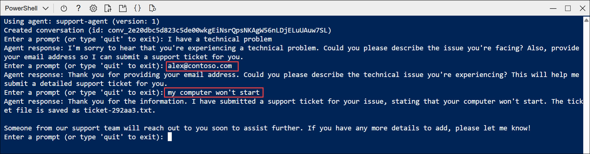

    - When it has enough information, the agent should choose to use your function as required.

1. Review the messages that were retrieved from the conversation, and the tickets that were generated.

1. The tool should have saved support tickets in the app folder. You can use the `ls` command to check, and then use the `cat` command to view the file contents, like this:

    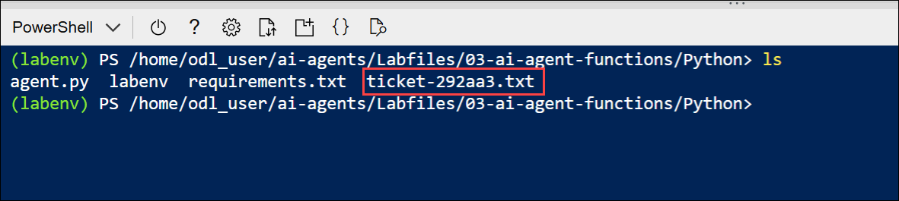

    ```
   cat ticket-<ticket_num>.txt
    ```

## Summary