# Lab 04: Use a custom function in an AI agent

### Estimated Duration : 30 Minutes

## Overview

In this lab, you’ll build an end-to-end solution using Microsoft Foundry by creating a project, deploying a model, and extending it with custom function tools. You’ll set up your development environment in VS Code, configure application settings, and implement Python-based functions that your agent can invoke. Finally, you’ll build, run, and test an AI agent that can intelligently call these functions, process responses, and generate outputs such as observation reports.

## Lab Objectives

In this lab, you'll perform the following tasks:

- Task 1: Install the Microsoft Foundry VS Code extension

- Task 2: Sign in to Azure and create a project

- Task 3: Deploy a model

- Task 4: Clone the starter code repository

- Task 5: Create a function for the agent to use

- Task 6: Connect to the Foundry project

- Task 7: Run the agent application

## Task 1: Install the Microsoft Foundry VS Code extension

In this task, you'll install and verify the Microsoft Foundry extension in Visual Studio Code, enabling you to create, manage, and interact with Azure AI projects and agents directly within the VS Code environment.

1. Open the **Visual Studio Code** from the desktop.

    

1. In Visual Studio Code, select **Extensions (1)** from the left pane, search for **Microsoft Foundry (2)**, choose the **Microsoft Foundry (3)** extension by Microsoft, and then click **Install (4)**.

   

1. After installation is complete, verify the extension appears in the primary navigation bar on the left side of Visual Studio Code.

   

   > **Note:** If you already have the extension installed, make sure the version is at least **v0.16.0** to follow along with the instructions in this exercise.

## Task 2: Sign in to Azure and create a project

In this task, you'll authenticate with your Azure account and create a new Azure AI Foundry project, which will serve as the workspace for deploying models and building AI-powered agent solutions.

1. In the VS Code sidebar, select the **Microsoft Foundry (1)** extension icon.

1. In the Resources view, choose **Create Project (2)**, and when prompted, select **Sign in to Azure (3)** to authenticate.

   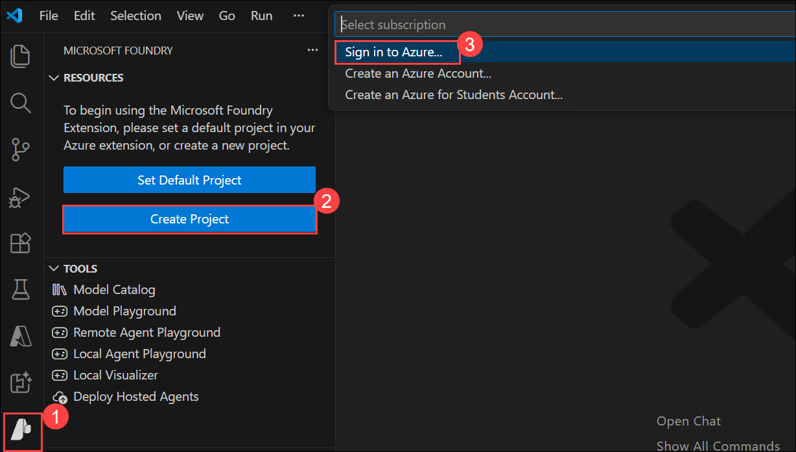

1. In the **Azure Resources wants to sign in using Microsoft** dialog, select **Allow**.

   

1. On the **Sign in** page, provide the credentials below:
 
   - **Email/Username:** <inject key="AzureAdUserEmail"></inject>
    
     

   - **Password:** <inject key="AzureAdUserPassword"></inject>
    
     

1. On the **Sign in to all apps, websites, and services on this device?** page, select **Yes**.

   

1. On the **Account added to this device** page, select **Done**.

   

1. In the **Choose a resource group** dialog, select **AI-102-RG10** from the list.

   

1. In the **Enter project name** dialog, enter **Myproject<inject key="DeploymentID" enableCopy="false"/>**, and then press **Enter** to confirm.

   

1. Wait for the project deployment to complete. A popup will appear with the message "Project deployed successfully."

    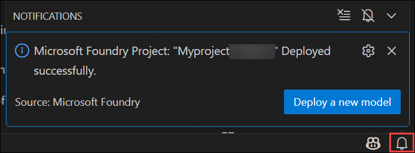

## Task 3: Deploy a model

In this task, you'll deploy the gpt-4.1 model (or an equivalent) in your Foundry project, making it available for your agent to process prompts and generate intelligent responses.

1. In the **RESOURCES** pane, select **Models**, and then select the **+** icon to add a new model deployment.

   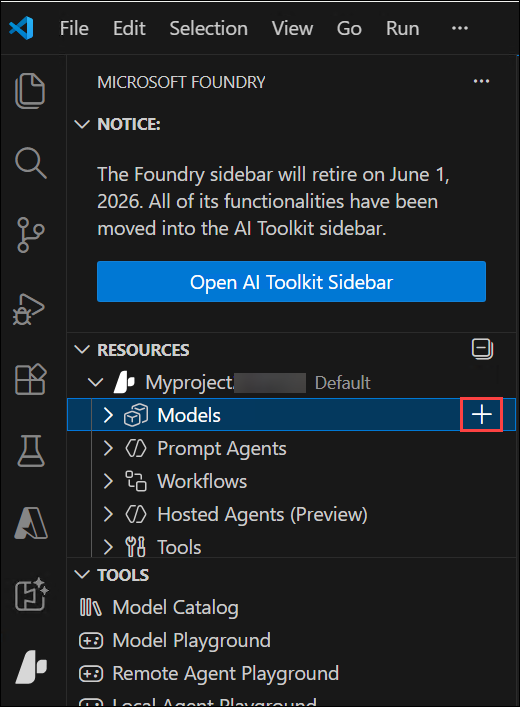

   > **Tip:** You can also access the Model Catalog pressing **F1** and running the command **Microsoft Foundry: Open Model Catalog**.

1. In the Model Catalog, scroll down, search for **gpt-4.1 (1)** in the search bar, and then select **Deploy (2)** under **OpenAI GPT-4.1**.

   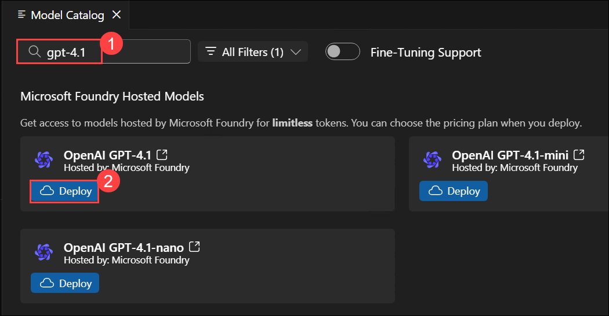

1. Configure the deployment settings:
   
    - **Deployment name:** Enter a name like **gpt-4.1 (1)**
    - **Deployment type:** Select **Global Standard** (or **Standard** if Global Standard is not available) **(2)**
    - **Model version:** Leave as default
    - **Tokens per minute:** `50K` **(3)**
    - Select **Deploy in Microsoft Foundry (4)** in the bottom-left corner.

        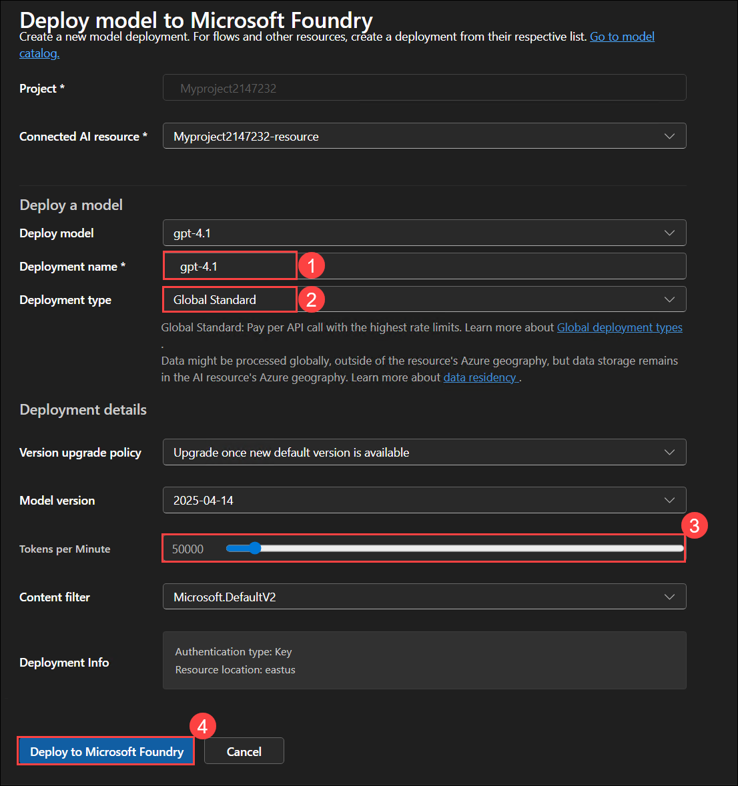

1. If the confirmation dialog appears, select **Deploy** to deploy the model.

1. Wait for the deployment to complete. Your deployed model will appear under the **Models** section in the Resources view.

    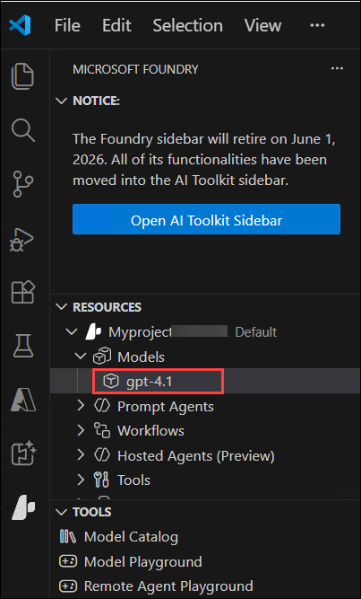

## Task 4: Clone the starter code repository

In this task, you'll clone the provided GitHub repository, set up a Python virtual environment, install required dependencies, and configure environment variables to prepare your local development setup.

1. Navigate to the **Welcome** page in VS Code by selecting the ellipsis **(...) (1)** from the top bar, then **Help (2)**, and finally **Welcome (3)**.

    

1. On the **Get Started** page, select **Mark Done (1)** to complete this step and proceed.

    

1. Select **Clone Git Repository... (1)**, paste the repository URL **(2)** `https://github.com/MicrosoftLearning/mslearn-ai-agents.git`, and then choose **Clone from URL (3)** to proceed.

    

1. Select the destination folder **C:\LabFiles (1)** and click **Select as Repository Destination (2)** to proceed.

    

1. When prompted, select **Open (1)** to open the cloned repository.

    

1. In the trust prompt, select **Yes, I trust the authors (1)** to continue.

    

1. In the Explorer view, navigate to the **Labfiles (1)** and then select **02-agent-custom-tools/Python (2)** folder to find the starter code for this exercise.

    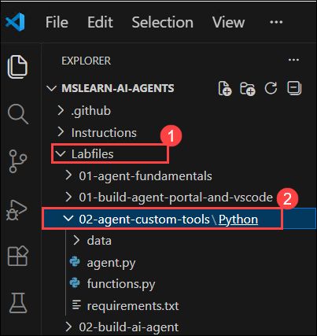

1. Right-click on the **requirements.txt (1)** file and select **Open in Integrated Terminal (2)**.

    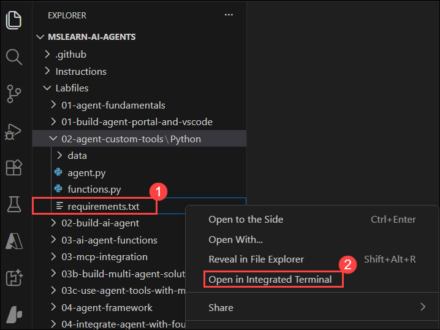

1. In the terminal, enter the following command to install the required Python packages in a virtual environment:

    ```
    python -m venv labenv
    .\labenv\Scripts\Activate.ps1
    pip install -r requirements.txt
    ```

1. In the Explorer view, right-click the **02-agent-custom-tools/Python (1)** folder and select **New File (2)**, then name the file **.env**.

    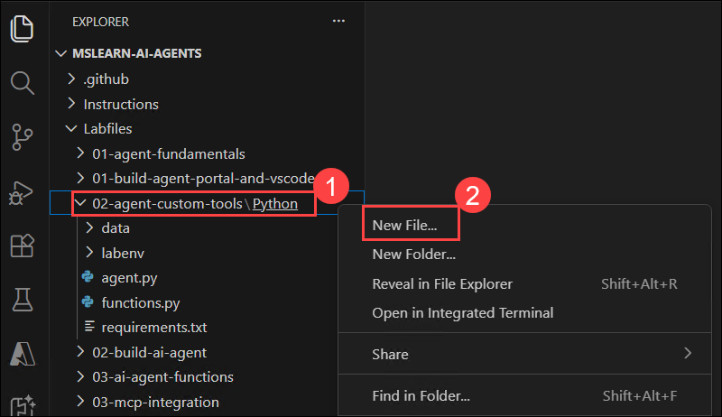

1. Open the **.env (1)** file, add the required environment variables **(2)**, and save the file using **Ctrl+S**.

    ```
    PROJECT_ENDPOINT="your_project_endpoint"
    MODEL_DEPLOYMENT_NAME="gpt-4.1"
    ```

    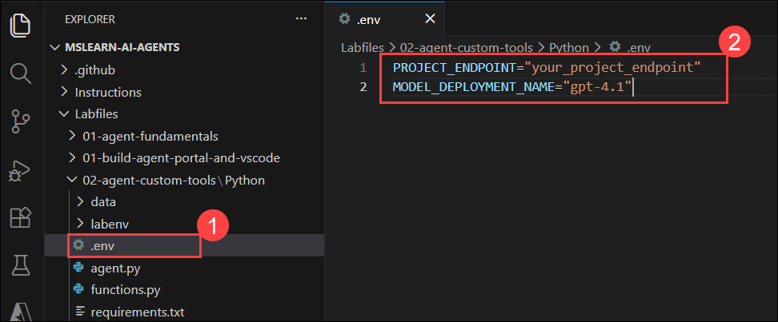

1. In the VS Code Activity Bar, select the **Microsoft Foundry extension (1)**, then under the **Resources** section expand and right-click your project **Myproject (2)**, and choose **Copy Project Endpoint (3)** to copy the endpoint.

    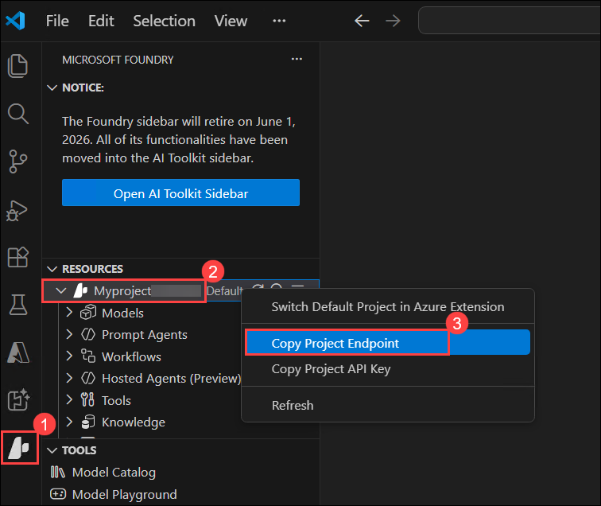

1. From the left navigation menu, select **Explorer (1)**, navigate to the **02-agent-custom-tools \ Python (2)** folder, and open the **.env (3)** file. Paste the copied project endpoint into the **PROJECT_ENDPOINT (4)** field, and verify that the **MODEL_DEPLOYMENT_NAME (5)** is set to `gpt-4.1` (or the name of your deployed model). Once done, press **Ctrl+S** to save the changes.

    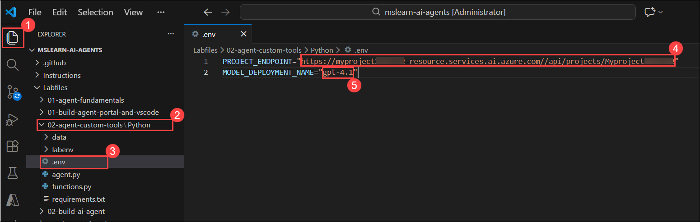

Now you're ready to create an AI agent that uses MCP server tools to access external data sources and APIs.

## Task 5: Create a function for the agent to use

In this task, you'll implement a custom Python function that retrieves relevant data, which will later be exposed as a tool for the agent to enhance its capabilities.

1. Open the **functions.py** file and review the existing code.

    This file includes several functions that you can use as tools for your agent. The functions use sample files located inthe **data** folder to retrieve information about astronomical events and locations.

    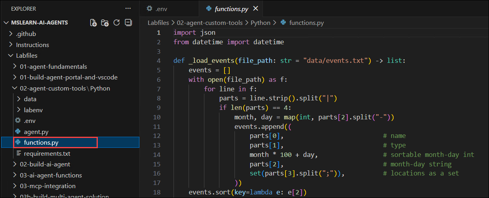

1. Find the comment **Determine the next visible astronomical event for a given location** and add the following code and then press **Ctrl+S** to save the changes:

    ```python
   # Determine the next visible astronomical event for a given location
   def next_visible_event(location: str) -> str:
       """Returns the next visible astronomical event for a location."""
       today = int(datetime.now().strftime("%m%d"))
       loc = location.lower().replace(" ", "_")

       # Retrieve the next event visible from the location, starting with events later this year
       for name, event_type, date, date_str, locs in EVENTS:
           if loc in locs and date >= today:
               return json.dumps({"event": name, "type": event_type, "date": date_str, "visible_from": sorted(locs)})

       return json.dumps({"message": f"No upcoming events found for {location}."})
    ```

    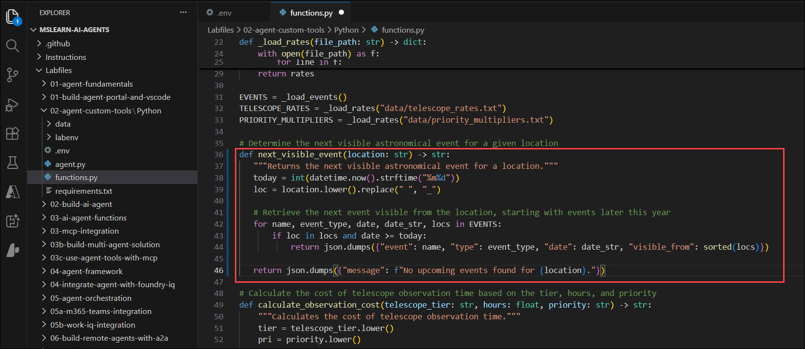

    This function checks the sample events data to find the next astronomical event that is visible from a specified location, and returns the event details as a JSON string. Next, let's create an agent that can use this function.

## Task 6: Connect to the Foundry project

In this task, you'll connect your application to the Azure AI Foundry project, define multiple function tools, and configure an AI agent capable of invoking these functions based on user input.

1. Open the **agent.py** file.

    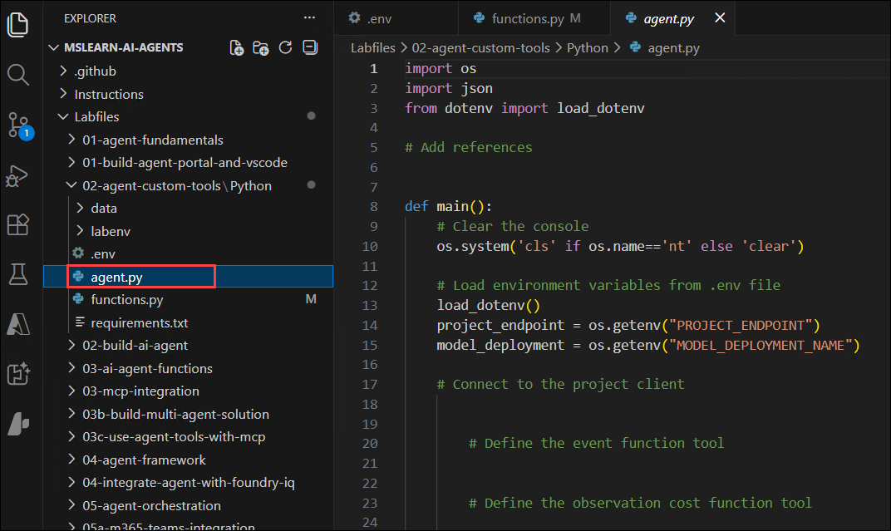

    > **Note:** As you add code, be sure to maintain the correct indentation. Use the comment indentation levels as a guide.

1. Find the comment **Add references** and add the following code to import the classes you'll need to build an Azure AI agent that uses a function tool and press **Ctrl+S** to save the changes:

    ```python
    # Add references
    from azure.ai.projects import AIProjectClient
    from azure.ai.projects.models import FunctionTool
    from azure.identity import DefaultAzureCredential
    from azure.ai.projects.models import PromptAgentDefinition, FunctionTool
    from openai.types.responses.response_input_param import FunctionCallOutput, ResponseInputParam
    from functions import next_visible_event, calculate_observation_cost, generate_observation_report
    ```

    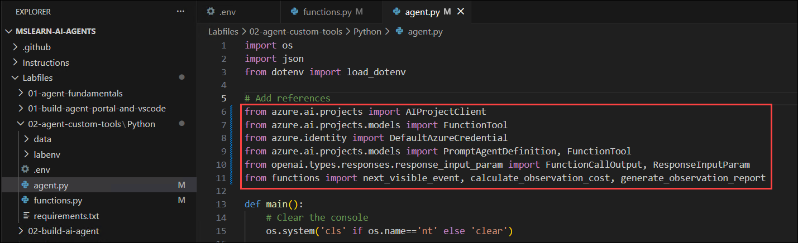

    Notice that the functions you defined in the **functions.py** file are imported so they can be used as tools for the agent.

1. Find the comment **Connect to the project client** and add the following code and press **Ctrl+S** to save the changes:

    ```python
    # Connect to the project client
    with (
        DefaultAzureCredential() as credential,
        AIProjectClient(endpoint=project_endpoint, credential=credential) as project_client,
        project_client.get_openai_client() as openai_client,
    ):
    ```

    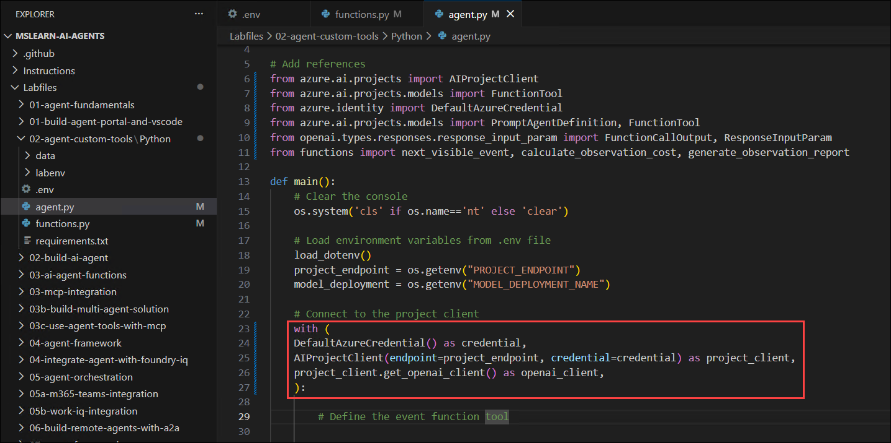

### Task 6.1: Define the function tools

In this task, you'll define each of the function tools that the agent can use. The parameters for each function tool are defined using a JSON schema, which specifies the name, type, description, and other attributes for each parameter of the function.

1. Find the comment **Define the event function tool** and add the following code and press **Ctrl+S** to save the changes:

    ```python
    # Define the event function tool
    event_tool = FunctionTool(
        name="next_visible_event",
        description="Get the next visible event in a given location.",
        parameters={
            "type": "object",
            "properties": {
                "location": {
                    "type": "string",
                    "description": "continent to find the next visible event in (e.g. 'north_america', 'south_america', 'australia')",
                },
            },
            "required": ["location"],
            "additionalProperties": False,
        },
        strict=True,
    )
    ```

    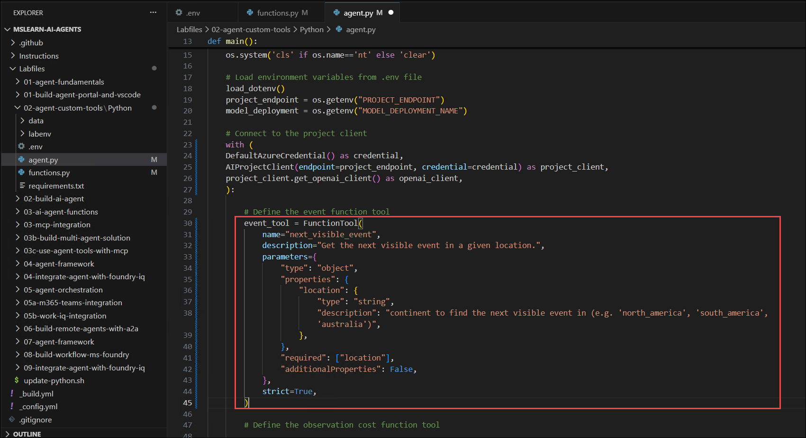

1. Find the comment **Define the observation cost function tool** and add the following code and press **Ctrl+S** to save the changes:

    ```python
    # Define the observation cost function tool
    cost_tool = FunctionTool(
        name="calculate_observation_cost",
        description="Calculate the cost of an observation based on the telescope tier, number of hours, and priority level.",
        parameters={
            "type": "object",
            "properties": {
                "telescope_tier": {
                    "type": "string",
                    "description": "the tier of the telescope (e.g. 'standard', 'advanced', 'premium')",
                },
                "hours": {
                    "type": "number",
                    "description": "the number of hours for the observation",
                },
                "priority": {
                    "type": "string",
                    "description": "the priority level of the observation (e.g. 'low', 'normal', 'high')",
                },
            },
            "required": ["telescope_tier", "hours", "priority"],
            "additionalProperties": False,
        },
        strict=True,
    )
    ```

    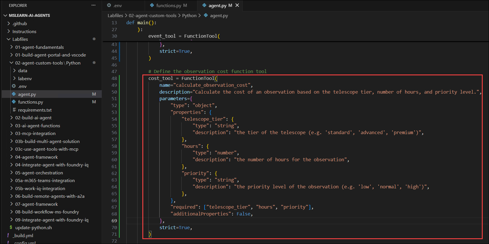

1. Find the comment **Define the observation report generation function tool** and add the following code and press **Ctrl+S** to save the changes:

    ```python
    # Define the observation report generation function tool
    report_tool = FunctionTool(
        name="generate_observation_report",
        description="Generate a report summarizing an astronomical observation",
        parameters={
            "type": "object",
            "properties": {
                "event_name": {
                    "type": "string",
                    "description": "the name of the astronomical event being observed",
                },
                "location": {
                    "type": "string",
                    "description": "the location of the observer",
                },
                "telescope_tier": {
                    "type": "string",
                    "description": "the tier of the telescope used for the observation (e.g. 'standard', 'advanced', 'premium')",
                },
                "hours": {
                    "type": "number",
                    "description": "the number of hours the telescope was used for the observation",
                },
                "priority": {
                    "type": "string",
                    "description": "the priority level of the observation (e.g. 'low', 'normal', 'high')",
                },
                "observer_name": {
                    "type": "string",
                    "description": "the name of the person who conducted the observation",
                },                   
            },
            "required": ["event_name", "location", "telescope_tier", "hours", "priority", "observer_name"],
            "additionalProperties": False,
        },
        strict=True,
    )
    ```

    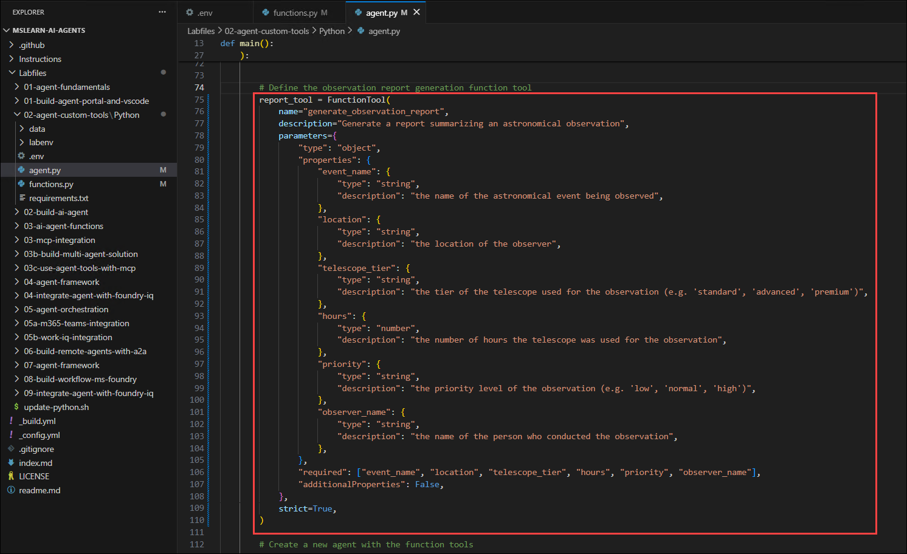

### Task 6.2: Create the agent that uses the function tools

Now that you've defined the function tools, you can create an agent that can use those tools to complete tasks.

1. Find the comment **Create a new agent with the function tools** and add the following code and press **Ctrl+S** to save the changes:

    ```python
    # Create a new agent with the function tools
    agent = project_client.agents.create_version(
        agent_name="astronomy-agent",
        definition=PromptAgentDefinition(
            model=model_deployment,
            instructions=
                """You are an astronomy observations assistant that helps users find 
                information about astronomical events and calculate telescope rental costs. 
                Use the available tools to assist users with their inquiries.""",
            tools=[event_tool, cost_tool, report_tool],
        ),
    )
    ```

    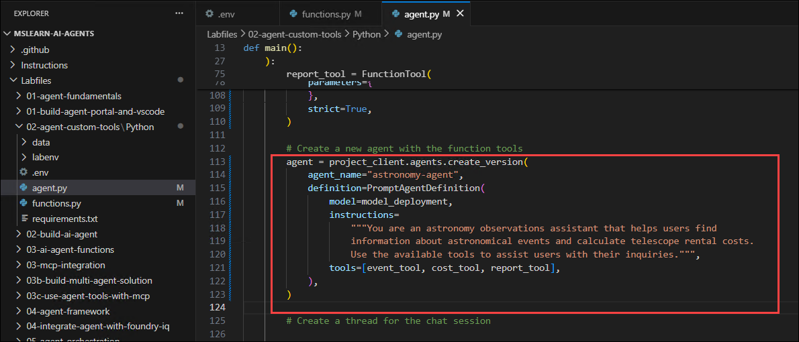

### Task 6.3: Send a message to the agent and process the response

Now that you've created the agent with the function tools, you can send messages to the agent and process its responses.

1. Find the comment **Create a thread for the chat session** and add the following code and press **Ctrl+S** to save the changes:

    ```python
    # Create a thread for the chat session
    conversation = openai_client.conversations.create()
    ```
    
    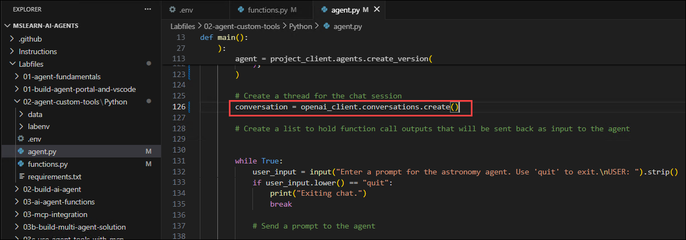

    This code creates the chat session with the agent.

1. Find the comment **Create an input list to hold function call outputs to send back to the model** and add the following code and press **Ctrl+S** to save the changes:

    ```python
    # Create a list to hold function call outputs that will be sent back as input to the agent
    input_list: ResponseInputParam = []
    ```

    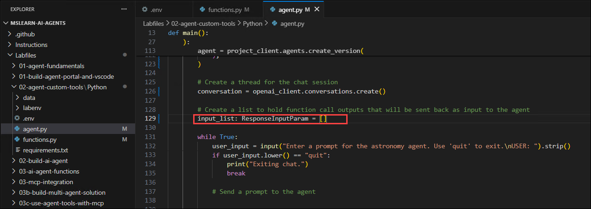

1. Find the comment **Send a prompt to the agent** and add the following code and press **Ctrl+S** to save the changes:

    ```python
    # Send a prompt to the agent
    openai_client.conversations.items.create(
        conversation_id=conversation.id,
        items=[{"type": "message", "role": "user", "content": user_input}],
    )
    ```

    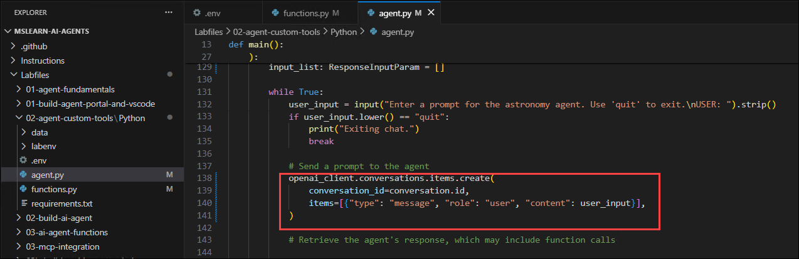

1. Find the comment **Retrieve the agent's response, which may include function calls** and add the following code and press **Ctrl+S** to save the changes:

    ```python
    # Retrieve the agent's response, which may include function calls
    response = openai_client.responses.create(
        conversation=conversation.id,
        extra_body={"agent": {"name": agent.name, "type": "agent_reference"}},
        input=input_list,
    )

    # Check the run status for failures
    if response.status == "failed":
        print(f"Response failed: {response.error}")
    ```

    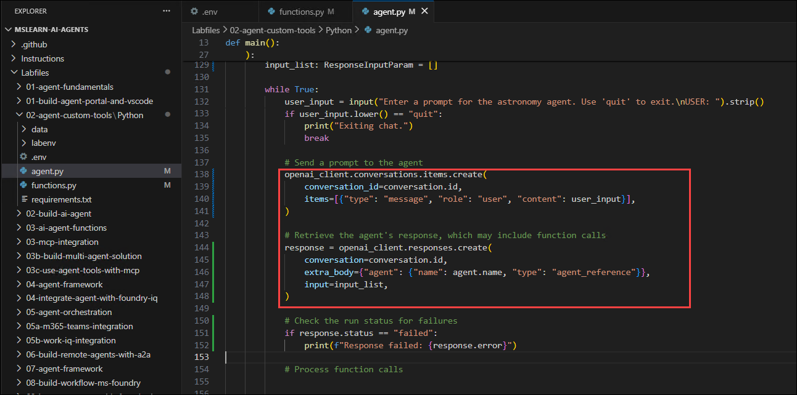

    In this code, you send a user prompt to the agent and retrieve the response. You also check if the response indicates a failure and print the error if so.

### Task 6.4: Process function calls and display the agent's response

1. Find the comment **Process function calls** and add the following code to handle any function calls made by the agent and press **Ctrl+S** to save the changes:

    ```python
    # Process function calls
    for item in response.output:
        if item.type == "function_call":
            # Retrieve the matching function tool
            function_name = item.name
            result = None
            if item.name == "next_visible_event":
                result = next_visible_event(**json.loads(item.arguments))
            elif item.name == "calculate_observation_cost":
                result = calculate_observation_cost(**json.loads(item.arguments))
            elif item.name == "generate_observation_report":
                result = generate_observation_report(**json.loads(item.arguments))
                    
            # Append the output text
            input_list.append(
                FunctionCallOutput(
                    type="function_call_output",
                    call_id=item.call_id,
                    output=result,
                )
            )
    ```

    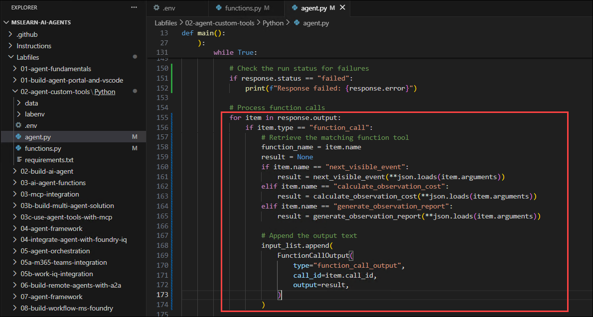

    This code iterates through the items in the agent's response to check for any function calls. If a function call is found, it retrieves the corresponding function tool, executes the function with the provided arguments, and appends the result to the input list that will be sent back to the agent.

1. Find the comment **Send function call outputs back to the model and retrieve a response** and add the following code and press **Ctrl+S** to save the changes:

    ```python
    # Send function call outputs back to the model and retrieve a response
    if input_list:
        response = openai_client.responses.create(
            input=input_list,
            previous_response_id=response.id,
            extra_body={"agent": {"name": agent.name, "type": "agent_reference"}},
        )
    # Display the agent's response
    print(f"AGENT: {response.output_text}")
    ```

    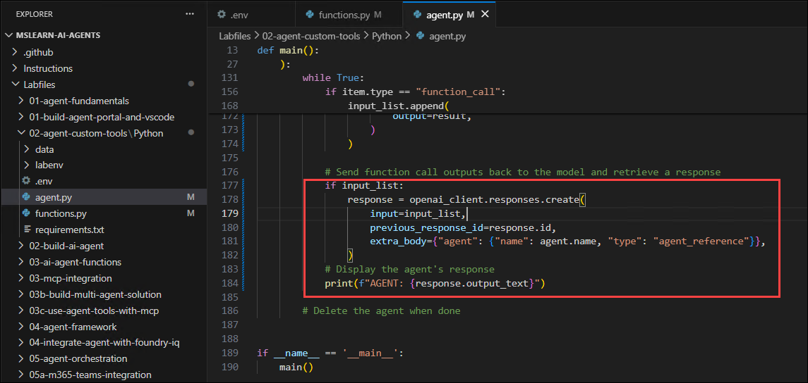

    This code checks if there are any function call outputs in the input list, and if so, it sends them back to the agent as input to retrieve an updated response. Finally, it prints the agent's response.

1. Find the comment  **Delete the conversation when done** and add the following code and press **Ctrl+S** to save the changes:

    ```python
   # Delete the agent when done
    project_client.agents.delete_version(agent_name=agent.name, agent_version=agent.version)
    print("Deleted agent.")
    ```

    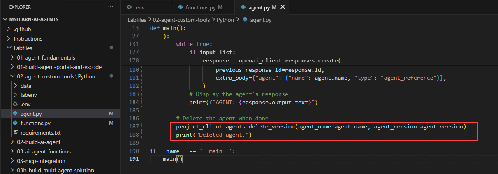

1. Review the complete code you've added to the file. It should now include sections that:

    - Import necessary libraries
    - Connect to the Foundry project and OpenAI client
    - Define function tools for the agent to use
    - Create an agent with those function tools
    - Send a message to the agent and retrieve the response
    - Process any function calls made by the agent and send the outputs back to the agent
    - Display the agent's response
    - Delete the agent when done

1. Save the code file (*CTRL+S*) when you have finished.

## Task 7: Run the agent application

In this task, you'll authenticate with Azure, execute the agent application, interact with it using prompts, and observe how it utilizes custom functions to generate meaningful responses and outputs.

1. In the terminal, run `Connect-AzAccount` to initiate the Azure sign-in process.

    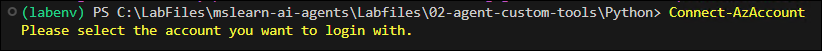

    >**Note:** If you have closed the terminal, right-click on the **02-agent-custom-tools \ Python** folder and select **Open in Integrated Terminal**. Then run the command `.\labenv\Scripts\Activate.ps1` to activate the virtual environment before proceeding.

1. In the sign-in window, select your account **<inject key="AzureAdUserEmail"></inject> (1)** and click **Continue (2)** to proceed with authentication.

    

1. After successful sign-in, wait for the subscriptions to load and verify that your subscription is listed in the terminal.

    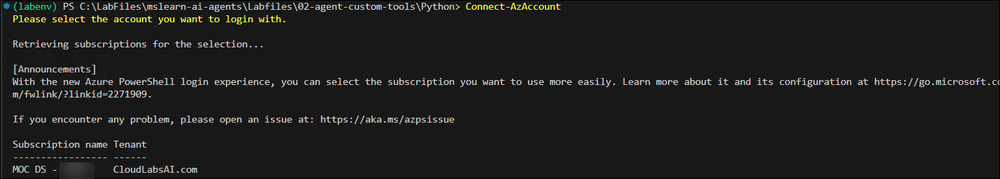

1. In the integrated terminal, enter the following command to run the application:

    ```
    python agent.py
    ```

1. When prompted, enter a prompt such as:

    ```
    Find me the next event I can see from South America and give me the cost for 5 hours of premium telescope time at normal priority.
    ```

    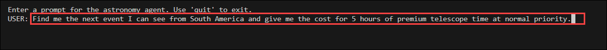

    Notice that this prompt asks the agent to use both of the function tools you defined: `next_visible_event` and `calculate_observation_cost`. The agent is able to invoke both functions in the same conversation turn, and use the outputs from those function calls to provide a helpful response to the user.

    > **Note:** If the app fails because the rate limit is exceeded. Wait a few seconds and try again. If there is insufficient quota available in your subscription, the model may not be able to respond.

1. You should see some output similar to the folloiwng:

    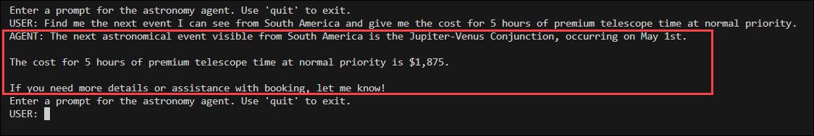
    
1. Enter a follow-up prompt to generate an observation report, such as:

    ```
    Generate that information in a report for Bellows College.
    ```

1. You should see a response similar to the following:

    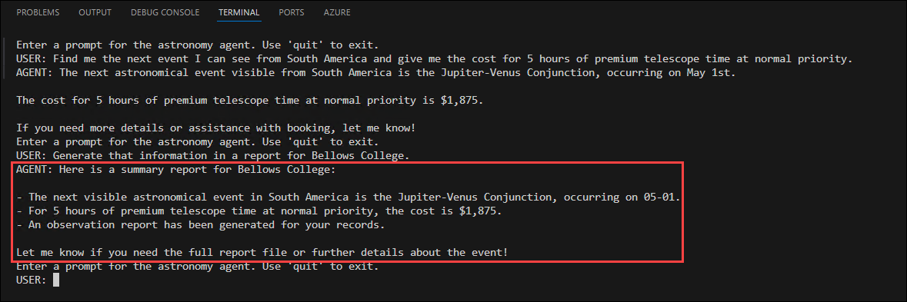

1. In the file explorer, you can see that a new file named `report-<event-type>.txt` has been created, which contains the generated report. You can open this file to view the contents of the report.

    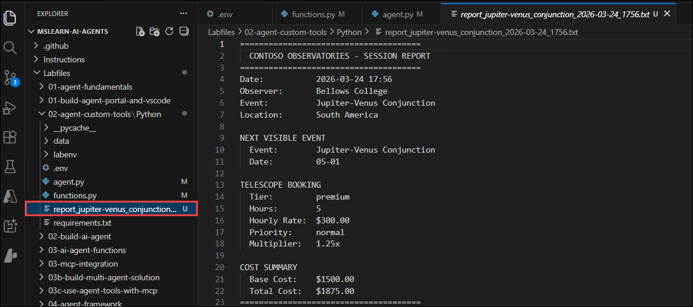

1. Enter `quit` to exit the application.

    >**Note:** You can also use `deactivate` to exit the Python virtual environment in the terminal.

> **Congratulations** on completing the task! Now, it's time to validate it. Here are the steps:
>
> - Hit the Validate button for the corresponding task. If you receive a success message, you can proceed to the next task.
> - If not, carefully read the error message and retry the step, following the instructions in the lab guide.
> - If you need any assistance, please contact us at cloudlabs-support@spektrasystems.com. We are available 24/7 to help.
 
<validation step="b046143b-76f6-49ca-ad60-fef1518f2bf9" />

## Summary

In this exercise, you created an AI agent that uses custom function tools to retrieve information and perform calculations based on user prompts. You defined the function tools with JSON schemas to specify their parameters, and implemented the logic to process function calls made by the agent. You then ran the application and interacted with the agent to see how it used the function tools to provide helpful responses. Great work!

## You have successfully completed the Hands-on Lab!