# Lab 3b: Develop a multi-agent solution with Microsoft Foundry
    
### Estimated Duration: 30 Minutes

## Overview

In this lab, you will build a multi-agent AI solution using the Microsoft Foundry Agent Service to automate support ticket triage. You will create a Foundry project and develop a client application that connects multiple AI agents. These agents will collaborate to evaluate ticket priority, recommend the appropriate team, and estimate the required effort. Finally, you will run the application and observe how the agents work together to provide a structured ticket assessment.

> **Tip:** The code used in this exercise is based on the for Foundry SDK for Python. You can develop similar solutions using the SDKs for Microsoft .NET, JavaScript, and Java. Refer to [Foundry SDK client libraries](https://learn.microsoft.com/azure/ai-foundry/how-to/develop/sdk-overview) for details.

> **Note:** Some of the technologies used in this exercise are in preview or in active development. You may experience some unexpected behavior, warnings, or errors.

## Lab Objectives

- **Task 1:** Create a Foundry project

- **Task 2:** Create an AI Agent client app

## Task 1: Create a Foundry project

In this task, you will sign in to the Microsoft Foundry portal and create a new project. You will then deploy the gpt-4.1 model, verify it in the Agents playground, and copy the project endpoint for use in your client application.

1. Open a new tab in the browser, right-click on the following link [Microsoft Foundry portal](https://ai.azure.com), then **Copy link** and paste it in a browser tab to log in to **Microsoft Foundry portal**.

1. Click on **Sign in**.

   

1. If prompted, provide the credentials below:

   - **Email/Username:** <inject key="AzureAdUserEmail"></inject>

     

   - **Password:** <inject key="AzureAdUserPassword"></inject>

      

1. When the **Stay signed in?** window appears, select **No**.

    

     > **Important:** Make sure the **New Foundry** toggle is **Off** for this lab.

1. In the home page, select **Create an agent**.   

    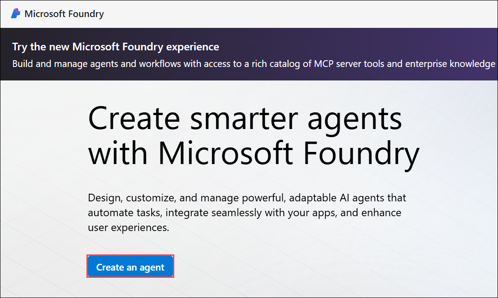

1. In the **Create a new project** window, enter **Myproject<inject key="DeploymentID"></inject> (1)** as the project name. Open the **Advanced options (2)** drop-down, fill in the following details, and then click **Create (7)**:

    * Subscription: **Choose Default Subscription (3)**
    * Resource group: **AI-3026-RG3b (4)**
    * Microsoft Foundry resource: **Keep as Default (5)**
    * Region: **<inject key="Region"></inject> (6)**

      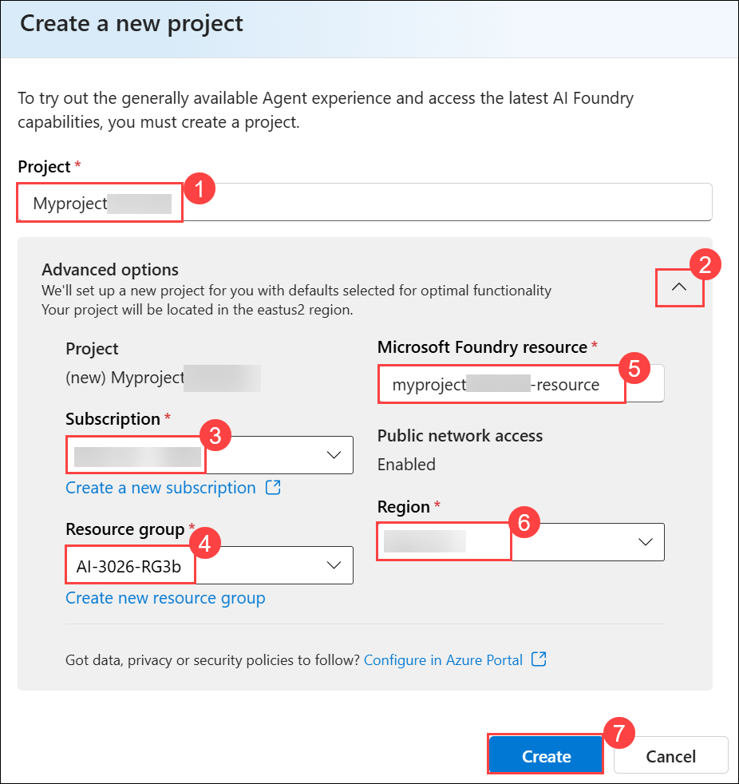

       >**Note:** Some Azure AI resources are constrained by regional model quotas. In the event of a quota limit being exceeded later in the exercise, there's a possibility you may need to create another resource in a different region.       

1. Wait for your project to be created.      

    >**Note:** In some cases, Microsoft Foundry will automatically deploy a default model usually **gpt-4o**. If this happens, follow the below step and deploy gpt-4.1 model.

    1. In the left-hand menu, select **Models + endpoints**, then select **+ Deploy model** and choose **Deploy base model** from the drop-down list.

       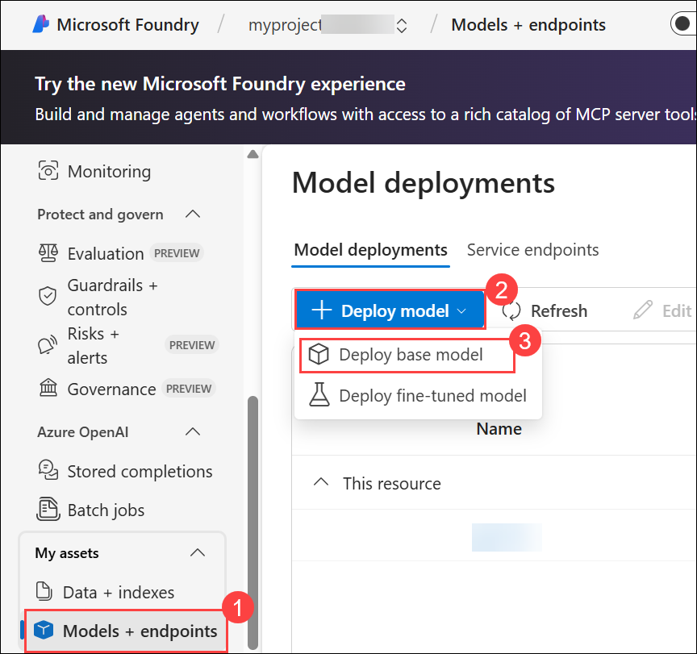

1. When prompted, search for `gpt-4.1` **(1)**, then select **gpt-4.1 (2)** model and then **Confirm (3)**.

    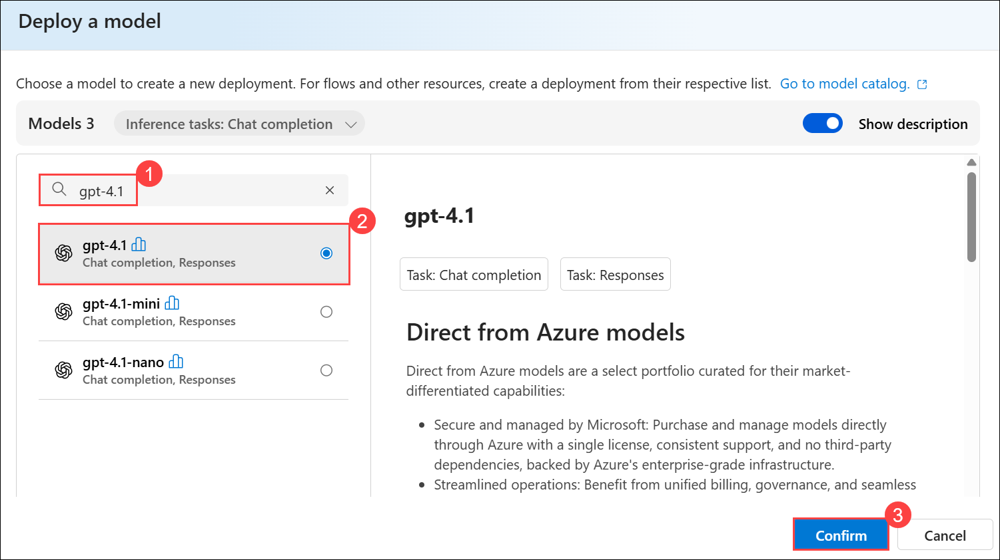

1. On the **Deploy gpt-4.1** page, select **Standard (1)** as the Deployment type and then click on **Deploy (2)**.

   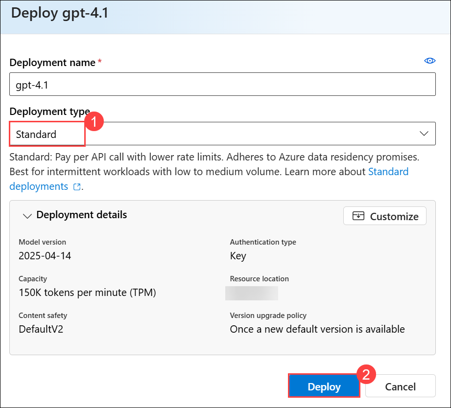

1. From the left navigation pane, select **Playgrounds (1)**, then in the **Agents playground** verify that **gpt-4.1 (2)** is selected under *Deployment*; if not, choose **gpt-4.1** from the drop-down.

    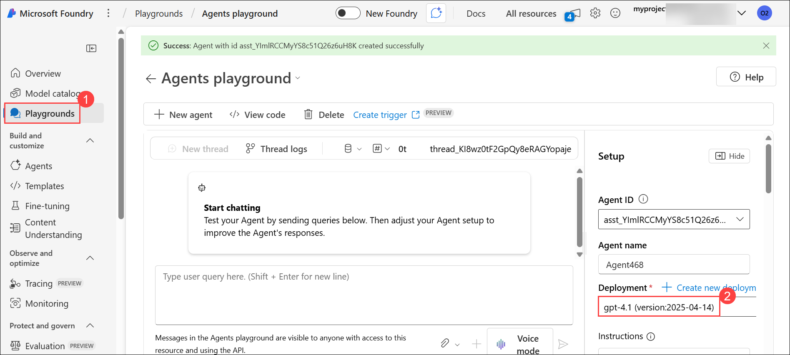

    > **Note:** After selecting **Playgrounds**, if the welcome page appears with the **Let’s go** button, select **Let’s go** to open the **Agents playground**, and then verify that **gpt-4.1** is selected under *Deployment*.

1. In the navigation pane on the left, select **Overview (1)** to see the main page for your project. Copy the **Microsoft Foundry project endpoint (2)** values to a notepad, as you'll use them to connect to your project in a client application.

    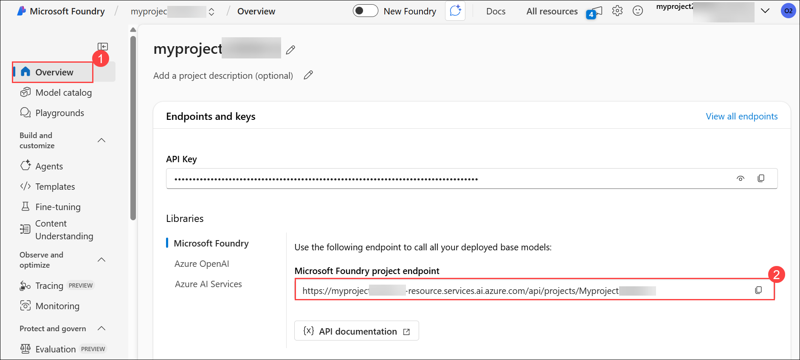

## Task 2: Create an AI Agent client app

Now you're ready to create a client app that defines the agents and instructions. Some code is provided for you in a GitHub repository.

### Task 2.1 : Prepare the environment

In this task, you will open the Microsoft Azure portal and use Cloud Shell to prepare your development environment. You will also clone the GitHub repository and access the project files needed to build the AI agent client application.

1. Open a new browser tab (keeping the Microsoft Foundry portal open in the existing tab). Then in the new tab, browse to the [Azure portal](https://portal.azure.com) at `https://portal.azure.com`.

1. If prompted, provide the credentials below:

    - **Email/Username:** <inject key="AzureAdUserEmail"></inject>

    - **Password:** <inject key="AzureAdUserPassword"></inject> 

      >**Note:** Close any welcome notifications to see the Azure portal home page.

1. On the **Azure portal** homepage, click the **\[>\_] Cloud Shell (1)** button located to the right of the **Copilot** tab at the top. This opens a new Cloud Shell session. In the **Welcome to Azure Cloud Shell** window, choose **PowerShell (2)**.

    

    >**Note:** The cloud shell provides a command-line interface in a pane at the bottom of the Azure portal. You can resize or maximize this pane to make it easier to work in.

    > **Note:** If you have previously created a cloud shell that uses a **Bash** environment, switch it to **PowerShell**.

1. In the **Getting started** window, ensure **No storage account required (1)** is selected. From the **Subscription** drop-down, choose **Default subscription (2)**, then click **Apply (3)**.

    

1. In the Cloud Shell toolbar, open the **Settings (1)** menu and choose **Go to Classic version (2)** from the drop-down.

    

    >**Note:** **<font color="red">Ensure you've switched to the classic version of the cloud shell before continuing.</font>**

1. In the cloud shell pane, enter the following commands to clone the GitHub repo containing the code files for this exercise (type the command, or copy it to the clipboard and then right-click in the command line and paste as plain text):

    ```
   rm -r ai-agents -f
   git clone https://github.com/MicrosoftLearning/mslearn-ai-agents ai-agents
    ```
    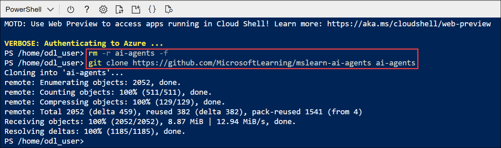

    > **Tip:** As you enter commands into the cloud shell, the output may take up a large amount of the screen buffer and the cursor on the current line may be obscured. You can clear the screen by entering the `cls` command to make it easier to focus on each task.

1. When the repo has been cloned, enter the following command to change the working directory to the folder containing the code files and list them all.

    ```
   cd ai-agents/Labfiles/03b-build-multi-agent-solution/Python
   ls -a -l
    ```

    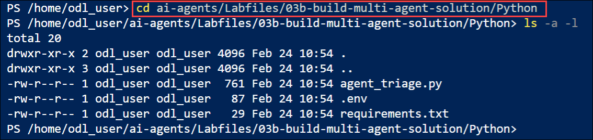

    - The provided files include application code and a file for configuration settings.

### Task 2.2: Configure the application settings

In this task, you will install the required libraries and configure the application settings by updating the project endpoint and model deployment details from your Microsoft Foundry project.

1. In the cloud shell command-line pane, enter the following command to install the libraries you'll use:

    ```
   python -m venv labenv
   ./labenv/bin/Activate.ps1
   pip install -r requirements.txt azure-ai-projects azure-ai-agents
    ```

1. Enter the following command to edit the configuration file that is provided:

    ```
   code .env
    ```

    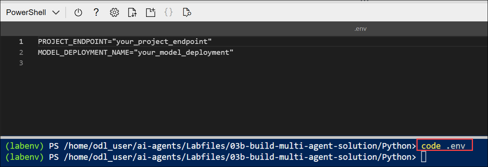

1. In the code file, replace the placeholder values with the correct details for your project:

    * PROJECT\_ENDPOINT : **Microsoft Foundry project endpoint (1)**
    * MODEL\_DEPLOYEMNT\_NAME : **gpt-4.1 (2)**

      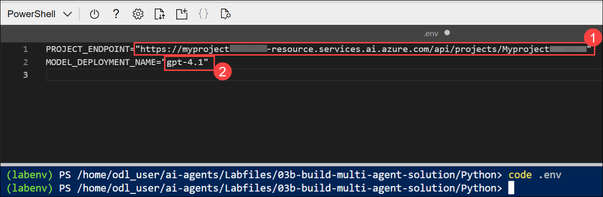

      > **Note:** Paste the project endpoint you copied in the previous task.

1. After you've replaced the placeholders, use the **CTRL+S** command to save your changes and then use the **CTRL+Q** command to close the code editor while keeping the cloud shell command line open.

### Task 2.3: Create AI agents

In this task, you will modify the Python application to create multiple AI agents using the Microsoft Foundry Agents SDK, each responsible for priority, team assignment, and effort estimation. You will then connect these agents through a primary triage agent that orchestrates them to process and respond to support tickets collaboratively.

1. Enter the following command to edit the **agent_triage.py** file:

    ```
   code agent_triage.py
    ```

    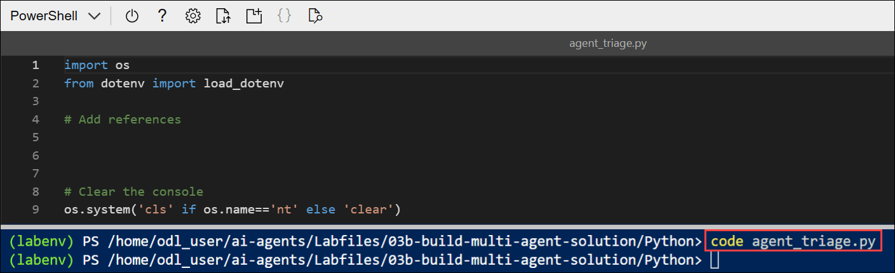

1. Review the code in the file, noting that it contains strings for each agent name and instructions.

1. Find the comment **Add references** and add the following code to import the classes you'll need:

    ```python
   # Add references
   from azure.ai.agents import AgentsClient
   from azure.ai.agents.models import ConnectedAgentTool, MessageRole, ListSortOrder, ToolSet, FunctionTool
   from azure.identity import DefaultAzureCredential
    ```

    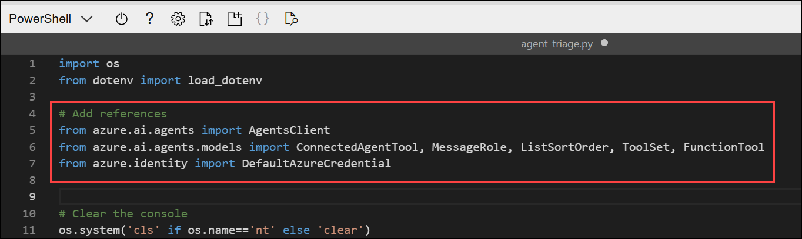

1. Note that code to load the project endpoint and model name from your environment variables has been provided.

1. Find the comment **Connect to the agents client**, and add the following code to create an AgentsClient connected to your project:

    ```python
   # Connect to the agents client
   agents_client = AgentsClient(
        endpoint=project_endpoint,
        credential=DefaultAzureCredential(
            exclude_environment_credential=True, 
            exclude_managed_identity_credential=True
        ),
   )
    ```

    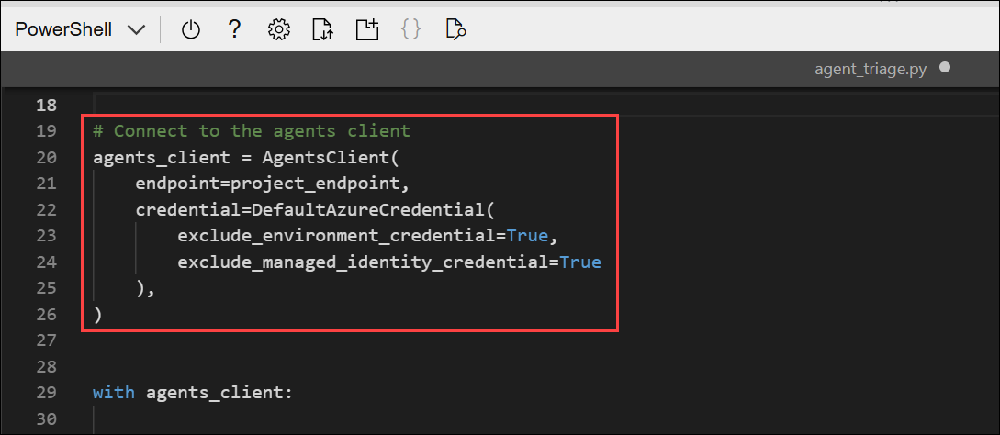

    - Now you'll add code that uses the AgentsClient to create multiple agents, each with a specific role to play in processing a support ticket.

      > **Tip:** When adding subsequent code, be sure to maintain the right level of indentation under the `using agents_client:` statement.

1. Find the comment **Create an agent to prioritize support tickets**, and enter the following code (being careful to retain the right level of indentation):

    ```python
   # Create an agent to prioritize support tickets
   priority_agent_name = "priority_agent"
   priority_agent_instructions = """
   Assess how urgent a ticket is based on its description.

   Respond with one of the following levels:
   - High: User-facing or blocking issues
   - Medium: Time-sensitive but not breaking anything
   - Low: Cosmetic or non-urgent tasks

   Only output the urgency level and a very brief explanation.
   """

   priority_agent = agents_client.create_agent(
        model=model_deployment,
        name=priority_agent_name,
        instructions=priority_agent_instructions
   )
    ```

    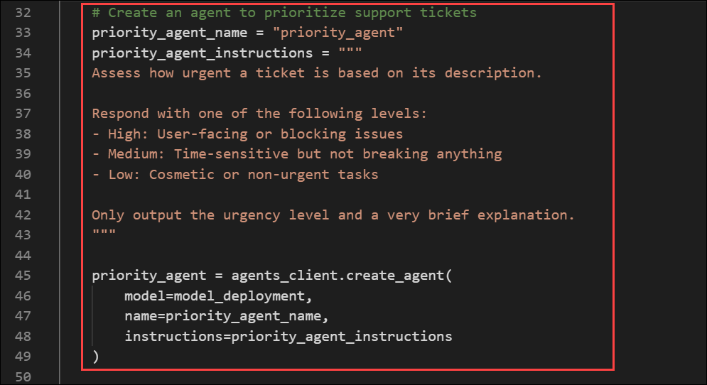

1. Find the comment **Create an agent to assign tickets to the appropriate team**, and enter the following code:

    ```python
   # Create an agent to assign tickets to the appropriate team
   team_agent_name = "team_agent"
   team_agent_instructions = """
   Decide which team should own each ticket.

   Choose from the following teams:
   - Frontend
   - Backend
   - Infrastructure
   - Marketing

   Base your answer on the content of the ticket. Respond with the team name and a very brief explanation.
   """

   team_agent = agents_client.create_agent(
        model=model_deployment,
        name=team_agent_name,
        instructions=team_agent_instructions
   )
    ```

    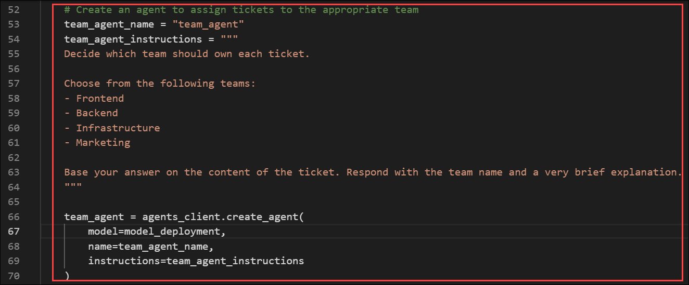

1. Find the comment **Create an agent to estimate effort for a support ticket**, and enter the following code:

    ```python
   # Create an agent to estimate effort for a support ticket
   effort_agent_name = "effort_agent"
   effort_agent_instructions = """
   Estimate how much work each ticket will require.

   Use the following scale:
   - Small: Can be completed in a day
   - Medium: 2-3 days of work
   - Large: Multi-day or cross-team effort

   Base your estimate on the complexity implied by the ticket. Respond with the effort level and a brief justification.
   """

   effort_agent = agents_client.create_agent(
        model=model_deployment,
        name=effort_agent_name,
        instructions=effort_agent_instructions
   )
    ```

    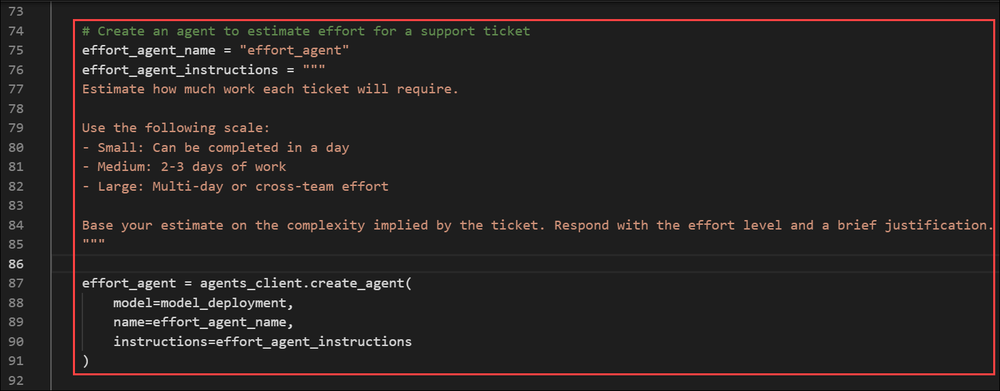

    - So far, you've created three agents; each of which has a specific role in triaging a support ticket. Now let's create ConnectedAgentTool objects for each of these agents so they can be used by other agents.

1. Find the comment **Create connected agent tools for the support agents**, and enter the following code:

    ```python
   # Create connected agent tools for the support agents
   priority_agent_tool = ConnectedAgentTool(
        id=priority_agent.id, 
        name=priority_agent_name, 
        description="Assess the priority of a ticket"
   )
    
   team_agent_tool = ConnectedAgentTool(
        id=team_agent.id, 
        name=team_agent_name, 
        description="Determines which team should take the ticket"
   )
    
   effort_agent_tool = ConnectedAgentTool(
        id=effort_agent.id, 
        name=effort_agent_name, 
        description="Determines the effort required to complete the ticket"
   )
    ```

    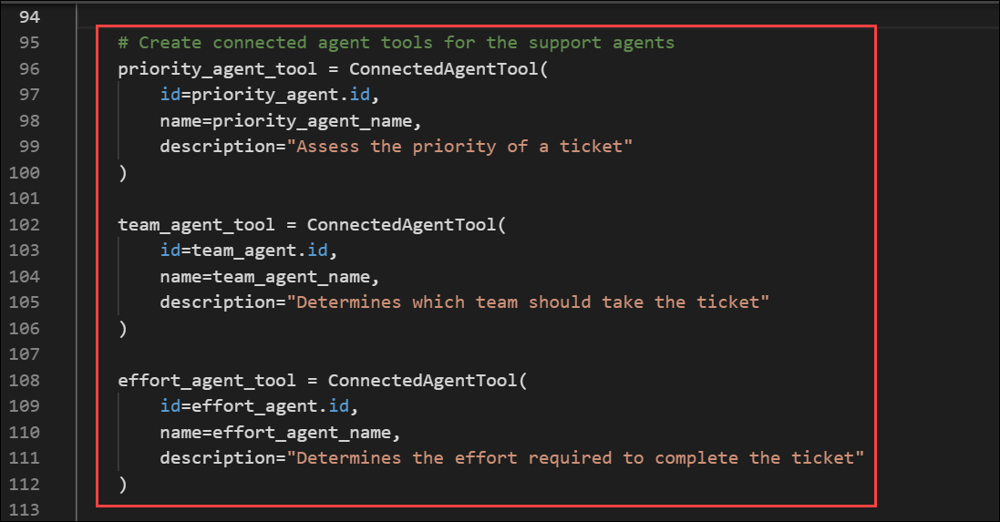

    - Now you're ready to create a primary agent that will coordinate the ticket triage process, using the connected agents as required.

1. Find the comment **Create an agent to triage support ticket processing by using connected agents**, and enter the following code:

    ```python
   # Create an agent to triage support ticket processing by using connected agents
   triage_agent_name = "triage-agent"
   triage_agent_instructions = """
   Triage the given ticket. Use the connected tools to determine the ticket's priority, 
   which team it should be assigned to, and how much effort it may take.
   """

   triage_agent = agents_client.create_agent(
        model=model_deployment,
        name=triage_agent_name,
        instructions=triage_agent_instructions,
        tools=[
            priority_agent_tool.definitions[0],
            team_agent_tool.definitions[0],
            effort_agent_tool.definitions[0]
        ]
   )
    ```

    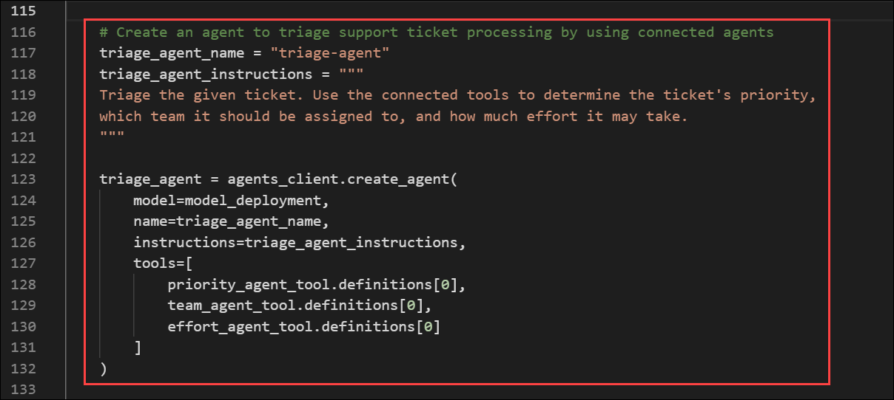

    - Now that you have defined a primary agent, you can submit a prompt to it and have it use the other agents to triage a support issue.

1. Find the comment **Use the agents to triage a support issue**, and enter the following code:

    ```python
   # Use the agents to triage a support issue
   print("Creating agent thread.")
   thread = agents_client.threads.create()  

   # Create the ticket prompt
   prompt = input("\nWhat's the support problem you need to resolve?: ")
    
   # Send a prompt to the agent
   message = agents_client.messages.create(
        thread_id=thread.id,
        role=MessageRole.USER,
        content=prompt,
   )   
    
   # Run the thread usng the primary agent
   print("\nProcessing agent thread. Please wait.")
   run = agents_client.runs.create_and_process(thread_id=thread.id, agent_id=triage_agent.id)
        
   if run.status == "failed":
        print(f"Run failed: {run.last_error}")

   # Fetch and display messages
   messages = agents_client.messages.list(thread_id=thread.id, order=ListSortOrder.ASCENDING)
   for message in messages:
        if message.text_messages:
            last_msg = message.text_messages[-1]
            print(f"{message.role}:\n{last_msg.text.value}\n")
   
    ```

    

1. Find the comment **Clean up**, and enter the following code to delete the agents when they are no longer required:

    ```python
   # Clean up
   print("Cleaning up agents:")
   agents_client.delete_agent(triage_agent.id)
   print("Deleted triage agent.")
   agents_client.delete_agent(priority_agent.id)
   print("Deleted priority agent.")
   agents_client.delete_agent(team_agent.id)
   print("Deleted team agent.")
   agents_client.delete_agent(effort_agent.id)
   print("Deleted effort agent.")
    ```
    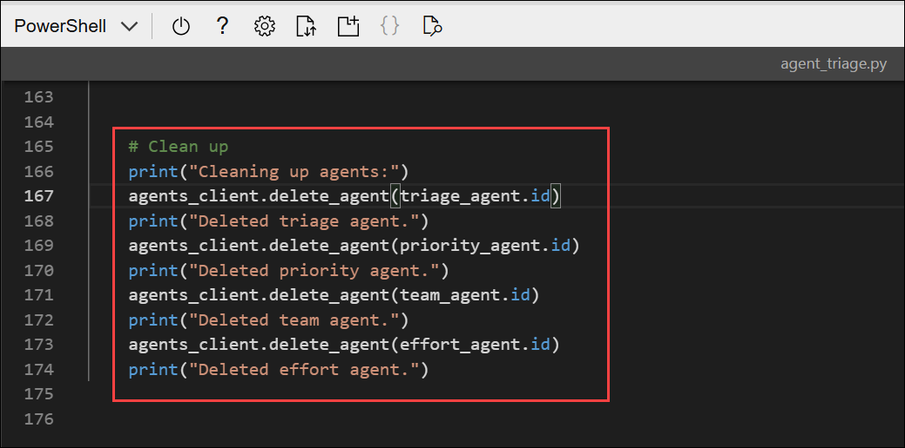

1. Use the **CTRL+S** command to save your changes to the code file. You can keep it open (in case you need to edit the code to fix any errors) or use the **CTRL+Q** command to close the code editor while keeping the cloud shell command line open.

### Task 2.4: Sign into Azure and run the app

In this task, you will sign in to Microsoft Azure using Azure CLI and run the Python application to test how your multi-agent solution processes and triages support tickets.

1. In the cloud shell command-line pane, enter the following command to sign into Azure. Click on the **Link (1)** and copy the **code (2)** provided.

    ```
    az login
    ```

    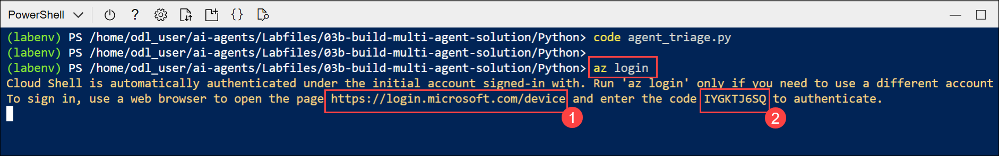

    > **Note:** In most scenarios, just using *az login* will be sufficient. However, if you have subscriptions in multiple tenants, you may need to specify the tenant by using the *--tenant* parameter. See [Sign into Azure interactively using the Azure CLI](https://learn.microsoft.com/cli/azure/authenticate-azure-cli-interactively) for details.

1. In the new browser tab, when the **Enter code to allow access (1)** window appears, paste the copied code and select **Next (2)**.

    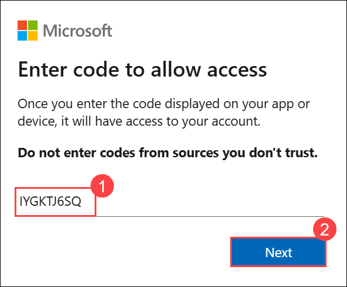

1. In the **Pick an account** dialog box, choose **ODL_User<inject key="DeploymentID"></inject>**. 

    

1. In the **Are you trying to sign in to Microsoft Azure CLI?** dialog box, click **Continue**.

    

1. When the **Microsoft Azure Cross-platform Command Line Interface** window pops up, return to the browser tab with Cloud Shell open. 

    

1. In the Cloud Shell console, press **Enter** to select the only available subscription.

    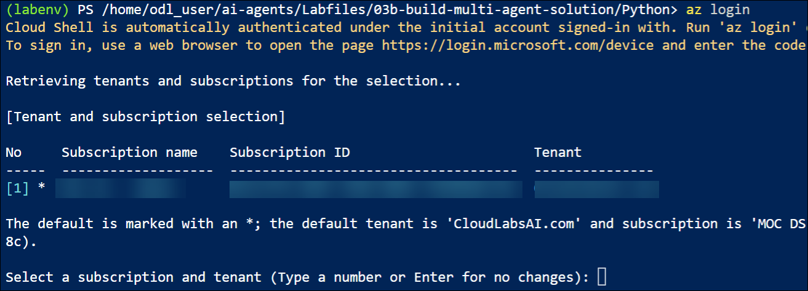

1. After you have signed in, enter the following command to run the application:

    ```
   python agent_triage.py
    ```

1. Enter a prompt, such as `Users can't reset their password from the mobile app.`

    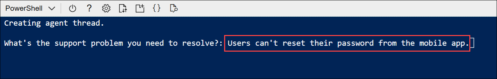

1. After the agents process the prompt, you should see some output similar to the following:

    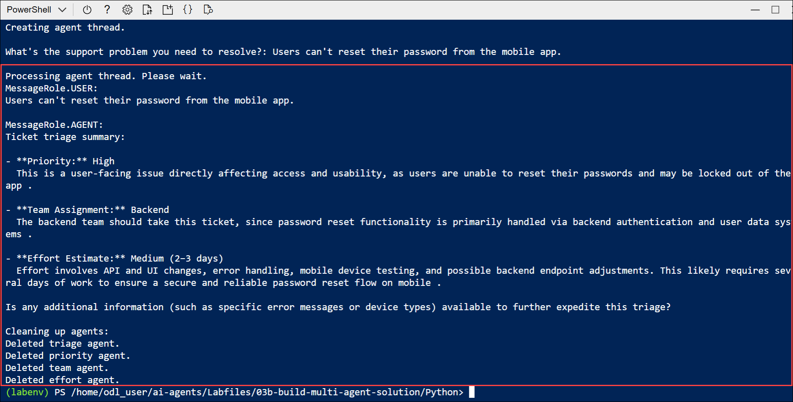

    ```output
    Creating agent thread.
    Processing agent thread. Please wait.

    MessageRole.USER:
    Users can't reset their password from the mobile app.

    MessageRole.AGENT:
    ### Ticket Assessment

    - **Priority:** High — This issue blocks users from resetting their passwords, limiting access to their accounts.
    - **Assigned Team:** Frontend Team — The problem lies in the mobile app's user interface or functionality.
    - **Effort Required:** Medium — Resolving this problem involves identifying the root cause, potentially updating the mobile app functionality, reviewing API/backend integration, and testing to ensure compatibility across Android/iOS platforms.

    Cleaning up agents:
    Deleted triage agent.
    Deleted priority agent.
    Deleted team agent.
    Deleted effort agent.
    ```

    - You can try modifying the prompt using a different ticket scenario to see how the agents collaborate. For example, "Investigate occasional 502 errors from the search endpoint."

## Summary

In this lab, you used the Microsoft Foundry Agent Service and SDK to build a multi-agent solution for support ticket triage. You created and configured multiple specialized AI agents, connected them through a primary orchestration agent, and integrated the solution with your Foundry project. Finally, you ran and tested the application to observe how the agents collaborated to evaluate ticket priority, assign the appropriate team, and estimate the required effort.

### You have successfully completed the Hands-on Lab!