# Lab 03c: Connect AI agents to tools using Model Context Protocol (MCP)

### Estimated Duration: 30 Minutes

## Overview

In this lab, you will build an AI agent using Microsoft Foundry that connects to a remote Model Context Protocol (MCP) server to access trusted and up-to-date technical documentation. You will configure the agent with MCP function tools and enable it to retrieve real-time information from official Microsoft Learn resources. Finally, you will run and test the agent to observe how it uses MCP tools to answer developer queries accurately.

> **Tip:** The code used in this exercise is based on the Azure AI Agent service MCP support sample repository. Refer to [Azure OpenAI demos](https://github.com/retkowsky/Azure-OpenAI-demos/blob/main/Azure%20Agent%20Service/9%20Azure%20AI%20Agent%20service%20-%20MCP%20support.ipynb) or visit [Connect to Model Context Protocol servers](https://learn.microsoft.com/en-us/azure/ai-foundry/agents/how-to/tools/model-context-protocol) for more details.

> **Note:** Some of the technologies used in this exercise are in preview or in active development. You may experience some unexpected behavior, warnings, or errors.

## Lab Objectives

- **Task 1:** Create a Microsoft Foundry project

- **Task 2:** Develop an agent that uses MCP function tools

## Task 1: Create a Microsoft Foundry project

In this task, you’ll create a new project in the Microsoft Foundry portal and deploy the gpt-4.1 model using the required subscription and region settings. Finally, you’ll copy the project endpoint to use later for connecting your AI client application.

1. Open a new tab in the browser, right-click on the following link [Foundry portal](https://ai.azure.com), then **Copy link** and paste it in a browser tab to log in to **Microsoft Foundry portal**.

1. Click on **Sign in**.
 
    

1. If prompted, provide the credentials below:
 
   - **Email/Username:** <inject key="AzureAdUserEmail"></inject>
    
     

   - **Password:** <inject key="AzureAdUserPassword"></inject>
    
     

1. When the **Stay signed in?** window appears, select **No**.

    
    
    >**Note:** Close any tips or quick start panes that are opened the first time you sign in, and if necessary use the **Foundry** logo at the top left to navigate to the home page, which looks similar to the following image (close the **Help** pane if it's open):

1. At the top of the **Microsoft Foundry** portal, enable the **New Foundry toggle (1)** to switch to the latest Foundry user interface.

1. From the **Select a project to continue** dialog, click the drop-down under **Select or search for a project**, and then select **Create a new project (2)**.

     

    > **Important:** For this lab, you're using the **New** Foundry experience.

1. In the **Create a project** window, enter **Myproject<inject key="DeploymentID"></inject> (1)** as the project name. Open the **Advanced options (2)** drop-down, fill in the following details, and then click **Create (7)**:

    * Subscription: **Choose Default Subscription (3)**
    * Resource group: **AI-3026-RG3c (4)**
    * Microsoft Foundry resource: **Keep as Default (5)**
    * Region: **<inject key="Region"></inject> (6)**

      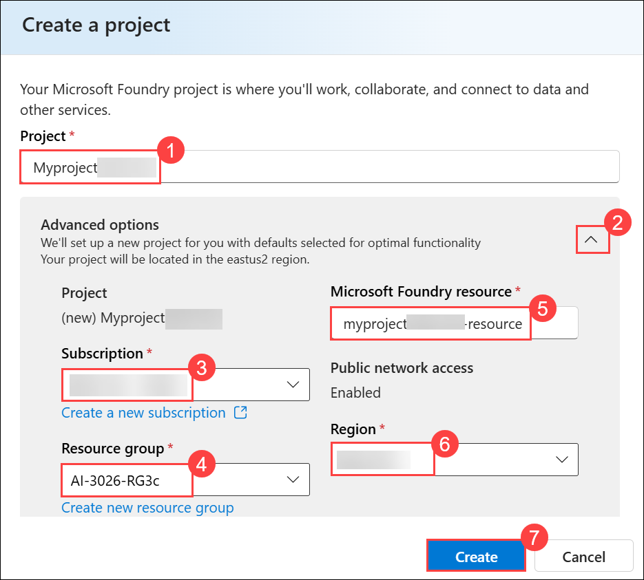

      >**Note:**  Some Azure AI resources are constrained by regional model quotas. In the event of a quota limit being exceeded later in the exercise, there's a possibility you may need to create another resource in a different region.

1. Wait for your project created. It may take a few minutes.

1. On the **Microsoft Foundry** home page, click **Start building (1)**, and then select **Browse models (2)** from the drop-down menu.

     

1. On the **Models** page, search for **gpt-4.1 (1)** in the search bar, and then select the **gpt-4.1 (2)** model from the search results.

     

1. On the **gpt-4.1** model details page, click **Deploy (1)**, and then select **Default settings (2)** to deploy the model using the standard configuration.

    

    - After the model is deployed, the playground for the model is displayed.

1. In the navigation bar on the left, select **Microsoft Foundry** to return to the Foundry home page.

     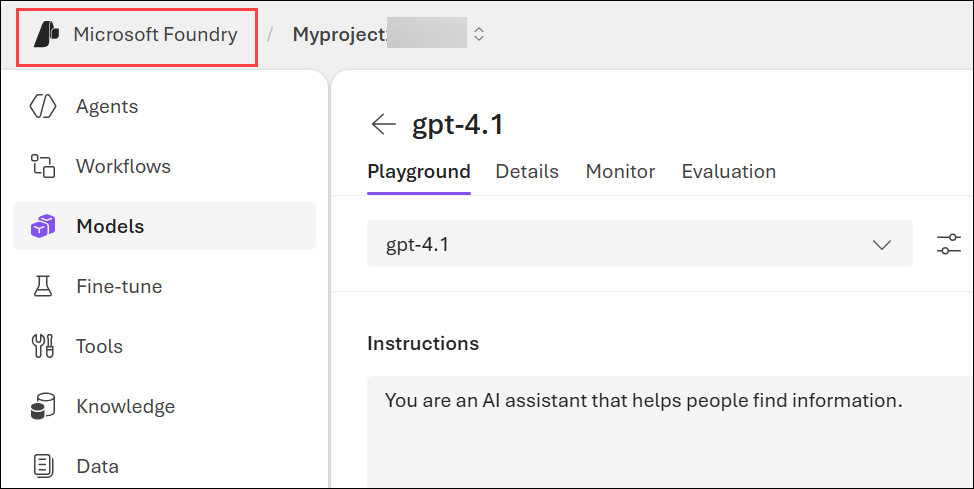

1. Copy the **Project endpoint** value to a notepad, as you'll use them to connect to your project in a client application.

    

> **Congratulations** on completing the task! Now, it's time to validate it. Here are the steps:
>
> - Hit the Validate button for the corresponding task. If you receive a success message, you can proceed to the next task.
> - If not, carefully read the error message and retry the step, following the instructions in the lab guide.
> - If you need any assistance, please contact us at cloudlabs-support@spektrasystems.com. We are available 24/7 to help.
 
<validation step="159626b2-71e1-4a6b-96db-ca27aa144d74" />

## Task 2: Develop an agent that uses MCP function tools

Now that you've created your project in AI Foundry, let's develop an app that integrates an AI agent with an MCP server.

### Task 2.1: Clone the repo containing the application code

In this task, you’ll use Azure Cloud Shell (PowerShell) to clone the GitHub repository and navigate to the project folder containing the MCP-based AI agent application code.

1. Open a new browser tab (keeping the Microsoft Foundry portal open in the existing tab). Then in the new tab, browse to the [Azure portal](https://portal.azure.com) at `https://portal.azure.com`.

1. If prompted, provide the credentials below:

    - **Email/Username:** <inject key="AzureAdUserEmail"></inject>

    - **Password:** <inject key="AzureAdUserPassword"></inject> 

      >**Note:** Close any welcome notifications to see the Azure portal home page.

1. On the **Azure portal** homepage, click the **\[>\_] Cloud Shell (1)** button located to the right of the **Copilot** tab at the top. This opens a new Cloud Shell session. In the **Welcome to Azure Cloud Shell** window, choose **PowerShell (2)**.

    

    >**Note:** The cloud shell provides a command-line interface in a pane at the bottom of the Azure portal. You can resize or maximize this pane to make it easier to work in.

    > **Note:** If you have previously created a cloud shell that uses a **Bash** environment, switch it to **PowerShell**.

1. In the **Getting started** window, ensure **No storage account required (1)** is selected. From the **Subscription** drop-down, choose **Default subscription (2)**, then click **Apply (3)**.

    

1. In the Cloud Shell toolbar, open the **Settings (1)** menu and choose **Go to Classic version (2)** from the drop-down.

    

    >**Note:** **Ensure you've switched to the classic version of the cloud shell before continuing.**

1. In the cloud shell pane, enter the following commands to clone the GitHub repo containing the code files for this exercise (type the command, or copy it to the clipboard and then right-click in the command line and paste as plain text):

    ```
   rm -r ai-agents -f
   git clone https://github.com/MicrosoftLearning/mslearn-ai-agents ai-agents
    ```
    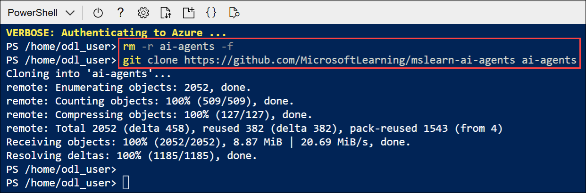

    > **Tip:** As you enter commands into the cloudshell, the output may take up a large amount of the screen buffer and the cursor on the current line may be obscured. You can clear the screen by entering the `cls` command to make it easier to focus on each task.

1. Enter the following command to change the working directory to the folder containing the code files and list them all.

    ```
   cd ai-agents/Labfiles/03c-use-agent-tools-with-mcp/Python
   ls -a -l
    ```

    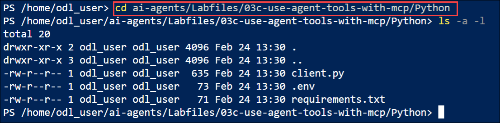

### Task 2.2: Configure the application settings

In this task, you’ll create a virtual environment, install required libraries, and update the project endpoint and model deployment name in the configuration file.

1. In the cloud shell command-line pane, enter the following command to install the libraries you'll use:

    ```
   python -m venv labenv
   ./labenv/bin/Activate.ps1
   pip install -r requirements.txt
    ```

    >**Note:** You can ignore any warning or error messages displayed during the library installation.

1. Enter the following command to edit the configuration file that has been provided:

    ```
   code .env
    ```

    

1. In the code file, replace the placeholder values with the correct details for your project:

    * PROJECT\_ENDPOINT : **Foundry project endpoint (1)**
    * MODEL\_DEPLOYMENT\_NAME : **gpt-4.1 (2)**

        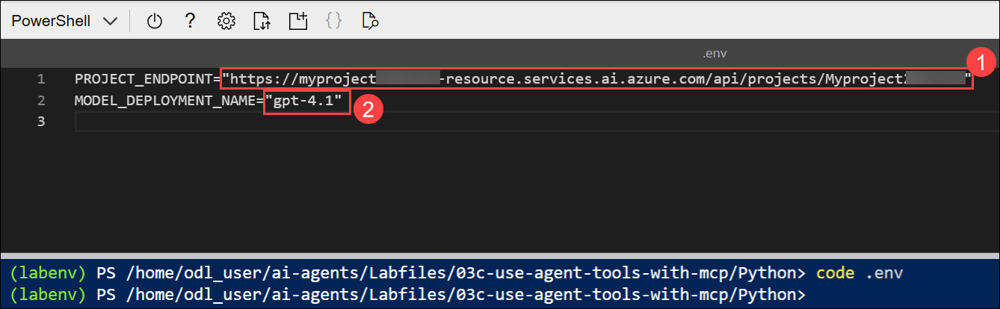

        > **Note:** Paste the project endpoint you copied in the previous task.

1. After you've replaced the placeholder, use the **CTRL+S** command to save your changes and then use the **CTRL+Q** command to close the code editor while keeping the cloud shell command line open.

### Task 2.3: Connect an Azure AI Agent to a remote MCP server

In this task, you’ll connect the Azure AI agent to a remote MCP server, configure it with tools and instructions, run a prompt, handle approval requests, and retrieve the final response.

1. Enter the following command to edit the code file that has been provided:

    ```
   code client.py
    ```

    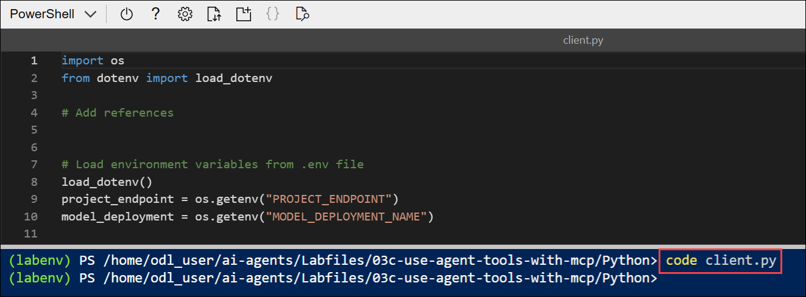

1. Find the comment **Add references** and add the following code to import the classes:

    ```python
   # Add references
   from azure.identity import DefaultAzureCredential
   from azure.ai.projects import AIProjectClient
   from azure.ai.projects.models import PromptAgentDefinition, MCPTool
   from openai.types.responses.response_input_param import McpApprovalResponse, ResponseInputParam
    ```

    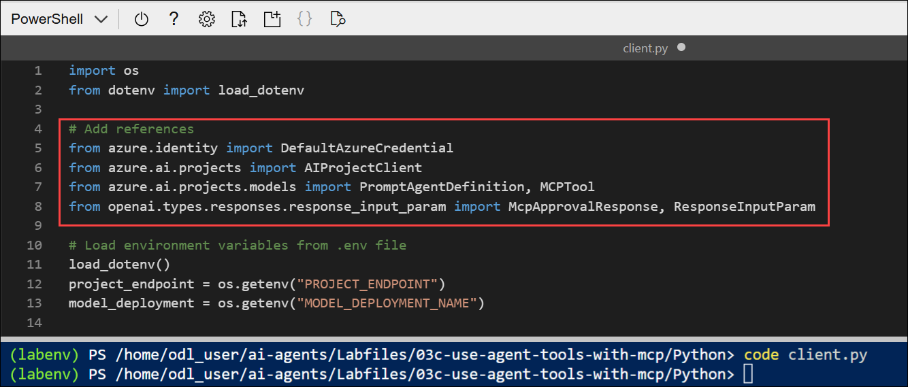

1. Find the comment **Connect to the agents client** and add the following code to connect to the Azure AI project using the current Azure credentials.

    ```python
   # Connect to the agents client
   with (
       DefaultAzureCredential(
           exclude_environment_credential=True,
           exclude_managed_identity_credential=True) as credential,
       AIProjectClient(endpoint=project_endpoint, credential=credential) as project_client,
       project_client.get_openai_client() as openai_client,
    ):
    ```

    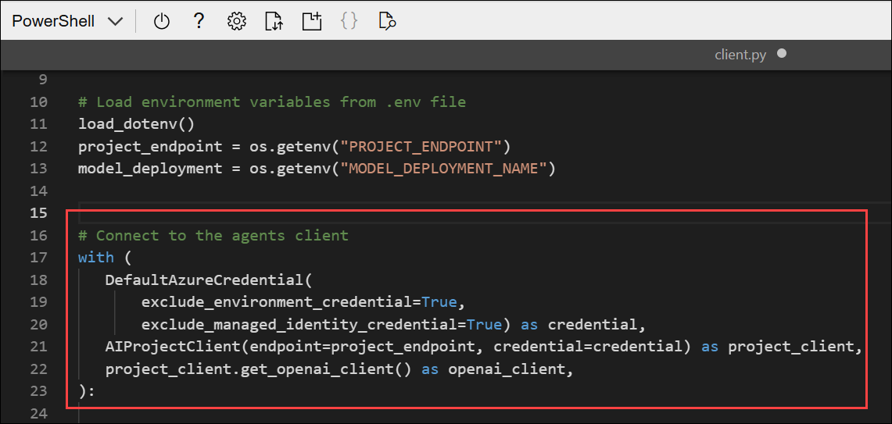

1. Under the comment **Initialize agent MCP tool**, add the following code:

    ```python
   # Initialize agent MCP tool
   mcp_tool = MCPTool(
       server_label="api-specs",
       server_url="https://learn.microsoft.com/api/mcp",
       require_approval="always",
   )
    ```

    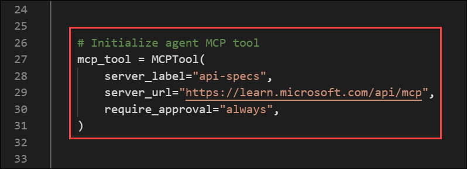

    - This code will connect to the Microsft Learn Docs remote MCP server. This is a cloud-hosted service that enables clients to access trusted and up-to-date information directly from Microsoft's official documentation.

1. Under the comment **Create a new agent with the MCP tool** and add the following code:

    ```python
   # Create a new agent with the MCP tool
   agent = project_client.agents.create_version(
       agent_name="MyAgent",
       definition=PromptAgentDefinition(
           model=model_deployment,
           instructions="You are a helpful agent that can use MCP tools to assist users. Use the available MCP tools to answer questions and perform tasks.",
           tools=[mcp_tool],
       ),
   )
   print(f"Agent created (id: {agent.id}, name: {agent.name}, version: {agent.version})")
    ```

    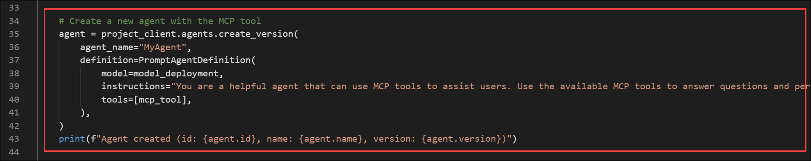

    - In this code, you provide instructions for the agent and provide it with the MCP tool definitions.

1. Find the comment **Create a conversation thread** and add the following code:

    ```python
   # Create a conversation thread
   conversation = openai_client.conversations.create()
   print(f"Created conversation (id: {conversation.id})")
    ```

1. Find the comment **Send initial request that will trigger the MCP tool** and add the following code:

    ```python
   # Send initial request that will trigger the MCP tool
   response = openai_client.responses.create(
       conversation=conversation.id,
       input="Give me the Azure CLI commands to create an Azure Container App with a managed identity.",
       extra_body={"agent": {"name": agent.name, "type": "agent_reference"}},
   )
    ```

    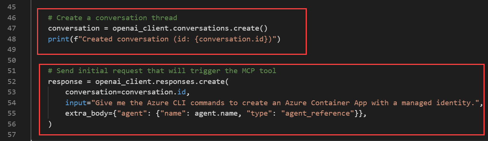

1. Find the comment **Process any MCP approval requests that were generated** and add the following code:

    ```python
   # Process any MCP approval requests that were generated
   input_list: ResponseInputParam = []
   for item in response.output:
       if item.type == "mcp_approval_request":
           if item.server_label == "api-specs" and item.id:
               # Automatically approve the MCP request to allow the agent to proceed
               input_list.append(
                   McpApprovalResponse(
                       type="mcp_approval_response",
                       approve=True,
                       approval_request_id=item.id,
                   )
               )

   print("Final input:")
   print(input_list)
    ```

    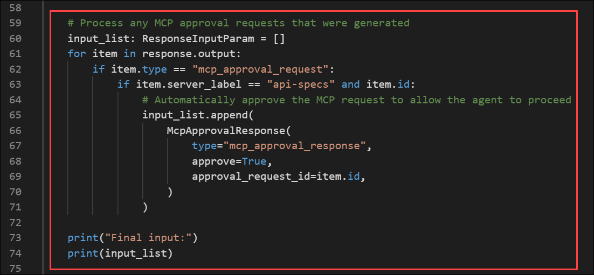

1. Find the comment **Send the approval response back and retrieve a response** and add the following code:

    ```python
   # Send the approval response back and retrieve a response
   response = openai_client.responses.create(
       input=input_list,
       previous_response_id=response.id,
       extra_body={"agent": {"name": agent.name, "type": "agent_reference"}},
   )

   print(f"\nAgent response: {response.output_text}")
    ```

    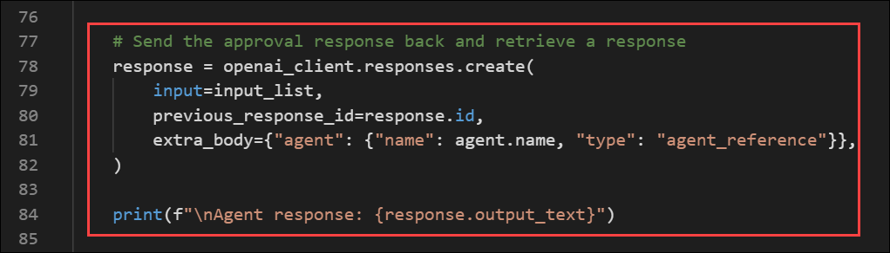

1. Find the comment **Clean up resources by deleting the agent version** and add the following code:

    ```python
   # Clean up resources by deleting the agent version
   project_client.agents.delete_version(agent_name=agent.name, agent_version=agent.version)
   print("Agent deleted")
    ```

    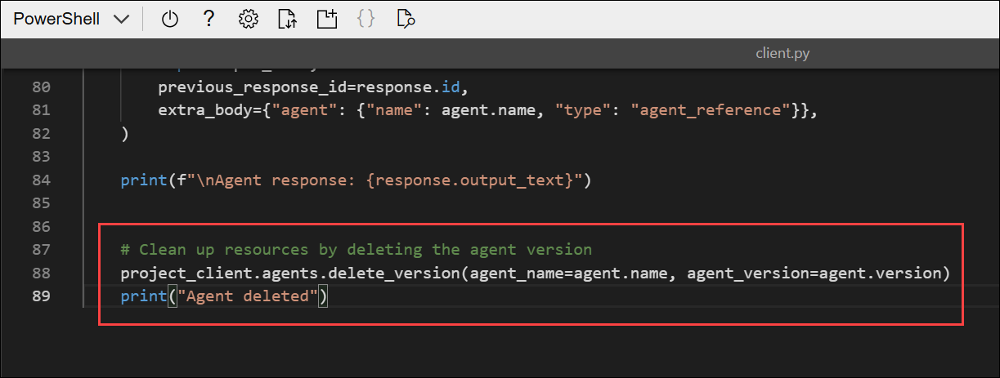

1. Save the code file **CTRL+S** when you have finished. You can also close the code editor **CTRL+Q**; though you may want to keep it open in case you need to make any edits to the code you added. In either case, keep the cloud shell command-line pane open.

### Task 2.4: Sign into Azure and run the app

In this task, you’ll sign in to Azure using the CLI, run the application, and verify that the agent successfully processes the prompt by using the MCP server to retrieve and return the required information.

1. In the cloud shell command-line pane, enter the following command to sign into Azure. Click on the **Link (1)** and copy the **code (2)** provided.

    ```
    az login
    ```

    

    > **Note:** In most scenarios, just using *az login* will be sufficient. However, if you have subscriptions in multiple tenants, you may need to specify the tenant by using the *--tenant* parameter. See [Sign into Azure interactively using the Azure CLI](https://learn.microsoft.com/cli/azure/authenticate-azure-cli-interactively) for details.

1. In the new browser tab, when the **Enter code to allow access (1)** window appears, paste the copied code and select **Next (2)**.

    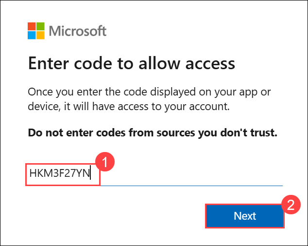

1. In the **Pick an account** dialog box, choose **ODL_User<inject key="DeploymentID"></inject>**. 

    

1. In the **Are you trying to sign in to Microsoft Azure CLI?** dialog box, click **Continue**.

    

1. When the **Microsoft Azure Cross-platform Command Line Interface** window pops up, return to the browser tab with Cloud Shell open. 

    

1. In the Cloud Shell console, press **Enter** to select the only available subscription.

    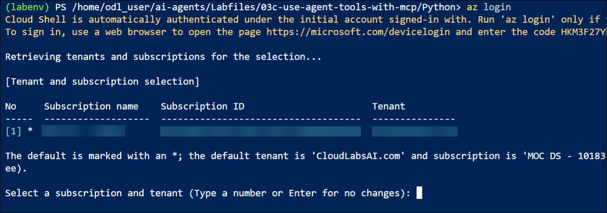

1. After you have signed in, enter the following command to run the application:

    ```
   python client.py
    ```

1. Wait for the agent to process the prompt, using the MCP server to find a suitable tool to retrieve the requested information. You should see some output similar to the following:

    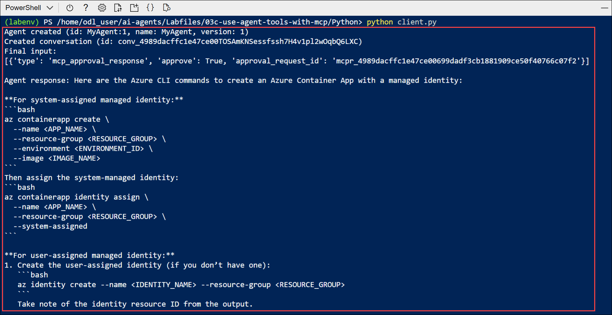

    ```
    Agent created (id: MyAgent:2, name: MyAgent, version: 2)
    Created conversation (id: conv_086911ecabcbc05700BBHIeNRoPSO5tKPHiXRkgHuStYzy27BS)
    Final input:
    [{'type': 'mcp_approval_response', 'approve': True, 'approval_request_id': '{approval_request_id}'}]

    Agent response: Here are Azure CLI commands to create an Azure Container App with a managed identity:

    **1. For a System-assigned Managed Identity**
    ```sh
    az containerapp create \
    --name <CONTAINERAPP_NAME> \
    --resource-group <RESOURCE_GROUP> \
    --environment <CONTAINERAPPS_ENVIRONMENT> \
    --image <CONTAINER_IMAGE> \
    --identity 'system'
    ```

    [continued...]

    Agent deleted
    ```

    Notice that the agent was able to invoke the MCP tool to automatically fulfill the request.

1. You can update the input in the request to ask for different information. In each case, the agent will attempt to find technical documentation by using the MCP tool.

## Summary

In this lab, you created a Microsoft Foundry project, deployed the Microsoft Azure AI Foundry model, and configured the project endpoint for your application.
You set up a Python development environment, installed dependencies, and built an AI agent integrated with a remote MCP server using the Azure AI Agents SDK.
Finally, you authenticated with Azure, ran the application, and verified that the agent used MCP tools to retrieve trusted documentation and generate accurate responses.

### You have successfully completed the Hands-on Lab!