# Lab 06: Develop an AI agent with Model Context Protocol (MCP) tools

### Estimated Duration: 30 Minutes

## Overview

In this lab, you will create and configure an AI agent using the Microsoft Foundry extension in Visual Studio Code and deploy a foundation model in an Foundry project. You will connect the agent to a remote Model Context Protocol (MCP) server to retrieve real-time information and implement custom MCP server tools for inventory and sales operations. You will set up a client application, configure the environment, and enable the agent to invoke tools dynamically. Finally, you will run and validate the application to ensure the agent can retrieve data and generate context-aware responses.

## Lab Objectives

- **Task 1:** Install the Microsoft Foundry VS Code extension

- **Task 2:** Sign in to Azure and create a project

- **Task 3:** Deploy a model

- **Task 4:** Clone the starter code repository

- **Task 5:** Connect an Azure AI Agent to a remote MCP server

- **Task 6:** Connect an Azure AI Agent to custom MCP server tools

- **Task 7:** Run the application

## Task 1: Install the Microsoft Foundry VS Code extension

In this task, you'll install and verify the Microsoft Foundry extension in Visual Studio Code, enabling you to create, manage, and interact with Foundry projects and agents directly within the VS Code environment.

1. Open the **Visual Studio Code** from the desktop.

    

1. In Visual Studio Code, select **Extensions (1)** from the left pane, search for **Microsoft Foundry (2)**, choose the **Microsoft Foundry (3)** extension by Microsoft, and then click **Install (4)**.

   

1. After installation is complete, verify the extension appears in the primary navigation bar on the left side of Visual Studio Code.

   

   > **Note:** If you already have the extension installed, make sure the version is at least **v0.16.0** to follow along with the instructions in this exercise.

## Task 2: Sign in to Azure and create a project

In this task, you'll authenticate with your Azure account and create a new Foundry project, which will serve as the workspace for deploying models and building AI-powered agent solutions.

1. In the VS Code sidebar, select the **Microsoft Foundry (1)** extension icon.

1. In the Resources view, choose **Create Project (2)**, and when prompted, select **Sign in to Azure (3)** to authenticate.

   

1. In the **Azure Resources wants to sign in using Microsoft** dialog, select **Allow**.

   

1. On the **Sign in** page, provide the credentials below:
 
   - **Email/Username:** <inject key="AzureAdUserEmail"></inject>
    
     

   - **Password:** <inject key="AzureAdUserPassword"></inject>
    
     

1. On the **Sign in to all apps, websites, and services on this device?** page, select **Yes**.

   

1. On the **Account added to this device** page, select **Done**.

   

1. In the **Choose a resource group** dialog, select **AI-3026-RG3c** from the list.

   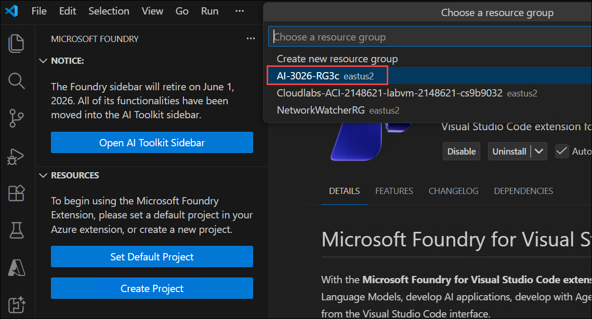

1. In the **Enter project name** dialog, enter **Myproject<inject key="DeploymentID" enableCopy="false"/>**, and then press **Enter** to confirm.

   

1. Wait for the project deployment to complete. A popup will appear with the message "Project deployed successfully."

    

## Task 3: Deploy a model

In this task, you'll deploy the gpt-4.1 model (or an equivalent) in your Foundry project, making it available for your agent to process prompts and generate intelligent responses.

1. In the **RESOURCES** pane, select **Models**, and then select the **+** icon to add a new model deployment.

   

   > **Tip:** You can also access the Model Catalog pressing **F1** and running the command **Microsoft Foundry: Open Model Catalog**.

1. In the Model Catalog, scroll down, search for **gpt-4.1 (1)** in the search bar, and then select **Deploy (2)** under **OpenAI GPT-4.1**.

   

1. Configure the deployment settings:
   
    - **Deployment name:** Enter a name like **gpt-4.1 (1)**
    - **Deployment type:** Select **Global Standard** (or **Standard** if Global Standard is not available) **(2)**
    - **Model version:** Leave as default
    - **Tokens per minute:** `50K` **(3)**
    - Select **Deploy in Microsoft Foundry (4)** in the bottom-left corner.

        

1. If the confirmation dialog appears, select **Deploy** to deploy the model.

1. Wait for the deployment to complete. Your deployed model will appear under the **Models** section in the Resources view.

    

1. In the VS Code Activity Bar, under the **Resources** section expand and right-click your project **Myproject (2)**, and choose **Copy Project Endpoint (3)** to copy the endpoint.

    

    > **Note:** Copy and save the **Project endpoint** in a notepad, as it will be required in upcoming task.

> **Congratulations** on completing the task! Now, it's time to validate it. Here are the steps:
>
> - Hit the Validate button for the corresponding task. If you receive a success message, you can proceed to the next task.
> - If not, carefully read the error message and retry the step, following the instructions in the lab guide.
> - If you need any assistance, please contact us at cloudlabs-support@spektrasystems.com. We are available 24/7 to help.
 
<validation step="159626b2-71e1-4a6b-96db-ca27aa144d74" />

## Task 4: Clone the starter code repository

In this task, you'll clone the provided GitHub repository, set up a Python virtual environment, install required dependencies, and configure environment variables to prepare your local development setup.

1. Navigate to the **Welcome** page in VS Code by selecting the ellipsis **(...) (1)** from the top bar, then **Help (2)**, and finally **Welcome (3)**.

    

1. On the **Get Started** page, select **Mark Done (1)** to complete this step and proceed.

    

1. Select **Clone Git Repository... (1)**, paste the repository URL **(2)** `https://github.com/MicrosoftLearning/mslearn-ai-agents.git`, and then choose **Clone from URL (3)** to proceed.

    

1. Select the destination folder **C:\LabFiles (1)** and click **Select as Repository Destination (2)** to proceed.

    

1. When prompted, select **Open (1)** to open the cloned repository.

    

1. In the trust prompt, select **Yes, I trust the authors (1)** to continue.

    

1. In the Explorer view, navigate to the **Labfiles (1)** and then select **03-mcp-integration/Python (2)** folder to find the starter code for this exercise.

    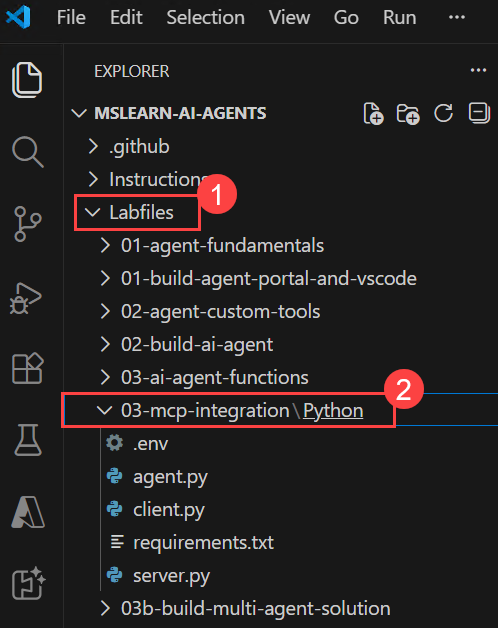

1. Right-click on the **requirements.txt (1)** file and select **Open in Integrated Terminal (2)**.

    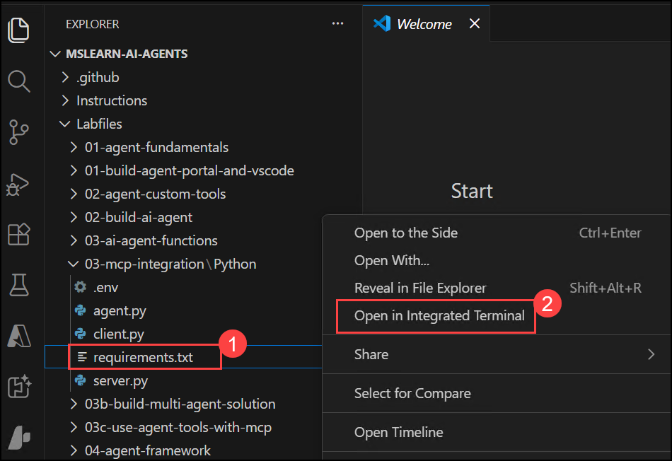

1. In the terminal, enter the following command to install the required Python packages in a virtual environment:

    ```
    python -m venv labenv
    .\labenv\Scripts\Activate.ps1
    pip install -r requirements.txt
    ```

1. From the left navigation menu, under **03-mcp-integration/Python** folder, open the **.env (1)** file. Paste the copied project endpoint into the **PROJECT_ENDPOINT (2)** field, and verify that the **MODEL_DEPLOYMENT_NAME (3)** is set to `gpt-4.1` (or the name of your deployed model). Once done, press **Ctrl+S** to save the changes.

    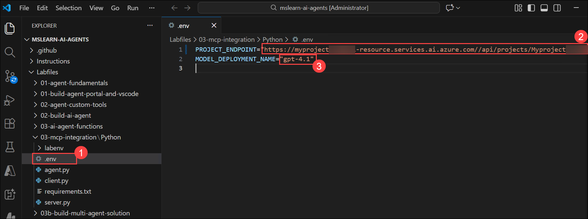

    - Now you're ready to create an AI agent that uses MCP server tools to access external data sources and APIs.

## Task 5: Connect an Azure AI Agent to a remote MCP server

In this task, you'll connect to a remote MCP server, prepare the AI agent, and run a user prompt.

> **Tip:** As you add code, be sure to maintain the correct indentation. Use the comment indentation levels as a guide.

1. Open the **agent.py** file in the code editor.

     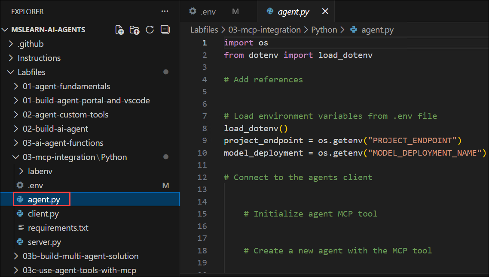

1. Find the comment **Add references** and add the following code to import the classes:

    ```python
   # Add references
   from azure.identity import DefaultAzureCredential
   from azure.ai.projects import AIProjectClient
   from azure.ai.projects.models import PromptAgentDefinition, MCPTool
   from openai.types.responses.response_input_param import McpApprovalResponse, ResponseInputParam
    ```

    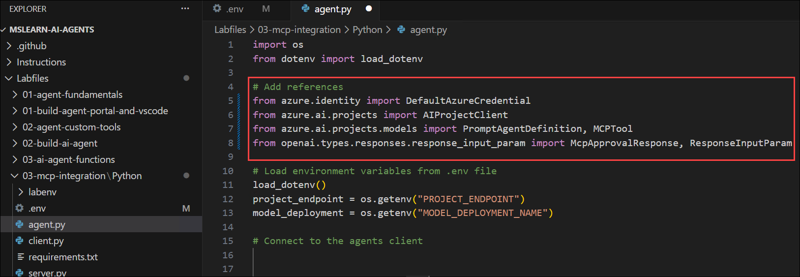

1. Find the comment **Connect to the agents client** and add the following code to connect to the Azure AI project using the current Azure credentials.

    ```python
   # Connect to the agents client
   with (
       DefaultAzureCredential() as credential,
       AIProjectClient(endpoint=project_endpoint, credential=credential) as project_client,
       project_client.get_openai_client() as openai_client,
   ):
    ```

    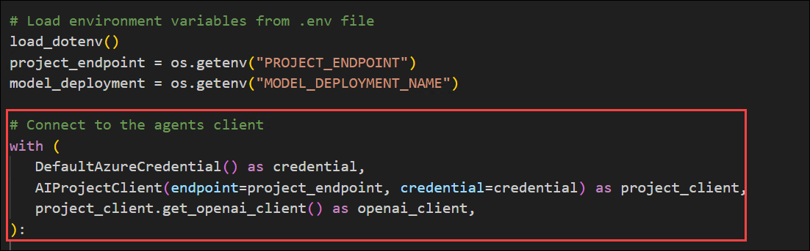

1. Under the comment **Initialize agent MCP tool**, add the following code:

    ```python
   # Initialize agent MCP tool
   mcp_tool = MCPTool(
       server_label="api-specs",
       server_url="https://learn.microsoft.com/api/mcp",
       require_approval="always",
   )
    ```

    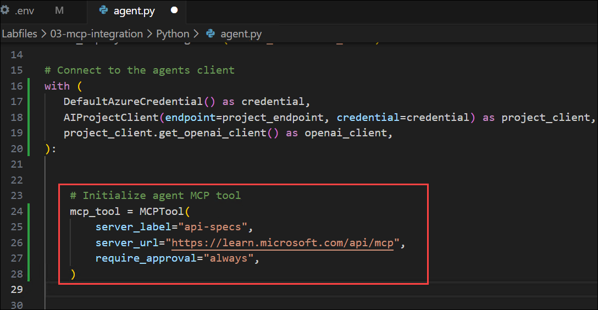

    This code will connect to the Microsft Learn Docs remote MCP server. This is a cloud-hosted service that enables clients to access trusted and up-to-date information directly from Microsoft's official documentation.

1. Under the comment **Create a new agent with the MCP tool** and add the following code:

    ```python
   # Create a new agent with the MCP tool
   agent = project_client.agents.create_version(
       agent_name="MyAgent",
       definition=PromptAgentDefinition(
           model=model_deployment,
           instructions="You are a helpful agent that can use MCP tools to assist users. Use the available MCP tools to answer questions and perform tasks.",
           tools=[mcp_tool],
       ),
   )
   print(f"Agent created (id: {agent.id}, name: {agent.name}, version: {agent.version})")
    ```

    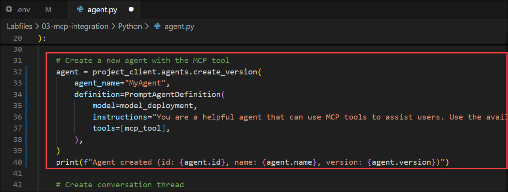

    In this code, you provide instructions for the agent and provide it with the MCP tool definitions.

1. Find the comment **Create a conversation thread** and add the following code:

    ```python
   # Create a conversation thread
   conversation = openai_client.conversations.create()
   print(f"Created conversation (id: {conversation.id})")
    ```

    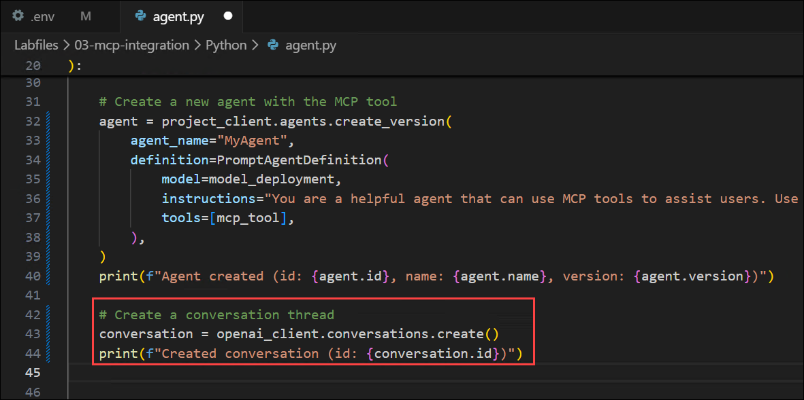

1. Find the comment **Send initial request that will trigger the MCP tool** and add the following code:

    ```python
   # Send initial request that will trigger the MCP tool
   response = openai_client.responses.create(
       conversation=conversation.id,
       input="Give me the Azure CLI commands to create an Azure Container App with a managed identity.",
       extra_body={"agent": {"name": agent.name, "type": "agent_reference"}},
   )
    ```

    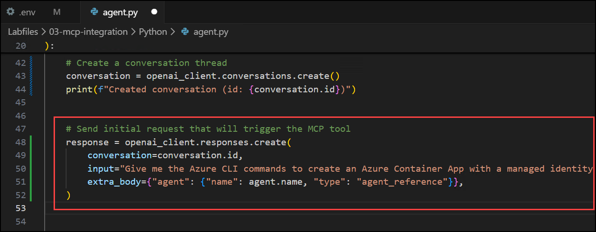

1. Find the comment **Process any MCP approval requests that were generated** and add the following code:

    ```python
    # Process any MCP approval requests that were generated
    input_list: ResponseInputParam = []
    for item in response.output:
        if item.type == "mcp_approval_request":
            if item.server_label == "api-specs" and item.id:
                # Automatically approve the MCP request to allow the agent to proceed
                input_list.append(
                    McpApprovalResponse(
                        type="mcp_approval_response",
                        approve=True,
                        approval_request_id=item.id,
                    )
                )

    print("Final input:")
    print(input_list)
    ```

     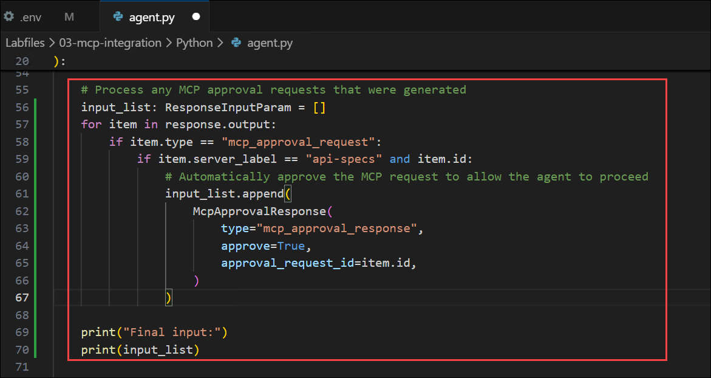

     - This code listens for any MCP approval requests in the agent's response and automatically approves them.

1. Find the comment **Send the approval response back and retrieve a response** and add the following code:

    ```python
    # Send the approval response back and retrieve a response
    response = openai_client.responses.create(
        input=input_list,
        previous_response_id=response.id,
        extra_body={"agent": {"name": agent.name, "type": "agent_reference"}},
    )

    print(f"\nAgent response: {response.output_text}")
    ```

     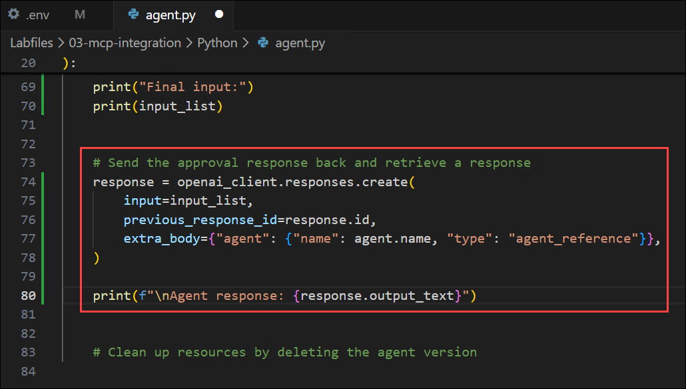

1. Find the comment **Clean up resources by deleting the agent version** and add the following code:

    ```python
   # Clean up resources by deleting the agent version
   project_client.agents.delete_version(agent_name=agent.name, agent_version=agent.version)
   print("Agent deleted")
    ```

    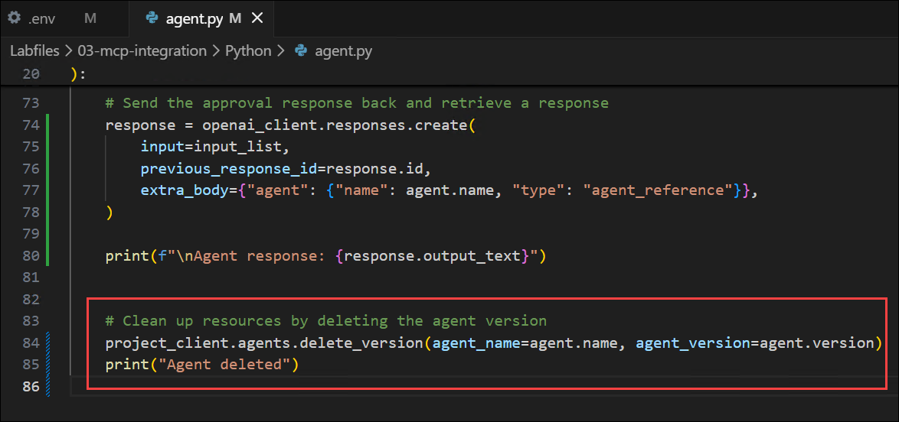

1. Save the code file (*CTRL+S*) when you're finished.

### Task 5.1: Run the application

In this task, you'll authenticate to Azure and run the Python application to test the agent connected to the remote MCP server. You will verify that the agent can invoke MCP tools and retrieve relevant information.

1. In the terminal, run `Connect-AzAccount` to initiate the Azure sign-in process.

    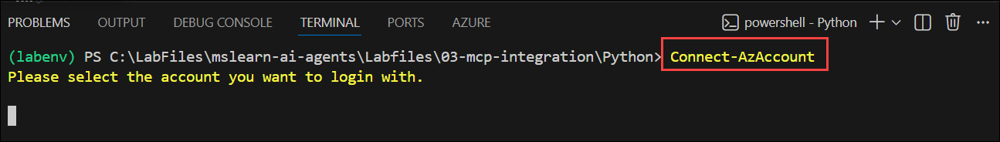

    >**Note:** If you have closed the terminal, right-click on the **03-mcp-integration \ Python** folder and select **Open in Integrated Terminal**. Then run the command `.\labenv\Scripts\Activate.ps1` to activate the virtual environment before proceeding.

1. In the sign-in window, select your account **<inject key="AzureAdUserEmail"></inject> (1)** and click **Continue (2)** to proceed with authentication.

    

1. After successful sign-in, wait for the subscriptions to load and verify that your subscription is listed in the terminal.

    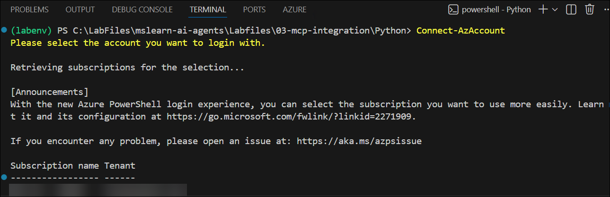

1. In the integrated terminal, enter the following command to run the application:

    ```
   python agent.py
    ```

1. Wait for the agent to process the prompt, using the MCP server to find a suitable tool to retrieve the requested information. You should see some output similar to the following:

    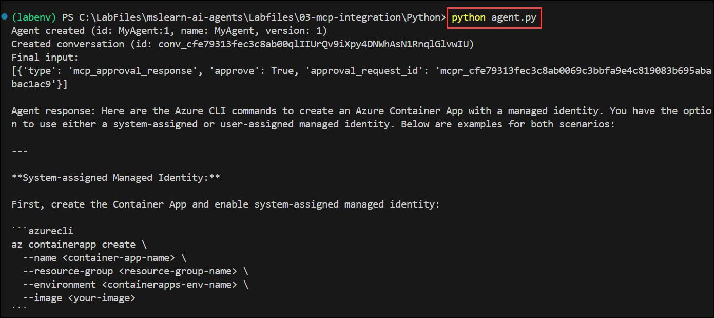

    ```output
    Agent created (id: MyAgent:2, name: MyAgent, version: 2)
    Created conversation (id: conv_086911ecabcbc05700BBHIeNRoPSO5tKPHiXRkgHuStYzy27BS)
    Final input:
    [{'type': 'mcp_approval_response', 'approve': True, 'approval_request_id': '{approval_request_id}'}]

    Agent response: Here are Azure CLI commands to create an Azure Container App with a managed identity:

    **1. For a System-assigned Managed Identity**
    ```sh
    az containerapp create \
    --name <CONTAINERAPP_NAME> \
    --resource-group <RESOURCE_GROUP> \
    --environment <CONTAINERAPPS_ENVIRONMENT> \
    --image <CONTAINER_IMAGE> \
    --identity 'system'
    
    [continued...]

    Agent deleted
    ```
    - Notice that the agent was able to invoke the MCP tool to automatically fulfill the request.

1. You can update the input in the request to ask for different information. In each case, the agent will attempt to find technical documentation by using the MCP tool.

## Task 6: Connect an Azure AI Agent to custom MCP server tools

In addition to connecting to remote MCP servers, you can also create your own custom MCP server tools and connect them to your agent. A Model Context Protocol (MCP) Server is a component that hosts callable tools. These tools are Python functions that can be exposed to AI agents. When tools are annotated with `@mcp.tool()`, they become discoverable to the client, allowing an AI agent to call them autonomously during a conversation or task. In this task, you'll add tools that will allow an agent to perform inventory inquiries and recommendations.

### Task 6.1: Create an MCP server with custom tools

In this task, you'll create a custom MCP server and define tool functions using decorators. These tools will simulate backend operations such as inventory checks and sales data retrieval.

1. Open the **server.py** file in the code editor.

    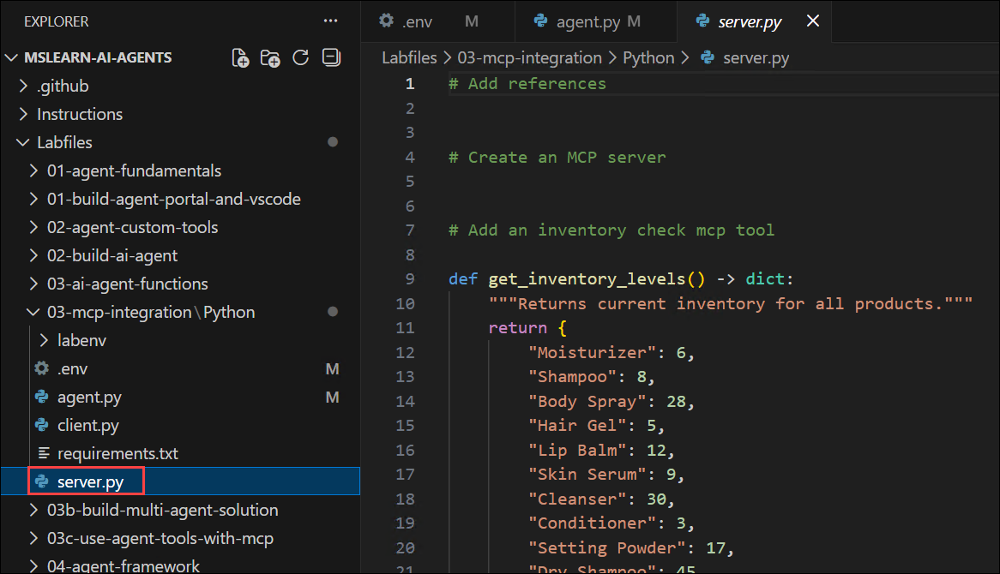

    - In this code file, you'll define the tools the agent can use to simulate a backend service for the retail store. Notice the server setup code at the top of the file. It uses `FastMCP` to quickly spin up an MCP server instance named "Inventory". This server will host the tools you define and make them accessible to the agent during the lab.

1. Under the comment **Add references**, add the following code:

    ```python
   # Add references
   from mcp.server.fastmcp import FastMCP
    ```

1. Under the comment **Create an MCP server**, add the following code to create a new MCP server instance:

    ```python
   # Create an MCP server
   mcp = FastMCP(name="Inventory")
    ```

    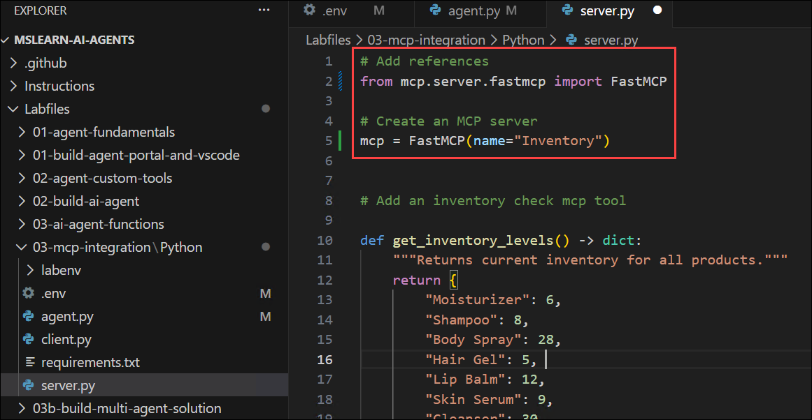

    - This code initializes a new MCP server with the label "Inventory".

1. Find the comment **Add an inventory check mcp tool** and add the following decorator above the function definition:

    ```python
   # Add an inventory check mcp tool
   @mcp.tool()
    ```

    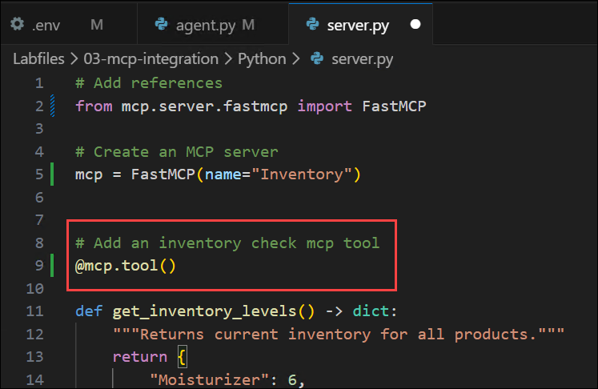

    - This dictionary represents a sample inventory. The `@mcp.tool()` decorator registers the function as a tool on the MCP server, allowing the LLM to discover your function.

1. Find the comment **Add a weekly sales mcp tool** and add the following decorator above the function definition:

    ```python
   # Add a weekly sales mcp tool
   @mcp.tool()
    ```

    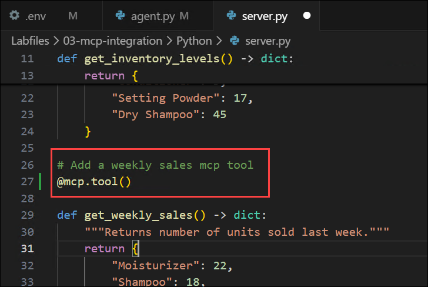

1. Find the comment **Run the MCP server** and add the following code to start the server:

    ```python
   # Run the MCP server
   mcp.run()
    ```

    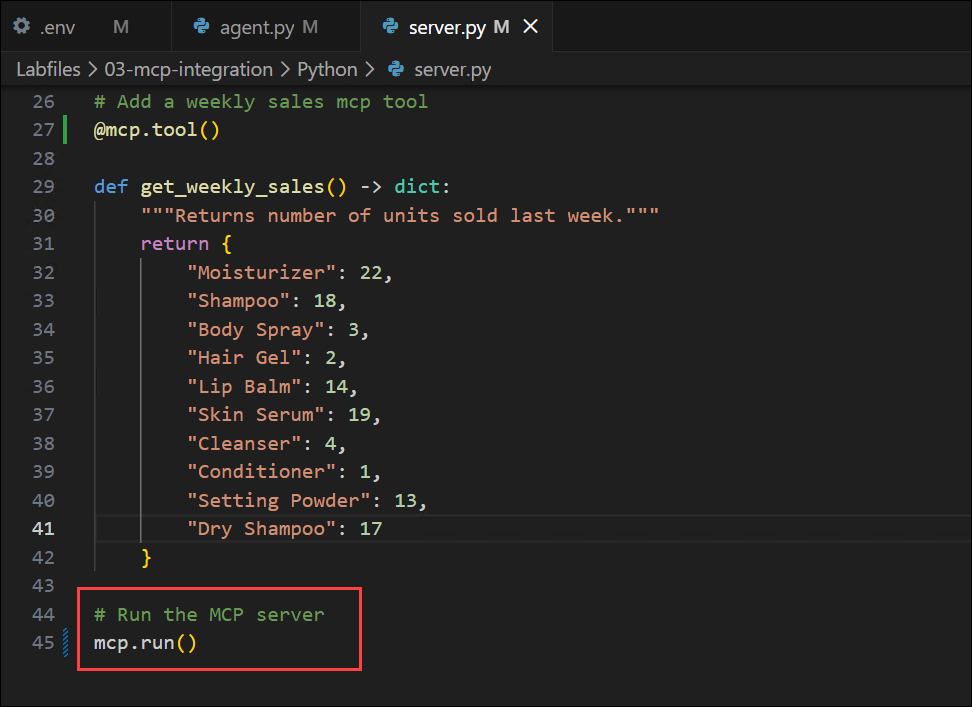

    - This code starts the MCP server, making your tools available for discovery and use by the agent.

1. Save the file (*CTRL+S*).

### Task 6.2: Implement an MCP Client

In this task, you'll implement an MCP client to connect to the server and initialize a session. You will verify the connection by listing available tools exposed by the MCP server.

1. Navigate to the **client.py** file.

    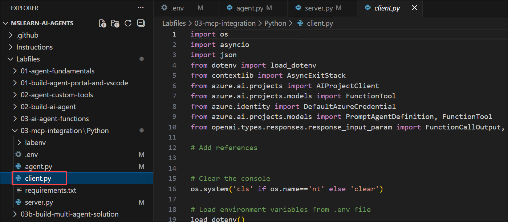

1. Find the comment **Add references** and add the following code to import the classes:

    ```python
   # Add references
   from mcp import ClientSession, StdioServerParameters
   from mcp.client.stdio import stdio_client
    ```

    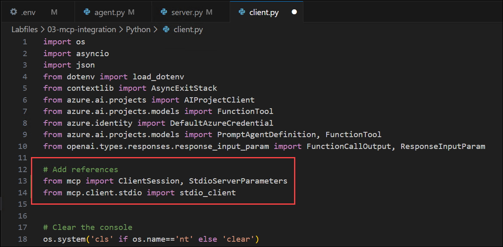

1. In the **connect_to_server** method, find the comment **Start the MCP server** and add the following code:

    ```python
   # Start the MCP server
   stdio_transport = await exit_stack.enter_async_context(stdio_client(server_params))
   stdio, write = stdio_transport
    ```

    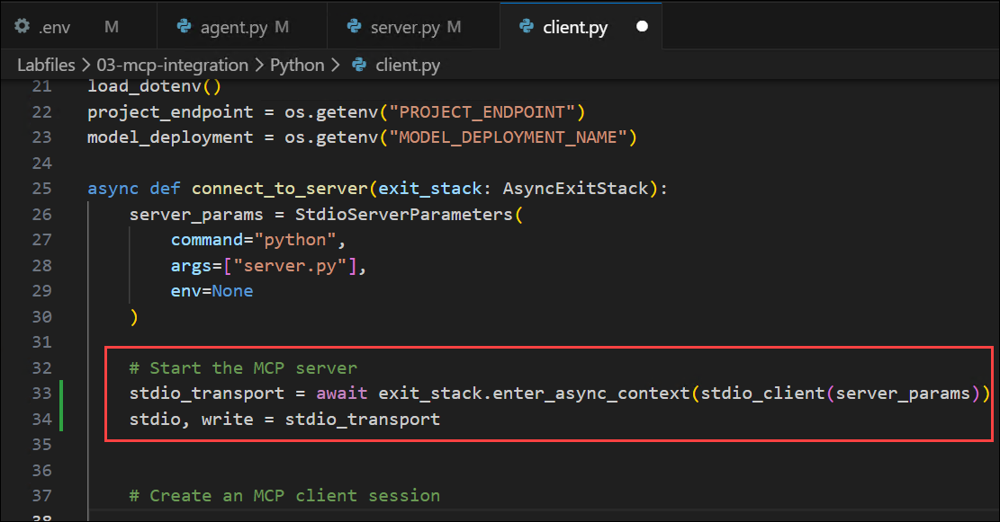

    - In a standard production setup, the server would run separately from the client. But for the sake of this lab, the client is responsible for starting the server using standard input/output transport. This creates a lightweight communication channel between the two components and simplifies the local development setup.

1. Find the comment **Create an MCP client session** and add the following code:

    ```python
   # Create an MCP client session
   session = await exit_stack.enter_async_context(ClientSession(stdio, write))
   await session.initialize()
    ```

    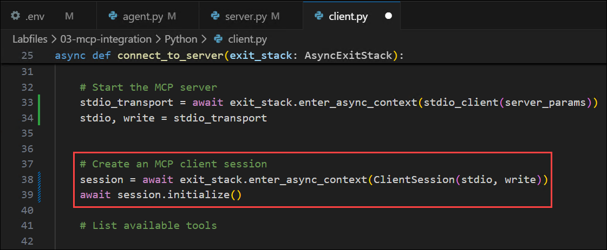

    This creates a new client session using the input and output streams from the previous step. Calling `session.initialize` prepares the session to discover and call tools that are registered on the MCP server.

1. Under the comment **List available tools**, add the following code to verify that the client has connected to the server:

    ```python
   # List available tools
   response = await session.list_tools()
   tools = response.tools
   print("\nConnected to server with tools:", [tool.name for tool in tools]) 
    ```

    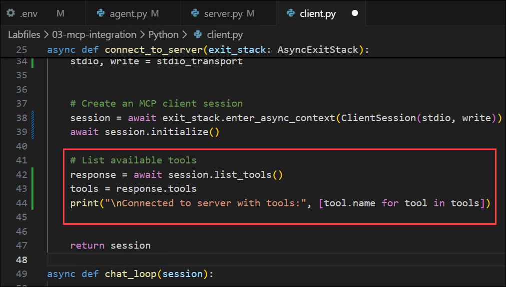

    Now your client session is ready for use with your Azure AI Agent.

### Task 6.3: Connect the MCP tools to your agent

In this task, you'll connect the MCP server tools to your agent so that it can call them in response to user prompts.

> **Tip:** As you add code, be sure to maintain the correct indentation. Use the comment indentation levels as a guide.

1. In the **chat_loop** method, find the comment **Build a function for each tool** and add the following code:

    ```python
    # Build a function for each tool
    def make_tool_func(tool_name):
        async def tool_func(**kwargs):
            result = await session.call_tool(tool_name, kwargs)
            return result
        
        tool_func.__name__ = tool_name
        return tool_func

    # Store the functions in a dictionary for easy access when processing function calls
    functions_dict = {tool.name: make_tool_func(tool.name) for tool in tools}
    ```

    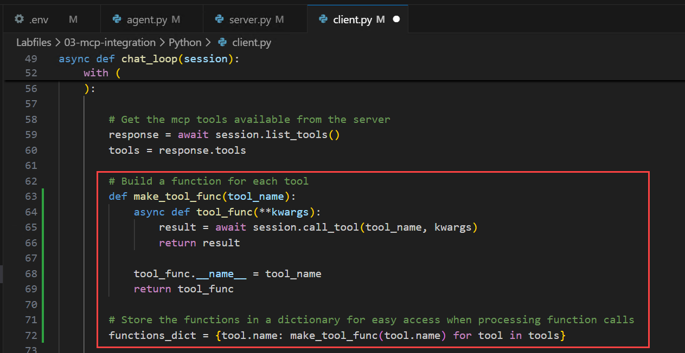

    This code dynamically wraps tools available in the MCP server so that they can be called by the AI agent. Each tool is turned into an async function that the agent can invoke.

1. Find the comment **Create FunctionTool definitions for the agent** and add the following code:

    ```python
   # Create FunctionTool definitions for the agent
   mcp_function_tools: FunctionTool = []
   for tool in tools:
       function_tool = FunctionTool(
           name=tool.name,
           description=tool.description,
           parameters={
               "type": "object",
               "properties": {},
               "additionalProperties": False,
           },
           strict=True
       )
       mcp_function_tools.append(function_tool)
    ```

    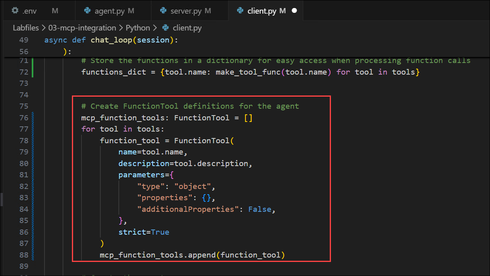

1. Find the comment **Create the agent** and add the following code:

    ```python
   # Create the agent
   agent = project_client.agents.create_version(
       agent_name="inventory-agent",
       definition=PromptAgentDefinition(
           model=model_deployment,
           instructions="""
           You are an inventory assistant. Here are some general guidelines:
           - Recommend restock if item inventory < 10  and weekly sales > 15
           - Recommend clearance if item inventory > 20 and weekly sales < 5
           """,
           tools=mcp_function_tools
       ),
   )
    ```

     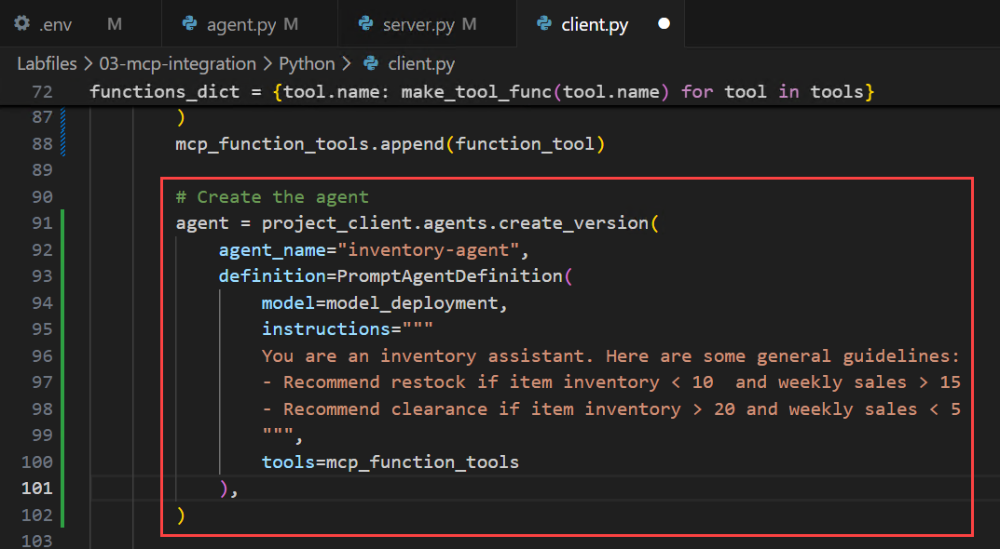

     - With these instructions and tools, the agent is able to invoke the tools to retrieve inventory and sales data, and then use that information to provide helpful responses to the user.

1. Locate the comment **Process function calls** and add the following code:

    ```python
   # Process function calls
   for item in response.output:
       if item.type == "function_call":
           # Retrieve the matching function tool
           function_name = item.name
           kwargs = json.loads(item.arguments)
           required_function = functions_dict.get(function_name)

           # Invoke the function
           output = await required_function(**kwargs)

           # Append the output text
           input_list.append(
              FunctionCallOutput(
                 type="function_call_output",
                 call_id=item.call_id,
                 output=output.content[0].text,
              )
           )
    ```

    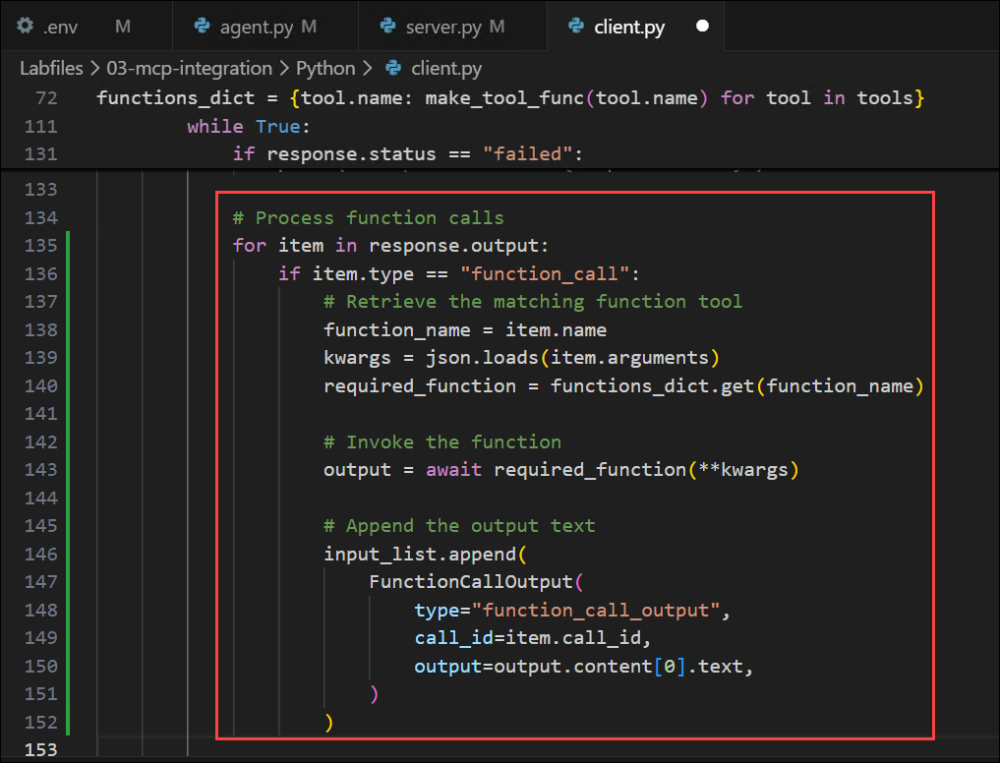

    This code listens for any function calls in the agent's response, invokes the corresponding tool function, and prepares the output to be sent back to the agent.

1. Find the comment **Send function call outputs back to the model and retrieve a response** and add the following code:

    ```python
   # Send function call outputs back to the model and retrieve a response
   if input_list:
      response = openai_client.responses.create(
            input=input_list,
            previous_response_id=response.id,
            extra_body={"agent": {"name": agent.name, "type": "agent_reference"}},
      )
   print(f"Agent response: {response.output_text}")
    ```

    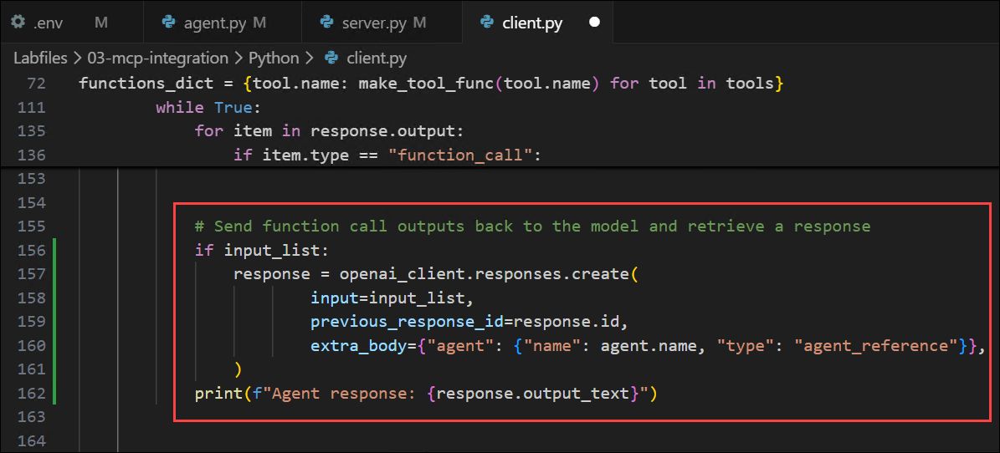

1. Save the code file (**CTRL+S**) when you have finished.

## Task 7: Run the application

In this task, you'll execute the client application and interact with the agent using different prompts. You will validate that the agent uses MCP tools to retrieve data and generate meaningful responses.

1. In the integrated terminal, enter the following command to run the application:

    ```
   python client.py
    ```

1. When prompted, enter a prompt such as:

    ```
   Show me the current inventory levels for all products.
    ```

    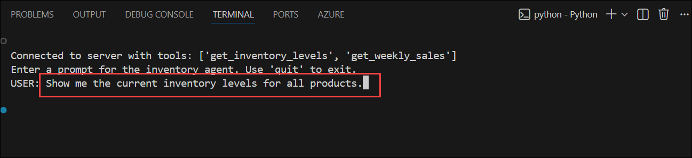

    > **Tip:** If the app fails because the rate limit is exceeded. Wait a few seconds and try again. If there is insufficient quota available in your subscription, the model may not be able to respond.

1. You should see some output similar to the folloiwng:

    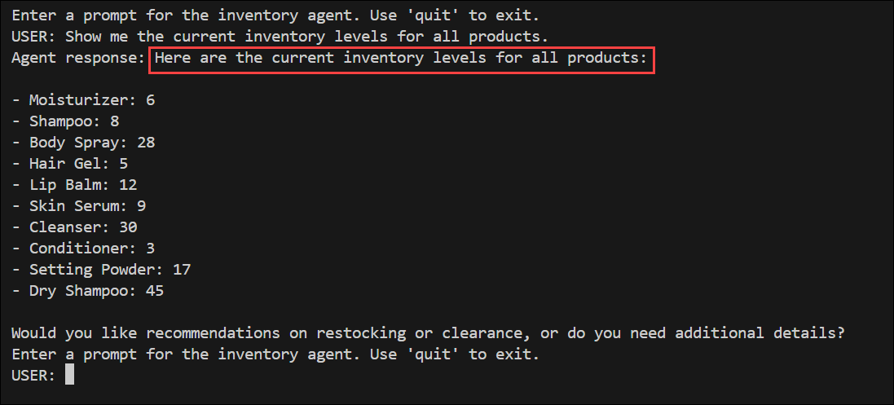

    ```output
    MessageRole.AGENT:
    Agent response: Here are the current inventory levels for all items:

    - Moisturizer: 6
    - Shampoo: 8
    - Body Spray: 28
    [continued ...]

    Would you like recommendations for restocking or clearance? If so, I can check the weekly sales to advise accordingly.
    ```

    Notice that the agent was able to call the MCP tools to retrieve inventory and sales data, and then use that information to provide a helpful response to the user.

1. You can continue the conversation if you like. The thread is *stateful*, so it retains the conversation history - meaning that the agent has the full context for each response.

1. In the terminal, enter the following prompt and review the agent response:

    ```
   Are there any products that should be restocked?
    ```

    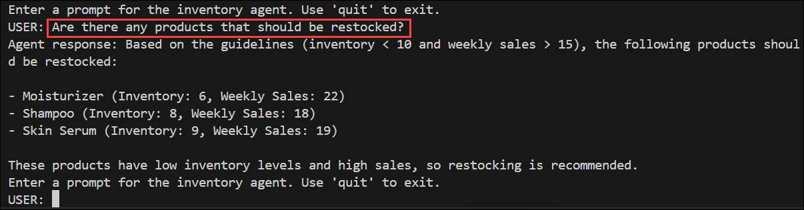

    ```
   Which products would you recommend for clearance?
    ```

    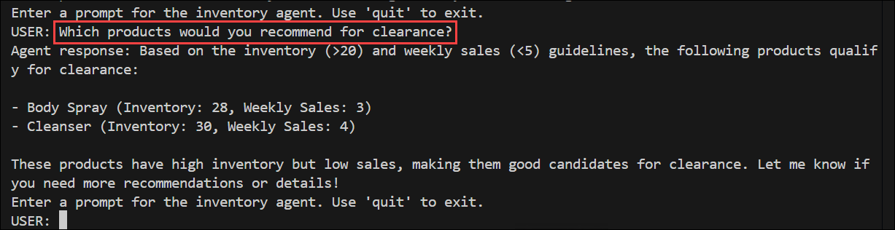

    ```
   What are the best sellers this week?
    ```

    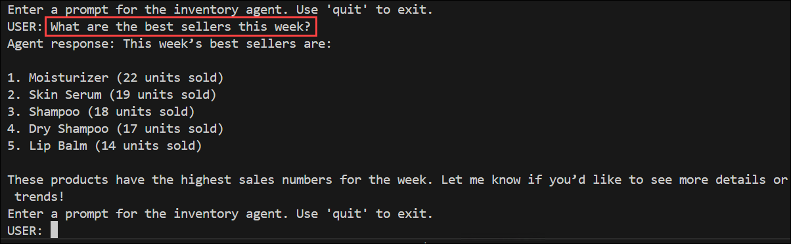

1. Enter `quit` to exit the application.

    You can also use `deactivate` to exit the Python virtual environment in the terminal.

## Summary

In this lab, you created AI agents that can use Model Context Protocol (MCP) server tools to access external data sources and APIs. You connected your agents to a remote MCP server hosted by Microsoft Learn Docs and a custom MCP server that you implemented. By integrating these tools, the agent was able to retrieve up-to-date information and provide informed responses to user prompts. This demonstrates how MCP tools can significantly enhance the capabilities of AI agents, enabling them to perform a wide range of tasks by leveraging external services and data. Great work!

## You have successfully completed the Hands-on Lab!