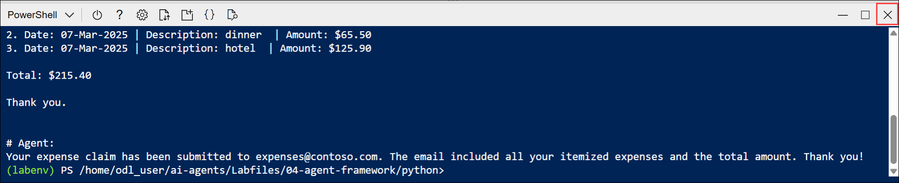

# Lab 07: Develop an Azure AI chat agent with the Microsoft Agent Framework SDK

### Estimated Duration: 30 Minutes

## Overview

In this lab, you will develop an Azure AI chat agent using the Microsoft Agent Framework SDK and set up a client application in Azure Cloud Shell. You will configure the application, define a custom email tool, and write code to process expenses data and automate expense claim submission. Finally, you will authenticate to Azure, run the application, and observe how the agent uses tools to generate and send structured expense claim emails.

## Lab Objectives

- **Task 1:** Create an agent client app

- **Task 2:** Configure the application settings

- **Task 3:** Write code for an agent app

- **Task 4:** Sign into Azure and run the app

    > **Note:** Some of the technologies used in this exercise are in preview or in active development. You may experience some unexpected behavior, warnings, or errors.

## Task 1: Create an agent client app

In this task, you will set up a client app in Azure Cloud Shell, clone the provided GitHub repository, and prepare the code files for creating your agent.

1. In the **Azure portal**, select the **Cloud Shell** icon in the top navigation bar to open a new Cloud Shell session.

    

1. In the Cloud Shell toolbar, open the **Settings (1)** menu and choose **Go to Classic version (2)** from the drop-down.

    

    >**Note:** **Ensure you've switched to the classic version of the cloud shell before continuing.**

1. In the cloud shell pane, enter the following commands to clone the GitHub repo containing the code files for this exercise (type the command, or copy it to the clipboard and then right-click in the command line and paste as plain text):

    ```
   rm -r ai-agents -f
   git clone https://github.com/MicrosoftLearning/mslearn-ai-agents ai-agents
    ```

    

    > **Tip:** As you enter commands into the cloudshell, the output may take up a large amount of the screen buffer and the cursor on the current line may be obscured. You can clear the screen by entering the `cls` command to make it easier to focus on each task.

1. When the repo has been cloned, enter the following command to change the working directory to the folder containing the code files and list them all.

    ```
   cd ai-agents/Labfiles/04-agent-framework/python
   ls -a -l
    ```

    

    - The provided files include application code a file for configuration settings, and a file containing expenses data.

## Task 2: Configure the application settings

In this task, you will install required libraries and configure the .env file with your Foundry project details.

1. In the cloud shell command-line pane, enter the following command to install the libraries you'll use:

    ```
   python -m venv labenv
   ./labenv/bin/Activate.ps1
   pip install agent-framework==1.0.0b260212 --pre
    ```
    > **Tip:** As you enter commands into the cloudshell, the output may take up a large amount of the screen buffer and the cursor on the current line may be obscured. You can clear the screen by entering the `cls` command to make it easier to focus on each task.

1. In the Cloud Shell command-line pane, enter the following command to install the required package version:

    ```
   pip install opentelemetry-semantic-conventions-ai==0.4.13
    ```

    

1. Enter the following command to edit the configuration file that has been provided:

    ```
   code .env
    ```

1. In the code file, replace the placeholder values with the correct details for your project:

    * PROJECT\_ENDPOINT : **Foundry project endpoint**
    * MODEL\_DEPLOYEMNT\_NAME : **gpt-4.1**

      

      > **Note:** Paste the project endpoint you copied in Lab 1 – Task 1.

1. After you've replaced the placeholders, use the **CTRL+S** command to save your changes and then use the **CTRL+Q** command to close the code editor while keeping the cloud shell command line open.

## Task 3: Write code for an agent app

In this task, you will edit the agent code to add references, define a custom email tool, initialize the agent with instructions, and configure it to process expenses data.

> **Tip:** As you add code, be sure to maintain the correct indentation. Use the existing comments as a guide, entering the new code at the same level of indentation.

1. Enter the following command to edit the agent code file that has been provided:

    ```
   code agent-framework.py
    ```

    

1. Review the code in the file. It contains:
    - Some **import** statements to add references to commonly used namespaces
    - A **main** function that loads a file containing expenses data, asks the user for instructions, and and then calls...
    - A **process_expenses_data** function in which the code to create and use your agent must be added

1. At the top of the file, after the existing **import** statement, find the comment **Add references**, and add the following code to reference the namespaces in the libraries you'll need to implement your agent:

    ```python
   # Add references
   from agent_framework import tool, Agent
   from agent_framework.azure import AzureOpenAIResponsesClient
   from azure.identity.aio import AzureCliCredential
   from pydantic import Field
   from typing import Annotated
    ```

    

1. Near the bottom of the file, find the comment **Create a tool function for the email functionality**, and add the following code to define a function that your agent will use to send email (tools are a way to add custom functionality to agents)

    ```python
   # Create a tool function for the email functionality
   @tool(approval_mode="never_require")
   def send_email(
    to: Annotated[str, Field(description="Who to send the email to")],
    subject: Annotated[str, Field(description="The subject of the email.")],
    body: Annotated[str, Field(description="The text body of the email.")]):
        print("\nTo:", to)
        print("Subject:", subject)
        print(body, "\n")
    ```

     

     > **Note:** The function *simulates* sending an email by printing it to the console. In a real application, you'd use an SMTP service or similar to actually send the email!

1. Back up above the **send_email** code, in the **process_expenses_data** function, find the comment **Create a client and initialize an agent with the tool and instructions**, and add the following code:

    (Be sure to maintain the indentation level)

    ```python
   # Create a client and initialize an agent with the tool and instructions
   async with (
        AzureCliCredential() as credential,
        Agent(
            client=AzureOpenAIResponsesClient(
                credential=credential,
                deployment_name=os.getenv("MODEL_DEPLOYMENT_NAME"),
                project_endpoint=os.getenv("PROJECT_ENDPOINT"),
            ),
            instructions="""You are an AI assistant for expense claim submission.
                        At the user's request, create an expense claim and use the plug-in function to send an email to expenses@contoso.com with the subject 'Expense Claim`and a body that contains itemized expenses with a total.
                        Then confirm to the user that you've done so. Don't ask for any more information from the user, just use the data provided to create the email.""",
            tools=[send_email],
        ) as agent,
    ):
    ```

    

    - Note that the **AzureCliCredential** object will allow your code to authenticate to your Azure account. The **AzureOpenAIResponsesClient** object includes the Foundry project settings from the .env configuration. The **Agent** object is initialized with the client, instructions for the agent, and the tool function you defined to send emails.

1. Find the comment **Use the agent to process the expenses data**, and add the following code to create a thread for your agent to run on, and then invoke it with a chat message.

    (Be sure to maintain the indentation level):

    ```python
   # Use the agent to process the expenses data
   try:
       # Add the input prompt to a list of messages to be submitted
       prompt_messages = [f"{prompt}: {expenses_data}"]
       # Invoke the agent for the specified thread with the messages
       response = await agent.run(prompt_messages)
       # Display the response
       print(f"\n# Agent:\n{response}")
   except Exception as e:
       # Something went wrong
       print (e)
    ```

    

1. Review that the completed code for your agent, using the comments to help you understand what each block of code does, and then save your code changes **CTRL+S**.

1. Keep the code editor open in case you need to correct any typo's in the code, but resize the panes so you can see more of the command line console.

## Task 4: Run the app

In this task, you will run the agent application in Cloud Shell, submit an expense claim prompt, and verify that the AI agent generates and simulates sending the expense claim email successfully.

1. In the Cloud Shell console, enter the following command to run the application:  

    ```
   python agent-framework.py
    ```
    
    - The application runs using the credentials for your authenticated Azure session to connect to your project and create and run the agent.

1. When asked **What would you like me to do with it?** expenses data, enter the following prompt:

    ```
   Submit an expense claim
    ```

    

1. When the application has finished, review the output. The agent should have composed an email for an expenses claim based on the data that was provided.

    

    > **Tip:** If the app fails because the rate limit is exceeded. Wait a few seconds and try again. If there is insufficient quota available in your subscription, the model may not be able to respond.

1. In the Cloud Shell window, select the **Close (X)** icon to exit Cloud Shell before proceeding to the next lab.

    

## Summary

In this lab, you created an Azure AI chat agent using the Microsoft Agent Framework SDK. You configured the application, defined a custom email tool, and initialized the agent with instructions to process expenses data. Finally, you ran the application to submit an expense claim and verified the agent’s ability to generate and simulate sending the email.

### You have successfully completed the lab. Click on **Next >>** to proceed with the next Lab.

   