# Lab 07: Develop an Azure AI chat agent with the Microsoft Agent Framework SDK

### Estimated Duration: 30 Minutes

## Overview

In this lab, you'll use the Microsoft Agent Framework SDK and Azure AI Agent Service to create an AI agent that processes expense claims. You will deploy a model in a Microsoft Foundry project, develop a client app, configure the application, define a custom tool for sending emails, and run the agent to handle expense claim requests.

## Lab Objectives

- **Task 1:** Deploy a model in a Microsoft Foundry project

- **Task 2:** Create an agent client app

- **Task 3:** Configure the application settings

- **Task 4:** Write code for an agent app

- **Task 5:** Sign into Azure and run the app

> **Note:** Some of the technologies used in this exercise are in preview or in active development. You may experience some unexpected behavior, warnings, or errors.

## Task 1: Deploy a model in a Microsoft Foundry project

In this task, you will sign in to the Microsoft Foundry portal, create a new project, and deploy the gpt-4.1 model for use in your agent application.

1. Open a new tab in the browser, right-click on the following link [Foundry portal](https://ai.azure.com), then **Copy link** and paste it in a browser tab to log in to **Microsoft Foundry portal**.

1. Click on **Sign in**.
 
    

1. If prompted, provide the credentials below:
 
   - **Email/Username:** <inject key="AzureAdUserEmail"></inject>
    
     

   - **Password:** <inject key="AzureAdUserPassword"></inject>
    
     

1. When the **Stay signed in?** window appears, select **No**.

    
    
    >**Note:** Close any tips or quick start panes that are opened the first time you sign in, and if necessary use the **Foundry** logo at the top left to navigate to the home page, which looks similar to the following image (close the **Help** pane if it's open):

1. At the top of the **Microsoft Foundry** portal, enable the **New Foundry toggle (1)** to switch to the latest Foundry user interface.

1. From the **Select a project to continue** dialog, click the drop-down under **Select or search for a project**, and then select **Create a new project (2)**.

     

1. In the **Create a project** window, enter **Myproject<inject key="DeploymentID"></inject> (1)** as the project name. Open the **Advanced options (2)** drop-down, fill in the following details, and then click **Create (7)**:

    * Subscription: **Choose Default Subscription (3)**
    * Resource group: **AI-102-RG11 (4)**
    * Microsoft Foundry resource: **Keep as Default (5)**
    * Region: **<inject key="Region"></inject> (6)**

      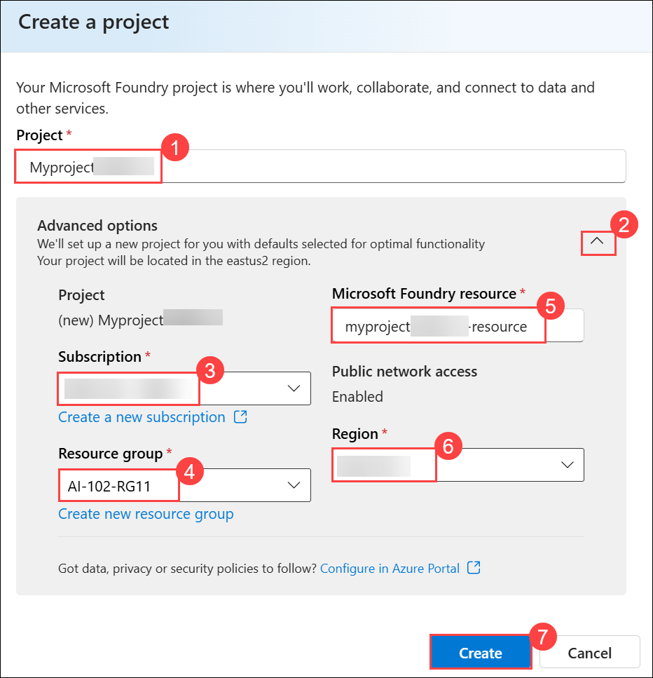

      >**Note:** Some Azure AI resources are constrained by regional model quotas. In the event of a quota limit being exceeded later in the exercise, there's a possibility you may need to create another resource in a different region.

1. Wait for your project created. It may take a few minutes.

1. On the **Microsoft Foundry** home page, click **Start building (1)**, and then select **Browse models (2)** from the drop-down menu.

     

1. On the **Models** page, search for **gpt-4.1 (1)** in the search bar, and then select the **gpt-4.1 (2)** model from the search results.

     

1. On the **gpt-4.1** model details page, click **Deploy (1)**, and then select **Default settings (2)** to deploy the model using the standard configuration.

    

    - After the model is deployed, the playground for the model is displayed.

1. In the navigation bar on the left, select **Microsoft Foundry** to return to the Foundry home page.

     

1. Copy the **Project endpoint** value to a notepad, as you'll use them to connect to your project in a client application.

    

> **Congratulations** on completing the task! Now, it's time to validate it. Here are the steps:
>
> - Hit the Validate button for the corresponding task. If you receive a success message, you can proceed to the next task.
> - If not, carefully read the error message and retry the step, following the instructions in the lab guide.
> - If you need any assistance, please contact us at cloudlabs-support@spektrasystems.com. We are available 24/7 to help.
 
<validation step="412da72d-9077-4bed-899e-d2e2c021cd43" />
 
---  

## Task 2: Create an agent client app

In this task, you will set up a client app in Azure Cloud Shell, clone the provided GitHub repository, and prepare the code files for creating your agent.

1. Open a new browser tab (keeping the Microsoft Foundry portal open in the existing tab). Then in the new tab, browse to the [Azure portal](https://portal.azure.com) at `https://portal.azure.com`.

1. If prompted, provide the credentials below:

    - **Email/Username:** <inject key="AzureAdUserEmail"></inject>

    - **Password:** <inject key="AzureAdUserPassword"></inject> 

      >**Note:** Close any welcome notifications to see the Azure portal home page.

1. On the **Azure portal** homepage, click the **\[>\_] Cloud Shell (1)** button located to the right of the **Copilot** tab at the top. This opens a new Cloud Shell session. In the **Welcome to Azure Cloud Shell** window, choose **PowerShell (2)**.

    

    >**Note:** The cloud shell provides a command-line interface in a pane at the bottom of the Azure portal. You can resize or maximize this pane to make it easier to work in.

    > **Note:** If you have previously created a cloud shell that uses a **Bash** environment, switch it to **PowerShell**.

1. In the **Getting started** window, ensure **No storage account required (1)** is selected. From the **Subscription** drop-down, choose **Default subscription (2)**, then click **Apply (3)**.

    

1. In the Cloud Shell toolbar, open the **Settings (1)** menu and choose **Go to Classic version (2)** from the drop-down.

    

    >**Note:** **<font color="red">Ensure you've switched to the classic version of the cloud shell before continuing.</font>**

1. In the cloud shell pane, enter the following commands to clone the GitHub repo containing the code files for this exercise (type the command, or copy it to the clipboard and then right-click in the command line and paste as plain text):

    ```
   rm -r ai-agents -f
   git clone https://github.com/MicrosoftLearning/mslearn-ai-agents ai-agents
    ```

    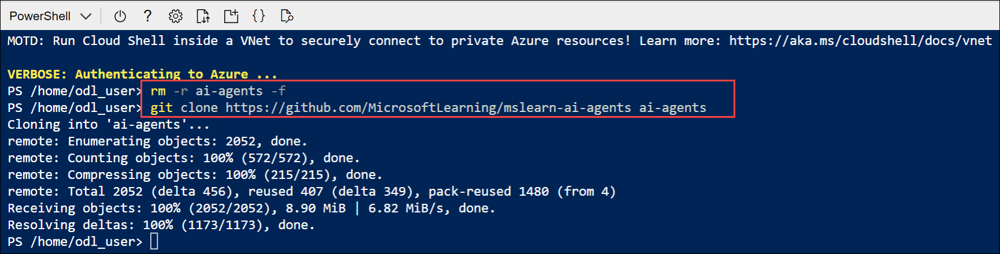

    > **Tip:** As you enter commands into the cloudshell, the output may take up a large amount of the screen buffer and the cursor on the current line may be obscured. You can clear the screen by entering the `cls` command to make it easier to focus on each task.

1. When the repo has been cloned, enter the following command to change the working directory to the folder containing the code files and list them all.

    ```
   cd ai-agents/Labfiles/04-agent-framework/python
   ls -a -l
    ```

    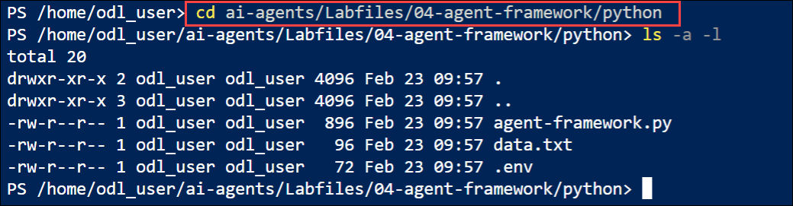

    - The provided files include application code a file for configuration settings, and a file containing expenses data.

## Task 3: Configure the application settings

In this task, you will install required libraries and configure the .env file with your Foundry project details.

1. In the cloud shell command-line pane, enter the following command to install the libraries you'll use:

    ```
   python -m venv labenv
   ./labenv/bin/Activate.ps1
   pip install agent-framework==1.0.0b260212 --pre
    ```

1. In the Cloud Shell command-line pane, enter the following command to install the required package version:

   ```
   pip install opentelemetry-semantic-conventions-ai==0.4.13
   ```

   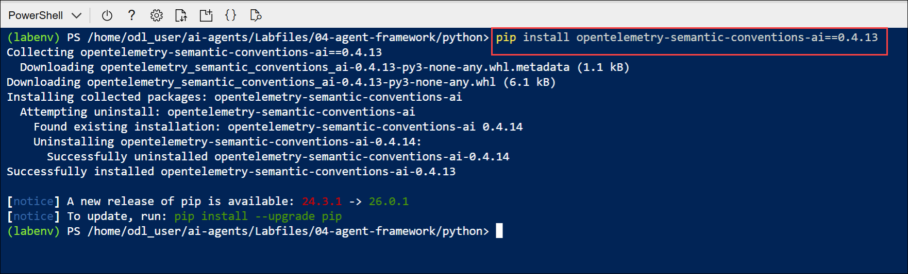

1. Enter the following command to edit the configuration file that has been provided:

    ```
   code .env
    ```

1. In the code file, replace the placeholder values with the correct details for your project:

    * PROJECT\_ENDPOINT : **Foundry project endpoint**
    * MODEL\_DEPLOYMENT\_NAME : **gpt-4.1**

      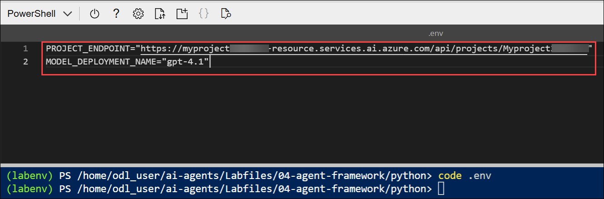

      > **Note:** Paste the project endpoint you copied in the previous task.

1. After you've replaced the placeholders, use the **CTRL+S** command to save your changes and then use the **CTRL+Q** command to close the code editor while keeping the cloud shell command line open.

## Task 4: Write code for an agent app

In this task, you will edit the agent code to add references, define a custom email tool, initialize the agent with instructions, and configure it to process expenses data.

> **Tip:** As you add code, be sure to maintain the correct indentation. Use the existing comments as a guide, entering the new code at the same level of indentation.

1. Enter the following command to edit the agent code file that has been provided:

    ```
   code agent-framework.py
    ```

    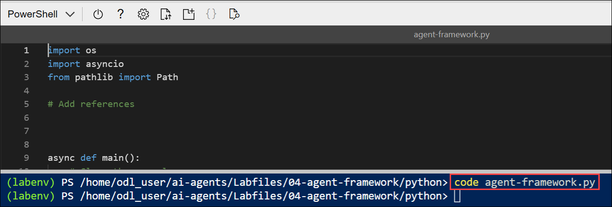

1. Review the code in the file. It contains:
    - Some **import** statements to add references to commonly used namespaces
    - A **main** function that loads a file containing expenses data, asks the user for instructions, and and then calls...
    - A **process_expenses_data** function in which the code to create and use your agent must be added

1. At the top of the file, after the existing **import** statement, find the comment **Add references**, and add the following code to reference the namespaces in the libraries you'll need to implement your agent:

    ```python
   # Add references
   from agent_framework import tool, Agent
   from agent_framework.azure import AzureOpenAIResponsesClient
   from azure.identity.aio import AzureCliCredential
   from pydantic import Field
   from typing import Annotated
    ```

    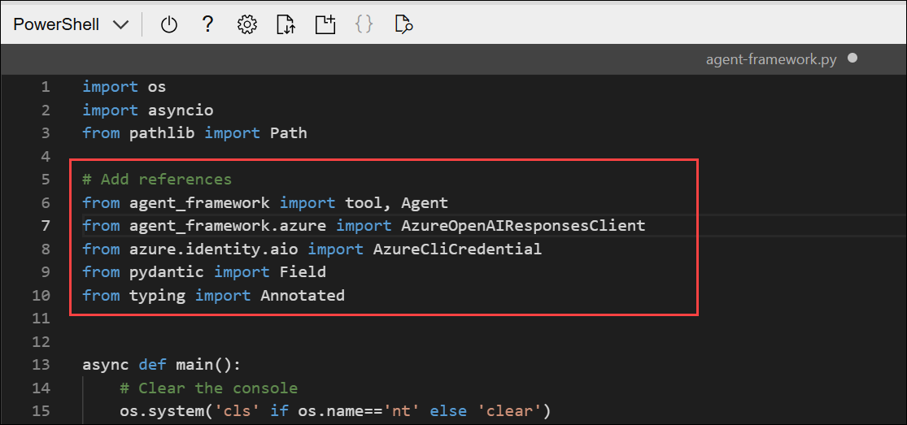

1. Near the bottom of the file, find the comment **Create a tool function for the email functionality**, and add the following code to define a function that your agent will use to send email (tools are a way to add custom functionality to agents)

    ```python
   # Create a tool function for the email functionality
   @tool(approval_mode="never_require")
   def send_email(
    to: Annotated[str, Field(description="Who to send the email to")],
    subject: Annotated[str, Field(description="The subject of the email.")],
    body: Annotated[str, Field(description="The text body of the email.")]):
        print("\nTo:", to)
        print("Subject:", subject)
        print(body, "\n")
    ```

     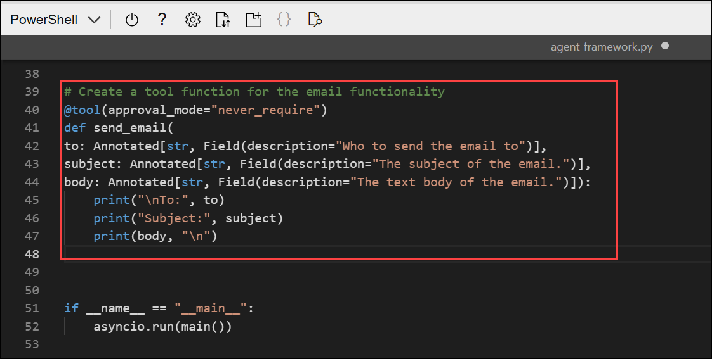

     > **Note:** The function *simulates* sending an email by printing it to the console. In a real application, you'd use an SMTP service or similar to actually send the email!

1. Back up above the **send_email** code, in the **process_expenses_data** function, find the comment **Create a client and initialize an agent with the tool and instructions**, and add the following code:

    (Be sure to maintain the indentation level)

    ```python
   # Create a client and initialize an agent with the tool and instructions
   async with (
        AzureCliCredential() as credential,
        Agent(
            client=AzureOpenAIResponsesClient(
                credential=credential,
                deployment_name=os.getenv("MODEL_DEPLOYMENT_NAME"),
                project_endpoint=os.getenv("PROJECT_ENDPOINT"),
            ),
            instructions="""You are an AI assistant for expense claim submission.
                        At the user's request, create an expense claim and use the plug-in function to send an email to expenses@contoso.com with the subject 'Expense Claim`and a body that contains itemized expenses with a total.
                        Then confirm to the user that you've done so. Don't ask for any more information from the user, just use the data provided to create the email.""",
            tools=[send_email],
        ) as agent,
    ):
    ```

    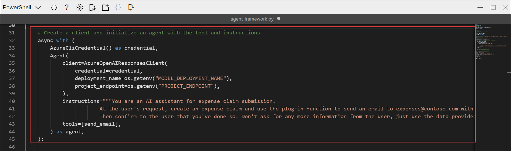

    - Note that the **AzureCliCredential** object will allow your code to authenticate to your Azure account. The **AzureOpenAIResponsesClient** object includes the Foundry project settings from the .env configuration. The **Agent** object is initialized with the client, instructions for the agent, and the tool function you defined to send emails.

1. Find the comment **Use the agent to process the expenses data**, and add the following code to create a thread for your agent to run on, and then invoke it with a chat message.

    (Be sure to maintain the indentation level):

    ```python
   # Use the agent to process the expenses data
   try:
       # Add the input prompt to a list of messages to be submitted
       prompt_messages = [f"{prompt}: {expenses_data}"]
       # Invoke the agent for the specified thread with the messages
       response = await agent.run(prompt_messages)
       # Display the response
       print(f"\n# Agent:\n{response}")
   except Exception as e:
       # Something went wrong
       print (e)
    ```

    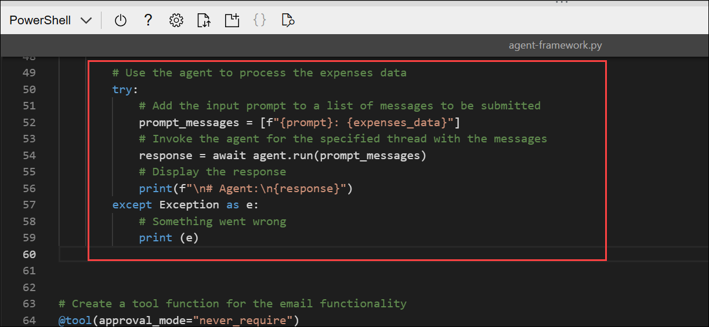

1. Review that the completed code for your agent, using the comments to help you understand what each block of code does, and then save your code changes **CTRL+S**.

1. Keep the code editor open in case you need to correct any typo's in the code, but resize the panes so you can see more of the command line console.

## Task 5: Sign into Azure and run the app

In this task, you signed into Azure using the CLI, authenticated your session, and ran the agent application. You then tested the agent by submitting an expense claim and verified that it generated the expected email output.

1. In the cloud shell command-line pane beneath the code editor, enter the following command to sign into Azure **(1)**. Copy and paste the Sign in URL in the web browser **(2)**. Copy the device code as well to authenticate **(3)**.

    ```
    az login
    ```

    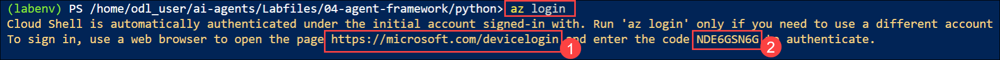

    >**Note:** You must sign into Azure - even though the cloud shell session is already authenticated

    > **Note:** In most scenarios, just using *az login* will be sufficient. However, if you have subscriptions in multiple tenants, you may need to specify the tenant by using the *--tenant* parameter. See [Sign into Azure interactively using the Azure CLI](https://learn.microsoft.com/cli/azure/authenticate-azure-cli-interactively) for details.

1. In the new browser tab, when the **Enter code to allow access** window appears, paste the copied code and select **Next**.

    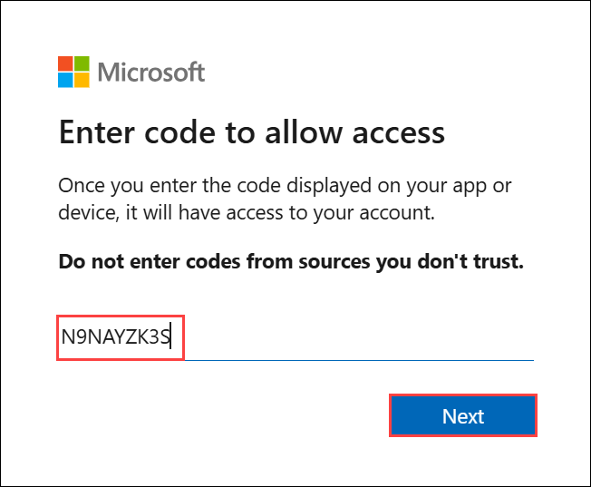

1. In the **Pick an account** dialog box, choose **ODL_User<inject key="DeploymentID"></inject>**. 

    

1. In the **Are you trying to sign in to Microsoft Azure CLI?** dialog box, click **Continue**.

    

1. When the **Microsoft Azure Cross-platform Command Line Interface** window pops up, return to the browser tab with Cloud Shell open. 

    

1. In the Cloud Shell console, press **Enter** to select the only available subscription.

    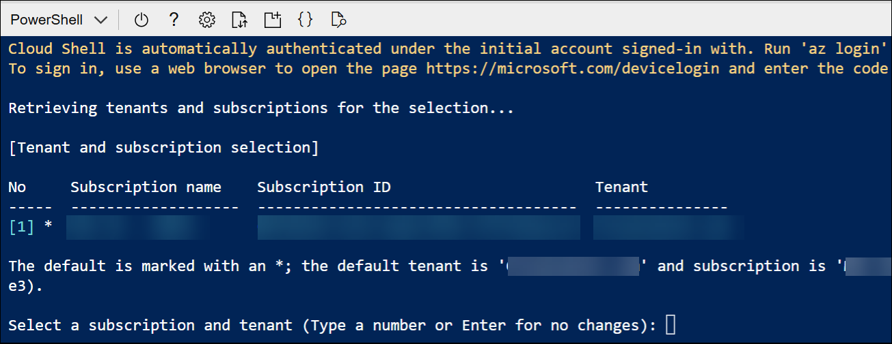

1. After you have signed in, enter the following command to run the application:  

    ```
   python agent-framework.py
    ```
    
    - The application runs using the credentials for your authenticated Azure session to connect to your project and create and run the agent.

1. When asked **What would you like me to do with it?** expenses data, enter the following prompt:

    ```
   Submit an expense claim
    ```

    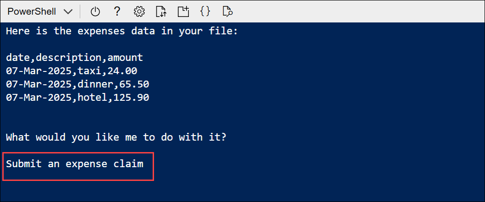

1. When the application has finished, review the output. The agent should have composed an email for an expenses claim based on the data that was provided.

    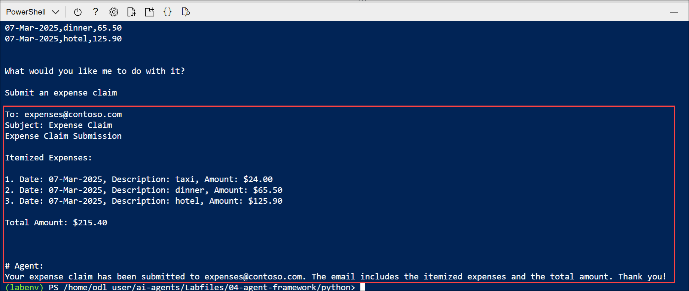

    > **Tip:** If the app fails because the rate limit is exceeded. Wait a few seconds and try again. If there is insufficient quota available in your subscription, the model may not be able to respond.

## Summary

In this lab, you used the Microsoft Agent Framework SDK to build an AI agent for expense claim processing. You created a custom tool to simulate sending emails, configured the agent with system instructions, and connected it to a Foundry project. Finally, you ran and tested the agent, verifying that it processed expenses data and generated the expected email output.

### You have successfully completed the Hands-on Lab!