# Lab 07: Develop an Azure AI chat agent with the Microsoft Agent Framework SDK

### Estimated Duration: 45 Minutes

## Lab Overview

In this lab, you will create and configure an AI chat agent using the Microsoft Agent Framework SDK in Visual Studio Code and deploy a model in an Foundry project. You will set up the development environment, implement a custom tool to process expense data, and integrate it with the agent. Finally, you will run and validate the application to ensure the agent can generate responses and simulate expense claim submissions.

## Lab Objectives

In this lab, you'll perform the following tasks:

- **Task 1:** Install the Microsoft Foundry VS Code extension

- **Task 2:** Sign in to Azure and create a project

- **Task 3:** Deploy a model

- **Task 4:** Clone the starter code repository

- **Task 5:** Write code for an agent app

- **Task 6:** Run the app

## Task 1: Install the Microsoft Foundry VS Code extension

In this task, you'll install and verify the Microsoft Foundry extension in Visual Studio Code, enabling you to create, manage, and interact with Azure AI projects and agents directly within the VS Code environment.

1. Open the **Visual Studio Code** from the desktop.

    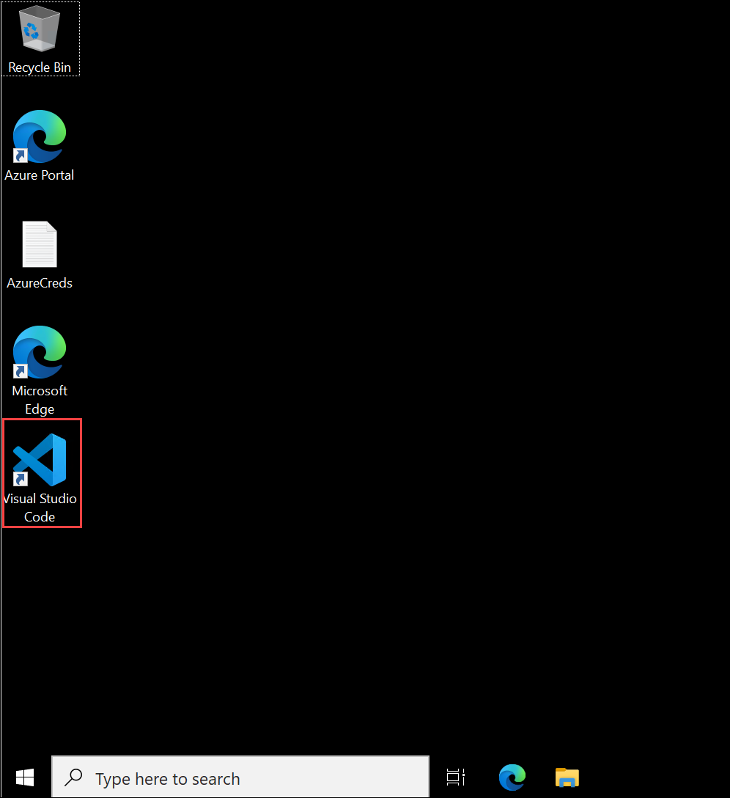

1. In Visual Studio Code, select **Extensions (1)** from the left pane, search for **Microsoft Foundry (2)**, choose the **Microsoft Foundry (3)** extension by Microsoft, and then click **Install (4)**.

   

1. After installation is complete, verify the extension appears in the primary navigation bar on the left side of Visual Studio Code.

   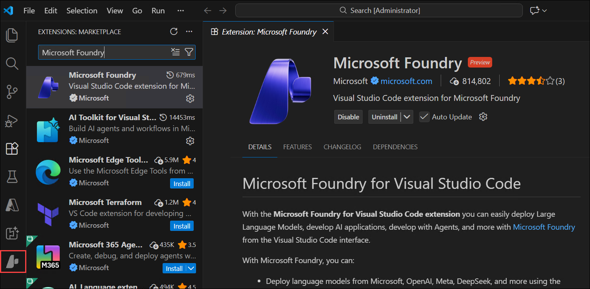

   > **Note:** If you already have the extension installed, make sure the version is at least **v0.16.0** to follow along with the instructions in this exercise.

## Task 2: Sign in to Azure and create a project

In this task, you'll authenticate with your Azure account and create a new Microsoft Foundry project, which will serve as the workspace for deploying models and building AI-powered agent solutions.

1. In the VS Code sidebar, select the **Microsoft Foundry (1)** extension icon.

1. In the Resources view, choose **Create Project (2)**, and when prompted, select **Sign in to Azure (3)** to authenticate.

   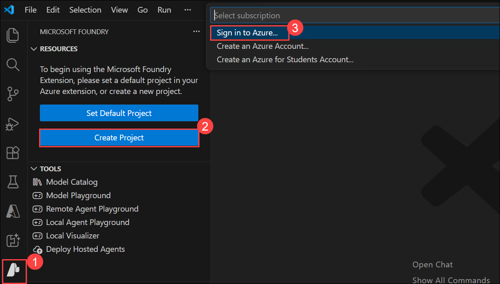

1. In the **Azure Resources wants to sign in using Microsoft** dialog, select **Allow**.

   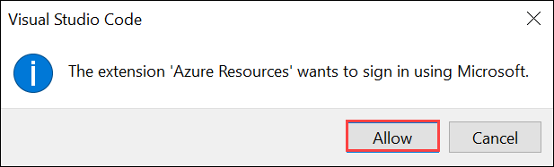

1. On the **Sign in** page, provide the credentials below:
 
   - **Email/Username:** <inject key="AzureAdUserEmail"></inject>
    
     

   - **Password:** <inject key="AzureAdUserPassword"></inject>
    
     

1. On the **Sign in to all apps, websites, and services on this device?** page, select **Yes**.

   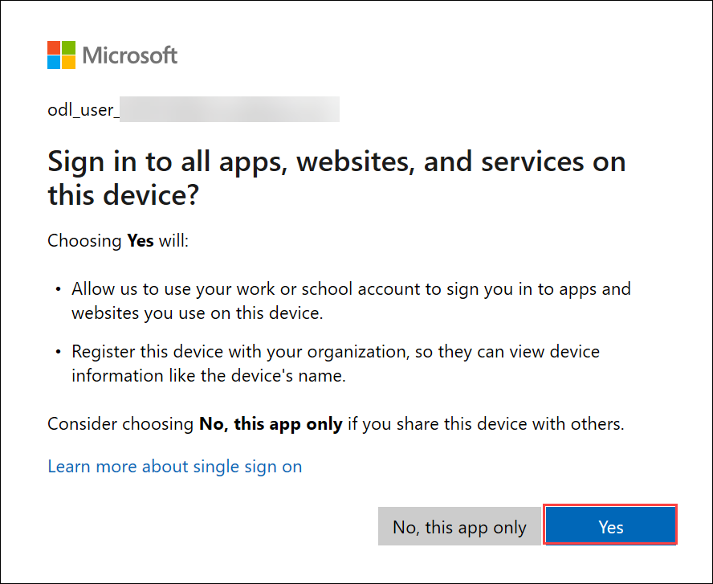

1. On the **Account added to this device** page, select **Done**.

   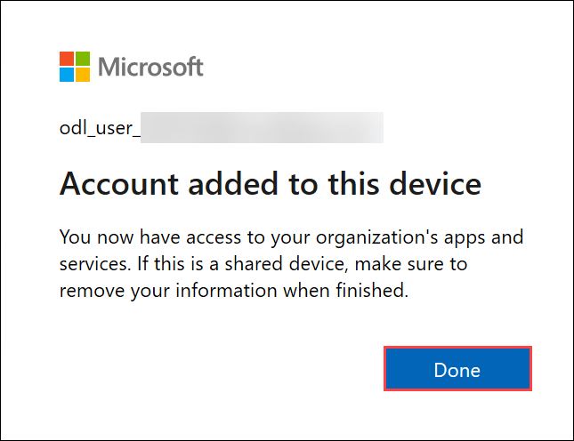

1. In the **Choose a resource group** dialog, select **AI-102-RG11** from the list.

   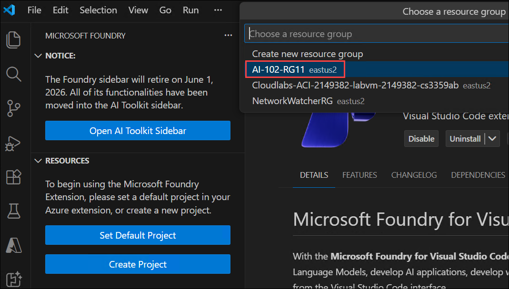

1. In the **Enter project name** dialog, enter **Myproject<inject key="DeploymentID" enableCopy="false"/>**, and then press **Enter** to confirm.

   

1. Wait for the project deployment to complete. A popup will appear with the message "Project deployed successfully."

    

## Task 3: Deploy a model

In this task, you'll deploy the gpt-4.1 model (or an equivalent) in your Foundry project, making it available for your agent to process prompts and generate intelligent responses.

1. In the **RESOURCES** pane, select **Models**, and then select the **+** icon to add a new model deployment.

   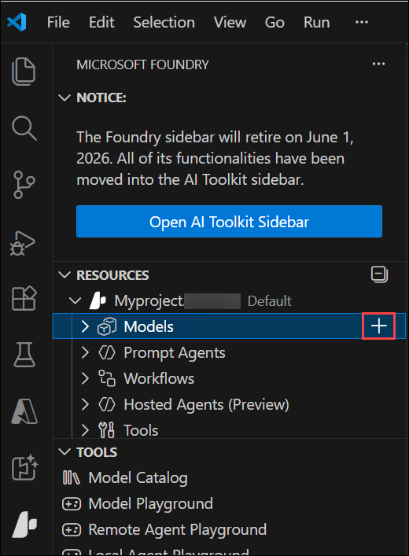

   > **Tip:** You can also access the Model Catalog pressing **F1** and running the command **Microsoft Foundry: Open Model Catalog**.

1. In the Model Catalog, scroll down, search for **gpt-4.1 (1)** in the search bar, and then select **Deploy (2)** under **OpenAI GPT-4.1**.

   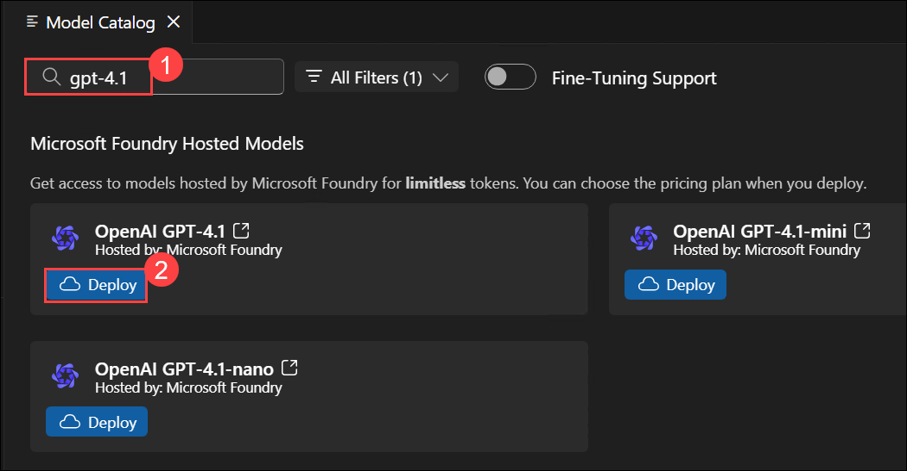

1. Configure the deployment settings:
   
    - **Deployment name:** Enter a name like **gpt-4.1 (1)**
    - **Deployment type:** Select **Global Standard** (or **Standard** if Global Standard is not available) **(2)**
    - **Model version:** Leave as default
    - **Tokens per minute:** `50K` **(3)**
    - Select **Deploy in Microsoft Foundry (4)** in the bottom-left corner.

        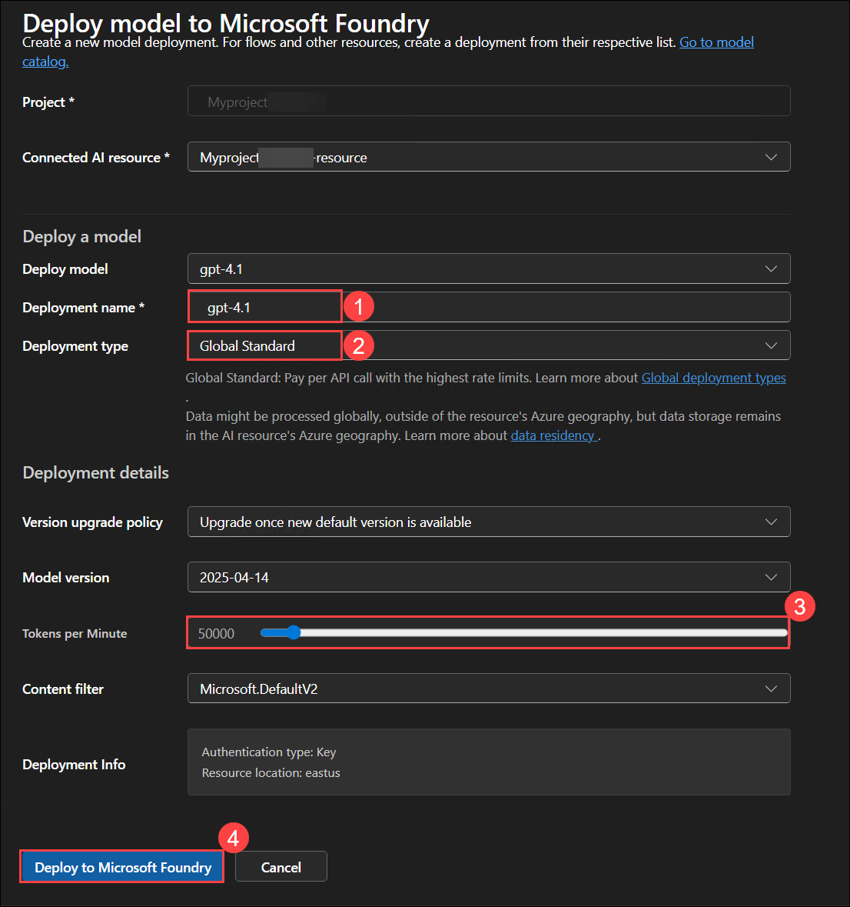

1. If the confirmation dialog appears, select **Deploy** to deploy the model.

1. Wait for the deployment to complete. Your deployed model will appear under the **Models** section in the Resources view.

    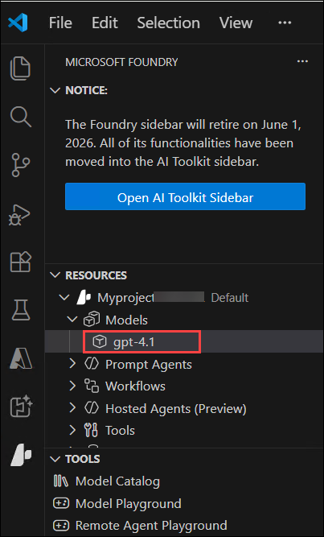

1. In the VS Code Activity Bar, under the **Resources** section expand and right-click your project **Myproject (2)**, and choose **Copy Project Endpoint (3)** to copy the endpoint.

    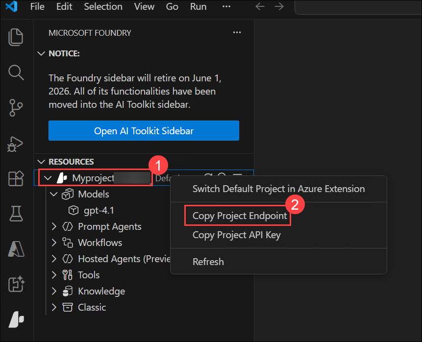

    > **Note:** Copy and save the **Project endpoint** in a notepad, as it will be required in upcoming task.

> **Congratulations** on completing the task! Now, it's time to validate it. Here are the steps:
>
> - Hit the Validate button for the corresponding task. If you receive a success message, you can proceed to the next task.
> - If not, carefully read the error message and retry the step, following the instructions in the lab guide.
> - If you need any assistance, please contact us at cloudlabs-support@spektrasystems.com. We are available 24/7 to help.
 
<validation step="412da72d-9077-4bed-899e-d2e2c021cd43" />

## Task 4: Clone the starter code repository

In this task, you'll clone the provided GitHub repository, set up a Python virtual environment, install required dependencies, and configure environment variables to prepare your local development setup.

1. Navigate to the **Welcome** page in VS Code by selecting the ellipsis **(...) (1)** from the top bar, then **Help (2)**, and finally **Welcome (3)**.

    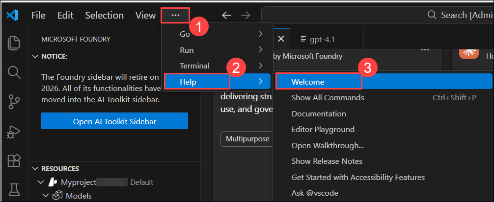

1. On the **Get Started** page, select **Mark Done (1)** to complete this step and proceed.

    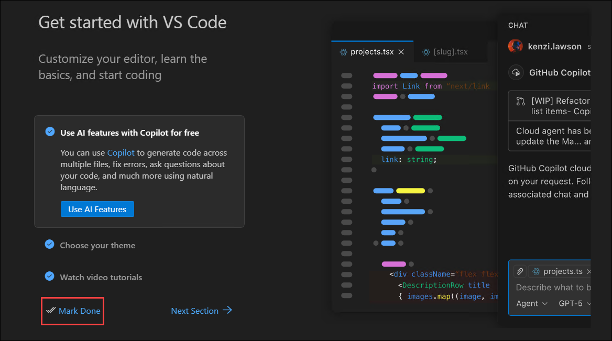

1. Select **Clone Git Repository... (1)**, paste the repository URL **(2)** `https://github.com/MicrosoftLearning/mslearn-ai-agents.git`, and then choose **Clone from URL (3)** to proceed.

    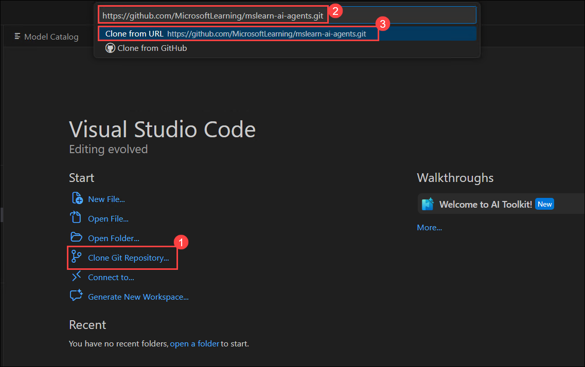

1. Select the destination folder **C:\LabFiles (1)** and click **Select as Repository Destination (2)** to proceed.

    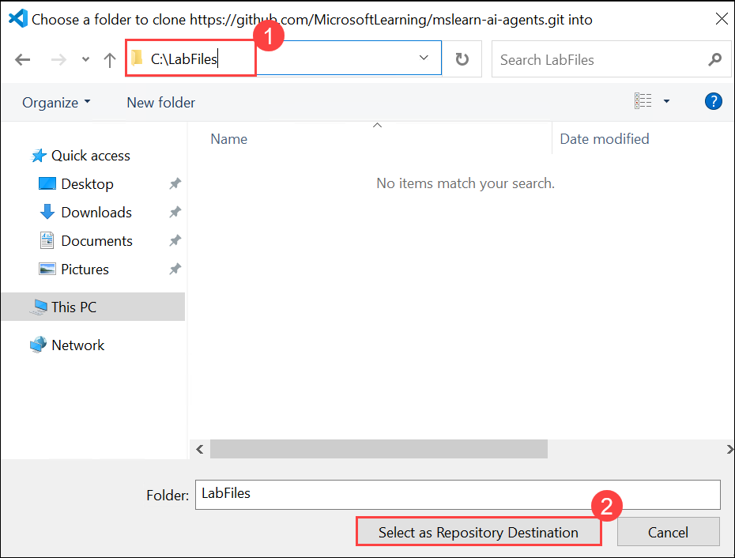

1. When prompted, select **Open (1)** to open the cloned repository.

    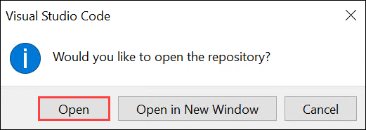

1. In the trust prompt, select **Yes, I trust the authors (1)** to continue.

    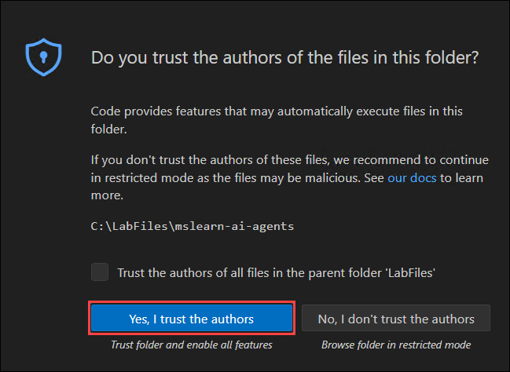

1. In the Explorer view, navigate to the **Labfiles (1)** and then select **07-agent-framework/Python (2)** folder to find the starter code for this exercise.

    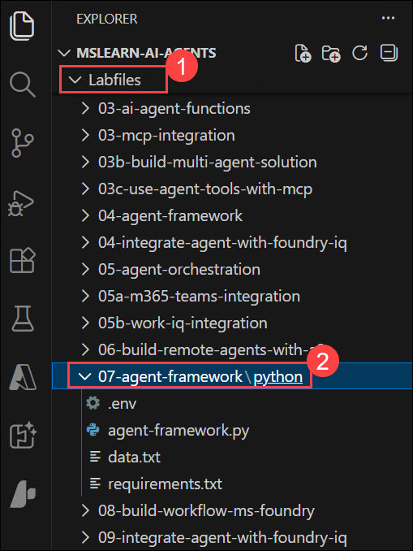

1. Right-click on the **requirements.txt (1)** file and select **Open in Integrated Terminal (2)**.

    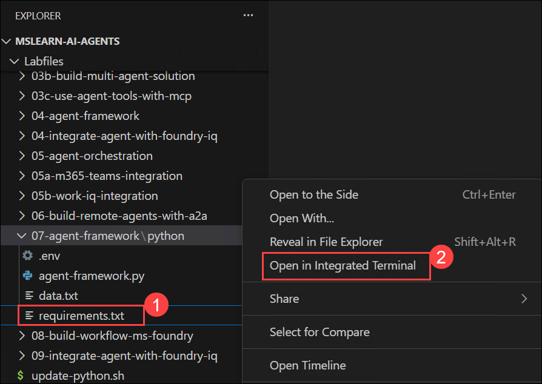

1. In the terminal, enter the following command to install the required Python packages in a virtual environment:

    ```
    python -m venv labenv
    .\labenv\Scripts\Activate.ps1
    pip install -r requirements.txt
    ```

1. From the left navigation menu, under **07-agent-framework/Python** folder, open the **.env (1)** file. Paste the copied project endpoint into the **PROJECT_ENDPOINT (2)** field, and verify that the **MODEL_DEPLOYMENT_NAME (3)** is set to `gpt-4.1` (or the name of your deployed model). Once done, press **Ctrl+S** to save the changes.

    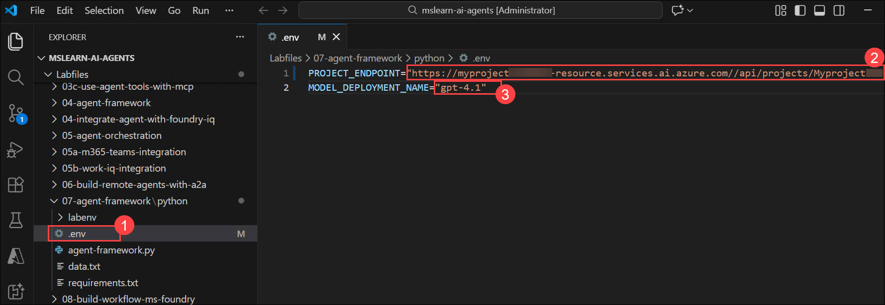

    - Now you're ready to create an AI agent that uses a custom tool to process expenses data.

## Task 5: Write code for an agent app

In this task, you'll create and configure an AI agent using the Microsoft Agent Framework SDK and define a custom tool for processing expense claims. You will integrate the tool with the agent to handle user prompts and perform actions.

> **Tip:** As you add code, be sure to maintain the correct indentation. Use the existing comments as a guide, entering the new code at the same level of indentation.

1. Open the **agent-framework.py** file in the code editor.

    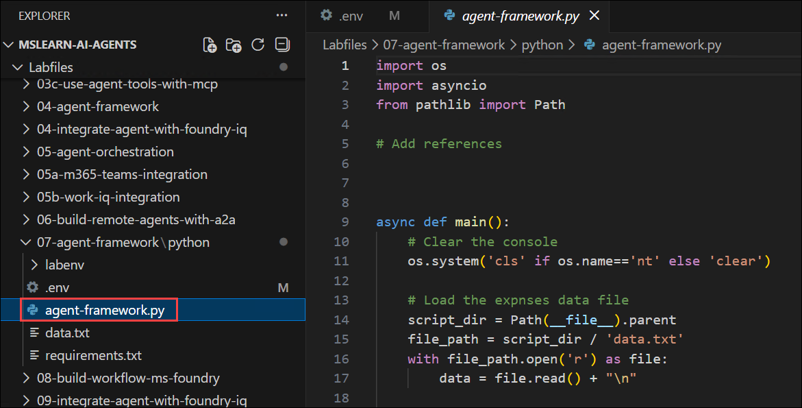

1. Review the code in the file. It contains:
    
    - Some **import** statements to add references to commonly used namespaces
    
    - A *main* function that loads a file containing expenses data, asks the user for instructions, and and then calls...
    
    - A **process_expenses_data** function in which the code to create and use your agent must be added

1. At the top of the file, after the existing **import** statement, find the comment **Add references**, and add the following code to reference the namespaces in the libraries you'll need to implement your agent:

    ```python
   # Add references
   from agent_framework import tool, Agent
   from agent_framework.azure import AzureOpenAIResponsesClient
   from azure.identity import AzureCliCredential
   from pydantic import Field
   from typing import Annotated
    ```

    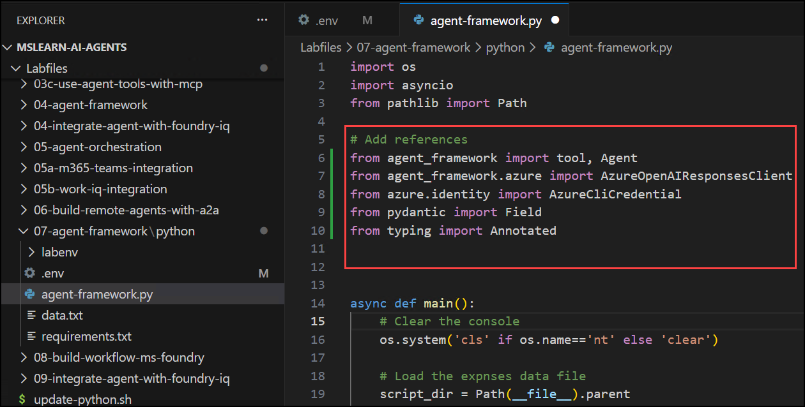

1. Near the bottom of the file, find the comment **Create a tool function for the email functionality**, and add the following code to define a function that your agent will use to send email (tools are a way to add custom functionality to agents)

    ```python
   # Create a tool function for the email functionality
   @tool(approval_mode="never_require")
   def submit_claim(
       to: Annotated[str, Field(description="Who to send the email to")],
       subject: Annotated[str, Field(description="The subject of the email.")],
       body: Annotated[str, Field(description="The text body of the email.")]):
           print("\nTo:", to)
           print("Subject:", subject)
           print(body, "\n")
    ```

    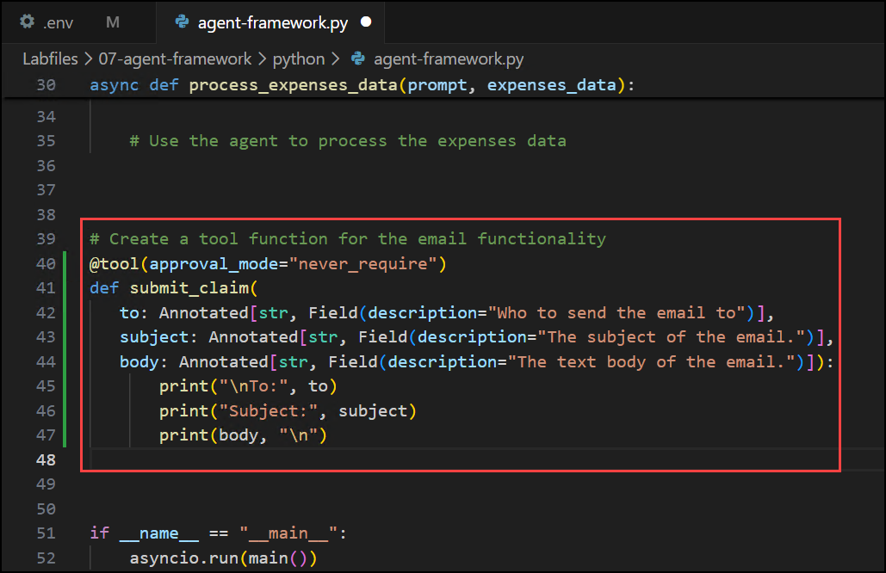

    > **Note:** The function *simulates* sending an email by printing it to the console. In a real application, you'd use an SMTP service or similar to actually send the email!

1. Back up above the **send_email** code, in the **process_expenses_data** function, find the comment **Create a client and initialize an agent with the tool and instructions**, and add the following code:

    (Be sure to maintain the indentation level)

    ```python
   # Create a client and initialize an agent with the tool and instructions
   credential = AzureCliCredential()
   async with (
        Agent(
            client=AzureOpenAIResponsesClient(
                credential=credential,
                deployment_name=os.getenv("MODEL_DEPLOYMENT_NAME"),
                project_endpoint=os.getenv("PROJECT_ENDPOINT"),
            ),
            instructions="""You are an AI assistant for expense claim submission.
                        At the user's request, create an expense claim and use the plug-in function to send an email to expenses@contoso.com with the subject 'Expense Claim`and a body that contains itemized expenses with a total.
                        Then confirm to the user that you've done so. Don't ask for any more information from the user, just use the data provided to create the email.""",
            tools=[submit_claim],
        ) as agent,
    ):
    ```

    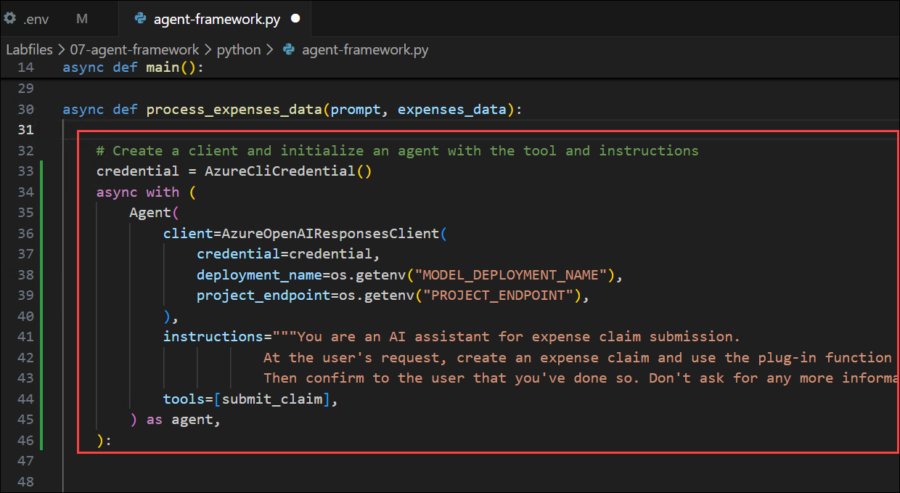

    - Note that the **AzureCliCredential** object will allow your code to authenticate to your Azure account. The **AzureOpenAIResponsesClient** object includes the Foundry project settings from the .env configuration. The **Agent** object is initialized with the client, instructions for the agent, and the tool function you defined to send emails.

1. Find the comment **Use the agent to process the expenses data**, and add the following code to create a thread for your agent to run on, and then invoke it with a chat message.

    ```python
   # Use the agent to process the expenses data
   try:
       # Add the input prompt to a list of messages to be submitted
       prompt_messages = [f"{prompt}: {expenses_data}"]
       # Invoke the agent for the specified thread with the messages
       response = await agent.run(prompt_messages)
       # Display the response
       print(f"\n# Agent:\n{response}")
   except Exception as e:
       # Something went wrong
       print (e)
    ```

    > **Note:** While adding code under **Use the agent to process the expenses data**, make sure the `try` block and all its statements are properly indented inside the `async with` block created in the previous step.

    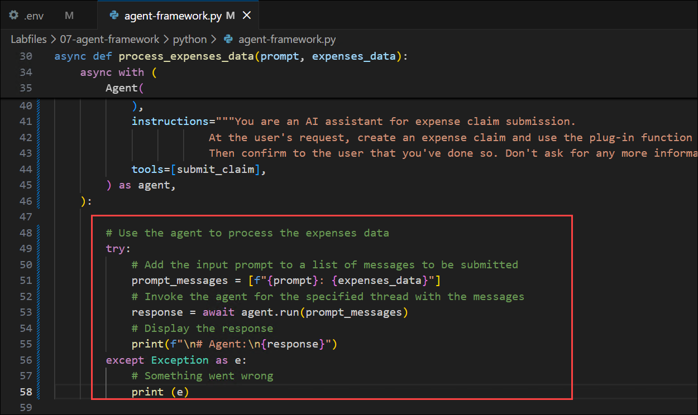

1. Review that the completed code for your agent, using the comments to help you understand what each block of code does, and then save your code changes **CTRL+S**.

## Task 6: Run the app

In this task, you'll run the Python application and interact with the agent using prompts. You will verify that the agent processes expense data and generates the expected output.

1. In the terminal, run `az login` to initiate the Azure sign-in process.

    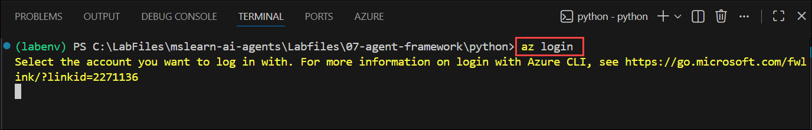

    >**Note:** If you have closed the terminal, right-click on the **07-agent-framework \ Python** folder and select **Open in Integrated Terminal**. Then run the command `.\labenv\Scripts\Activate.ps1` to activate the virtual environment before proceeding.

1. In the sign-in window, select your account **<inject key="AzureAdUserEmail"></inject> (1)** and click **Continue (2)** to proceed with authentication.

    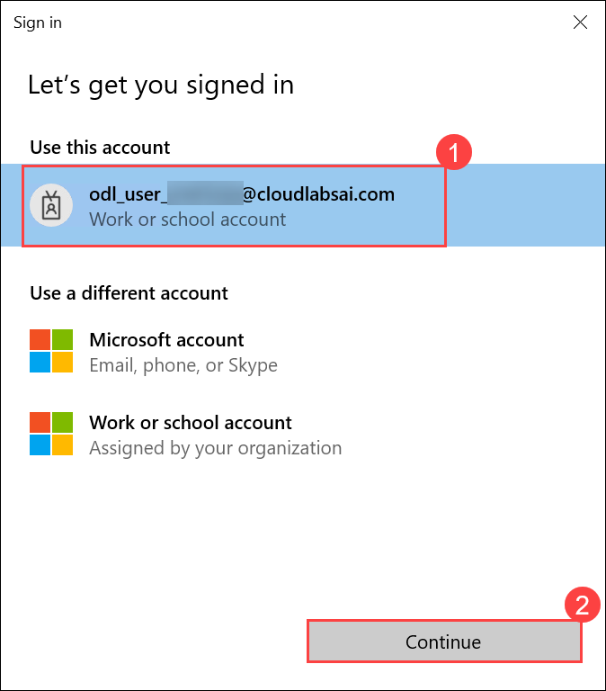

1. After successful sign-in, wait for the subscriptions to load and press **Enter** to select the only available subscription.

    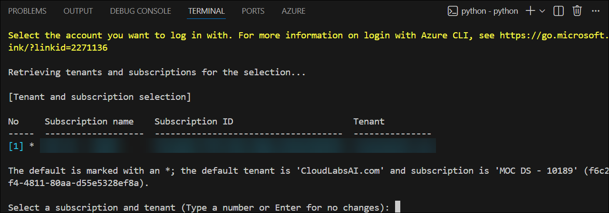

1. In the integrated terminal, enter the following command to run the application:

    ```
   python agent-framework.py
    ```

1. When asked what to do with the expenses data, enter the following prompt:

    ```
   Submit an expense claim
    ```

    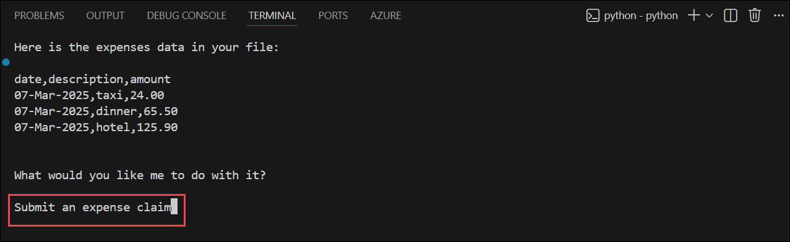

1. When the application has finished, review the output. The agent should have composed an email for an expenses claim based on the data that was provided.

    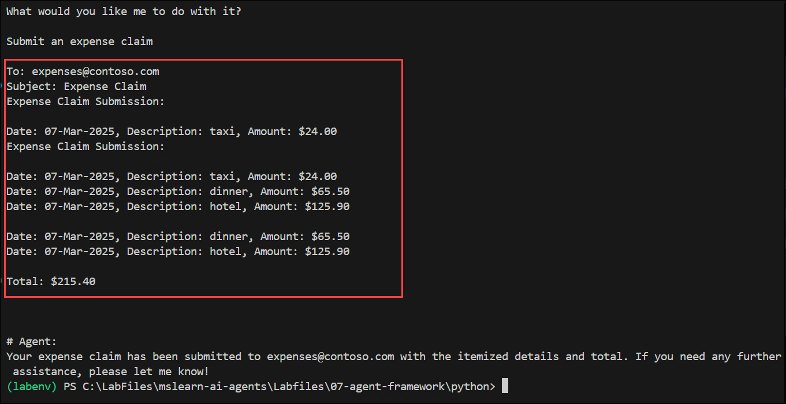

    > **Tip:** If the app fails because the rate limit is exceeded. Wait a few seconds and try again. If there is insufficient quota available in your subscription, the model may not be able to respond.

1. When you're finished, enter `deactivate` in the terminal to exit the Python virtual environment.

## Summary

In this lab, you used the Microsoft Agent Framework SDK to build and configure an AI chat agent in an Microsoft Foundry project. You implemented a custom tool to process expense data and integrated it with the agent to handle user requests. Finally, you ran and tested the application to validate the agent’s ability to generate responses and simulate expense claim submissions.

## You have successfully completed the Hands-on Lab!