# Lab 08: Develop a multi-agent solution with Microsoft Agent Framework

### Estimated Duration: 30 Minutes

## Overview

In this lab, you'll learn how to build a multi-agent solution using the Microsoft Agent Framework SDK. You'll implement the sequential orchestration pattern, where multiple agents work together in a pipeline to process input and generate meaningful outputs. You'll create the following agents:

- The Summarizer agent will condense raw feedback into a short, neutral sentence.
- The Classifier agent will categorize the feedback as Positive, Negative, or a Feature request.
- Finally, the Recommended Action agent will recommend an appropriate follow-up step.

    > **Note:** Some of the technologies used in this exercise are in preview or in active development. You may experience some unexpected behavior, warnings, or errors.

## Lab Objectives

- **Task 1:** Create an AI Agent client app

- **Task 2:** Configure the application settings

- **Task 3:** Create AI agents

- **Task 4:** Create a sequential orchestration

- **Task 5:** Run the app

## Task 1: Create an AI Agent client app

In this task, you will set up the client environment by opening Azure Cloud Shell and cloning the GitHub repo. This prepares your system to configure and run the multi-agent solution.

1. In the **Azure portal**, select the **Cloud Shell** icon in the top navigation bar to open a new Cloud Shell session.

    

1. In the Cloud Shell toolbar, open the **Settings (1)** menu and choose **Go to Classic version (2)** from the drop-down.

    

    >**Note:** **Ensure you've switched to the classic version of the cloud shell before continuing.**

1. In the cloud shell pane, enter the following commands to clone the GitHub repo containing the code files for this exercise (type the command, or copy it to the clipboard and then right-click in the command line and paste as plain text):

    ```
   rm -r ai-agents -f
   git clone https://github.com/MicrosoftLearning/mslearn-ai-agents ai-agents
    ```

    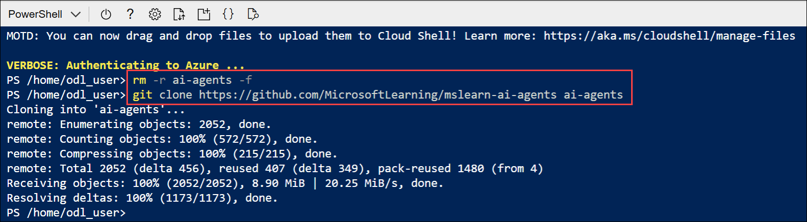

    > **Tip:** As you enter commands into the cloud shell, the output may take up a large amount of the screen buffer and the cursor on the current line may be obscured. You can clear the screen by entering the `cls` command to make it easier to focus on each task.

1. When the repo has been cloned, enter the following command to change the working directory to the folder containing the code files and list them all.

    ```
   cd ai-agents/Labfiles/05-agent-orchestration/Python
   ls -a -l
    ```

    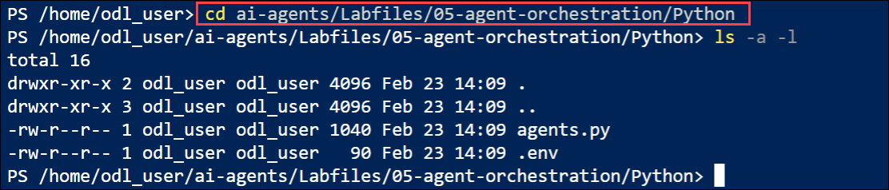

    - The provided files include application code and a file for configuration settings.

## Task 2: Configure the application settings

In this task, you will install required Python libraries and configure the .env file with your Foundry project details to enable agent connectivity.

1. In the cloud shell command-line pane, enter the following command to install the libraries you'll use:

    ```
   python -m venv labenv
   ./labenv/bin/Activate.ps1
   pip install agent-framework==1.0.0b260128 --pre
    ```

    > **Tip:** As you enter commands into the cloud shell, the output may take up a large amount of the screen buffer and the cursor on the current line may be obscured. You can clear the screen by entering the `cls` command to make it easier to focus on each task.

1. In the Cloud Shell command-line pane, enter the following command to install the required package version:

   ```
   pip install opentelemetry-semantic-conventions-ai==0.4.13
   pip install azure-ai-projects==2.0.0b3
   ```

    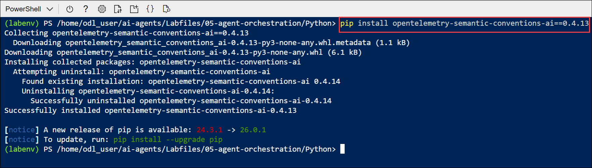

1. Enter the following command to edit the configuration file that is provided:

    ```
   code .env
    ```

1. In the code file, replace the placeholder values with the correct details for your project:

    * PROJECT\_ENDPOINT: **Foundry project endpoint**
    * MODEL\_DEPLOYMENT\_NAME: **gpt-4.1**

        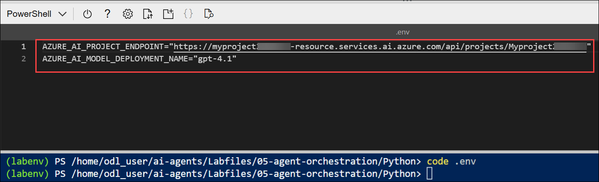

        > **Note:** Paste the project endpoint you copied in Lab 1 – Task 1.

1. After you've replaced the placeholders, use the **CTRL+S** command to save your changes and then use the **CTRL+Q** command to close the code editor while keeping the cloud shell command line open.

## Task 3: Create AI agents

In this task, you will define and initialize the summarizer, classifier, and action agents to form the core of your multi-agent workflow.

> **Tip:** As you add code, be sure to maintain the correct indentation. Use the comment indentation levels as a guide.

1. Enter the following command to edit the **agents.py** file:

    ```
   code agents.py
    ```

    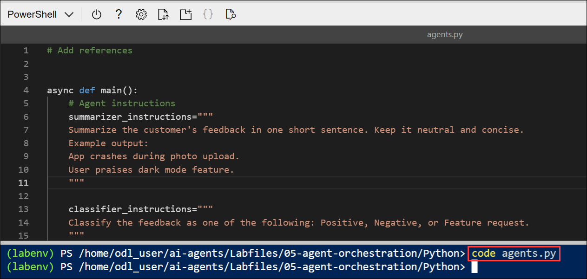

1. At the top of the file under the comment **Add references**, and add the following code to reference the namespaces in the libraries you'll need to implement your agent:

    ```python
   # Add references
   import asyncio
   from typing import cast
   from agent_framework import ChatMessage, Role, SequentialBuilder, WorkflowOutputEvent
   from agent_framework.azure import AzureAIAgentClient
   from azure.identity import AzureCliCredential
    ```

    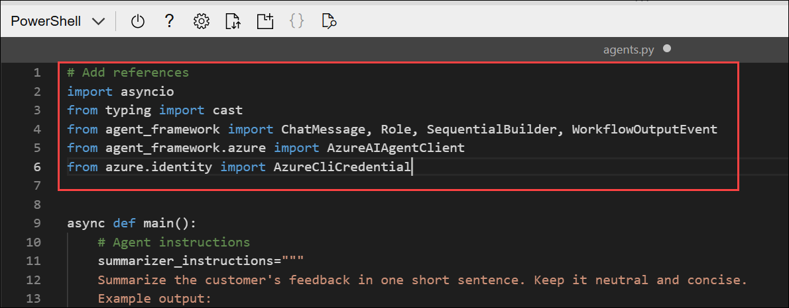

1. In the **main** function, take a moment to review the agent instructions. These instructions define the behavior of each agent in the orchestration.

1. Add the following code under the comment **Create the chat client**:

    ```python
   # Create the chat client
   credential = AzureCliCredential()
   async with (
       AzureAIAgentClient(credential=credential) as chat_client,
   ):
    ```

    

    - Note that the **AzureCliCredential** object will allow your code to authenticate to your Azure account. The **AzureAIAgentClient** object will automatically include the Foundry project settings from the .env configuration.

1. Add the following code under the comment **Create agents**:

    (Be sure to maintain the indentation level)

    ```python
   # Create agents
   summarizer = chat_client.as_agent(
       instructions=summarizer_instructions,
       name="summarizer",
   )

   classifier = chat_client.as_agent(
       instructions=classifier_instructions,
       name="classifier",
   )

   action = chat_client.as_agent(
       instructions=action_instructions,
       name="action",
   )
    ```

    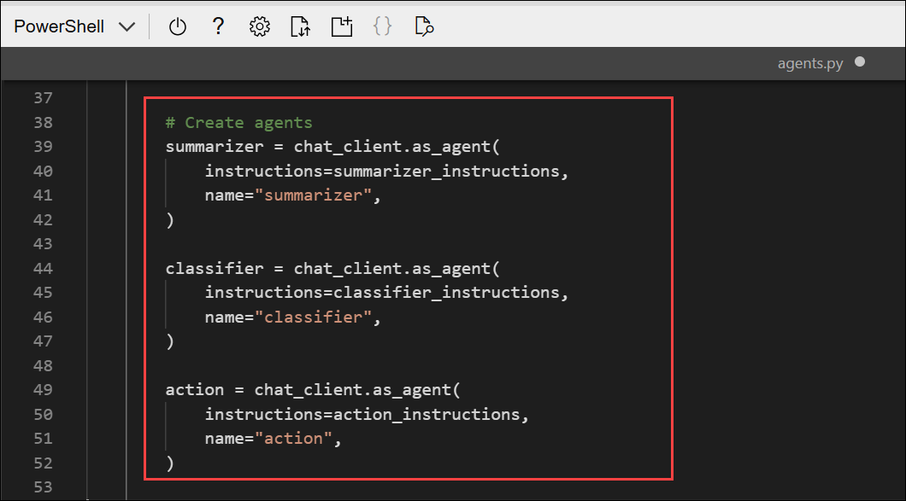

## Task 4: Create a sequential orchestration

In this task, you will build a sequential workflow to process customer feedback through the summarizer, classifier, and action agents, then collect and display their outputs.

> **Tip:** As you add code, be sure to maintain the correct indentation. Use the comment indentation levels as a guide.

1. In the **main** function, find the comment **Initialize the current feedback** and add the following code:
    
    (Be sure to maintain the indentation level)

    ```python
   # Initialize the current feedback
   feedback="""
   I use the dashboard every day to monitor metrics, and it works well overall. 
   But when I'm working late at night, the bright screen is really harsh on my eyes. 
   If you added a dark mode option, it would make the experience much more comfortable.
   """
    ```

    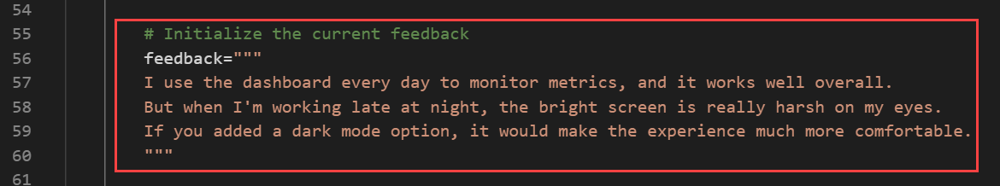

1. Under the comment **Build a sequential orchestration**, add the following code to define a sequential orchestration with the agents you defined:

    ```python
   # Build sequential orchestration
   workflow = SequentialBuilder().participants([summarizer, classifier, action]).build()
    ```

    - The agents will process the feedback in the order they are added to the orchestration.

1. Add the following code under the comment **Run and collect outputs**:

    ```python
   # Run and collect outputs
   outputs: list[list[ChatMessage]] = []
   async for event in workflow.run_stream(f"Customer feedback: {feedback}"):
       if isinstance(event, WorkflowOutputEvent):
           outputs.append(cast(list[ChatMessage], event.data))
    ```

    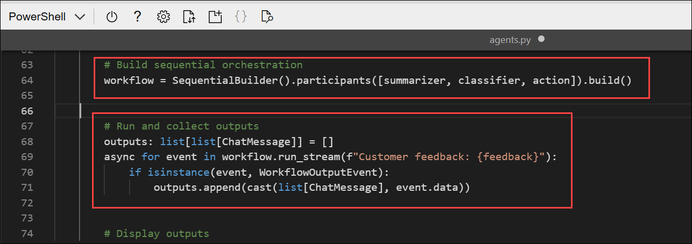

    - This code runs the orchestration and collects the output from each of the participating agents.

1. Add the following code under the comment **Display outputs**:

    ```python
   # Display outputs
   if outputs:
       for i, msg in enumerate(outputs[-1], start=1):
           name = msg.author_name or ("assistant" if msg.role == Role.ASSISTANT else "user")
           print(f"{'-' * 60}\n{i:02d} [{name}]\n{msg.text}")
    ```

    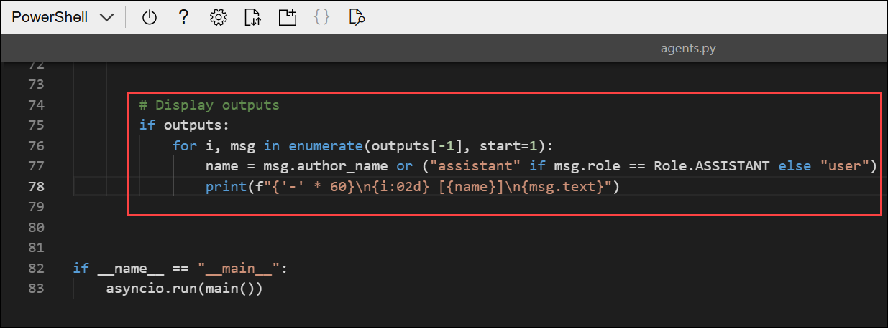

    - This code formats and displays the messages from the workflow outputs you collected from the orchestration.

1. Use the **CTRL+S** command to save your changes to the code file. You can keep it open (in case you need to edit the code to fix any errors) or use the **CTRL+Q** command to close the code editor while keeping the cloud shell command line open.

## Task 5: Run the app

In this task, you will run the multi-agent application, and observe how the agents process and respond to customer feedback.

1. In the Cloud Shell console, enter the following command to run the application:

    ```
   python agents.py
    ```

    You should see some output similar to the following:

    ```output
    ------------------------------------------------------------
    01 [user]
    Customer feedback:
        I use the dashboard every day to monitor metrics, and it works well overall.
        But when I'm working late at night, the bright screen is really harsh on my eyes.
        If you added a dark mode option, it would make the experience much more comfortable.

    ------------------------------------------------------------
    02 [summarizer]
    User requests a dark mode for better nighttime usability.
    ------------------------------------------------------------
    03 [classifier]
    Feature request
    ------------------------------------------------------------
    04 [action]
    Log as enhancement request for product backlog.
    ```

    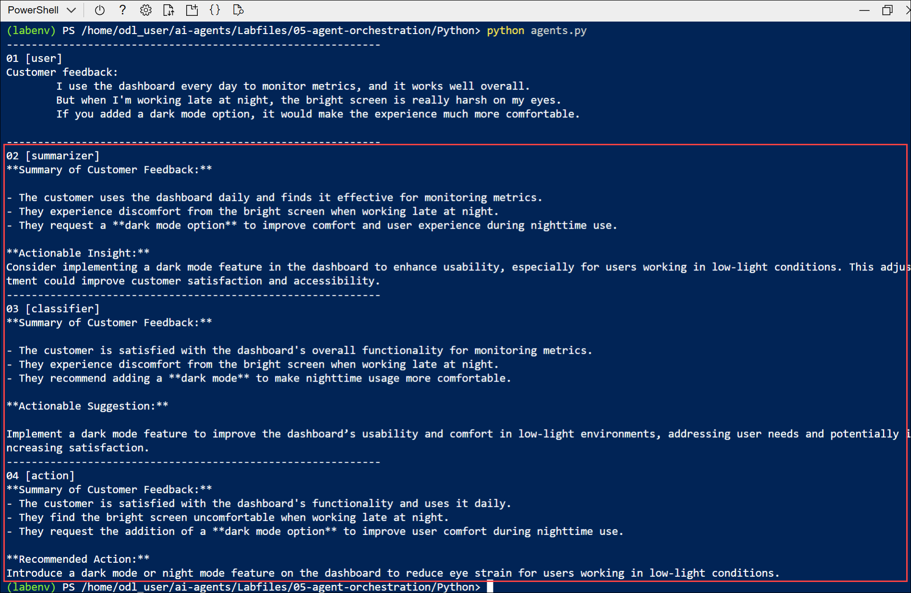

1. Optionally, you can try running the code using different feedback inputs, such as:

1. Enter the following command to edit the **agents.py** file:

    ```
   code agents.py
    ```

1. Locate the section under the comment **# Initialize the current feedback** and replace the existing feedback text with the following **(2)**:

    ```output
    I reached out to your customer support yesterday because I couldn't access my account. The representative responded almost immediately, was polite and professional, and fixed the issue within minutes. Honestly, it was one of the best support experiences I've ever had.
    ```

     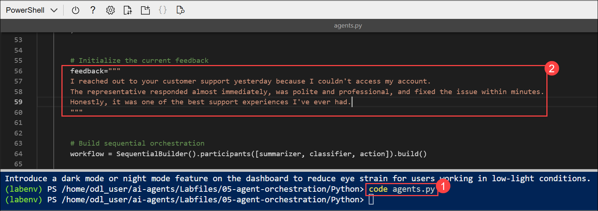

1. Save your changes by pressing **CTRL+S**, then run the application with the following command and review the output:

    ```
    python agents.py
    ```

1. In the Cloud Shell window, select the **Close (X)** icon to exit Cloud Shell before proceeding to the next lab.

## Summary

In this lab, you used the Microsoft Agent Framework SDK to build a multi-agent Python application that connects to your Foundry project. You configured the application, created summarizer, classifier, and action agents, and set up a sequential orchestration to process customer feedback. You then ran the application, observed the agents collaborating, and generated structured insights and recommendations from the input data.

### You have successfully completed the lab. Click on **Next >>** to proceed with the next Lab.

   