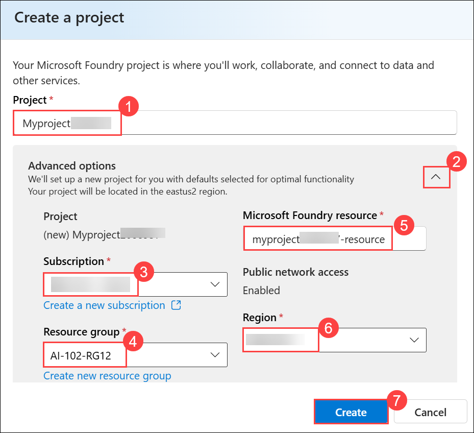
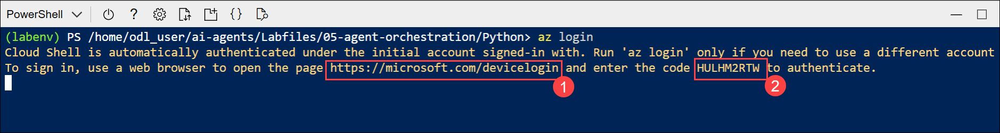
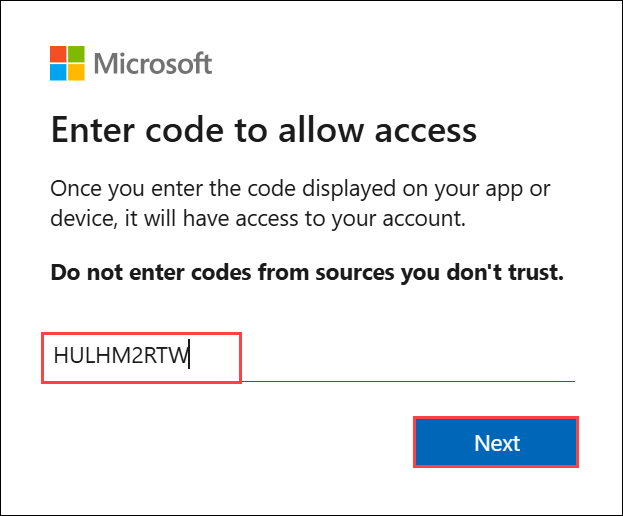
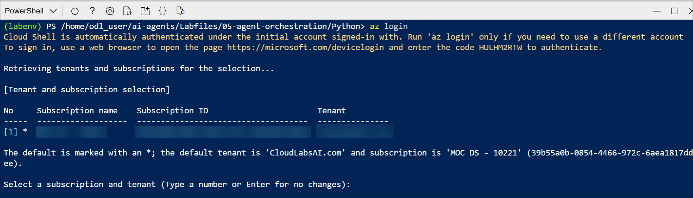

# Lab 08: Develop a multi-agent solution with Microsoft Agent Framework

### Estimated Duration: 30 Minutes

## Overview

In this lab, you'll learn how to build a multi-agent solution using the Microsoft Agent Framework SDK. You'll implement the sequential orchestration pattern, where multiple agents work together in a pipeline to process input and generate meaningful outputs. You'll create the following agents:

- The Summarizer agent will condense raw feedback into a short, neutral sentence.
- The Classifier agent will categorize the feedback as Positive, Negative, or a Feature request.
- Finally, the Recommended Action agent will recommend an appropriate follow-up step.

> **Note:** Some of the technologies used in this exercise are in preview or in active development. You may experience some unexpected behavior, warnings, or errors.

## Lab Objectives

- **Task 1:** Deploy a model in a Microsoft Foundry project

- **Task 2:** Create an AI Agent client app

- **Task 3:** Configure the application settings

- **Task 4:** Create AI agents

- **Task 5:** Create a sequential orchestration

- **Task 6:** Sign into Azure and run the app

## Task 1: Deploy a model in a Microsoft Foundry project

In this task, you will create a new Microsoft Foundry project, deploy the gpt-4.1 model, and copy the project endpoint to use in your client application.

1. Open a new tab in the browser, right-click on the following link [Foundry portal](https://ai.azure.com), then **Copy link** and paste it in a browser tab to log in to **Microsoft Foundry portal**.

1. Click on **Sign in**.
 
    

1. If prompted, provide the credentials below:
 
   - **Email/Username:** <inject key="AzureAdUserEmail"></inject>
    
     

   - **Password:** <inject key="AzureAdUserPassword"></inject>
    
     

1. When the **Stay signed in?** window appears, select **No**.

    
    
    >**Note:** Close any tips or quick start panes that are opened the first time you sign in, and if necessary use the **Foundry** logo at the top left to navigate to the home page, which looks similar to the following image (close the **Help** pane if it's open):

1. At the top of the **Microsoft Foundry** portal, enable the **New Foundry toggle (1)** to switch to the latest Foundry user interface.

1. From the **Select a project to continue** dialog, click the drop-down under **Select or search for a project**, and then select **Create a new project (2)**.

     

1. In the **Create a project** window, enter **Myproject<inject key="DeploymentID"></inject> (1)** as the project name. Open the **Advanced options (2)** drop-down, fill in the following details, and then click **Create (7)**:

    * Subscription: **Choose Default Subscription (3)**
    * Resource group: **AI-102-RG12 (4)**
    * Microsoft Foundry resource: **Keep as Default (5)**
    * Region: **<inject key="Region"></inject> (6)**

      

      >**Note:**  Some Azure AI resources are constrained by regional model quotas. In the event of a quota limit being exceeded later in the exercise, there's a possibility you may need to create another resource in a different region.

1. Wait for your project created. It may take a few minutes.

1. On the **Microsoft Foundry** home page, click **Start building (1)**, and then select **Browse models (2)** from the drop-down menu.

     

1. On the **Models** page, search for **gpt-4.1 (1)** in the search bar, and then select the **gpt-4.1 (2)** model from the search results.

     

1. On the **gpt-4.1** model details page, click **Deploy (1)**, and then select **Default settings (2)** to deploy the model using the standard configuration.

    

    - After the model is deployed, the playground for the model is displayed.

1. In the navigation bar on the left, select **Microsoft Foundry** to return to the Foundry home page.

     

1. Copy the **Project endpoint** value to a notepad, as you'll use them to connect to your project in a client application.

    

> **Congratulations** on completing the task! Now, it's time to validate it. Here are the steps:
>
> - Hit the Validate button for the corresponding task. If you receive a success message, you can proceed to the next task.
> - If not, carefully read the error message and retry the step, following the instructions in the lab guide.
> - If you need any assistance, please contact us at cloudlabs-support@spektrasystems.com. We are available 24/7 to help.
 
<validation step="5067f59b-415f-4007-9926-ff36dcc942d8" />


## Task 2: Create an AI Agent client app

In this task, you will set up the client environment by opening Azure Cloud Shell and cloning the GitHub repo. This prepares your system to configure and run the multi-agent solution.

1. Open a new browser tab (keeping the Microsoft Foundry portal open in the existing tab). Then in the new tab, browse to the [Azure portal](https://portal.azure.com) at `https://portal.azure.com`.

1. If prompted, provide the credentials below:

    - **Email/Username:** <inject key="AzureAdUserEmail"></inject>

    - **Password:** <inject key="AzureAdUserPassword"></inject> 

      >**Note:** Close any welcome notifications to see the Azure portal home page.

1. On the **Azure portal** homepage, click the **\[>\_] Cloud Shell (1)** button located to the right of the **Copilot** tab at the top. This opens a new Cloud Shell session. In the **Welcome to Azure Cloud Shell** window, choose **PowerShell (2)**.

    

    >**Note:** The cloud shell provides a command-line interface in a pane at the bottom of the Azure portal. You can resize or maximize this pane to make it easier to work in.

    > **Note:** If you have previously created a cloud shell that uses a **Bash** environment, switch it to **PowerShell**.

1. In the **Getting started** window, ensure **No storage account required (1)** is selected. From the **Subscription** drop-down, choose **Default subscription (2)**, then click **Apply (3)**.

    

1. In the Cloud Shell toolbar, open the **Settings (1)** menu and choose **Go to Classic version (2)** from the drop-down.

    

    >**Note:** **<font color="red">Ensure you've switched to the classic version of the cloud shell before continuing.</font>**

1. In the cloud shell pane, enter the following commands to clone the GitHub repo containing the code files for this exercise (type the command, or copy it to the clipboard and then right-click in the command line and paste as plain text):

    ```
   rm -r ai-agents -f
   git clone https://github.com/MicrosoftLearning/mslearn-ai-agents ai-agents
    ```

    

    > **Tip:** As you enter commands into the cloud shell, the output may take up a large amount of the screen buffer and the cursor on the current line may be obscured. You can clear the screen by entering the `cls` command to make it easier to focus on each task.

1. When the repo has been cloned, enter the following command to change the working directory to the folder containing the code files and list them all.

    ```
   cd ai-agents/Labfiles/05-agent-orchestration/Python
   ls -a -l
    ```

    

    - The provided files include application code and a file for configuration settings.

## Task 3: Configure the application settings

In this task, you will install required Python libraries and configure the .env file with your Foundry project details to enable agent connectivity.

1. In the cloud shell command-line pane, enter the following command to install the libraries you'll use:

    ```
   python -m venv labenv
   ./labenv/bin/Activate.ps1
   pip install agent-framework==1.0.0b260128 --pre
    ```

1. In the Cloud Shell command-line pane, enter the following command to install the required package version:

   ```
   pip install opentelemetry-semantic-conventions-ai==0.4.13
   ```

    

1. Enter the following command to edit the configuration file that is provided:

    ```
   code .env
    ```

1. In the code file, replace the placeholder values with the correct details for your project:

    * PROJECT\_ENDPOINT : **Foundry project endpoint**
    * MODEL\_DEPLOYMENT\_NAME : **gpt-4.1**

        

        > **Note:** Paste the project endpoint you copied in the previous task.

1. After you've replaced the placeholders, use the **CTRL+S** command to save your changes and then use the **CTRL+Q** command to close the code editor while keeping the cloud shell command line open.

## Task 4: Create AI agents

In this task, you will define and initialize the summarizer, classifier, and action agents to form the core of your multi-agent workflow.

1. Enter the following command to edit the **agents.py** file:

    ```
   code agents.py
    ```

    

1. At the top of the file under the comment **Add references**, and add the following code to reference the namespaces in the libraries you'll need to implement your agent:

    ```python
   # Add references
   import asyncio
   from typing import cast
   from agent_framework import ChatMessage, Role, SequentialBuilder, WorkflowOutputEvent
   from agent_framework.azure import AzureAIAgentClient
   from azure.identity import AzureCliCredential
    ```

    

1. In the **main** function, take a moment to review the agent instructions. These instructions define the behavior of each agent in the orchestration.

1. Add the following code under the comment **Create the chat client**:

    ```python
   # Create the chat client
   credential = AzureCliCredential()
   async with (
       AzureAIAgentClient(credential=credential) as chat_client,
   ):
    ```

    

    - Note that the **AzureCliCredential** object will allow your code to authenticate to your Azure account. The **AzureAIAgentClient** object will automatically include the Foundry project settings from the .env configuration.

1. Add the following code under the comment **Create agents**:

    (Be sure to maintain the indentation level)

    ```python
   # Create agents
   summarizer = chat_client.as_agent(
       instructions=summarizer_instructions,
       name="summarizer",
   )

   classifier = chat_client.as_agent(
       instructions=classifier_instructions,
       name="classifier",
   )

   action = chat_client.as_agent(
       instructions=action_instructions,
       name="action",
   )
    ```

    

## Task 5: Create a sequential orchestration

In this task, you will build a sequential workflow to process customer feedback through the summarizer, classifier, and action agents, then collect and display their outputs.

1. In the **main** function, find the comment **Initialize the current feedback** and add the following code:
    
    (Be sure to maintain the indentation level)

    ```python
   # Initialize the current feedback
   feedback="""
   I use the dashboard every day to monitor metrics, and it works well overall. 
   But when I'm working late at night, the bright screen is really harsh on my eyes. 
   If you added a dark mode option, it would make the experience much more comfortable.
   """
    ```

    

1. Under the comment **Build a sequential orchestration**, add the following code to define a sequential orchestration with the agents you defined:

    ```python
   # Build sequential orchestration
   workflow = SequentialBuilder().participants([summarizer, classifier, action]).build()
    ```

    - The agents will process the feedback in the order they are added to the orchestration.

1. Add the following code under the comment **Run and collect outputs**:

    ```python
   # Run and collect outputs
   outputs: list[list[ChatMessage]] = []
   async for event in workflow.run_stream(f"Customer feedback: {feedback}"):
       if isinstance(event, WorkflowOutputEvent):
           outputs.append(cast(list[ChatMessage], event.data))
    ```

    

    - This code runs the orchestration and collects the output from each of the participating agents.

1. Add the following code under the comment **Display outputs**:

    ```python
   # Display outputs
   if outputs:
       for i, msg in enumerate(outputs[-1], start=1):
           name = msg.author_name or ("assistant" if msg.role == Role.ASSISTANT else "user")
           print(f"{'-' * 60}\n{i:02d} [{name}]\n{msg.text}")
    ```

    

    - This code formats and displays the messages from the workflow outputs you collected from the orchestration.

1. Use the **CTRL+S** command to save your changes to the code file. You can keep it open (in case you need to edit the code to fix any errors) or use the **CTRL+Q** command to close the code editor while keeping the cloud shell command line open.

## Task 6: Sign into Azure and run the app

In this task, you will sign into Azure, run your multi-agent application, and observe how the agents process and respond to customer feedback.

1. In the cloud shell command-line pane, enter the following command to sign into Azure. Click on the **Link (1)** and copy the **code (2)** provided.

    ```
    az login
    ```

    

    > **Note:** In most scenarios, just using *az login* will be sufficient. However, if you have subscriptions in multiple tenants, you may need to specify the tenant by using the *--tenant* parameter. See [Sign into Azure interactively using the Azure CLI](https://learn.microsoft.com/cli/azure/authenticate-azure-cli-interactively) for details.

1. In the new browser tab, when the **Enter code to allow access** window appears, paste the copied code and select **Next**.

    

1. In the **Pick an account** dialog box, choose **ODL_User<inject key="DeploymentID"></inject>**. 

    

1. In the **Are you trying to sign in to Microsoft Azure CLI?** dialog box, click **Continue**.

    

1. When the **Microsoft Azure Cross-platform Command Line Interface** window pops up, return to the browser tab with Cloud Shell open. 

    

1. In the Cloud Shell console, press **Enter** to select the only available subscription.

    

1. After you have signed in, enter the following command to run the application:

    ```
   python agents.py
    ```

    You should see some output similar to the following:

    ```output
    ------------------------------------------------------------
    01 [user]
    Customer feedback:
        I use the dashboard every day to monitor metrics, and it works well overall.
        But when I'm working late at night, the bright screen is really harsh on my eyes.
        If you added a dark mode option, it would make the experience much more comfortable.

    ------------------------------------------------------------
    02 [summarizer]
    User requests a dark mode for better nighttime usability.
    ------------------------------------------------------------
    03 [classifier]
    Feature request
    ------------------------------------------------------------
    04 [action]
    Log as enhancement request for product backlog.
    ```

    

1. Optionally, you can try running the code using different feedback inputs, such as:

1. Enter the following command **(1)** to edit the **agents.py** file:

    ```
   code agents.py
    ```

1. Locate the section under the comment **# Initialize the current feedback** and replace the existing feedback text with the following **(2)**:

    ```output
    I reached out to your customer support yesterday because I couldn't access my account. The representative responded almost immediately, was polite and professional, and fixed the issue within minutes. Honestly, it was one of the best support experiences I've ever had.
    ```

     

1. Save your changes by pressing **CTRL+S**, then run the application with the following command and review the output:

    ```
    python agents.py
    ```

## Summary

In this lab, you created a new project in the Microsoft Foundry portal and built a multi-agent solution using the Microsoft Agent Framework. You configured the agents with instructions, created a sequential orchestration, and tested the workflow by processing customer feedback to generate summaries, classifications, and recommended actions.

### You have successfully completed the Hands-on Lab!
