# Lab 08: Develop a multi-agent solution with Microsoft Agent Framework

### Estimated Duration: 60 Minutes

## Lab Overview

In this lab, you will develop a multi-agent solution using the Microsoft Agent Framework SDK in Visual Studio Code and Azure AI Foundry. You will create multiple specialized AI agents, configure a sequential orchestration workflow, and set up a Python-based client application. Finally, you will run and validate the solution to observe how the agents collaborate to process input and generate structured outputs.

## Lab Objectives

In this lab, you'll perform the following tasks:

- **Task 1:** Install the Microsoft Foundry VS Code extension

- **Task 2:** Sign in to Azure and create a project

- **Task 3:** Deploy a model

- **Task 4:** Clone the starter code repository

- **Task 5:** Create AI agents

- **Task 6:** Create a sequential orchestration

- **Task 7:** Run the app

## Task 1: Install the Microsoft Foundry VS Code extension

In this task, you'll install and verify the Microsoft Foundry extension in Visual Studio Code, enabling you to create, manage, and interact with Azure AI projects and agents directly within the VS Code environment.

1. Open the **Visual Studio Code** from the desktop.

    

1. In Visual Studio Code, select **Extensions (1)** from the left pane, search for **Microsoft Foundry (2)**, choose the **Microsoft Foundry (3)** extension by Microsoft, and then click **Install (4)**.

   

1. After installation is complete, verify the extension appears in the primary navigation bar on the left side of Visual Studio Code.

   

   > **Note:** If you already have the extension installed, make sure the version is at least **v0.16.0** to follow along with the instructions in this exercise.

## Task 2: Sign in to Azure and create a project

In this task, you'll authenticate with your Azure account and create a new Microsoft Foundry project, which will serve as the workspace for deploying models and building AI-powered agent solutions.

1. In the VS Code sidebar, select the **Microsoft Foundry (1)** extension icon.

1. In the Resources view, choose **Create Project (2)**, and when prompted, select **Sign in to Azure (3)** to authenticate.

   

1. In the **Azure Resources wants to sign in using Microsoft** dialog, select **Allow**.

   

1. On the **Sign in** page, provide the credentials below:
 
   - **Email/Username:** <inject key="AzureAdUserEmail"></inject>
    
     

   - **Password:** <inject key="AzureAdUserPassword"></inject>
    
     

1. On the **Sign in to all apps, websites, and services on this device?** page, select **Yes**.

   

1. On the **Account added to this device** page, select **Done**.

   

1. In the **Choose a resource group** dialog, select **AI-102-RG12** from the list.

   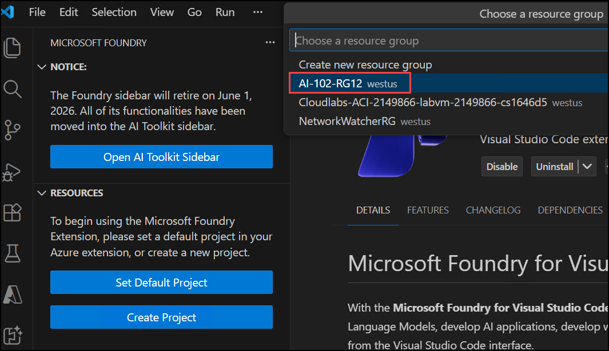

1. In the **Enter project name** dialog, enter **Myproject<inject key="DeploymentID" enableCopy="false"/>**, and then press **Enter** to confirm.

   

1. Wait for the project deployment to complete. A popup will appear with the message "Project deployed successfully."

    

## Task 3: Deploy a model

In this task, you'll deploy the gpt-4.1 model (or an equivalent) in your Foundry project, making it available for your agent to process prompts and generate intelligent responses.

1. In the **RESOURCES** pane, select **Models**, and then select the **+** icon to add a new model deployment.

   

   > **Tip:** You can also access the Model Catalog pressing **F1** and running the command **Microsoft Foundry: Open Model Catalog**.

1. In the Model Catalog, scroll down, search for **gpt-4.1 (1)** in the search bar, and then select **Deploy (2)** under **OpenAI GPT-4.1**.

   

1. Configure the deployment settings:
   
    - **Deployment name:** Enter a name like **gpt-4.1 (1)**
    - **Deployment type:** Select **Global Standard** (or **Standard** if Global Standard is not available) **(2)**
    - **Model version:** Leave as default
    - **Tokens per minute:** `50K` **(3)**
    - Select **Deploy in Microsoft Foundry (4)** in the bottom-left corner.

        

1. If the confirmation dialog appears, select **Deploy** to deploy the model.

1. Wait for the deployment to complete. Your deployed model will appear under the **Models** section in the Resources view.

    

1. In the VS Code Activity Bar, under the **Resources** section expand and right-click your project **Myproject (2)**, and choose **Copy Project Endpoint (3)** to copy the endpoint.

    

    > **Note:** Copy and save the **Project endpoint** in a notepad, as it will be required in upcoming task.

> **Congratulations** on completing the task! Now, it's time to validate it. Here are the steps:
>
> - Hit the Validate button for the corresponding task. If you receive a success message, you can proceed to the next task.
> - If not, carefully read the error message and retry the step, following the instructions in the lab guide.
> - If you need any assistance, please contact us at cloudlabs-support@spektrasystems.com. We are available 24/7 to help.
 
<validation step="5067f59b-415f-4007-9926-ff36dcc942d8" />

## Task 4: Clone the starter code repository

In this task, you'll clone the provided GitHub repository, set up a Python virtual environment, install required dependencies, and configure environment variables to prepare your local development setup.

1. Navigate to the **Welcome** page in VS Code by selecting the ellipsis **(...) (1)** from the top bar, then **Help (2)**, and finally **Welcome (3)**.

    

1. On the **Get Started** page, select **Mark Done (1)** to complete this step and proceed.

    

1. Select **Clone Git Repository... (1)**, paste the repository URL **(2)** `https://github.com/MicrosoftLearning/mslearn-ai-agents.git`, and then choose **Clone from URL (3)** to proceed.

    

1. Select the destination folder **C:\LabFiles (1)** and click **Select as Repository Destination (2)** to proceed.

    

1. When prompted, select **Open (1)** to open the cloned repository.

    

1. In the trust prompt, select **Yes, I trust the authors (1)** to continue.

    

1. In the Explorer view, navigate to the **Labfiles (1)** and then select **05-agent-orchestration/Python (2)** folder to find the starter code for this exercise.

    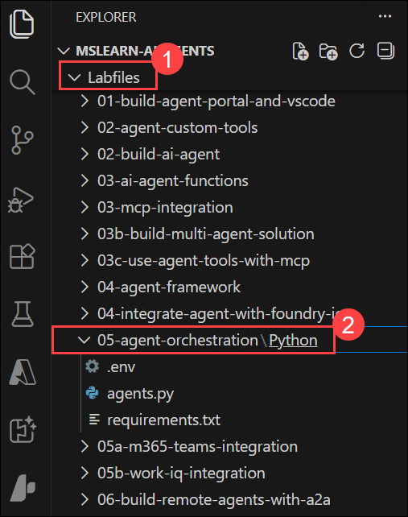

1. Right-click on the **requirements.txt (1)** file and select **Open in Integrated Terminal (2)**.

    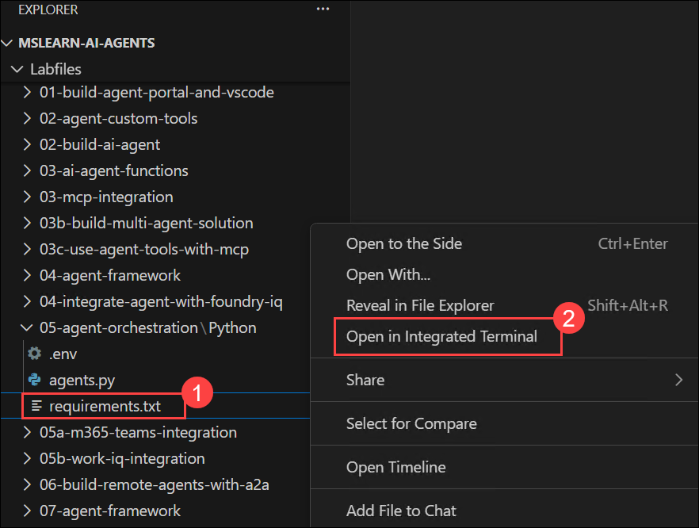

1. In the terminal, enter the following command to install the required Python packages in a virtual environment:

    ```
    python -m venv labenv
    .\labenv\Scripts\Activate.ps1
    pip install -r requirements.txt
    ```

1. From the left navigation menu, under **05-agent-orchestration/Python** folder, open the **.env (1)** file. Paste the copied project endpoint into the **PROJECT_ENDPOINT (2)** field, and verify that the **MODEL_DEPLOYMENT_NAME (3)** is set to `gpt-4.1` (or the name of your deployed model). Once done, press **Ctrl+S** to save the changes.

    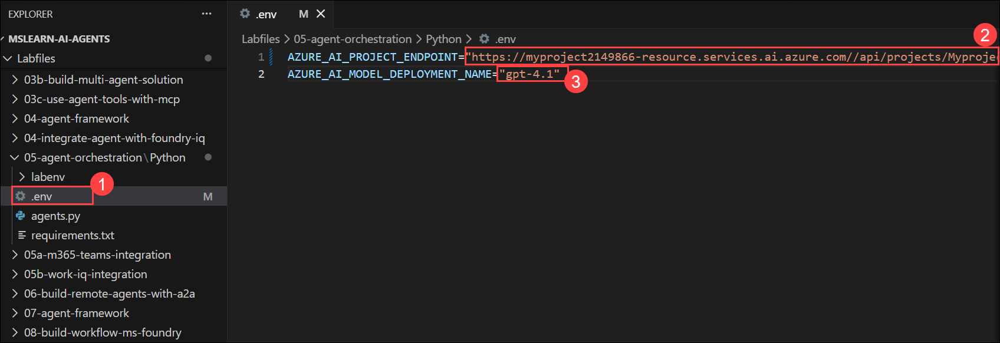

## Task 5: Create AI agents

In this task, you'll configure and initialize multiple AI agents with specific roles using the Microsoft Agent Framework SDK for use in the orchestration workflow.

1. Open the **agents.py** file in the code editor.

    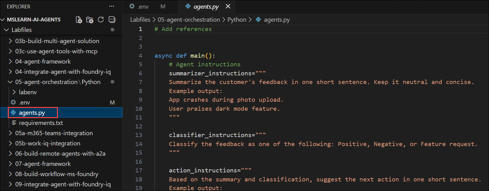

1. At the top of the file under the comment **Add references**, and add the following code to reference the namespaces in the libraries you'll need to implement your agent:

    ```python
    # Add references
    import asyncio
    from typing import cast
    from dotenv import load_dotenv
    from agent_framework import Message
    from agent_framework.azure import AzureAIAgentClient
    from agent_framework.orchestrations import SequentialBuilder
    from azure.identity import AzureCliCredential

    load_dotenv()
    ```

     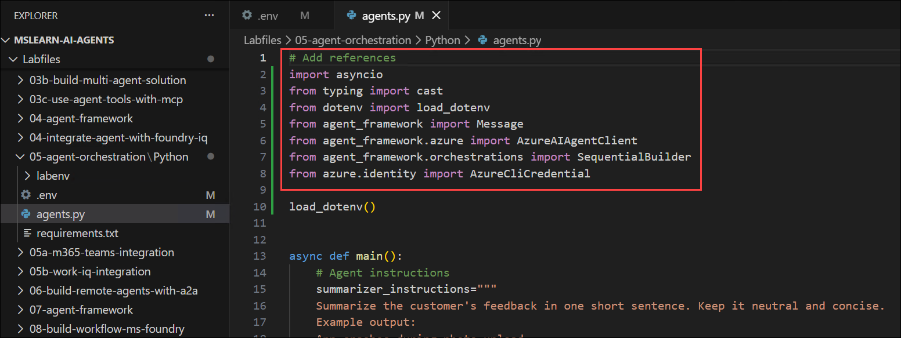

1. In the **main** function, take a moment to review the agent instructions. These instructions define the behavior of each agent in the orchestration.

1. Add the following code under the comment **Create the chat client**:

    ```python
    # Create the chat client
    credential = AzureCliCredential()
    async with (
        AzureAIAgentClient(credential=credential) as chat_client,
    ):
    ```

     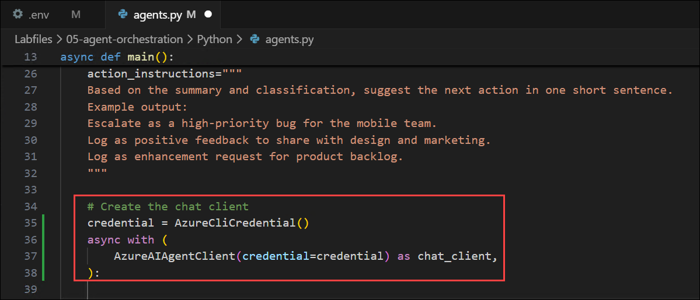

     Note that the **AzureCliCredential** object will allow your code to authenticate to your Azure account. The **AzureAIAgentClient** object will automatically include the Foundry project settings from the .env configuration.

1. Add the following code under the comment **Create agents**:

    (Be sure to maintain the indentation level)

    ```python
    # Create agents
    summarizer = chat_client.as_agent(
        instructions=summarizer_instructions,
        name="summarizer",
    )

    classifier = chat_client.as_agent(
        instructions=classifier_instructions,
        name="classifier",
    )

    action = chat_client.as_agent(
        instructions=action_instructions,
        name="action",
    )
    ```

     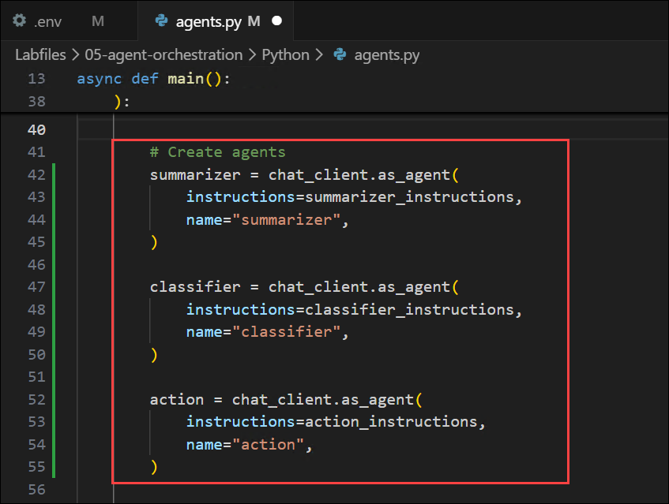

## Task 6: Create a sequential orchestration

In this task, you'll build a sequential orchestration by combining multiple agents into a workflow. You will run the orchestration and capture outputs generated by each agent in sequence.

1. In the **main** function, find the comment **Initialize the current feedback** and add the following code:

    (Be sure to maintain the indentation level)

    ```python
    # Initialize the current feedback
    feedback="""
    I use the dashboard every day to monitor metrics, and it works well overall. 
    But when I'm working late at night, the bright screen is really harsh on my eyes. 
    If you added a dark mode option, it would make the experience much more comfortable.
    """
    ```

     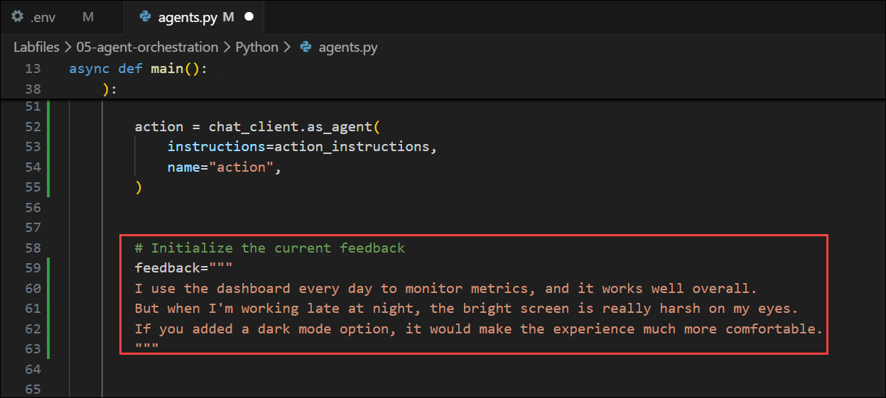

1. Under the comment **Build a sequential orchestration**, add the following code to define a sequential orchestration with the agents you defined:

    ```python
   # Build sequential orchestration
   workflow = SequentialBuilder(participants=[summarizer, classifier, action]).build()
    ```

    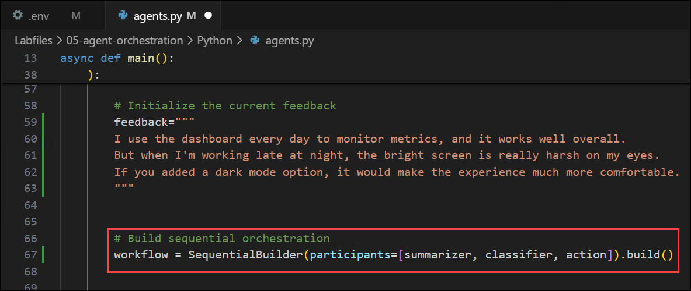

    - The agents will process the feedback in the order they are added to the orchestration.

1. Add the following code under the comment **Run and collect outputs**:

    ```python
   # Run and collect outputs
   outputs: list[list[Message]] = []
   async for event in workflow.run(f"Customer feedback: {feedback}", stream=True):
       if event.type == "output":
           outputs.append(cast(list[Message], event.data))
    ```

    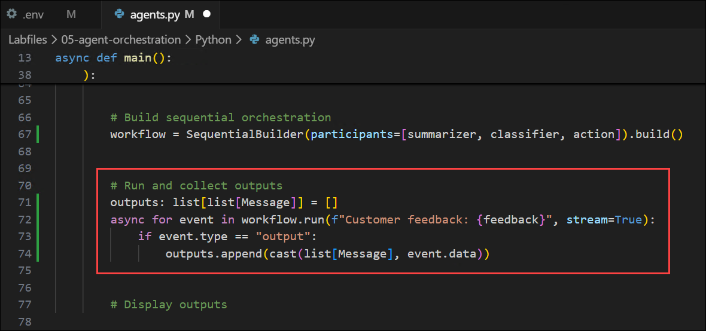

    This code runs the orchestration and collects the output from each of the participating agents.

1. Add the following code under the comment **Display outputs**:

    ```python
   # Display outputs
   if outputs:
       for i, msg in enumerate(outputs[-1], start=1):
           name = msg.author_name or ("assistant" if msg.role == "assistant" else "user")
           print(f"{'-' * 60}\n{i:02d} [{name}]\n{msg.text}")
    ```

    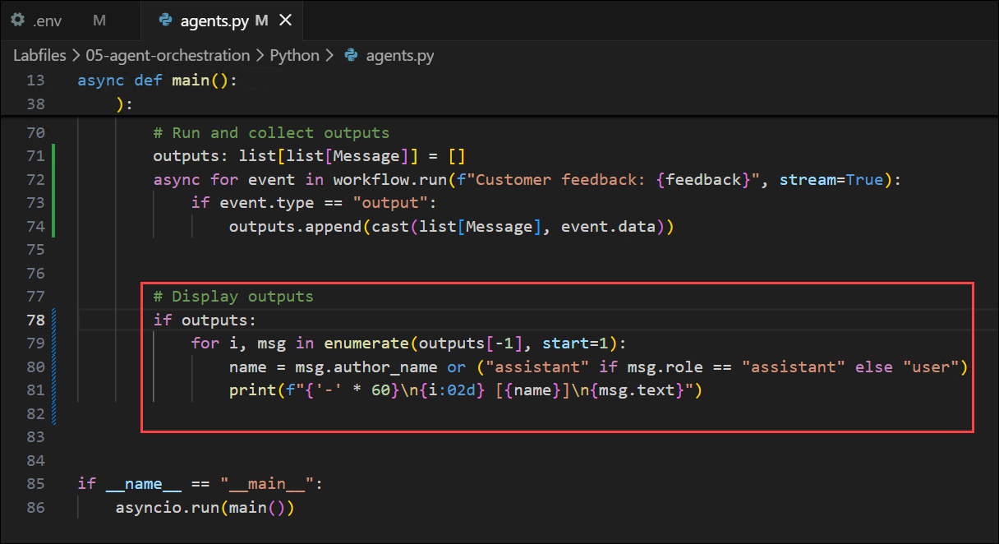

    This code formats and displays the messages from the workflow outputs you collected from the orchestration.

1. Use the **CTRL+S** command to save your changes to the code file.

## Task 7: Run the app

In this task, you'll execute the Python application and provide input to the multi-agent system. You will validate how the agents collaborate and generate structured responses.

1. In the terminal, run `az login` to initiate the Azure sign-in process.

    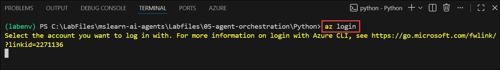

    >**Note:** If you have closed the terminal, right-click on the **05-agent-orchestration\Python** folder and select **Open in Integrated Terminal**. Then run the command `.\labenv\Scripts\Activate.ps1` to activate the virtual environment before proceeding.

1. In the sign-in window, select your account **<inject key="AzureAdUserEmail"></inject> (1)** and click **Continue (2)** to proceed with authentication.

    

1. After successful sign-in, wait for the subscriptions to load and press **Enter** to select the only available subscription.

    

1. In the integrated terminal, enter the following command to run the application:

    ```
   python agents.py
    ```

1. You should see some output similar to the following:

    ```output
    ------------------------------------------------------------
    01 [user]
    Customer feedback:
        I use the dashboard every day to monitor metrics, and it works well overall.
        But when I'm working late at night, the bright screen is really harsh on my eyes.
        If you added a dark mode option, it would make the experience much more comfortable.

    ------------------------------------------------------------
    02 [summarizer]
    User requests a dark mode for better nighttime usability.
    ------------------------------------------------------------
    03 [classifier]
    Feature request
    ------------------------------------------------------------
    04 [action]
    Log as enhancement request for product backlog.
    ```

    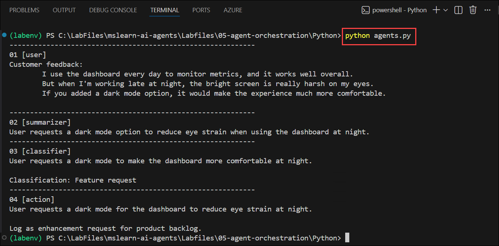

1. Optionally, you can try running the code using different feedback inputs, such as:

    ```output
    I use the dashboard every day to monitor metrics, and it works well overall. But when I'm working late at night, the bright screen is really harsh on my eyes. If you added a dark mode option, it would make the experience much more comfortable.
    ```

    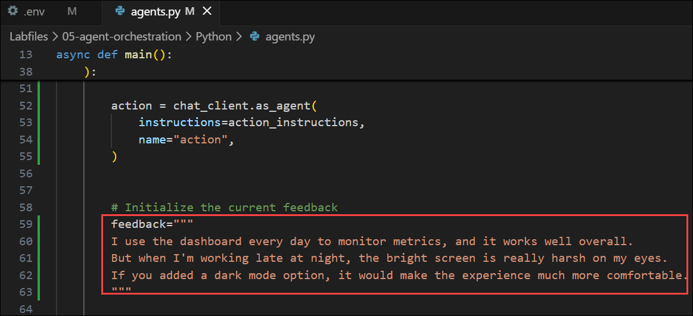

    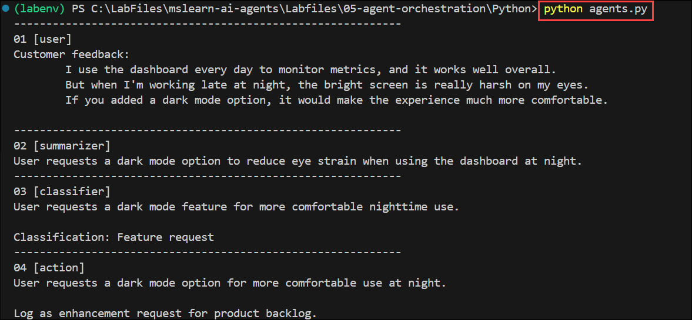

1. You can also try running the code using the task inputs given below:

    ```output
    I reached out to your customer support yesterday because I couldn't access my account. The representative responded almost immediately, was polite and professional, and fixed the issue within minutes. Honestly, it was one of the best support experiences I've ever had.
    ```

1. When you're finished, enter `deactivate` in the terminal to exit the Python virtual environment.

## Summary

In this lab, you created and configured a multi-agent solution using the Microsoft Agent Framework SDK in an Microsoft Foundry project. You defined multiple specialized agents and combined them using a sequential orchestration workflow. Finally, you ran and tested the application to observe how the agents collaborate to process input and generate structured outputs.

## You have successfully completed the Hands-on Lab!