# Lab 09 Connect to remote agents with A2A protocol
   
### Estimated Duration: 45 Minutes

## Overview

In this lab, you'll use Azure AI Agent Service with the A2A protocol to create remote agents that communicate with each other. You will build a title agent to generate article headlines and an outline agent to create structured outlines from the titles. A routing agent will orchestrate communication between them, allowing you to test multi-agent collaboration through a client application.

> **Tip:** The code used in this exercise is based on the for Microsoft Foundry SDK for Python. You can develop similar solutions using the SDKs for Microsoft .NET, JavaScript, and Java. Refer to [Microsoft Foundry SDK client libraries](https://learn.microsoft.com/azure/ai-foundry/how-to/develop/sdk-overview) for details.

> **Note:** Some of the technologies used in this exercise are in preview or in active development. You may experience some unexpected behavior, warnings, or errors.

## Lab Objectives

- **Task 1:** Create an A2A application

## Task 1: Create an A2A application

Now you're ready to create a client app that uses an agent. Some code has been provided for you in a GitHub repository.

### Task 1.1: Clone the repo containing the application code

In this task, you will set up a client application by cloning the provided GitHub repository containing the code for the title, outline, and routing agents, and prepare the environment for running the multi-agent A2A application.

1. In the **Azure portal**, select the **Cloud Shell** icon in the top navigation bar to open a new Cloud Shell session.

    

1. In the Cloud Shell toolbar, open the **Settings (1)** menu and choose **Go to Classic version (2)** from the drop-down.

    

    >**Note:** **Ensure you've switched to the classic version of the cloud shell before continuing.**

1. In the cloud shell pane, enter the following commands to clone the GitHub repo containing the code files for this exercise (type the command, or copy it to the clipboard and then right-click in the command line and paste as plain text):

    ```
   rm -r ai-agents -f
   git clone https://github.com/MicrosoftLearning/mslearn-ai-agents ai-agents
    ```

    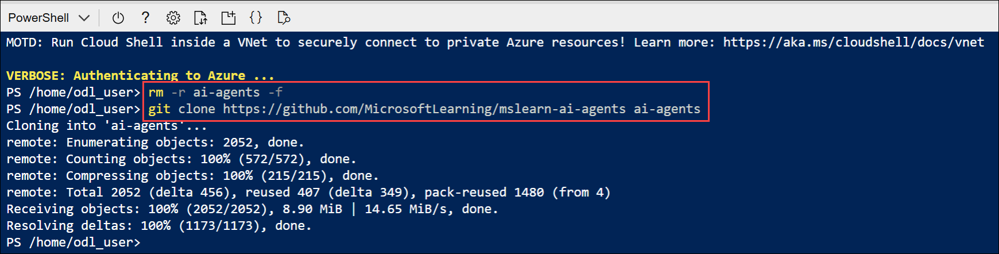

    > **Tip:** As you enter commands into the cloudshell, the output may take up a large amount of the screen buffer and the cursor on the current line may be obscured. You can clear the screen by entering the `cls` command to make it easier to focus on each task.

1. Enter the following command to change the working directory to the folder containing the code files and list them all.

    ```
   cd ai-agents/Labfiles/06-build-remote-agents-with-a2a/python
   ls -a -l
    ```

    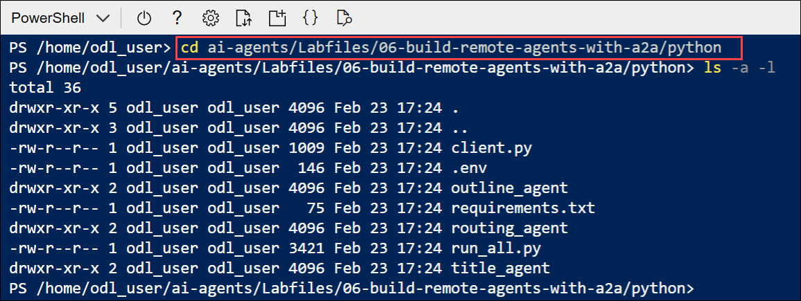

    The provided files include:
    
    ```output
    python
    ├── outline_agent/
    │   ├── agent.py
    │   ├── agent_executor.py
    │   └── server.py
    ├── routing_agent/
    │   ├── agent.py
    │   └── server.py
    ├── title_agent/
    │   ├── agent.py
    |   ├── agent_executor.py
    │   └── server.py
    ├── client.py
    └── run_all.py
    ```

    - Each agent folder contains the Azure AI agent code and a server to host the agent. The **routing agen**t is responsible for discovering and communicating with the **title** and **outline** agents. The **client** allows users to submit prompts to the routing agent. `run_all.py` launches all the servers and runs the client.

### Task 1.2: Configure the application settings

In this task, you will configure the application by installing required libraries and updating the .env file with your Foundry project endpoint and model deployment details.

1. In the cloud shell command-line pane, enter the following command to install the libraries you'll use:

    ```
   python -m venv labenv
   ./labenv/bin/Activate.ps1
   pip install -r requirements.txt azure-ai-projects azure-ai-agents a2a-sdk
    ```
    > **Tip:** As you enter commands into the cloudshell, the output may take up a large amount of the screen buffer and the cursor on the current line may be obscured. You can clear the screen by entering the `cls` command to make it easier to focus on each task.

1. Enter the following command to edit the configuration file that has been provided:

    ```
   code .env
    ```

    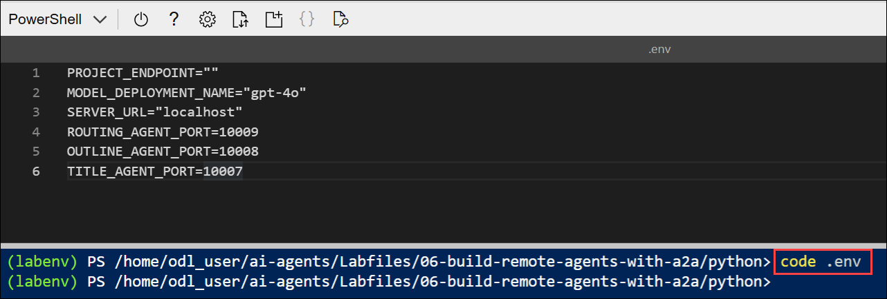

    - The file is opened in a code editor.

1. In the code file, replace the placeholder values with the correct details for your project:

    * PROJECT\_ENDPOINT : **Microsoft Foundry project endpoint (1)**
    * MODEL\_DEPLOYEMNT\_NAME : **gpt-4.1 (2)**

    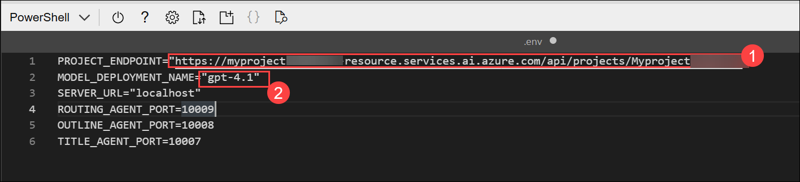

    > **Note:** Paste the project endpoint you copied in the previous task.

1. After you've replaced the placeholder, use the **CTRL+S** command to save your changes and then use the **CTRL+Q** command to close the code editor while keeping the cloud shell command line open.

### Task 1.3: Create a discoverable agent

In this task, you create the title agent that helps writers create trendy headlines for their articles. You also define the agent's skills and card required by the A2A protocol to make the agent discoverable.

> **Tip:** As you add code, be sure to maintain the correct indentation. Use the comment indentation levels as a guide.

1. Navigate to the `title_agent` directory:

    ```
   cd title_agent
    ```

1. Enter the following command to edit the code file that has been provided:

    ```
   code agent.py
    ```

    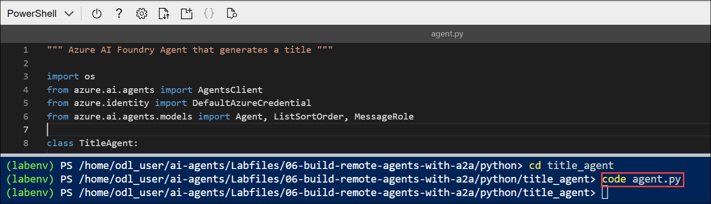

1. Find the comment **Create the agents client** and add the following code to connect to the Azure AI project:

    > **Tip:** Be careful to maintain the correct indentation level.

    ```python
   # Create the agents client
   self.client = AgentsClient(
       endpoint=os.environ['PROJECT_ENDPOINT'],
       credential=DefaultAzureCredential(
           exclude_environment_credential=True,
           exclude_managed_identity_credential=True
       )
   )
    ```

    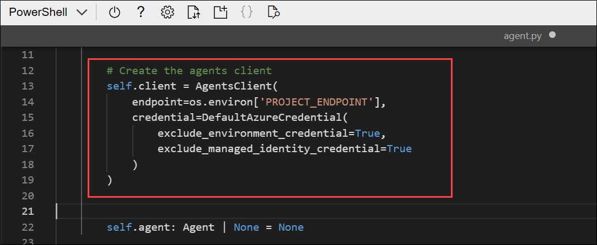

1. Find the comment **Create the title agent** and add the following code to create the agent:

    ```python
   # Create the title agent
   self.agent = self.client.create_agent(
       model=os.environ['MODEL_DEPLOYMENT_NAME'],
       name='title-agent',
       instructions="""
       You are a helpful writing assistant.
       Given a topic the user wants to write about, suggest a single clear and catchy blog post title.
       """,
   )
    ```

    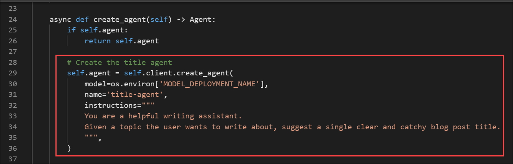

1. Find the comment **Create a thread for the chat session** and add the following code to create the chat thread:

    ```python
   # Create a thread for the chat session
   thread = self.client.threads.create()
    ```

1. Locate the comment **Send user message** and add this code to submit the user's prompt:

    ```python
   # Send user message
   self.client.messages.create(thread_id=thread.id, role=MessageRole.USER, content=user_message)
    ```

1. Under the comment **Create and run the agent**, add the following code to initiate the agent's response generation:

    ```python
   # Create and run the agent
   run = self.client.runs.create_and_process(thread_id=thread.id, agent_id=self.agent.id)
    ```

    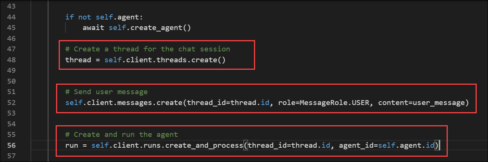

    - The code provided in the rest of the file will process and return the agent's response. 

1. Save the code file **CTRL+S**. Now you're ready to share the agent's skills and card with the A2A protocol. 

1. Enter the following command to edit the title agent's `server.py` file  

    ```
   code server.py
    ```

    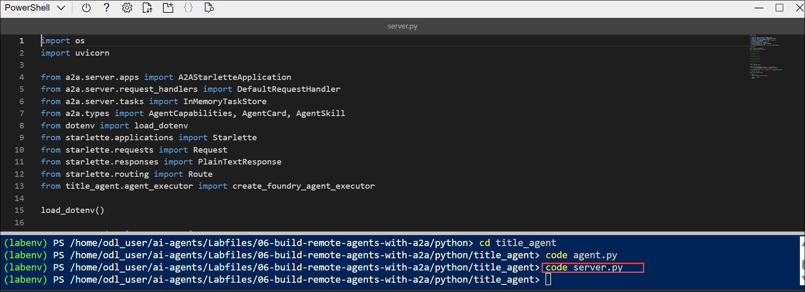

1. Find the comment **Define agent skills** and add the following code to specify the agent’s functionality:

    ```python
   # Define agent skills
   skills = [
       AgentSkill(
           id='generate_blog_title',
           name='Generate Blog Title',
           description='Generates a blog title based on a topic',
           tags=['title'],
           examples=[
               'Can you give me a title for this article?',
           ],
       ),
   ]
    ```

    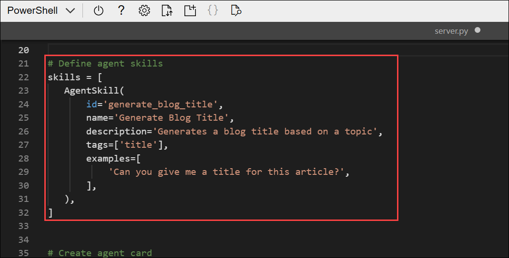

1. Find the comment **Create agent card** and add this code to define the metadata that makes the agent discoverable:

    ```python
   # Create agent card
   agent_card = AgentCard(
       name='AI Foundry Title Agent',
       description='An intelligent title generator agent powered by Foundry. '
       'I can help you generate catchy titles for your articles.',
       url=f'http://{host}:{port}/',
       version='1.0.0',
       default_input_modes=['text'],
       default_output_modes=['text'],
       capabilities=AgentCapabilities(),
       skills=skills,
   )
    ```

    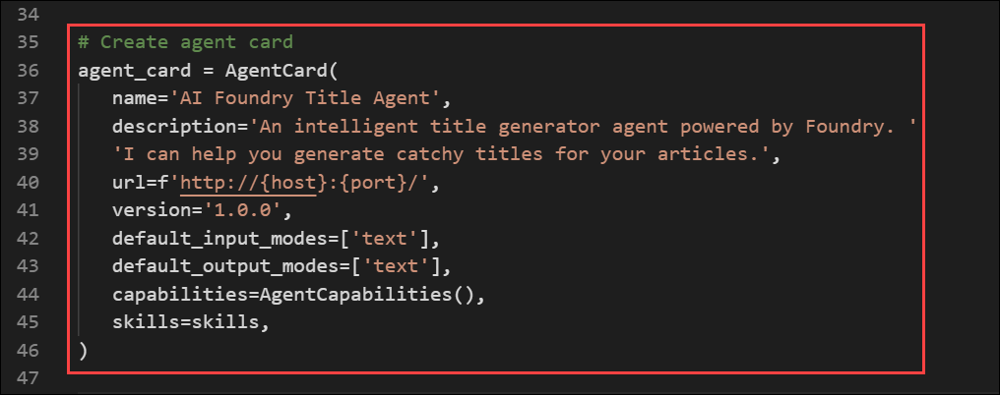

1. Locate the comment **Create agent executor** and add the following code to initialize the agent executor using the agent card:

    ```python
   # Create agent executor
   agent_executor = create_foundry_agent_executor(agent_card)
    ```

    - The agent executor will act as a wrapper for the title agent you created.

1. Find the comment **Create request handler** and add the following to handle incoming requests using the executor:

    ```python
   # Create request handler
   request_handler = DefaultRequestHandler(
       agent_executor=agent_executor, task_store=InMemoryTaskStore()
   )
    ```

1. Under the comment **Create A2A application**, add this code to create the A2A-compatible application instance:

    ```python
   # Create A2A application
   a2a_app = A2AStarletteApplication(
       agent_card=agent_card, http_handler=request_handler
   )
    ```
    
    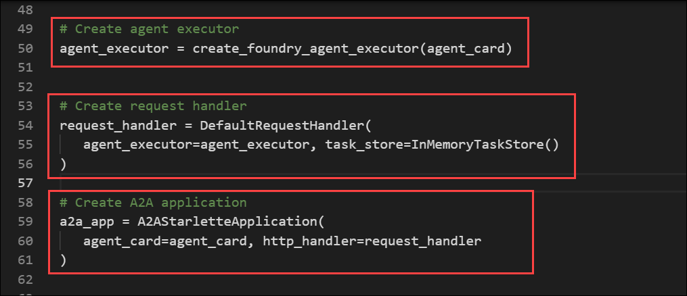

    - This code creates an A2A server that will share the title agent's information and handle incoming requests for this agent using the title agent executor.

1. Save the code file **CTRL+S** when you have finished.

### Task 1.4: Enable messages between the agents

In this task, you use the A2A protocol to enable the routing agent to send messages to the other agents. You also allow the title agent to receive messages by implementing the agent executor class.

> **Tip:** As you add code, be sure to maintain the correct indentation. Use the comment indentation levels as a guide.

1. Navigate to the `routing_agent` directory:

    ```
   cd ../routing_agent
    ```

1. Enter the following command to edit the code file that has been provided:

    ```
   code agent.py
    ```

    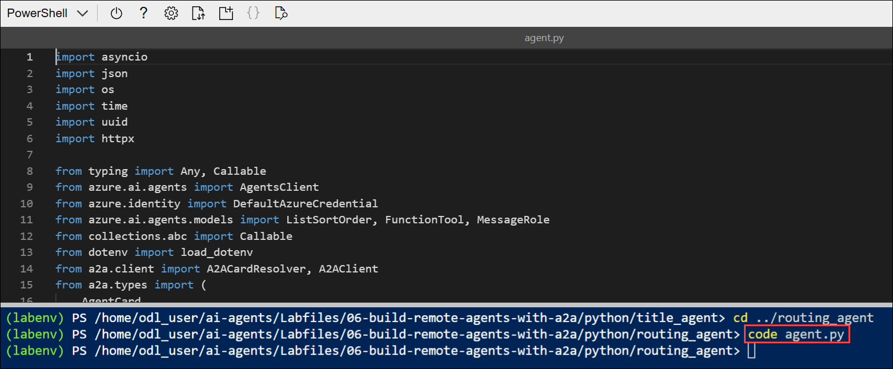

    The routing agent acts as an orchestrator that handles user messages and determines which remote agent should process the request.

    When a user message is received, the routing agent:
    - Starts a conversation thread.
    - Uses the `create_and_process` method to evaluate the best-matching agent for the user's message.
    - The message is routed to the appropriate agent over HTTP using the `send_message` function.
    - The remote agent processes the message and returns a response.

    The routing agent finally captures the response and returns it to the user through the thread.

    Notice that the `send_message` method is async and must be awaited for the agent run to complete successfully.

1. Add the following code under the comment **Retrieve the remote agent's A2A client using the agent name**:

    ```python
   # Retrieve the remote agent's A2A client using the agent name 
   client = self.remote_agent_connections[agent_name]
    ```

    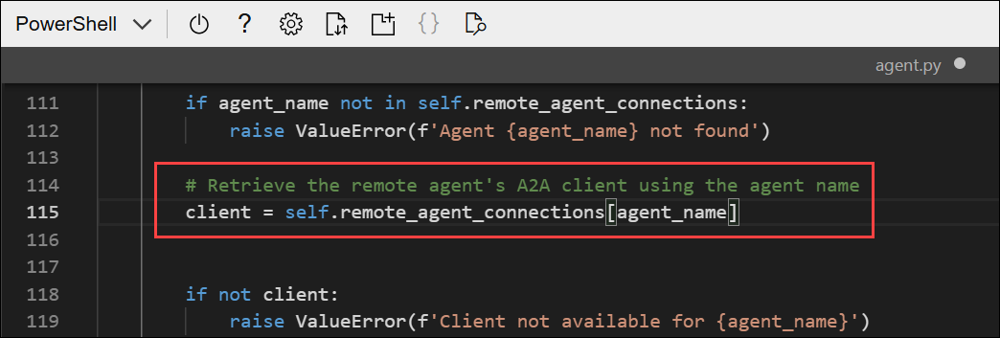

1. Locate the comment **Construct the payload to send to the remote agent** and add the following code:

    ```python
   # Construct the payload to send to the remote agent
   payload: dict[str, Any] = {
       'message': {
           'role': 'user',
           'parts': [{'kind': 'text', 'text': task}],
           'messageId': message_id,
       },
   }
    ```

    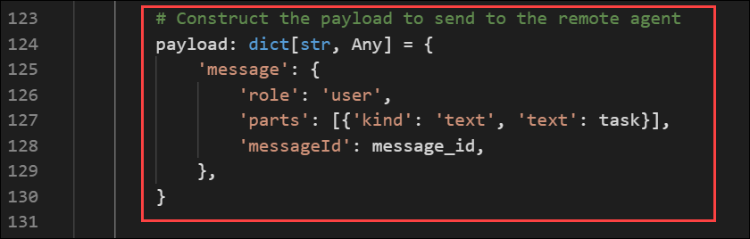

1. Find the comment **Wrap the payload in a SendMessageRequest object** and add the following code:

    ```python
   # Wrap the payload in a SendMessageRequest object
   message_request = SendMessageRequest(id=message_id, params=MessageSendParams.model_validate(payload))
    ```

1. Add the following code under the comment **Send the message to the remote agent client and await the response**:

    ```python
   # Send the message to the remote agent client and await the response
   send_response: SendMessageResponse = await client.send_message(message_request=message_request)
    ```

    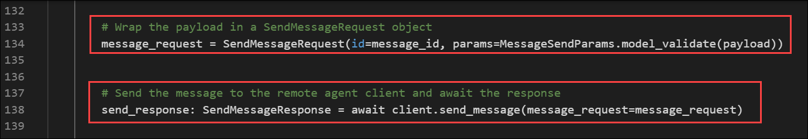

1. Save the code file **CTRL+S** when you have finished. Now the routing agent is able to discover and send messages to the title agent. Let's create the agent executor code to handle those incoming messages from the routing agent.

1. Navigate to the `title_agent` directory:

    ```
   cd ../title_agent
    ```

1. Enter the following command to edit the code file that has been provided:

    ```
   code agent_executor.py
    ```

    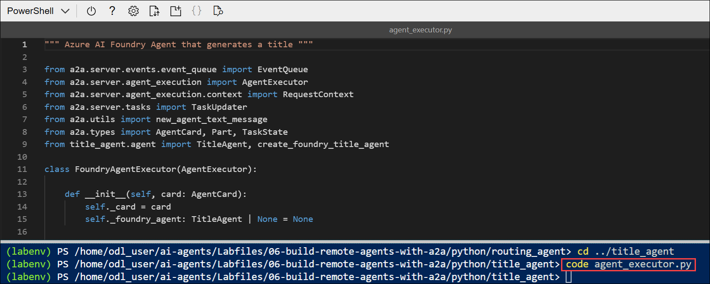

    - The `AgentExecutor` class implemenation must contain the methods `execute` and `cancel`. The cancel method has been provided for you. The `execute` method includes a `TaskUpdater` object that manages events and signals to the caller when the task is complete. Let's add the logic for task execution.

1. In the `execute` method, add the following code under the comment **Process the request**:

    ```python
   # Process the request
   await self._process_request(context.message.parts, context.context_id, updater)
    ```

    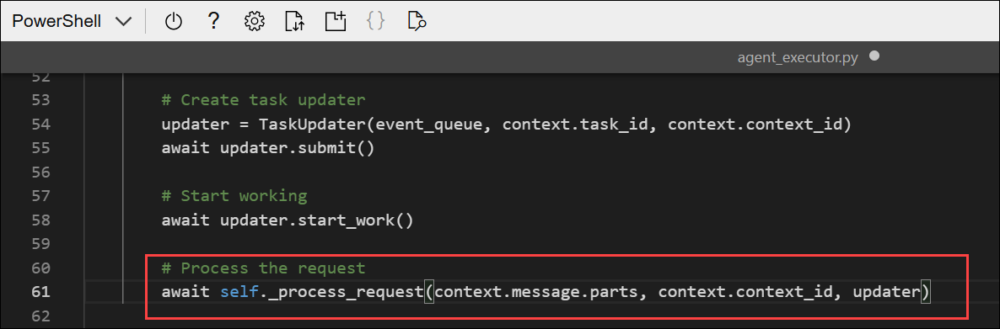

1. In the `_process_request` method, add the following code under the comment **Get the title agent**:

    ```python
   # Get the title agent
   agent = await self._get_or_create_agent()
    ```

1. Add the following code under the comment **Update the task status**:

    ```python
   # Update the task status
   await task_updater.update_status(
       TaskState.working,
       message=new_agent_text_message('Title Agent is processing your request...', context_id=context_id),
   )
    ```

    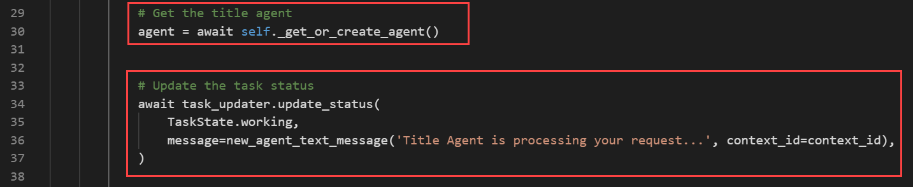

1. Find the comment **Run the agent conversation** and add the following code:

    ```python
   # Run the agent conversation
   responses = await agent.run_conversation(user_message)
    ```

1. Find the comment **Update the task with the responses** and add the following code:

    ```python
   # Update the task with the responses
   for response in responses:
       await task_updater.update_status(
           TaskState.working,
           message=new_agent_text_message(response, context_id=context_id),
       )
    ```

    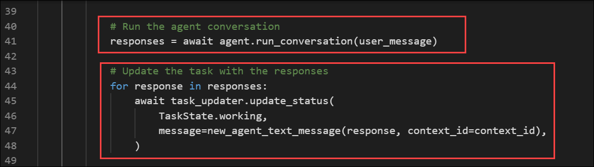

1. Find the comment **Mark the task as complete** and add the following code:

    ```python
   # Mark the task as complete
   final_message = responses[-1] if responses else 'Task completed.'
   await task_updater.complete(
       message=new_agent_text_message(final_message, context_id=context_id)
   )
    ```

    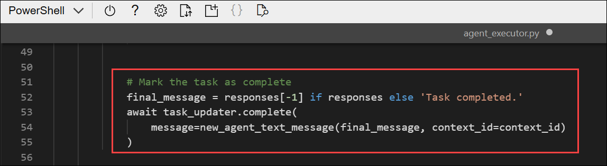

    - Now your title agent has been wrapped with an agent executor that the A2A protocol will use to handle messages. Great work!

### Task 1.5: Sign into Azure and run the app

In this task, you will run the multi-agent application, and interact with the agents to generate outputs such as article titles and outlines.

1. In the Cloud Shell console, enter the following command to run the application:

    ```
    cd ..
    python run_all.py
    ```
    
    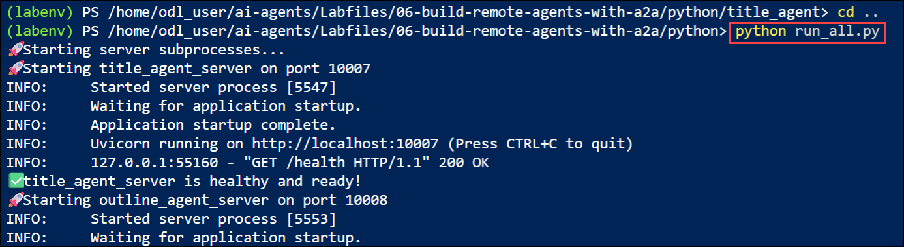

    - The application runs using the credentials for your authenticated Azure session to connect to your project and create and run the agent. You should see some output from each server as it starts.

1. Wait until the prompt for input appears, then enter a prompt such as:

    ```
   Create a title and outline for an article about React programming.
    ```

    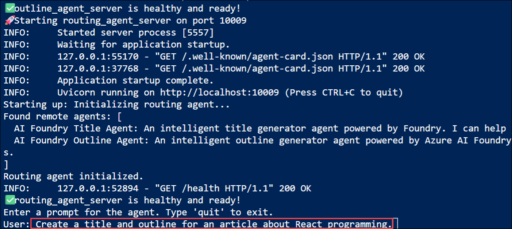

1. After a few moments, you should see a response from the agent with the results.

    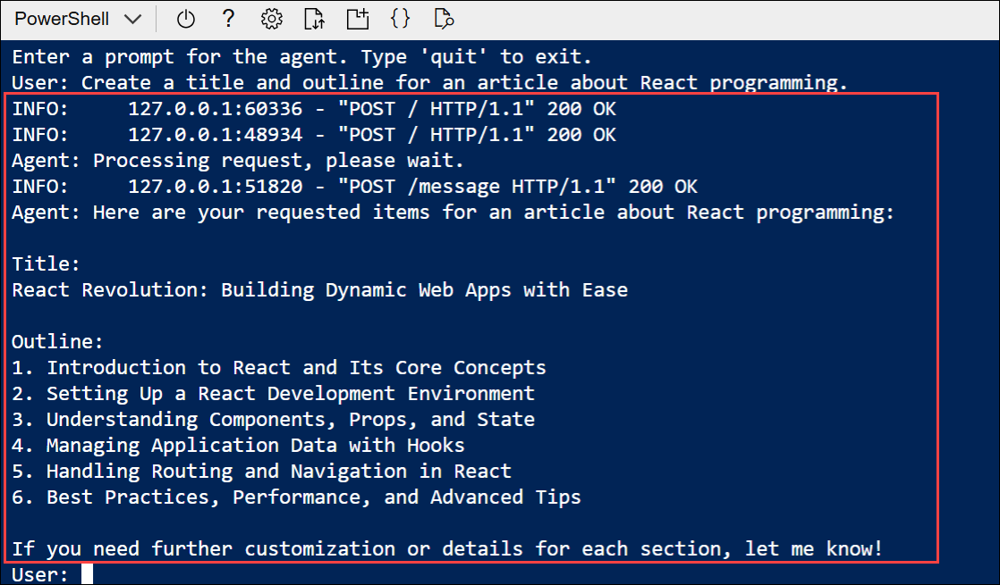

1. Enter `quit` to exit the program and stop the servers.
    
1. In the Cloud Shell window, select the **Close (X)** icon to exit Cloud Shell before proceeding to the next lab.

## Summary

In this lab, you used the Azure AI Agent Service with the A2A protocol to build a multi-agent Python application that enables remote agents to communicate. You created a title agent, an outline agent, and a routing agent to orchestrate messages and process user prompts. Finally, you ran the application to generate article titles and structured outlines through coordinated agent collaboration.

### You have successfully completed the lab. Click on **Next >>** to proceed with the next Lab.

   