# Lab 09 Connect to remote agents with A2A protocol

### Estimated Duration: 60 Minutes

## Lab Objectives

- **Task 1:** Install the Microsoft Foundry VS Code extension

- **Task 2:** Sign in to Azure and create a project

- **Task 3:** Deploy a model

- **Task 4:** Clone the starter code repository

- **Task 5:** Create an A2A application

- **Task 6:** Run the application

## Overview

In this lab, you will build a multi-agent application using the Azure AI Agent Service and the Agent-to-Agent (A2A) protocol in Microsoft Foundry. You will create and configure multiple agents, including a routing agent and remote agents, and enable communication between them using A2A messaging. You will define agent skills, implement an agent executor, and make agents discoverable through agent cards. Finally, you will run and validate the application to ensure agents collaborate effectively to process user requests.

## Task 1: Install the Microsoft Foundry VS Code extension

In this task, you'll install and verify the Microsoft Foundry extension in Visual Studio Code, enabling you to create, manage, and interact with Azure AI projects and agents directly within the VS Code environment.

1. Open the **Visual Studio Code** from the desktop.

    

1. In Visual Studio Code, select **Extensions (1)** from the left pane, search for **Microsoft Foundry (2)**, choose the **Microsoft Foundry (3)** extension by Microsoft, and then click **Install (4)**.

   

1. After installation is complete, verify the extension appears in the primary navigation bar on the left side of Visual Studio Code.

   

   > **Note:** If you already have the extension installed, make sure the version is at least **v0.16.0** to follow along with the instructions in this exercise.

## Task 2: Sign in to Azure and create a project

In this task, you'll authenticate with your Azure account and create a new Microsoft Foundry project, which will serve as the workspace for deploying models and building AI-powered agent solutions.

1. In the VS Code sidebar, select the **Microsoft Foundry (1)** extension icon.

1. In the Resources view, choose **Create Project (2)**, and when prompted, select **Sign in to Azure (3)** to authenticate.

   

1. In the **Azure Resources wants to sign in using Microsoft** dialog, select **Allow**.

   

1. On the **Sign in** page, provide the credentials below:
 
   - **Email/Username:** <inject key="AzureAdUserEmail"></inject>
    
     

   - **Password:** <inject key="AzureAdUserPassword"></inject>
    
     

1. On the **Sign in to all apps, websites, and services on this device?** page, select **Yes**.

   

1. On the **Account added to this device** page, select **Done**.

   

1. In the **Choose a resource group** dialog, select **AI-102-RG13** from the list.

   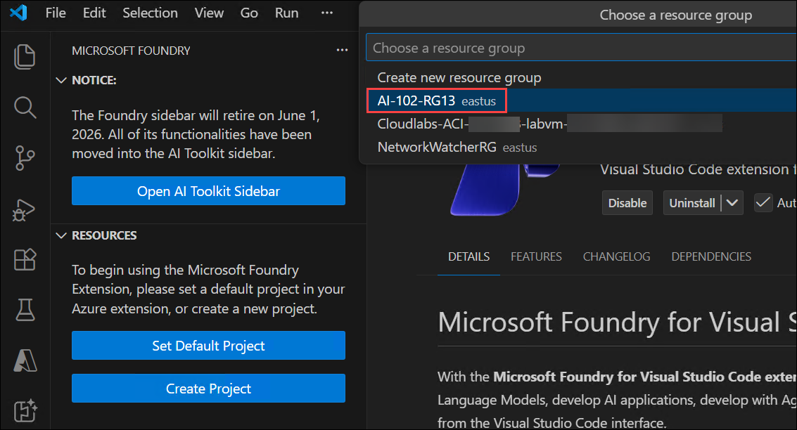

1. In the **Enter project name** dialog, enter **Myproject<inject key="DeploymentID" enableCopy="false"/>**, and then press **Enter** to confirm.

   

1. Wait for the project deployment to complete. A popup will appear with the message "Project deployed successfully."

    

## Task 3: Deploy a model

In this task, you'll deploy the gpt-4.1 model (or an equivalent) in your Foundry project, making it available for your agent to process prompts and generate intelligent responses.

1. In the **RESOURCES** pane, select **Models**, and then select the **+** icon to add a new model deployment.

   

   > **Tip:** You can also access the Model Catalog pressing **F1** and running the command **Microsoft Foundry: Open Model Catalog**.

1. In the Model Catalog, scroll down, search for **gpt-4.1 (1)** in the search bar, and then select **Deploy (2)** under **OpenAI GPT-4.1**.

   

1. Configure the deployment settings:
   
    - **Deployment name:** Enter a name like **gpt-4.1 (1)**
    - **Deployment type:** Select **Global Standard** (or **Standard** if Global Standard is not available) **(2)**
    - **Model version:** Leave as default
    - **Tokens per minute:** `50K` **(3)**
    - Select **Deploy in Microsoft Foundry (4)** in the bottom-left corner.

        

1. If the confirmation dialog appears, select **Deploy** to deploy the model.

1. Wait for the deployment to complete. Your deployed model will appear under the **Models** section in the Resources view.

    

1. In the VS Code Activity Bar, under the **Resources** section expand and right-click your project **Myproject (2)**, and choose **Copy Project Endpoint (3)** to copy the endpoint.

    

    > **Note:** Copy and save the **Project endpoint** in a notepad, as it will be required in upcoming task.

> **Congratulations** on completing the task! Now, it's time to validate it. Here are the steps:
>
> - Hit the Validate button for the corresponding task. If you receive a success message, you can proceed to the next task.
> - If not, carefully read the error message and retry the step, following the instructions in the lab guide.
> - If you need any assistance, please contact us at cloudlabs-support@spektrasystems.com. We are available 24/7 to help.
 
<validation step="c1fb6715-624a-418f-b152-45427c8de4d8" />

## Task 4: Clone the starter code repository

In this task, you'll clone the provided GitHub repository, set up a Python virtual environment, install required dependencies, and configure environment variables to prepare your local development setup.

1. Navigate to the **Welcome** page in VS Code by selecting the ellipsis **(...) (1)** from the top bar, then **Help (2)**, and finally **Welcome (3)**.

    

1. On the **Get Started** page, select **Mark Done** to complete this step and proceed.

    

1. Select **Clone Git Repository... (1)**, paste the repository URL **(2)** `https://github.com/MicrosoftLearning/mslearn-ai-agents.git`, and then choose **Clone from URL (3)** to proceed.

    

1. Select the destination folder **C:\LabFiles (1)** and click **Select as Repository Destination (2)** to proceed.

    

1. When prompted, select **Open (1)** to open the cloned repository.

    

1. In the trust prompt, select **Yes, I trust the authors (1)** to continue.

    

1. In the Explorer view, navigate to the **Labfiles (1)** and then select **06-build-remote-agents-with-a2a/Python (2)** folder to find the starter code for this exercise.

    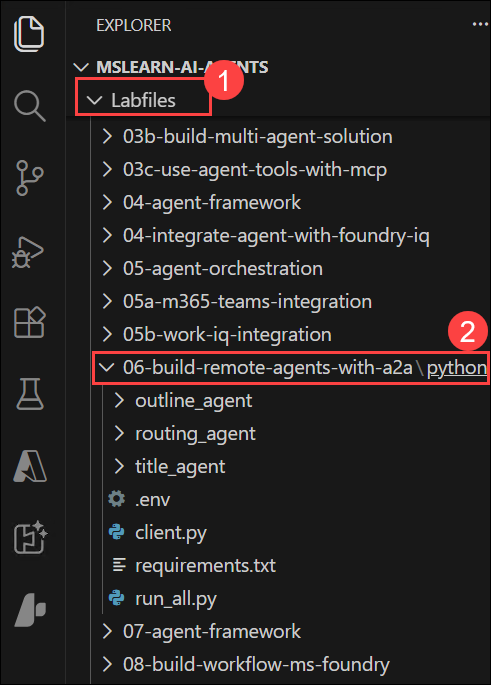

    The provided files include:

    ```output
    python
    ├── outline_agent/
    │   ├── agent.py
    │   ├── agent_executor.py
    │   └── server.py
    ├── routing_agent/
    │   ├── agent.py
    │   └── server.py
    ├── title_agent/
    │   ├── agent.py
    |   ├── agent_executor.py
    │   └── server.py
    ├── client.py
    └── run_all.py
    ```

    Each agent folder contains the Azure AI agent code and a server to host the agent. The **routing agent** is responsible for discovering and communicating with the **title** and **outline** agents. The **client** allows users to submit prompts to the routing agent. `run_all.py` launches all the servers and runs the client.

1. Right-click on the **requirements.txt (1)** file and select **Open in Integrated Terminal (2)**.

    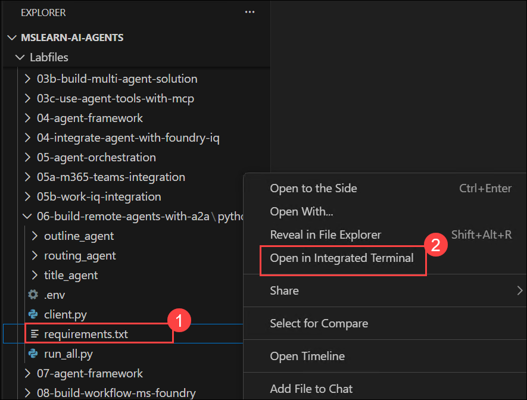

1. In the terminal, enter the following command to install the required Python packages in a virtual environment:

    ```
    python -m venv labenv
    .\labenv\Scripts\Activate.ps1
    pip install -r requirements.txt
    ```

1. From the left navigation menu, under **07-agent-framework/Python** folder, open the **.env (1)** file. Paste the copied project endpoint into the **PROJECT_ENDPOINT (2)** field, and verify that the **MODEL_DEPLOYMENT_NAME (3)** is set to `gpt-4.1` (or the name of your deployed model). Once done, press **Ctrl+S** to save the changes.

    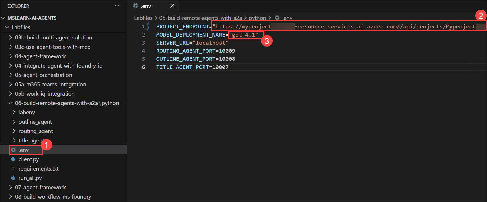

## Task 5: Create an A2A application

In this task, you will create an A2A-based application by developing a discoverable agent and defining its skills and agent card. You will also enable communication between agents by implementing message routing and processing using the A2A protocol.

### Task 5.1: Create a discoverable agent

In this task, you create the title agent that helps writers create trendy headlines for their articles. You also define the agent's skills and card required by the A2A protocol to make the agent discoverable.

> **Tip:** As you add code, be sure to maintain the correct indentation. Use the existing comments as a guide, entering the new code at the same level of indentation.

1. In the **Explorer**, expand **title_agent (1)** and select **agent.py (2)**.

    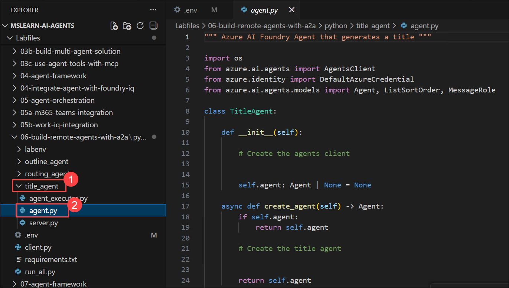

1. Find the comment **Create the agents client** and add the following code to connect to the Azure AI project:

    > **Tip:** Be careful to maintain the correct indentation level.

    ```python
   # Create the agents client
   self.client = AgentsClient(
       endpoint=os.environ['PROJECT_ENDPOINT'],
       credential=DefaultAzureCredential(
           exclude_environment_credential=True,
           exclude_managed_identity_credential=True
       )
   )
    ```

    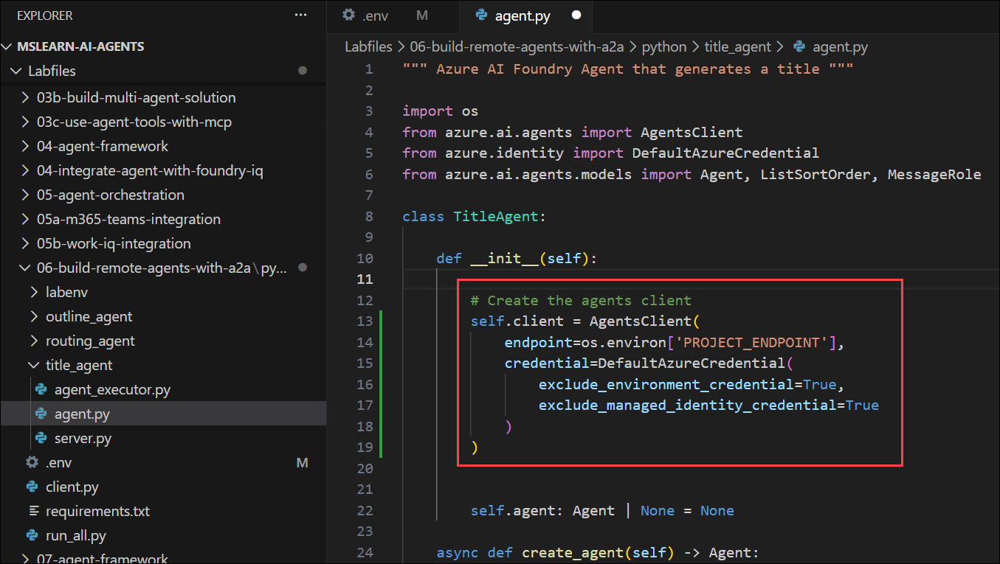

1. Find the comment **Create the title agent** and add the following code to create the agent:

    ```python
   # Create the title agent
   self.agent = self.client.create_agent(
       model=os.environ['MODEL_DEPLOYMENT_NAME'],
       name='title-agent',
       instructions="""
       You are a helpful writing assistant.
       Given a topic the user wants to write about, suggest a single clear and catchy blog post title.
       """,
   )
    ```

    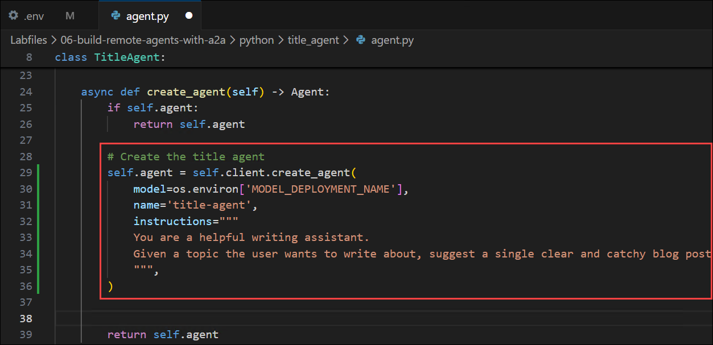

1. Find the comment **Create a thread for the chat session** and add the following code to create the chat thread:

    ```python
   # Create a thread for the chat session
   thread = self.client.threads.create()
    ```

    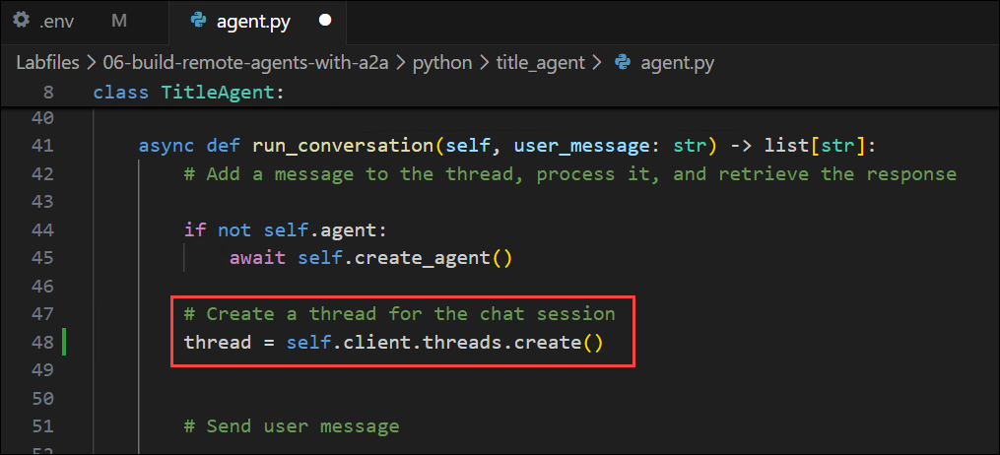

1. Locate the comment **Send user message** and add this code to submit the user's prompt:

    ```python
   # Send user message
   self.client.messages.create(thread_id=thread.id, role=MessageRole.USER, content=user_message)
    ```

    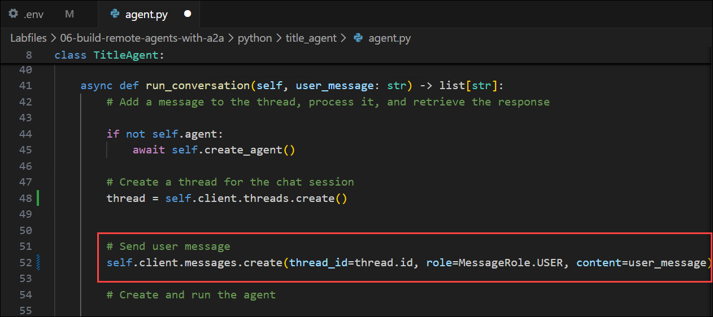

1. Under the comment **Create and run the agent**, add the following code to initiate the agent's response generation:

    ```python
   # Create and run the agent
   run = self.client.runs.create_and_process(thread_id=thread.id, agent_id=self.agent.id)
    ```

    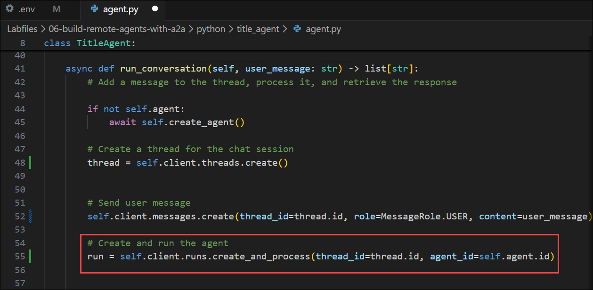

    The code provided in the rest of the file will process and return the agent's response.

1. Save the code file **CTRL+S**. Now you're ready to share the agent's skills and card with the A2A protocol.

1. Open the **title_agent/server.py** file in the code editor.

    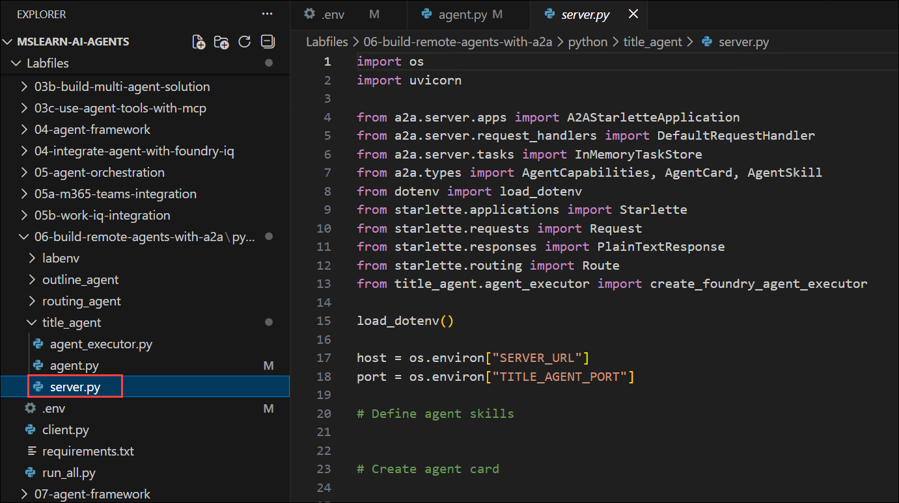

1. Find the comment **Define agent skills** and add the following code to specify the agent’s functionality:

    ```python
   # Define agent skills
   skills = [
       AgentSkill(
           id='generate_blog_title',
           name='Generate Blog Title',
           description='Generates a blog title based on a topic',
           tags=['title'],
           examples=[
               'Can you give me a title for this article?',
           ],
       ),
   ]
    ```

    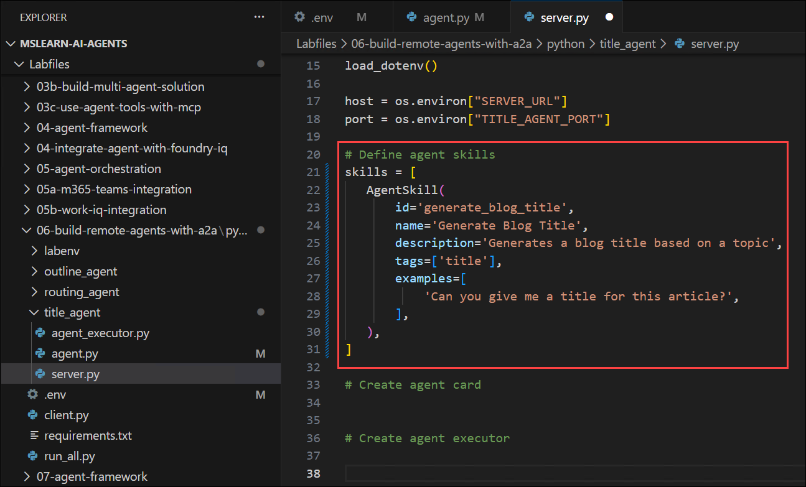

1. Find the comment **Create agent card** and add this code to define the metadata that makes the agent discoverable:

    ```python
   # Create agent card
   agent_card = AgentCard(
       name='Microsoft Foundry Title Agent',
       description='An intelligent title generator agent powered by Foundry. '
       'I can help you generate catchy titles for your articles.',
       url=f'http://{host}:{port}/',
       version='1.0.0',
       default_input_modes=['text'],
       default_output_modes=['text'],
       capabilities=AgentCapabilities(),
       skills=skills,
   )
    ```

    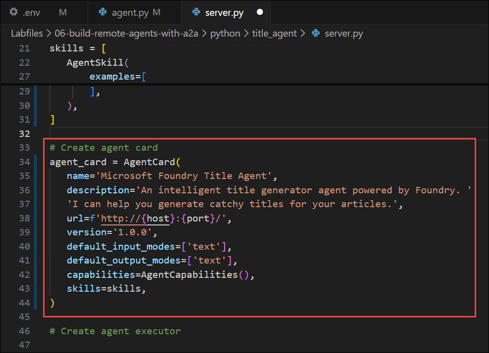

1. Locate the comment **Create agent executor** and add the following code to initialize the agent executor using the agent card:

    ```python
   # Create agent executor
   agent_executor = create_foundry_agent_executor(agent_card)
    ```

    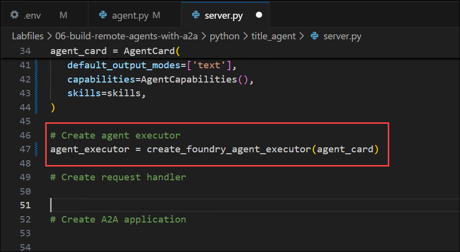

    The agent executor will act as a wrapper for the title agent you created.

1. Find the comment **Create request handler** and add the following to handle incoming requests using the executor:

    ```python
   # Create request handler
   request_handler = DefaultRequestHandler(
       agent_executor=agent_executor, task_store=InMemoryTaskStore()
   )
    ```

    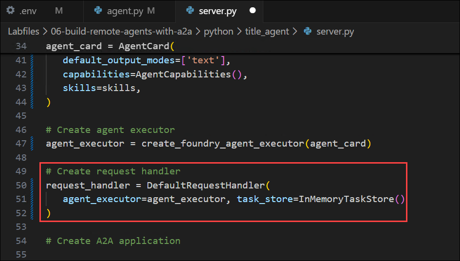

1. Under the comment **Create A2A application**, add this code to create the A2A-compatible application instance:

    ```python
   # Create A2A application
   a2a_app = A2AStarletteApplication(
       agent_card=agent_card, http_handler=request_handler
   )
    ```

    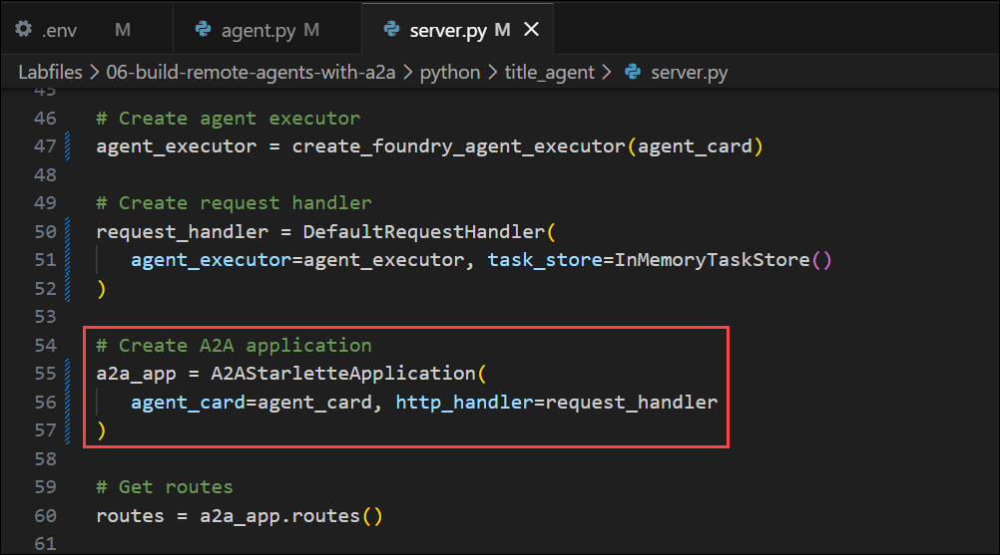

    This code creates an A2A server that will share the title agent's information and handle incoming requests for this agent using the title agent executor.

1. Save the code file **CTRL+S** when you have finished.

### Task 5.2: Enable messages between the agents

In this task, you use the A2A protocol to enable the routing agent to send messages to the other agents. You also allow the title agent to receive messages by implementing the agent executor class.

1. In the **Explorer**, expand **routing_agent (1)** and select **agent.py (2)** file to open in the code editor..

    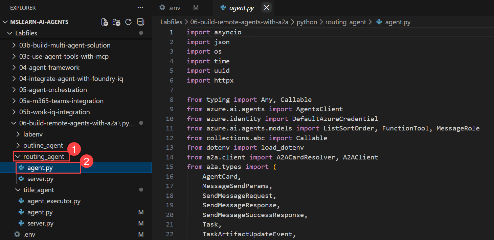

    The routing agent acts as an orchestrator that handles user messages and determines which remote agent should process the request.

    When a user message is received, the routing agent:
    - Starts a conversation thread.
    - Uses the `create_and_process` method to evaluate the best-matching agent for the user's message.
    - The message is routed to the appropriate agent over HTTP using the `send_message` function.
    - The remote agent processes the message and returns a response.

    The routing agent finally captures the response and returns it to the user through the thread.

    Notice that the `send_message` method is async and must be awaited for the agent run to complete successfully.

1. Add the following code under the comment **Retrieve the remote agent's A2A client using the agent name**:

    ```python
   # Retrieve the remote agent's A2A client using the agent name 
   client = self.remote_agent_connections[agent_name]
    ```

    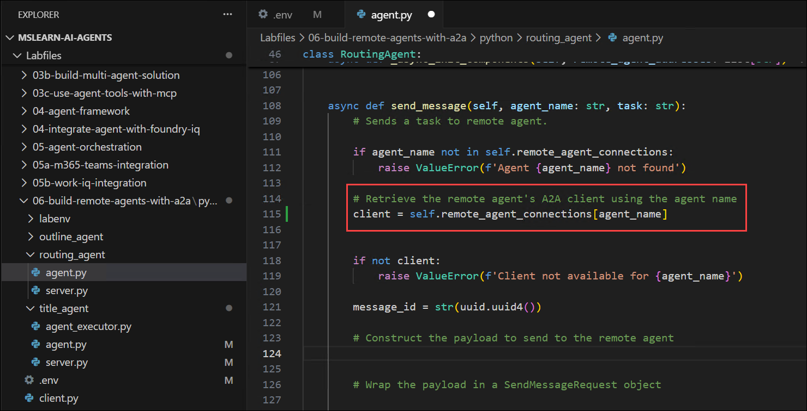

1. Locate the comment **Construct the payload to send to the remote agent** and add the following code:

    ```python
   # Construct the payload to send to the remote agent
   payload: dict[str, Any] = {
       'message': {
           'role': 'user',
           'parts': [{'kind': 'text', 'text': task}],
           'messageId': message_id,
       },
   }
    ```

    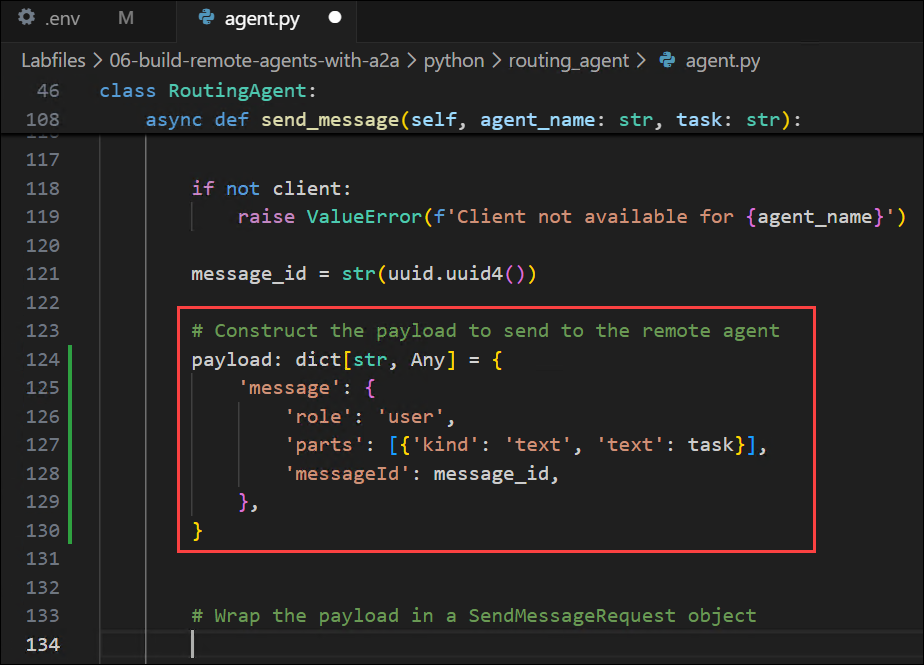

1. Find the comment **Wrap the payload in a SendMessageRequest object** and add the following code:

    ```python
   # Wrap the payload in a SendMessageRequest object
   message_request = SendMessageRequest(id=message_id, params=MessageSendParams.model_validate(payload))
    ```

    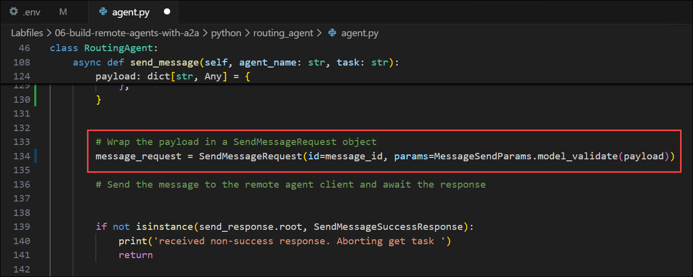

1. Add the following code under the comment **Send the message to the remote agent client and await the response**:

    ```python
   # Send the message to the remote agent client and await the response
   send_response: SendMessageResponse = await client.send_message(message_request=message_request)
    ```

    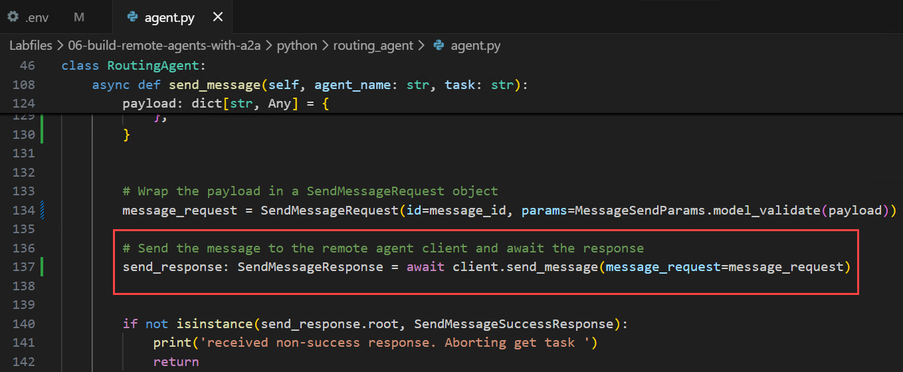

1. Save the code file **CTRL+S** when you have finished. Now the routing agent is able to discover and send messages to the title agent. Let's create the agent executor code to handle those incoming messages from the routing agent.

1. In the **Explorer**, expand **title_agent (1)** and select **agent_executor.py (2)** file to open in the code editor.

    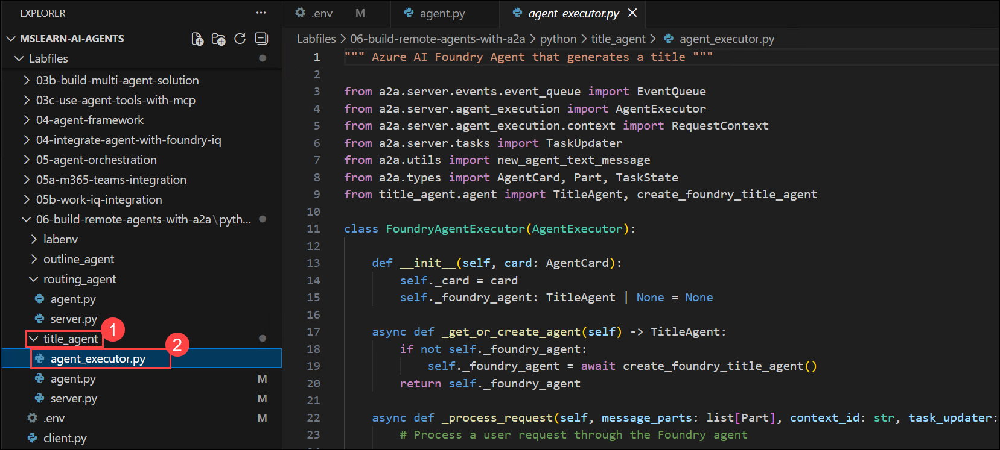

    The `AgentExecutor` class implemenation must contain the methods `execute` and `cancel`. The cancel method has been provided for you. The `execute` method includes a `TaskUpdater` object that manages events and signals to the caller when the task is complete. Let's add the logic for task execution.

1. In the `execute` method, add the following code under the comment **Process the request**:

    ```python
   # Process the request
   await self._process_request(context.message.parts, context.context_id, updater)
    ```

    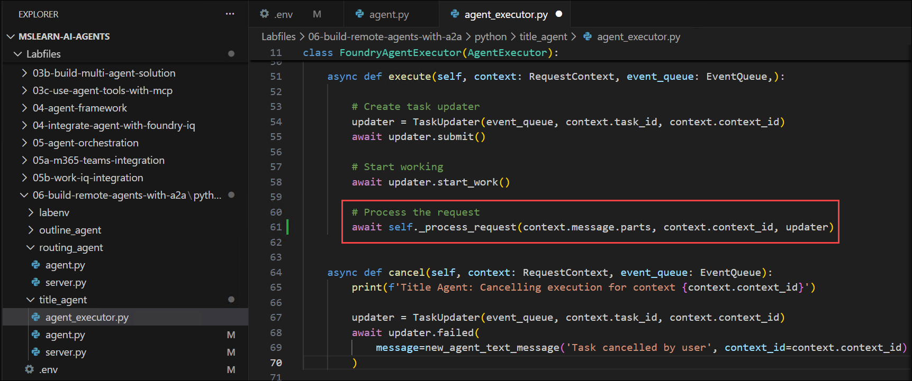

1. In the `_process_request` method, add the following code under the comment **Get the title agent**:

    ```python
   # Get the title agent
   agent = await self._get_or_create_agent()
    ```

    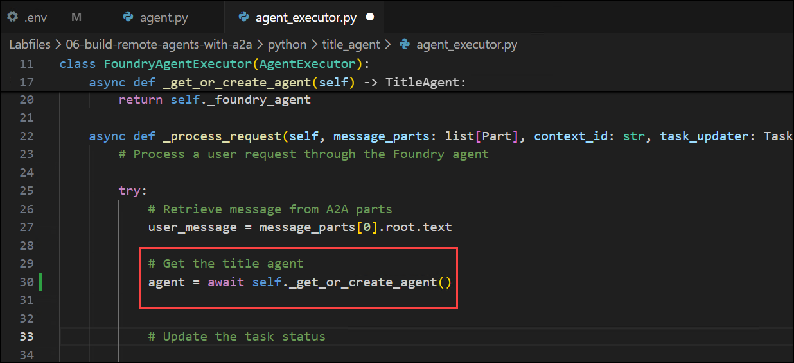

1. Add the following code under the comment **Update the task status**:

    ```python
   # Update the task status
   await task_updater.update_status(
       TaskState.working,
       message=new_agent_text_message('Title Agent is processing your request...', context_id=context_id),
   )
    ```

    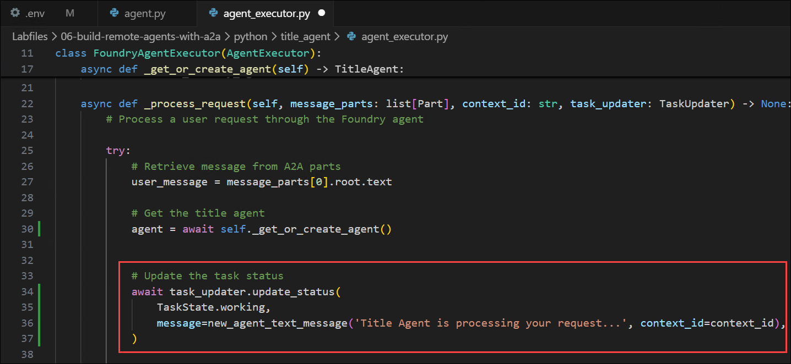

1. Find the comment **Run the agent conversation** and add the following code:

    ```python
   # Run the agent conversation
   responses = await agent.run_conversation(user_message)
    ```

    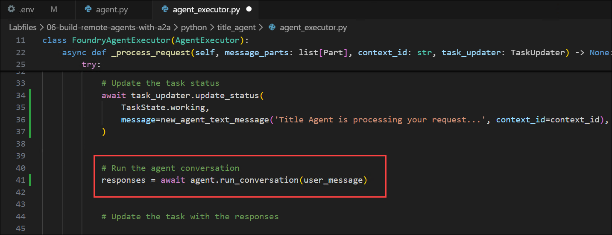

1. Find the comment **Update the task with the responses** and add the following code:

    ```python
   # Update the task with the responses
   for response in responses:
       await task_updater.update_status(
           TaskState.working,
           message=new_agent_text_message(response, context_id=context_id),
       )
    ```

    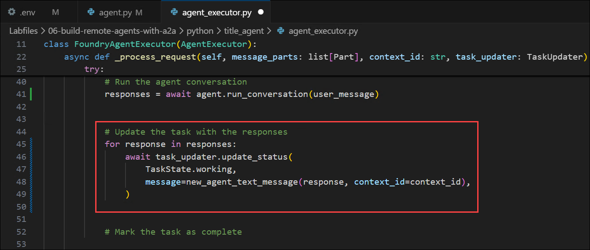

1. Find the comment **Mark the task as complete** and add the following code:

    ```python
   # Mark the task as complete
   final_message = responses[-1] if responses else 'Task completed.'
   await task_updater.complete(
       message=new_agent_text_message(final_message, context_id=context_id)
   )
    ```

    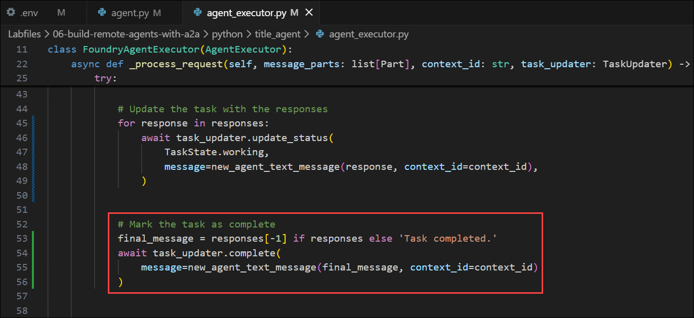

    Now your title agent has been wrapped with an agent executor that the A2A protocol will use to handle messages. Great work!

## Task 6: Run the application

In this task, you will run the multi-agent application and authenticate with Azure to initiate the services. You will test and validate the interaction between agents by sending user prompts and reviewing the generated responses.

1. In the terminal, run `Connect-AzAccount` to initiate the Azure sign-in process.

    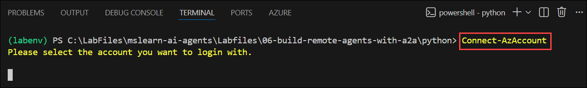

    >**Note:** If you have closed the terminal, right-click on the **06-build-remote-agents-with-a2a\Python** folder and select **Open in Integrated Terminal**. Then run the command `.\labenv\Scripts\Activate.ps1` to activate the virtual environment before proceeding.

1. In the sign-in window, select your account **<inject key="AzureAdUserEmail"></inject> (1)** and click **Continue (2)** to proceed with authentication.

    

1. After successful sign-in, wait for the subscriptions to load and verify that your subscription is listed in the terminal.

    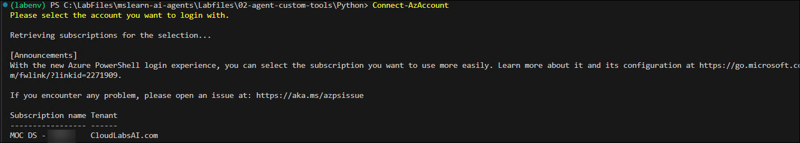

1. In the integrated terminal, enter the following command to run the application:

    ```
    python run_all.py
    ```

    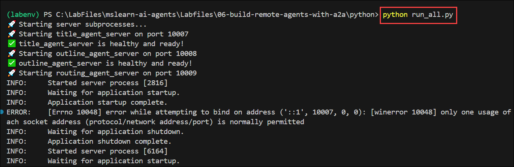

    You should see some output from each server as it starts.

1. Wait until the prompt for input appears, then enter a prompt such as:

    ```
   Create a title and outline for an article about React programming.
    ```

    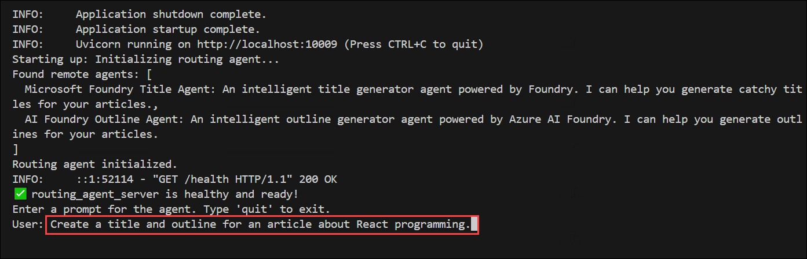

1. After a few moments, you should see a response from the agent with the results.

    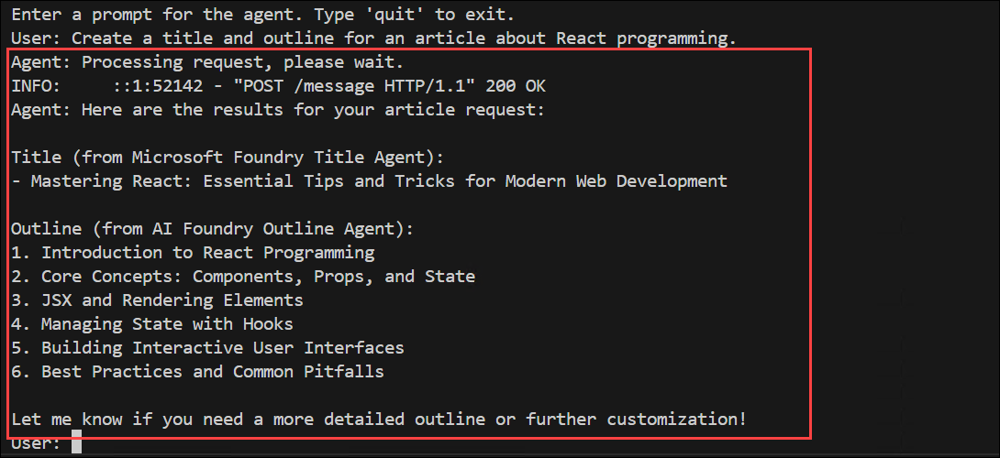

1. Enter `quit` to exit the program and stop the servers.

    You can also use `deactivate` to exit the Python virtual environment in the terminal.

## Summary

In this lab, you used the Azure AI Agent Service SDK and the A2A Python SDK to create a remote multi-agent solution. You created a discoverable A2A-compatible agent and set up a routing agent to access the agent's skills. You also implemented an agent executor to process incoming A2A messages and manage tasks. Great work!

## You have successfully completed the Hands-on Lab!