# Lab 03: Develop an AI agent with VS Code extension

### Estimated Duration: 30 Minutes

## Overview

In this exercise, you'll use the Microsoft Foundry VS Code extension to create an agent that can use Model Context Protocol (MCP) server tools to access external data sources and APIs. The agent will be able to retrieve up-to-date information and interact with various services through MCP tools.

> **Note:** Some of the technologies used in this exercise are in preview or in active development. You may experience some unexpected behavior, warnings, or errors.

## Task 1: Install the Microsoft Foundry VS Code extension

Let's start by installing and setting up the VS Code extension.

1. Open Visual Studio Code.

1. In Visual Studio Code, select **Extensions (1)** from the left pane, search for **Microsoft Foundry (2)**, choose the **Microsoft Foundry (3)** extension by Microsoft, and then click **Install (4)**.

   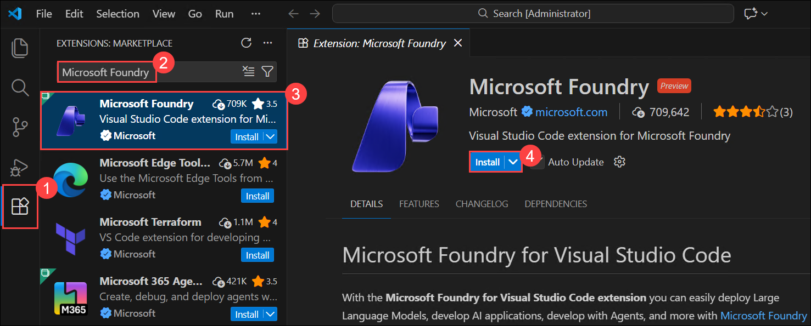

1. After installation is complete, verify the extension appears in the primary navigation bar on the left side of Visual Studio Code.

   

   > **Tip:** If you already have the extension installed, make sure the version is at least **v0.16.0** to follow along with the instructions in this exercise.

## Task 2: Sign in to Azure and Select a project

Now you'll connect to your Azure resources and create a new AI Foundry project.

1. In the VS Code sidebar, select the **Microsoft Foundry (1)** extension icon.

1. In the Resources view, choose **Set Default Project (2)**, and when prompted, select **Sign in to Azure (3)** to authenticate.

   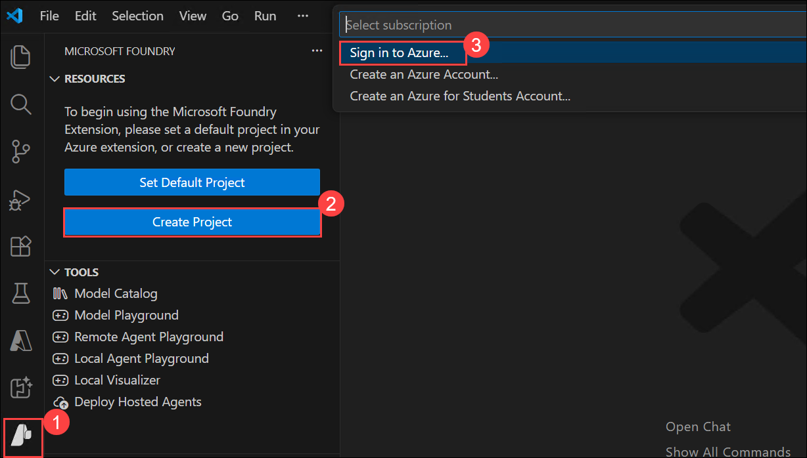

1. In the **Azure Resources wants to sign in using Microsoft** dialog, select **Allow**.

   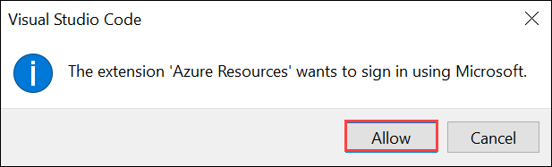

1. On the **Sign in** page, provide the credentials below:
 
   - **Email/Username:** <inject key="AzureAdUserEmail"></inject>
    
     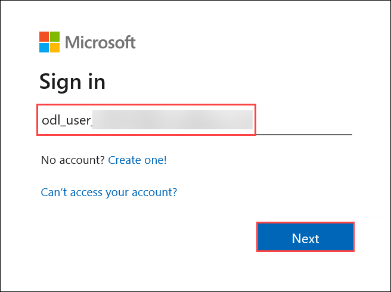

   - **Password:** <inject key="AzureAdUserPassword"></inject>
    
     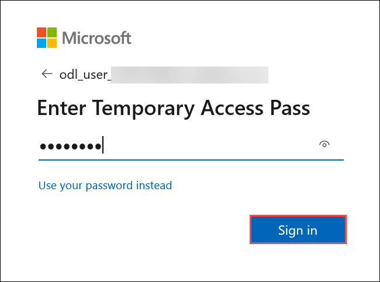

1. On the **Sign in to all apps, websites, and services on this device?** page, select **Yes**.

   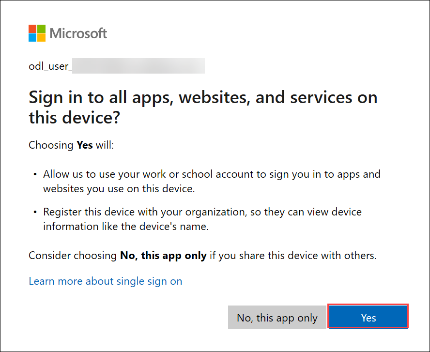

1. On the **Account added to this device** page, select **Done**.

   
   
1. In the **Pick a project** dialog, select your **myprojects-<inject key="DeploymentID"></inject>** project from the list.

   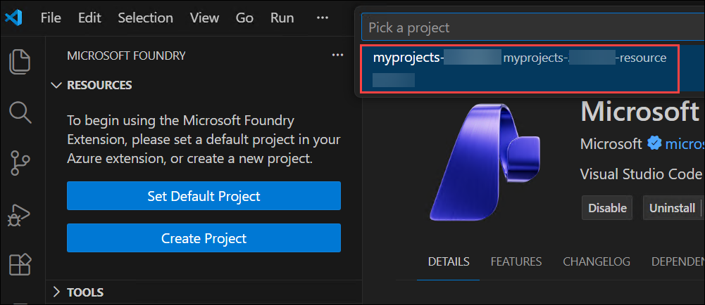

1. In the **Microsoft Foundry** extension, verify that your **myprojects-<inject key="DeploymentID"></inject>** project is listed under **RESOURCES**.

   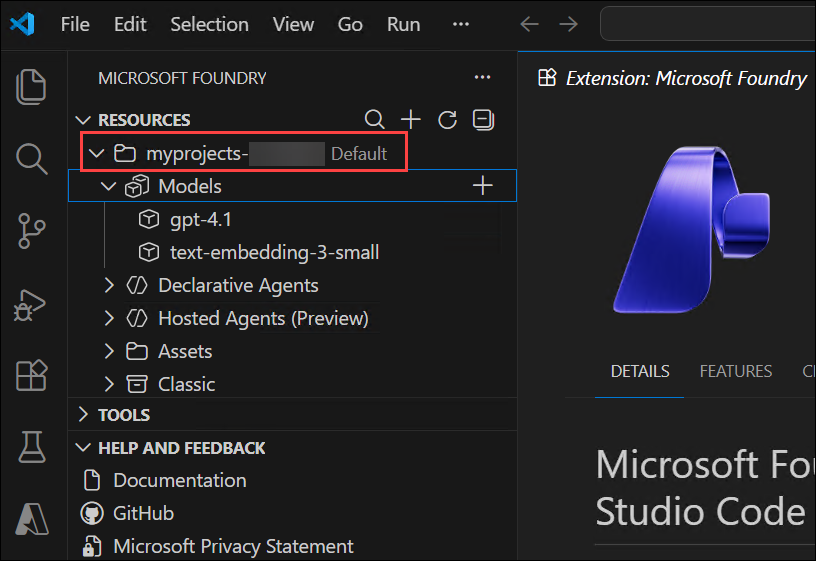

## Task 3: Create an AI agent with the designer view

Now you'll create an AI agent using the visual designer interface. Rather than writing code, you'll configure the agent's instructions, settings, and tools through the user interface.

1. In the Microsoft Foundry extension view, find the **Resources** section.

1. Expand the **Classic (1)** subsection.

1. Select the **+** (plus) **(2)** icon next to the **Classic Agents** subsection to create a new AI Agent.

    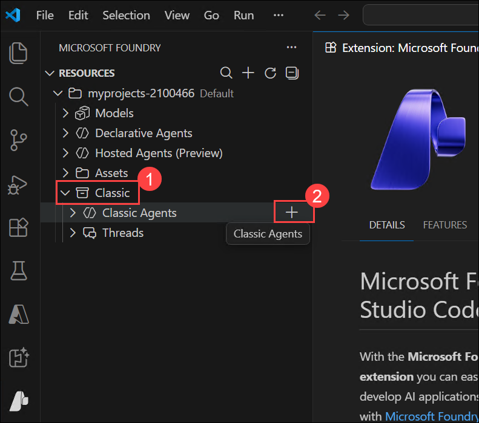

1. Choose a location to save your agent files if prompted.

1. A **New Agent** tab will open to an "Agent Preferences" editor, along with a `.yaml` configuration file.

   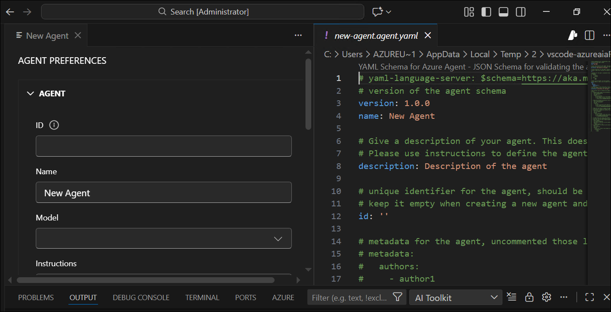

### Task 3.1 Configure your agent in the designer

1. In the agent preferences, configure the following fields:
   - **Name:** Enter a descriptive name for your agent **data-research-agent (1)**
   
   - **Model:** Select your **gpt-4.1 (2)** from the dropdown
   
   - **Instructions:** Enter system instructions such as **(3):**
     ```
     You are an AI agent that helps users research information from various sources. Use the available tools to access up-to-date information and provide comprehensive responses based on external data sources.
     ```

      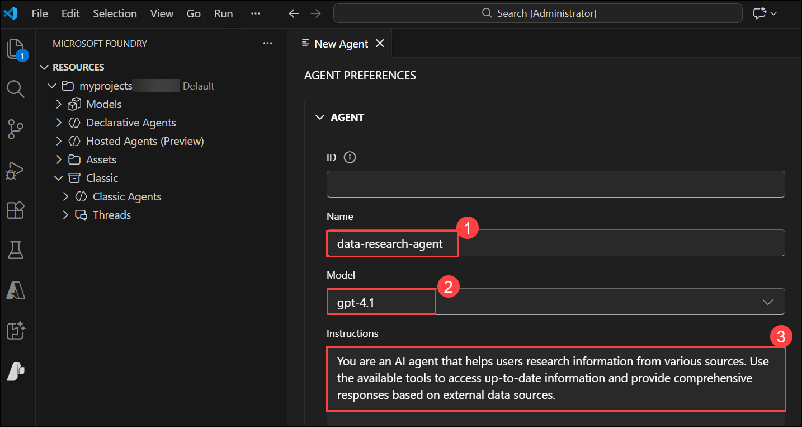

### Task 3.3 Add an MCP Server tool to your agent

You'll now add a Model Context Protocol (MCP) server tool that allows your agent to access external APIs and data sources.

1. In the **TOOL** section of the designer, select the **Add tool (1)** button in the top-right corner.

1. From the dropdown menu, choose **MCP Server (2)**.

   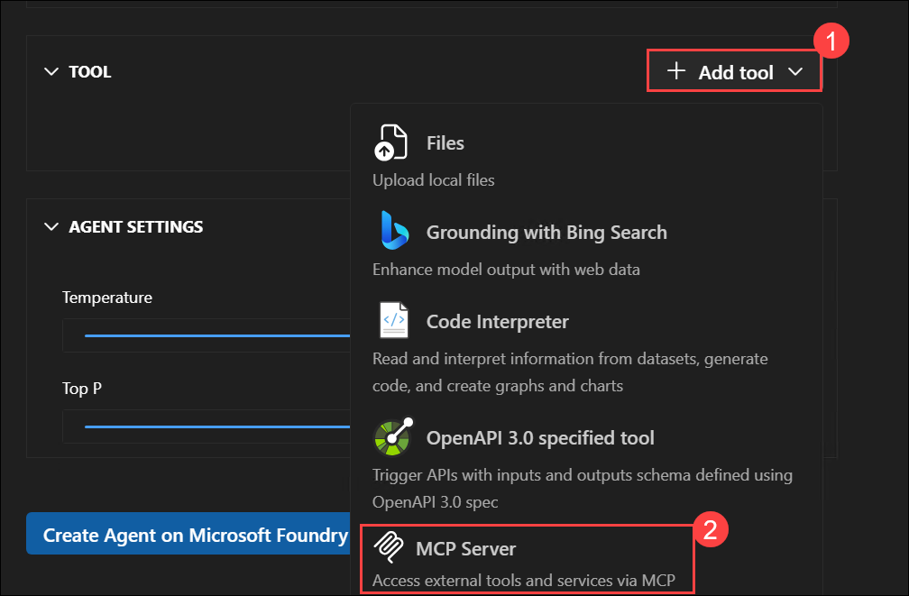

1. Configure the MCP Server tool with the following information:
   
   - **Server URL:** Enter the URL of an MCP server `https://gitmcp.io/Azure/azure-rest-api-specs` **(1)**
   
   - **Server Label:** Enter a unique identifier **github_docs_server (2)**

1. Leave the **Allowed tools** dropdown empty to allow all tools from the MCP server.

1. Select the **Create tool (3)** button to add the tool to your agent.

   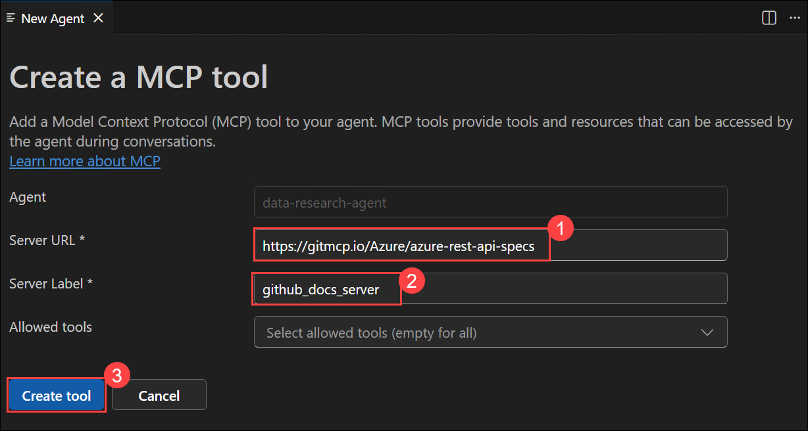

## Task 3.4: Deploy your agent to Microsoft Foundry

1. In the agent designer view, select the **Create Agent on Microsoft Foundry** button in the bottom-left corner.

   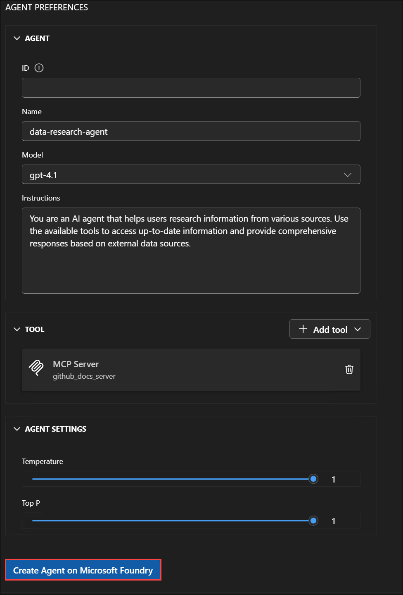

1. Wait for the deployment to complete.

1. In the VS Code navbar, refresh the **Resources** view.  **data-research-agent** should now appear under the **Classic Agents** subsection.

   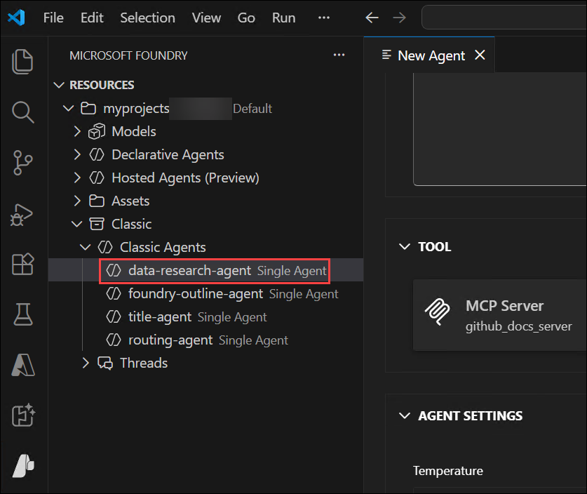

### Task 3.5: Test your agent in the playground

1. Right-click on **data-research-agent (1)** in the **Classic Agents** subsection.

1. Select **Open Playground (2)** from the context menu.

   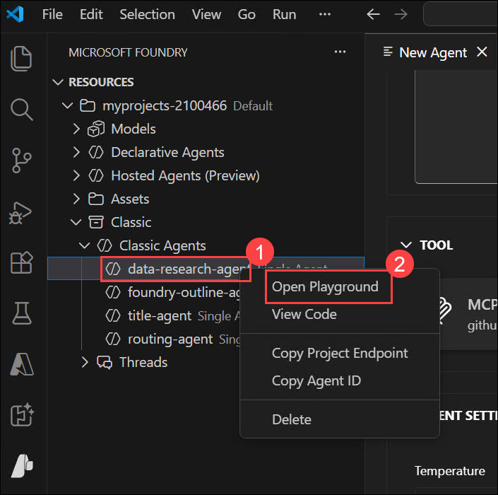

1. The Agents Playground will open in a new tab within VS Code.

1. In the **Agent Playground**, enter the following prompt in the chat box **(1)**, and then select **Send (2)**:

   ```output
   Can you help me find documentation about Azure Container Apps and provide an example of how to create one?
   ```

   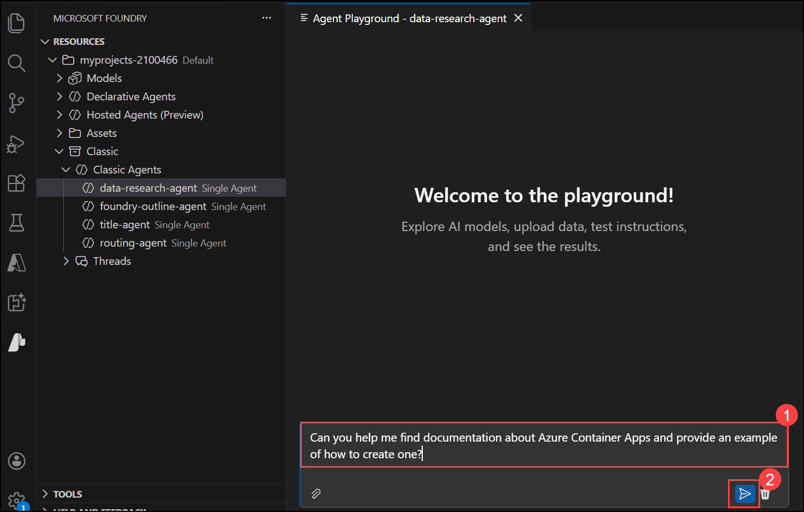

1. Send the message and observe the authentication and approval prompts for the MCP Server tool:
    
    - In the **MCP Tools Authentication Setup** dialog, select **No Authentication**.

      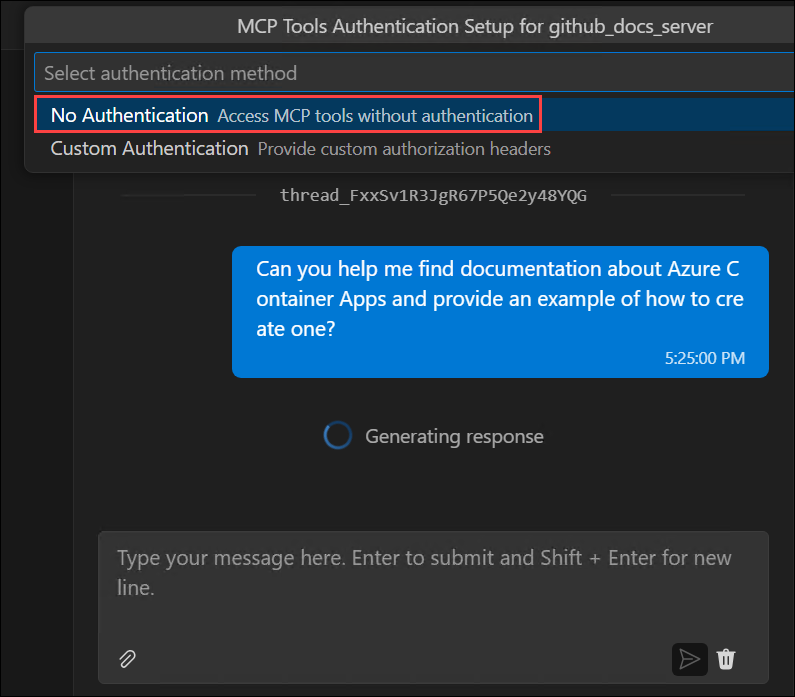
    
    - In the **MCP Tools Approval Preference** dialog, select **Always approve**.

      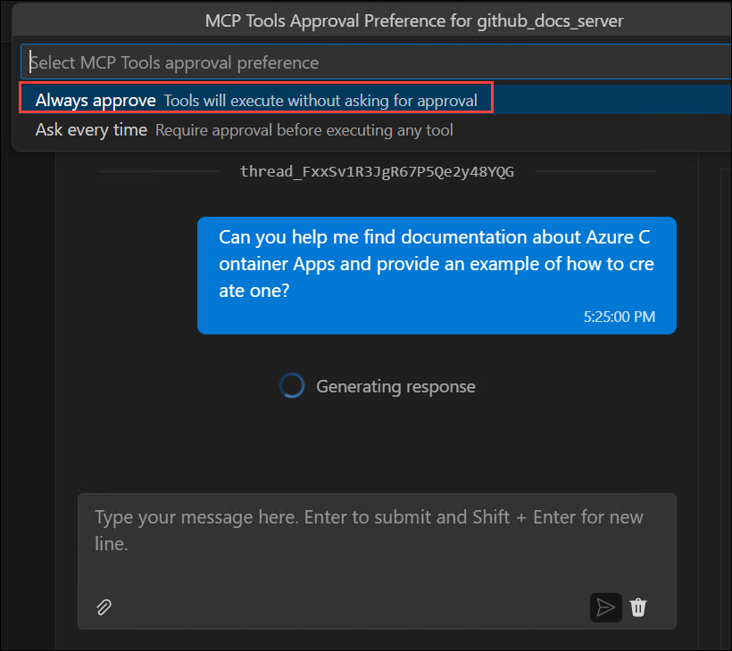

1. Review the agent's response and note how it uses the MCP server tool to retrieve external information.

   

1. Check the **Agent Annotations** section to see the sources of information used by the agent.

### Task 3.6: Generate sample code for your agent

1. Right-click on **data-research-agent (1)** and select **View Code** button in the Agent Preferences page.

   

1. In the **Choose your preferred SDK** dropdown, select **Microsoft Foundry Projects client library**.

   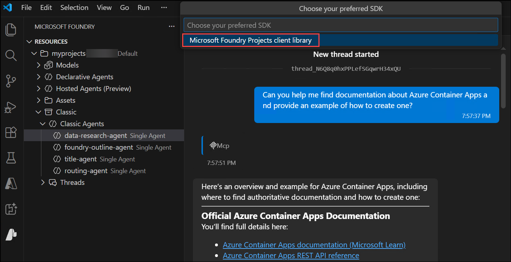

1. Select your preferred programming language (eg. Python).

   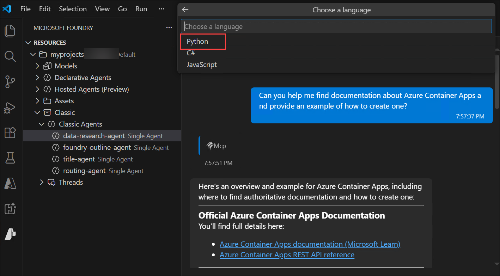

1. In the **Choose an auth method** dropdown, select **EntraID (default)**.

   

1. Review the generated sample code that demonstrates how to interact with your agent programmatically.

   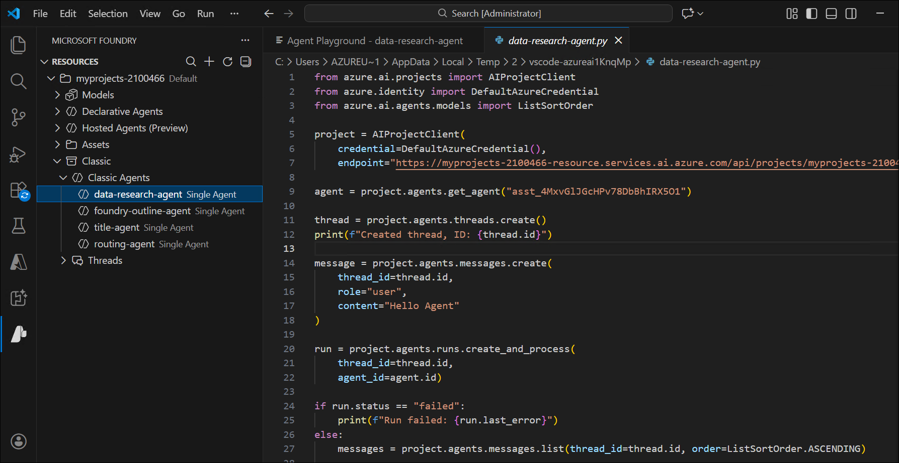

You can use this code as a starting point for building applications that leverage your AI agent.

### Task 3.7: View conversation history and threads

1. In the **Azure Resources** view, expand the **Threads** subsection to see conversations created during your agent interactions.

   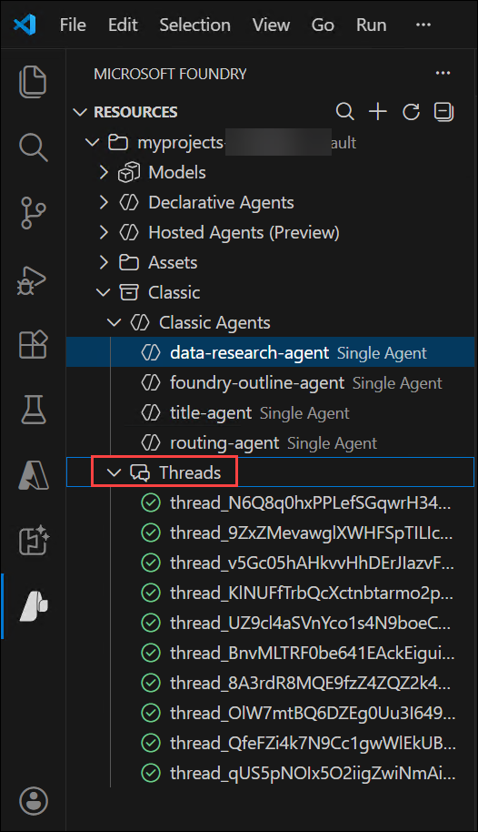

1. Select a thread to view the **Thread Details** page, which shows:
   
   - Individual messages in the conversation
   - Run information and execution details
   - Agent responses and tool usage

1. Select **View run info** to see detailed JSON information about each run.

   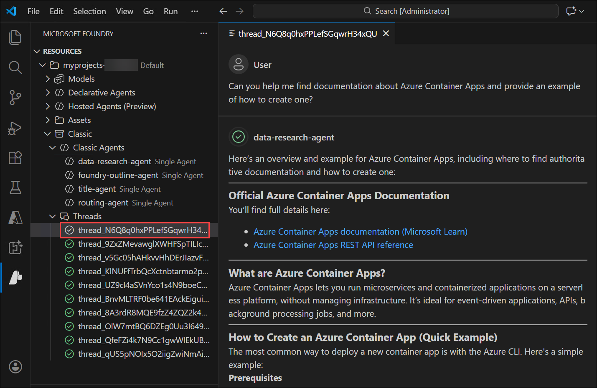

## Summary

In this exercise, you used the Foundry VS Code extension to create an AI agent with MCP server tools. The agent can access external data sources and APIs through the Model Context Protocol, enabling it to provide up-to-date information and interact with various services. You also learned how to test the agent in the playground and generate sample code for programmatic interaction.
