# Lab 10: Build a workflow in Microsoft Foundry

### Estimated Duration: 60 Minutes

## Overview

In this lab, you will use the Microsoft Foundry portal to build a sequential workflow for automating customer support ticket processing. You will create AI agents to classify tickets, handle low-confidence cases, and generate recommended responses, applying conditional logic for routing and escalation. You then connect the workflow to Python code via the Azure AI Projects SDK to run and validate automated support ticket handling programmatically.

**Workflow overview**

- Collect incoming support tickets
    
    The workflow starts with a predefined array of customer support issues. Each item in the array represents an individual support ticket submitted to ContosoPay.

- Process tickets one at a time
    
    A for-each loop iterates over the array, ensuring each support ticket is handled independently while using the same workflow logic.

- Classify each ticket with an AI agent
    
    For each ticket, the workflow invokes a Triage Agent to classify the issue as Billing, Technical, or General, along with a confidence score.

- Handle uncertainty with conditional logic
    
    If the confidence score is below a defined threshold, the workflow recommends additional info for that ticket.

- Route based on issue category
    
    Billing issues are flagged for escalation and removed from the automated resolution path.
    Technical and General issues continue through automated handling.

- Generate a recommended response
    
    For non-billing tickets, the workflow invokes a Resolution Agent to draft a category-appropriate support response.

    > **Note:** The workflow builder in Microsoft Foundry is currently in preview. You may experience some unexpected behavior, warnings, or errors.

## Lab Objectives


- **Task 1:** Create a customer support triage workflow

- **Task 2:** Use your workflow in code

## Task 1: Create a customer support triage workflow

In this task, you will create a sequential customer support triage workflow in Microsoft Foundry that uses AI agents to classify and respond to support tickets for ContosoPay.

1. On the Foundry portal home page, select **Build (1)** from the toolbar menu.

1. On the left-hand menu, select **Workflows (2)**.

     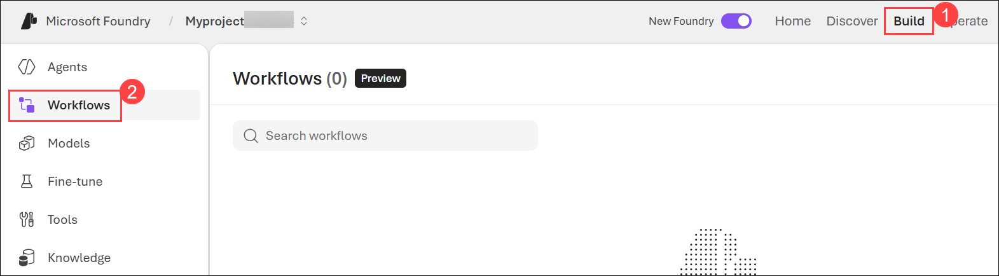

1. In the upper right corner, select **Create (1)** > **Blank workflow (2)** to create a new blank workflow.

    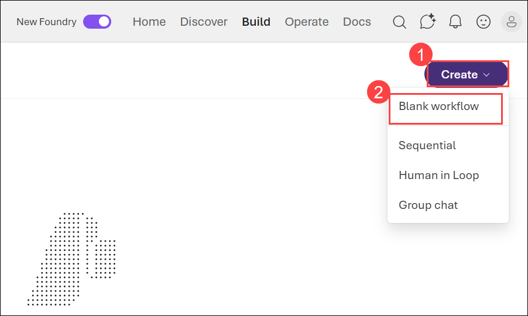

    - The type of workflow you'll create in this exercise is a sequential workflow. However, starting with a blank workflow will simplify the process of adding the necessary nodes.

1. Select **Save (1)** in the visualizer to save your new workflow. In the dialog box, enter a name for your workflow, such as **ContosoPay-Customer-Support-Triage (2)**, and then select **Save (3)**.

    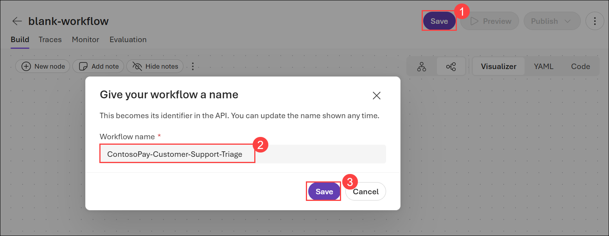

> **Congratulations** on completing the task! Now, it's time to validate it. Here are the steps:
>
> - Hit the Validate button for the corresponding task. If you receive a success message, you can proceed to the next task.
> - If not, carefully read the error message and retry the step, following the instructions in the lab guide.
> - If you need any assistance, please contact us at cloudlabs-support@spektrasystems.com. We are available 24/7 to help.
 
<validation step="1f26d4d8-b25f-43cf-8f1c-49f7345160d6" />

### Task 1.1: Create a ticket array variable

In this task, you will initialize a support ticket array variable in the workflow to simulate incoming customer requests for automated processing in Microsoft Foundry.

1. In the workflow visualizer, select the **+** (plus) **(1)** icon to add a new node.

1. In the workflow actions menu, under **Data transformation**, select **Set variable (2)** to add a node that initializes an array of support tickets.

    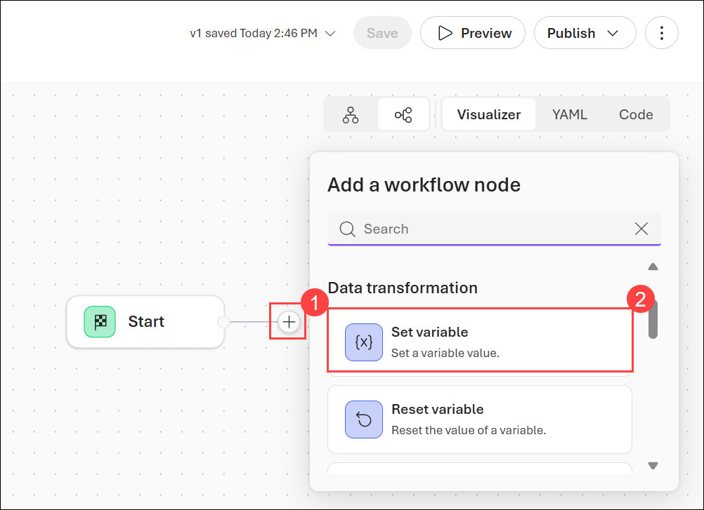

1. In the **Set variable** node editor, create a new variable by entering **SupportTickets (1)** and selecting **Create new variable** from the drop-down.

    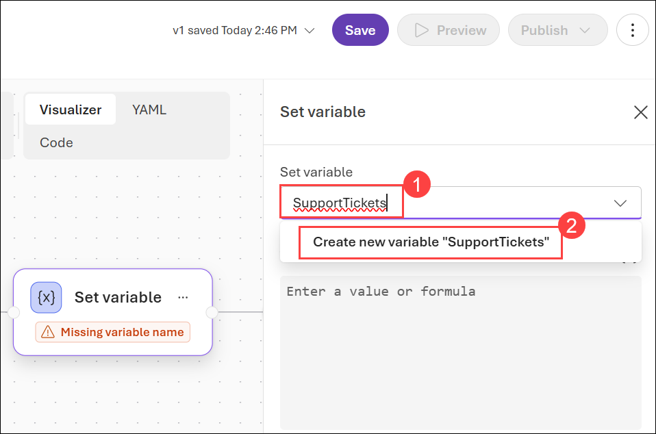

    - The new variable should appear as `Local.SupportTickets`.

1. In the **To value (1)** field, enter the following array that contains sample support tickets:

    ```output
   [ 
    "The API returns a 403 error when creating invoices, but our API key hasn't changed.", 
    "Is there a way to export all invoices as a CSV?", 
    "I was charged twice for the same invoice last Friday and my customer is also seeing two receipts. Can someone fix this?"]
    ```

1. Select **Done (2)** to save the node.

    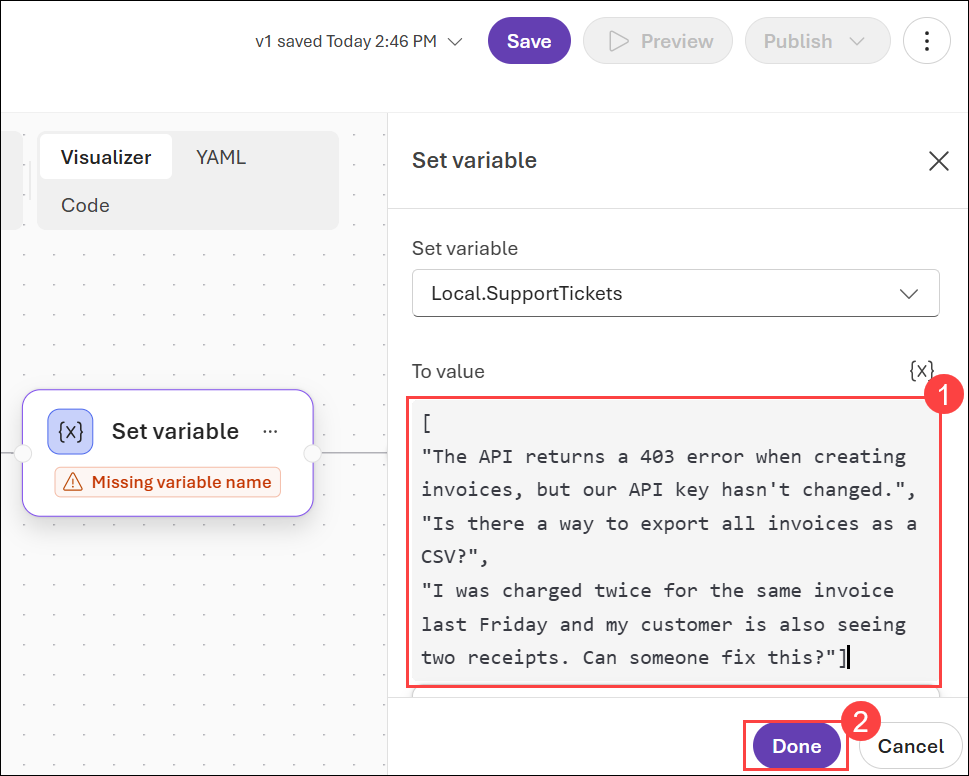

### Task 1.2: Add a for-each loop to process tickets

In this task, you will configure a for-each loop to iterate through each support ticket and process them individually within the workflow.

1. Select the **+ (1)** icon next to **Set variable**, scroll under **Flow**, and then choose **For each (2)** to add a loop for processing each support ticket.

     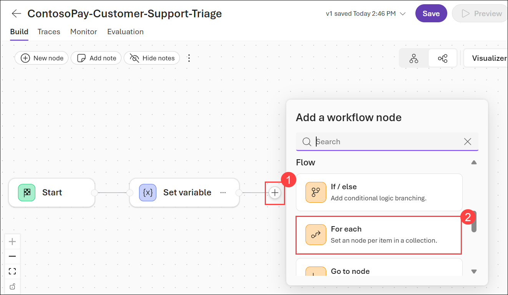

1. In the **For each** node editor, set **Select the items to loop for each (1)** to `Local.SupportTickets`, enter **CurrentTicket (2)** in the **Loop Value Variable** field, and then select **Create new variable "CurrentTicket" (3)**.

    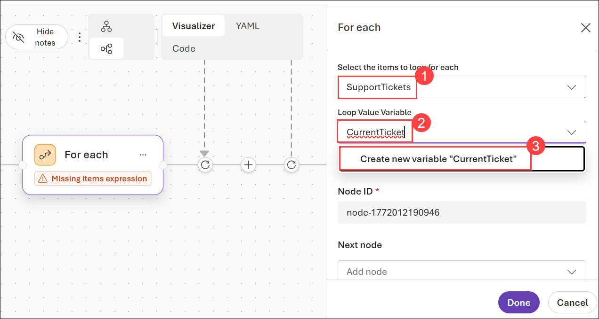

1. Select **Done** to save the node.

    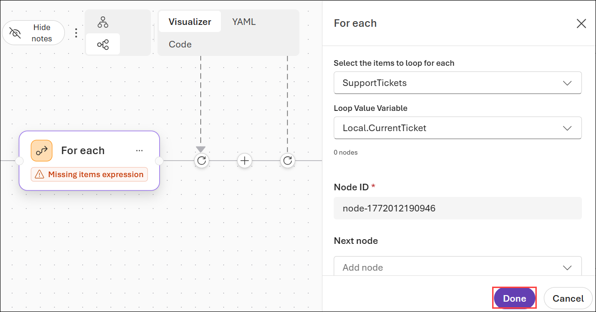

### Task 1.3: Invoke an agent to classify the ticket

In this task, you will invoke the Triage Agent to classify each support ticket into a category and generate a confidence score using structured JSON output.

1. Select the **+** (plus) **(1)** icon within the **For each** node to add a new node that classifies the current support ticket.

1. In the workflow actions menu, under **Invoke**, select **Agent (2)** to add an agent node.

    

1. In the **Agent** pane, open the **Select an agent (1)** dropdown, and then choose **Create a new agent (2)**.

    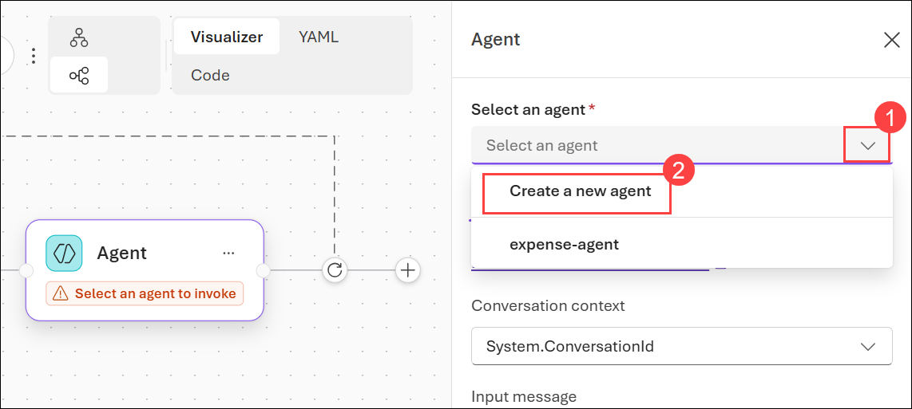

1. In the **Create an agent** pane, enter **Triage-Agent (1)** as the agent name, and then select **Create (2)**.

    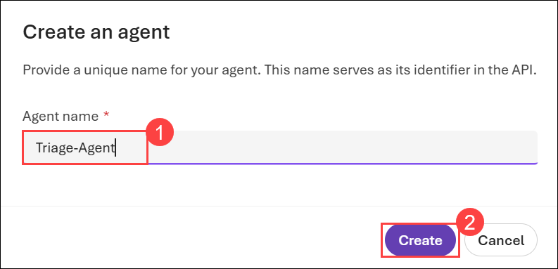

1. In the **Details (1)** tab, select the **Parameters (2)** icon next to the model name.

    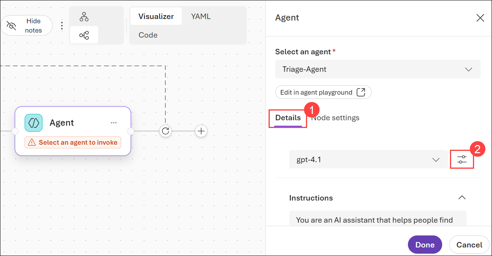

1. In the **Parameters** pane, open the **Text format (1)** dropdown, and then select **JSON Schema (2)**.

    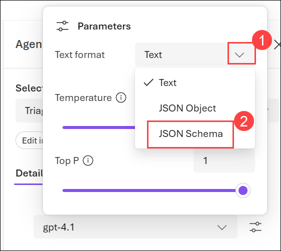

1. In the **Add response format** pane, enter the following definition **(1)** and select **Save (2)**:

    ```json
    {
    "name": "category_response",
    "schema": {
        "type": "object",
        "properties": {
            "customer_issue": {
                "type": "string"
            },
            "category": {
                "type": "string"
            },
            "confidence": {
                "type": "number"
            }
        },
        "additionalProperties": false,
        "required": [
            "customer_issue",
            "category",
            "confidence"
        ]
    },
    "strict": true
    }
    ```

    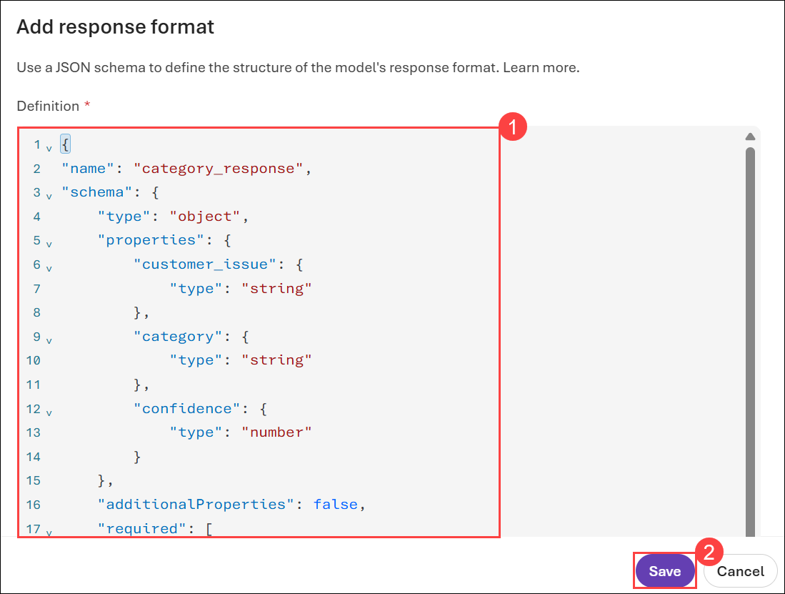

1. In the Agent **Details** pane, set the **Instructions (1)** field to the following prompt:

    ```output
    Classify the user's problem description into exactly ONE category from the list below. Provide a confidence score from 0 to 1.

    Billing
    - Charges, refunds, duplicate payments
    - Missing or incorrect payouts
    - Subscription pricing or invoices being charged

    Technical
    - API errors, integrations, webhooks
    - Platform bugs or unexpected behavior

    General
    - How-to questions
    - Feature availability
    - Data exports, reports, or UI navigation

    Important rules
    - Questions about exporting, viewing, or downloading invoices are General, not Billing
    - Billing ONLY applies when money was charged, refunded, or paid incorrectly
    ```

1. Select **Node settings (2)** to configure the input and output of the agent.

    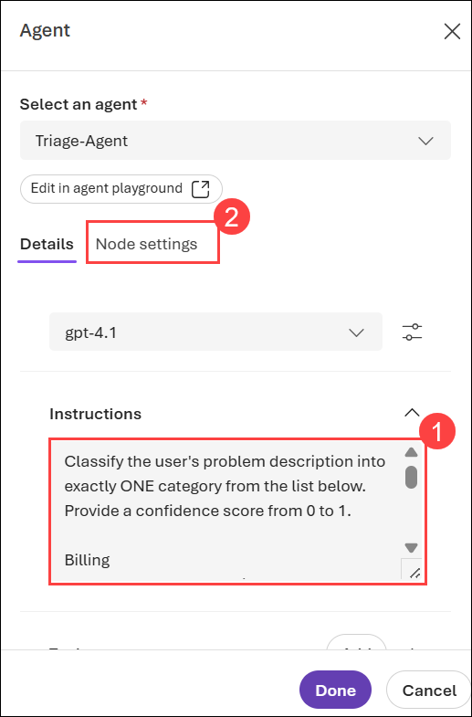

1. Set the **Input message** field to the  `Local.CurrentTicket` variable.

    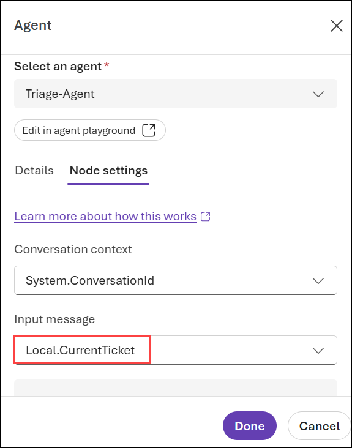

1. Under **Save agent output message as**, create a new variable by entering `TriageOutputText` **(1)** and select **Create new variable (2)** from the drop down.

    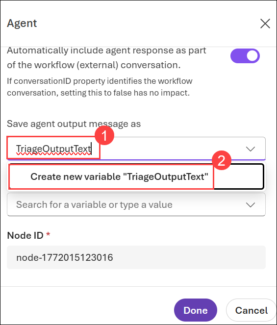

1. Under **Save the output json_object as**, create a new variable by entering `TriageOutputJson` **(1)** and select **Create new variable (2)** from the drop down.

    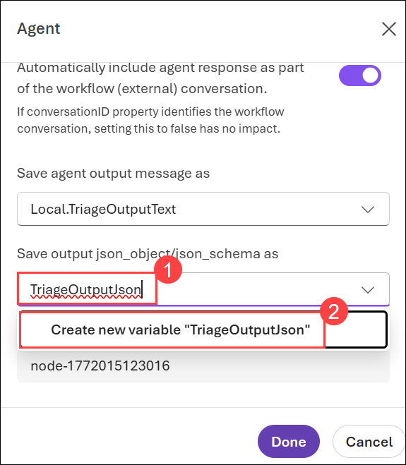

1. Select **Done** to save the node.

    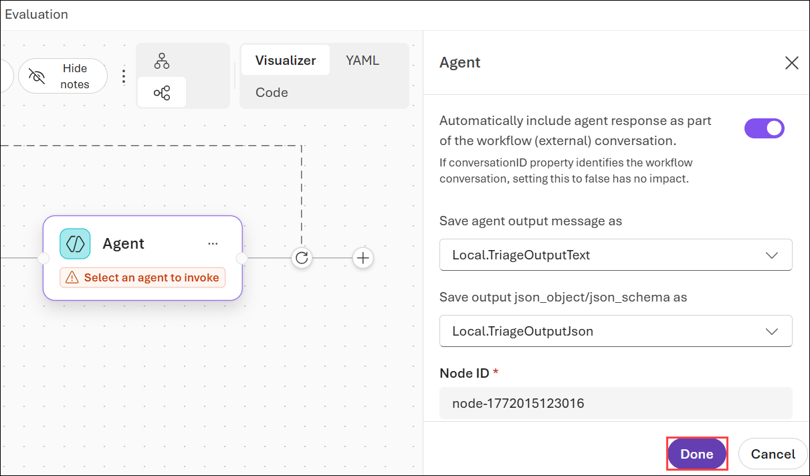

> **Congratulations** on completing the task! Now, it's time to validate it. Here are the steps:
>
> - Hit the Validate button for the corresponding task. If you receive a success message, you can proceed to the next task.
> - If not, carefully read the error message and retry the step, following the instructions in the lab guide.
> - If you need any assistance, please contact us at cloudlabs-support@spektrasystems.com. We are available 24/7 to help.
 
<validation step="3fa62825-2aad-4ec5-8512-a97c98d07032" />

## Task 1.4: Handle low-confidence classifications

In this task, you will add conditional logic to evaluate the confidence score and determine whether the ticket classification is reliable for further automated processing.

1. Select the **+ (1)** icon next to **Triage-Agent**, and then choose **If / else (2)** under **Flow** to add a conditional logic node for handling low-confidence classifications.

    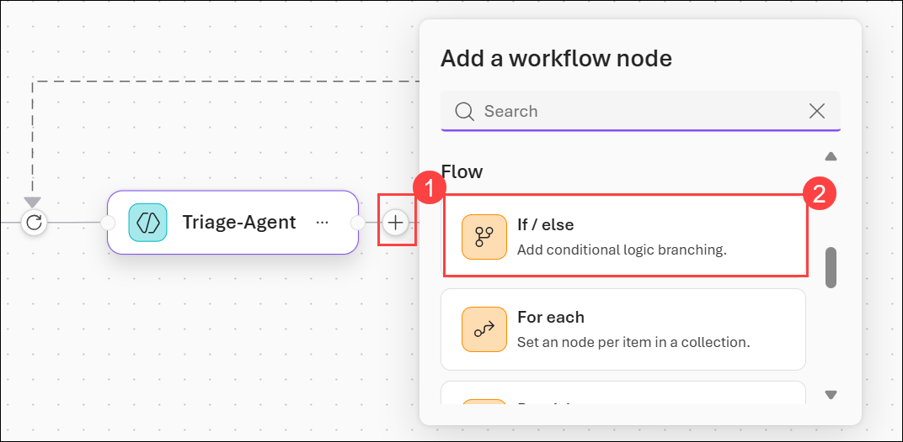

1. In the **If/Else** node editor, select the **If (1)** branch condition.

1. Set the **Condition (2)** field to the following expression to check if the confidence score is above 0.6:

    ```output
   Local.TriageOutputJson.confidence > 0.6
    ```

1. Select **Done (3)** to save the node.

    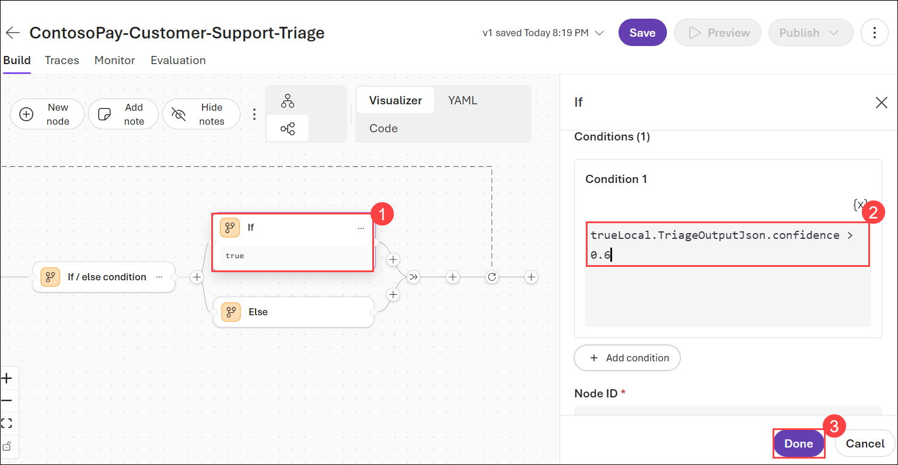

## Task 1.5: Recommend additional info for low-confidence tickets

In this task, you will configure the workflow to request additional details from the customer when the ticket classification confidence is low.

1. In the visualizer, under the **Else** branch of the **If/Else condition** node, select the **+** (plus) **(1)** icon to add a new node that recommends additional information for low-confidence tickets.

1. In the workflow actions menu, under **Basics**, select **Deliver message (3)** to add a send message activity.

    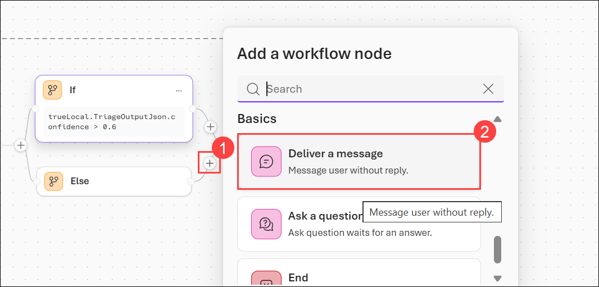

1. In the **Deliver message** node editor, set the **Message to send (1)** field to the following response and select **Done (2)**:

    ```output
   The support ticket classification has low confidence. Requesting more details about the issue: "{Local.CurrentTicket}"
    ```

    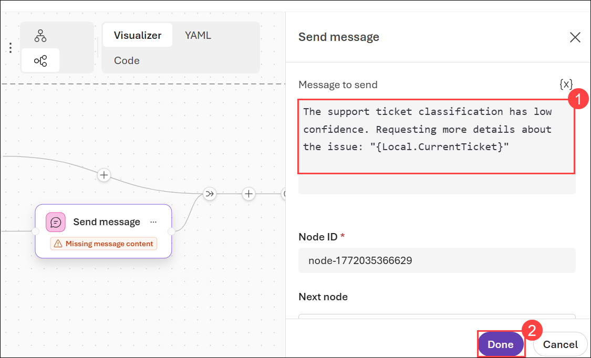

### Task 1.6: Route the ticket based on category

In this task, you will add routing logic to identify billing issues and escalate them to the human support team while allowing other categories to continue through automation.

1. In the visualizer, under the **If** branch of the **If/Else condition** node, select the **+** (plus) **(1)** icon to add a new node that routes the ticket based on its category.

1. In the workflow actions menu, under **Flow**, select **If/Else (2)** to add another conditional logic node.

    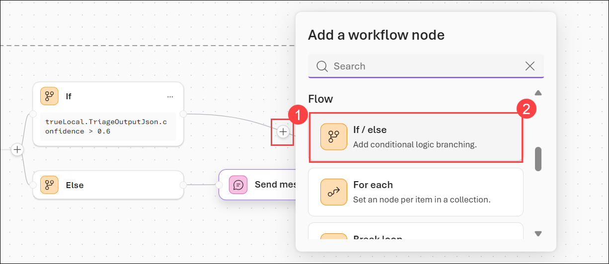

1. In the **If/Else** node editor, select the **If (1)** branch, set the **Condition (2)** field to the following expression to check if the ticket category is "Billing", and then select **Done (3)**:

    ```output
    Local.TriageOutputJson.category = "Billing"
    ```

    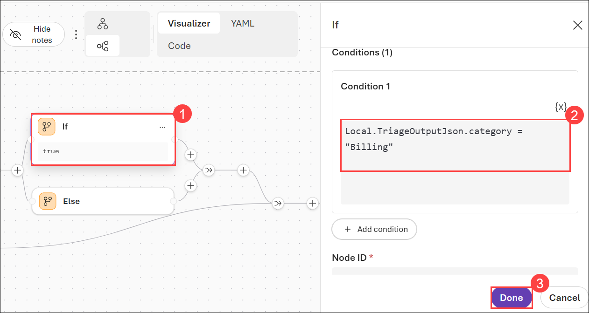

1. Select the **+** (plus) **(1)** icon under the **If** branch of the **If/Else** node to add a new node that drafts a response.

1. In the workflow actions menu, under **Basics**, select **Deliver message (2)** to add a send message activity.

    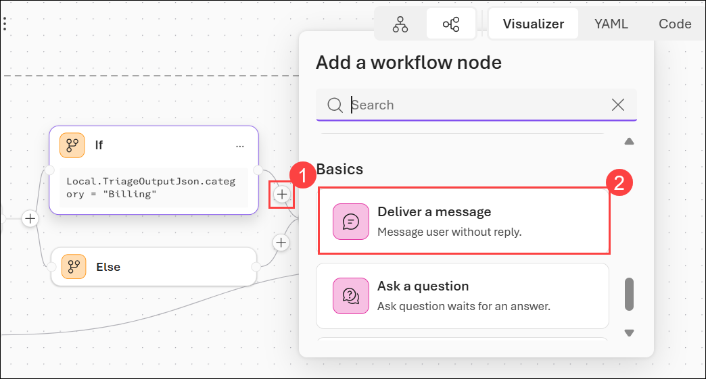

1. In the **Deliver message** node editor, set the **Message to send (1)** to the following response:

    ```output
   Escalate billing issue to human support team.
    ```

1. Select **Done (2)** to save the node.

    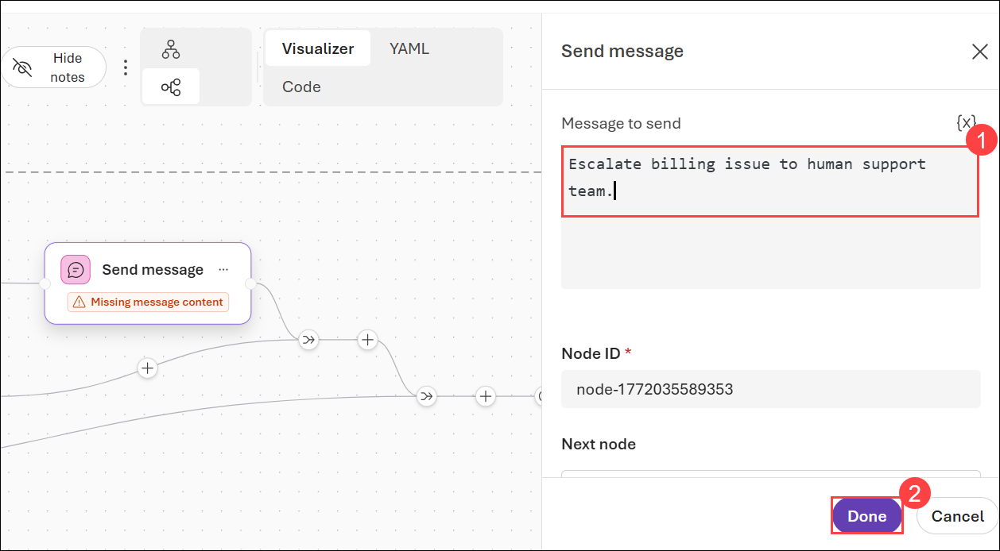

### Task 1.7: Generate a recommended response

In this task, you will invoke the Resolution Agent to automatically generate a professional support response for non-billing tickets based on the classified category.

1. In the visualizer, select the **+** (plus) **(1)** icon under the **Else** branch of the second **If/Else** node to add a new node that drafts a response for non-billing tickets.

1. In the workflow actions menu, under **Invoke**, select **Agent (2)** to add an agent node.

    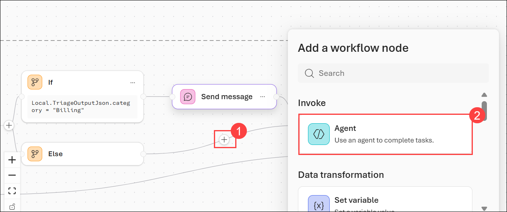

1. In the **Agent** pane, open the **Select an agent (1)** dropdown, and then select **Create a new agent (2)** from the list.

    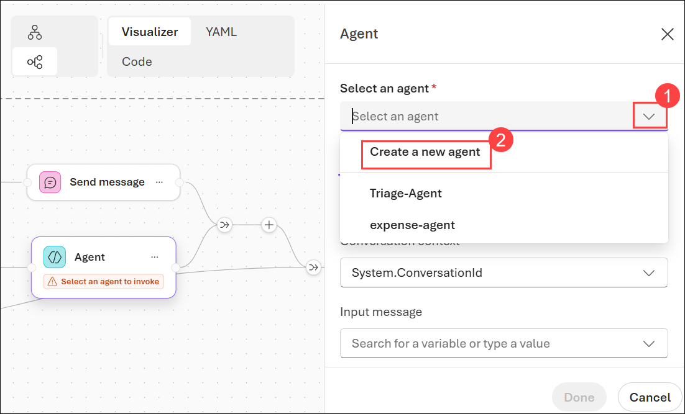

1. In the **Create an agent** pane, enter **Resolution-Agent (1)** as the agent name, and then select **Create (2)**.

    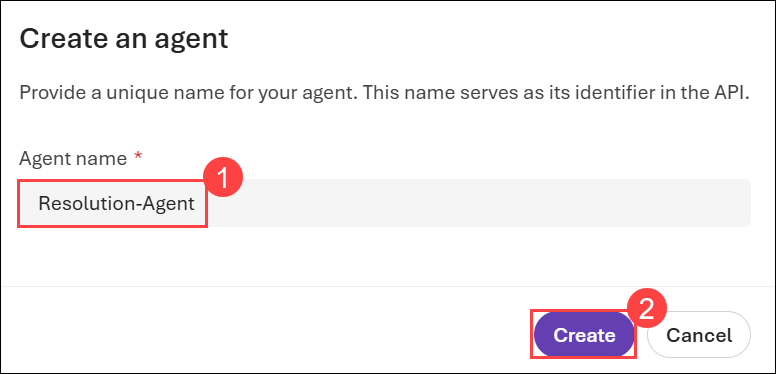

1. In the agent editor, set the **Instructions (1)** field to the following prompt:

    ```output
    You are a customer support resolution assistant for ContosoPay, a B2B payments and invoicing platform.

    Your task is to draft a clear, professional, and friendly support response based on the issue category and customer message.

    Guidelines:
    If the issue category is Technical:
    Suggest 1–2 common troubleshooting steps at a high level.

    Avoid asking for logs, credentials, or sensitive data.

    Do not imply fault by the customer.
    If the issue category is General:
    Provide a concise, helpful explanation or guidance.
    Keep the response under 5 sentences.

    Tone:
    Professional, calm, and supportive
    Clear and concise
    No emojis

    Output:
    Return only the drafted response text.
    Do not include internal reasoning or analysis.
    ```

1. Select **Node settings (2)** to configure the input and output of the agent.

    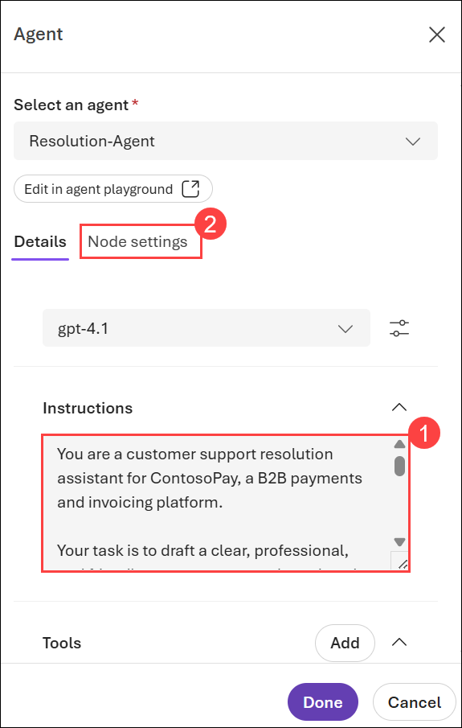

1. Set the **Input message** field to the `Local.TriageOutputText` variable.

    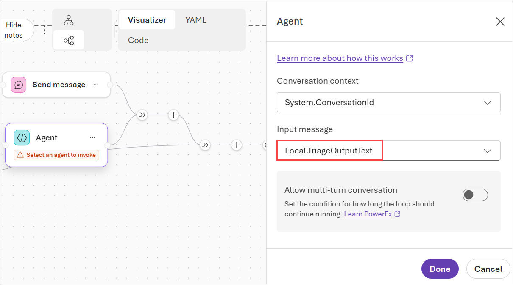

1. Under **Save agent output message as**, create a new variable by entering `ResolutionOutputText` **(1)** and select **Create new variable (2)** from the drop-down.

1. Select **Done (3)** to save the node.

    

> **Congratulations** on completing the task! Now, it's time to validate it. Here are the steps:
>
> - Hit the Validate button for the corresponding task. If you receive a success message, you can proceed to the next task.
> - If not, carefully read the error message and retry the step, following the instructions in the lab guide.
> - If you need any assistance, please contact us at cloudlabs-support@spektrasystems.com. We are available 24/7 to help.
 
<validation step="098c74c3-c5e2-4bfd-815b-f4941b9fb57a" />

### Task 1.8: Preview the workflow

In this task, you will test and validate the workflow by running a preview to observe how support tickets are processed, classified, escalated, and resolved automatically in Microsoft Foundry.

1. Select the **Save** button to save all changes to your workflow.

    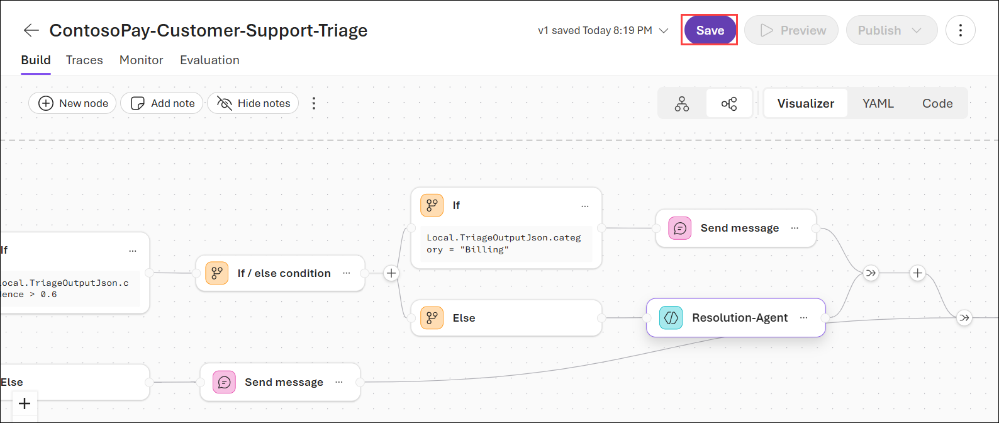

1. Select the **Preview** button to start the workflow.

    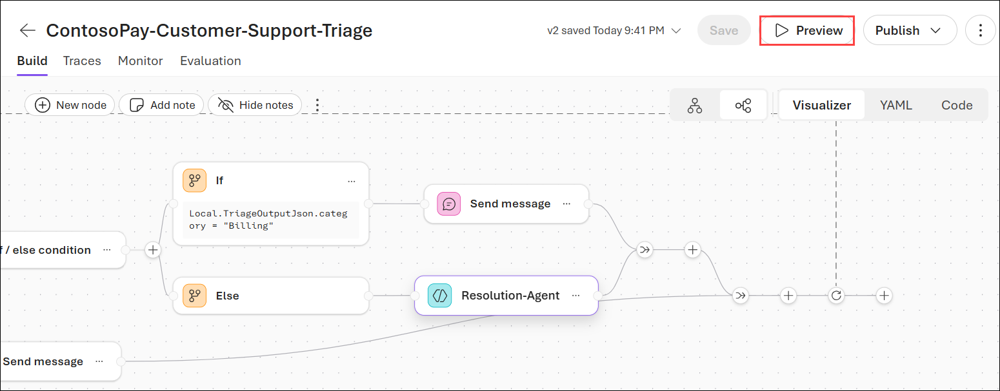

1. In the **Preview** pane,  enter some text to trigger the workflow `Start processing support tickets.` in the message box (1), and then select the **Send (2)** icon.

    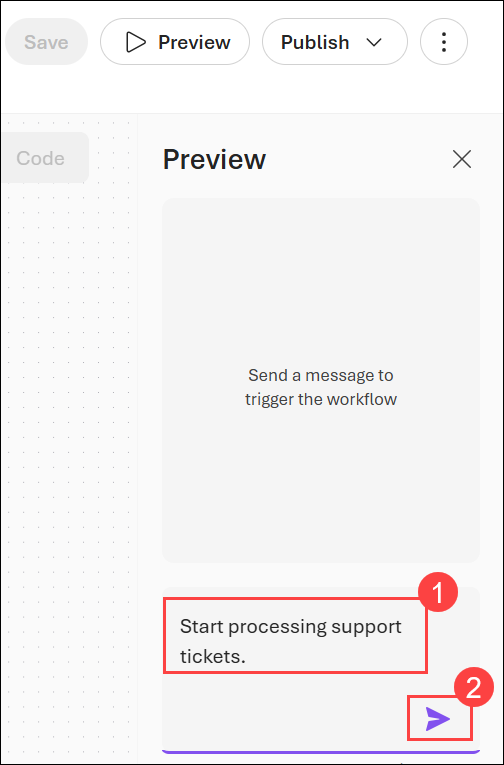

1. Observe the workflow as it processes each support ticket in sequence. Review the messages generated by the workflow in the chat window.

    You should see some output indicating that billing issues are being escalated, while technical and general issues receive drafted responses. For example:

    ```output
    Current Ticket:
    The API returns a 403 error when creating invoices, but our API key hasn't changed.

    Copilot said:
    Thank you for reaching out about the 403 error when creating invoices. This error typically indicates a permissions or access issue. 
    Please ensure that your API key has the necessary permissions for invoice creation and that your request is being sent to the correct endpoint. 
    If the issue persists, try regenerating your API key and updating it in your integration to see if that resolves the problem.
    ```

    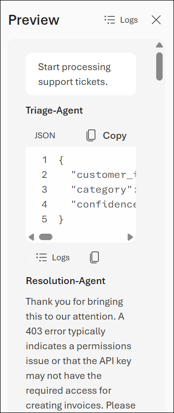

## Task 2: Use your workflow in code

Now that you've built and tested your workflow in the Foundry portal, you can also invoke it from your own code using the Azure AI Projects SDK. This allows you to integrate the workflow into your applications or automate its execution.

### Task 2.1: Prepare the environment

In this task, you will prepare the environment in Microsoft Azure by setting up Cloud Shell, cloning the repository, and accessing the Python files required to invoke the workflow programmatically.

1. In the **Azure portal**, select the **Cloud Shell** icon in the top navigation bar to open a new Cloud Shell session.

    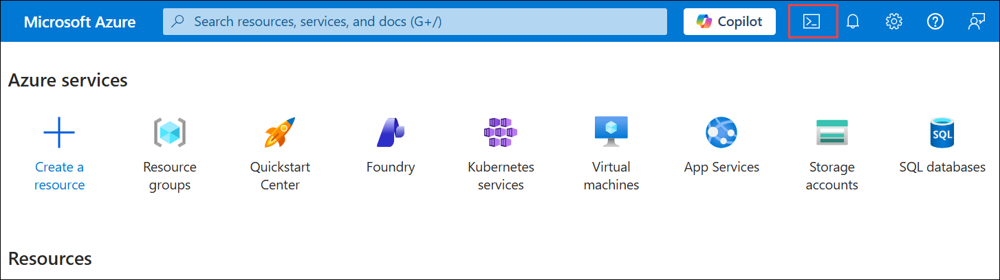

1. In the Cloud Shell toolbar, open the **Settings (1)** menu and choose **Go to Classic version (2)** from the drop-down.

    

    >**Note:** **Ensure you've switched to the classic version of the cloud shell before continuing.**

1. In the cloud shell pane, enter the following commands to clone the GitHub repo containing the code files for this exercise (type the command, or copy it to the clipboard and then right-click in the command line and paste as plain text):

    ```
   rm -r ai-agents -f
   git clone https://github.com/MicrosoftLearning/mslearn-ai-agents ai-agents
    ```

    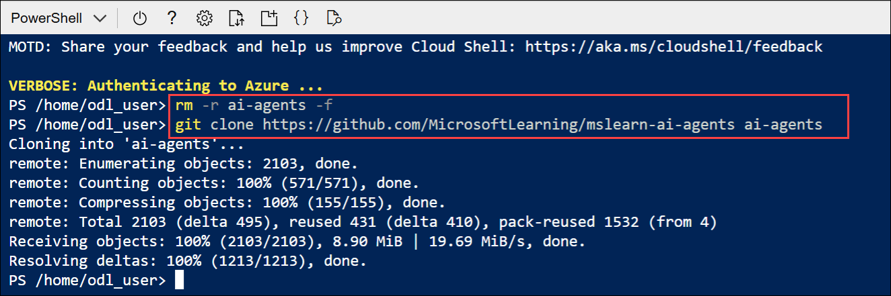

    > **Tip:** As you enter commands into the cloud shell, the output may take up a large amount of the screen buffer and the cursor on the current line may be obscured. You can clear the screen by entering the `cls` command to make it easier to focus on each task.

1. When the repo has been cloned, enter the following command to change the working directory to the folder containing the code files and list them all.

    ```
   cd ai-agents/Labfiles/08-build-workflow-ms-foundry/Python
   ls -a -l
    ```

    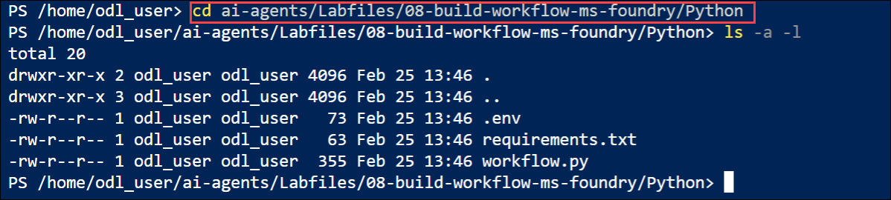

    - The provided files include application code and a file for configuration settings.

### Task 2.2: Configure the application settings

In this task, you will configure the application settings by installing dependencies and updating the project endpoint and model deployment details to connect your code with Microsoft Foundry.

1. In the cloud shell command-line pane, enter the following command to install the libraries you'll use:

    ```
   python -m venv labenv
   ./labenv/bin/Activate.ps1
   pip install -r requirements.txt
    ```

    > **Tip:** As you enter commands into the cloud shell, the output may take up a large amount of the screen buffer and the cursor on the current line may be obscured. You can clear the screen by entering the `cls` command to make it easier to focus on each task.

1. Enter the following command to edit the configuration file that is provided:

    ```
   code .env
    ```

1. In the code file, replace the placeholder values with the correct details for your project:

    * PROJECT\_ENDPOINT: **Foundry project endpoint (1)**
    * MODEL\_DEPLOYMENT\_NAME: **gpt-4.1 (2)**

         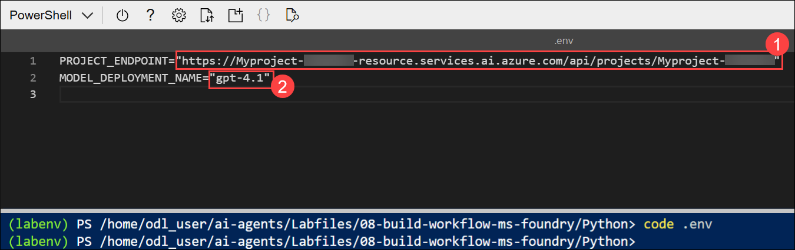

         > **Note:** Paste the project endpoint you copied in Lab 1 – Task 1.

1. After you've replaced the placeholders, use the **CTRL+S** command to save your changes and then use the **CTRL+Q** command to close the code editor while keeping the cloud shell command line open.

### Task 2.3: Connect to the workflow and run it

In this task, you will connect your Python application to the workflow and run it programmatically using the Azure AI Projects SDK to automate customer support processing.

> **Tip:** As you add code, be sure to maintain the correct indentation. Use the comment indentation levels as a guide.

1. Enter the following command to edit the **workflow.py** file:

    ```
   code workflow.py
    ```

    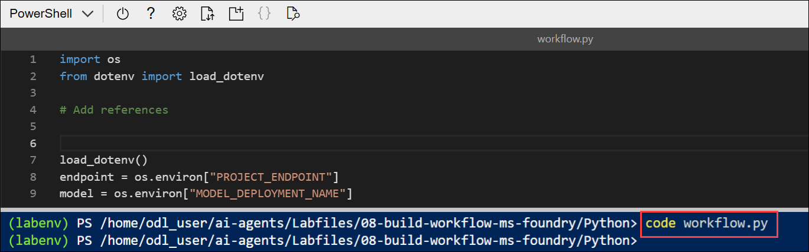

1. Review the code in the file, noting that it contains strings for each agent name and instructions.

1. Find the comment **Add references** and add the following code to import the classes you'll need:

    ```python
   # Add references
   from azure.identity import AzureCliCredential
   from azure.ai.projects import AIProjectClient
   from azure.ai.projects.models import ItemType
    ```

    

1. Note that code to load the project endpoint and model name from your environment variables has been provided.

1. Find the comment **Connect to the agents client**, and add the following code to create an AgentsClient connected to your project:

    > **Tip:** When adding subsequent code, be sure to maintain the right level of indentation.

    ```python
   # Connect to the AI Project client
   with (
       AzureCliCredential() as credential,
       AIProjectClient(endpoint=endpoint, credential=credential) as project_client,
       project_client.get_openai_client() as openai_client,
   ):
    ```

    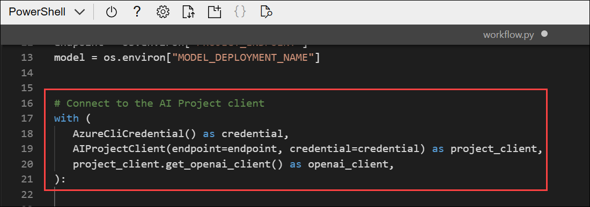

    - Now you'll add code that uses the AgentsClient to create multiple agents, each with a specific role to play in processing a support ticket.

1. Find the comment **Specify the workflow** and the following code:

    ```python
   # Specify the workflow
    workflow = {
        "name": "ContosoPay-Customer-Support-Triage",
        "version": "1",
    }
    ```

    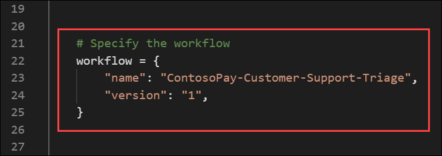

    - Be sure to use the name and version of the workflow you created in the Foundry portal.

1. Find the comment **Create a conversation and run the workflow**, and add the following code to create a conversation and invoke your workflow:

    ```python
    # Create a conversation and run the workflow
    conversation = openai_client.conversations.create()
    print(f"Created conversation (id: {conversation.id})")

    stream = openai_client.responses.create(
        conversation=conversation.id,
        extra_body={"agent": {"name": workflow["name"], "type": "agent_reference"}},
        input="Start",
        stream=True,
        metadata={"x-ms-debug-mode-enabled": "1"},
    )
    ```

    

    - This code will stream the output of the workflow execution to the console, allowing you to see the flow of messages as the workflow processes each ticket.

1. Find the comment **Process events from the workflow run**, and add the following code to process the streamed output and print messages to the console:

    ```python
    # Process events from the workflow run
    for event in stream:
        if (event.type == "response.completed"):
            print("\nResponse completed:")
            for message in event.response.output:
                if message.content:
                    for content_item in message.content:
                        if content_item.type == 'output_text':
                            print(content_item.text)
        if (event.type == "response.output_item.done") and event.item.type == ItemType.WORKFLOW_ACTION:
            print(f"item action ID '{event.item.action_id}' is '{event.item.status}' (previous action ID: '{event.item.previous_action_id}')")
    ```

    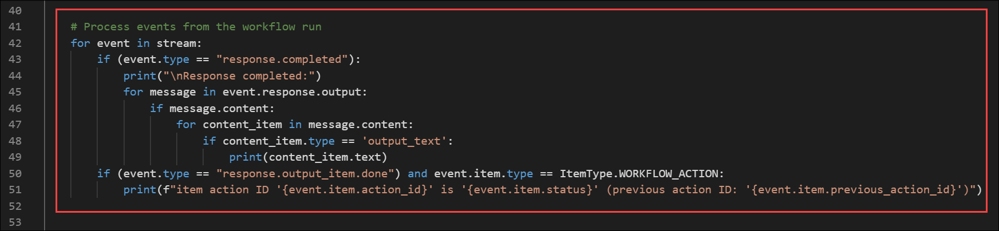

1. Find the comment **Clean up resources**, and enter the following code to delete the conversation when it is longer required:

    ```python
   # Clean up resources
   openai_client.conversations.delete(conversation_id=conversation.id)
   print("\nConversation deleted")
    ```

    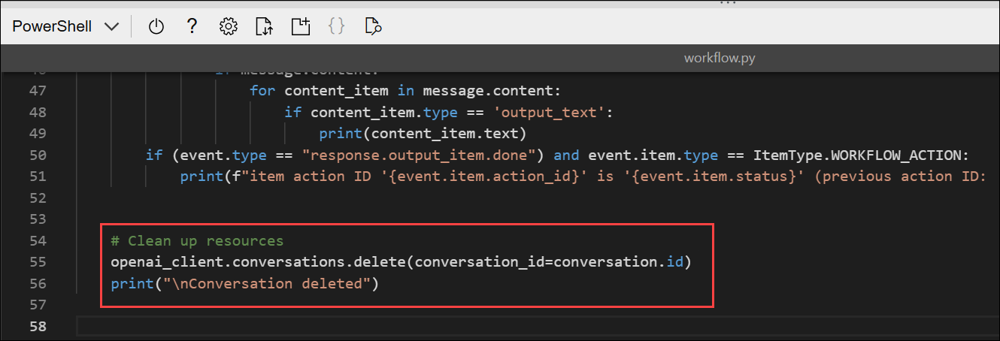

1. Use the **CTRL+S** command to save your changes to the code file. You can keep it open (in case you need to edit the code to fix any errors) or use the **CTRL+Q** command to close the code editor while keeping the cloud shell command line open.

### Task 2.4: Run the app

In this task, you will execute the Python application to run and validate the AI-powered workflow end-to-end.

1. In the Cloud Shell console, enter the following command to run the application:

    ```
   python workflow.py
    ```

1. Wait a moment for the workflow to process the tickets. As the workflow runs, you should see output in the console indicating the progress of the workflow, including messages generated by the agents and status updates for each action in the workflow.

1. When the workflow completes, you should see some output similar to the following:

    ```output
    Created conversation (id: {id})
    item action ID 'action-{id}' is 'completed' (previous action ID: 'trigger_id')
    item action ID 'action-{id}' is 'completed' (previous action ID: 'action-{id}')
    item action ID 'action-{id}' is 'completed' (previous action ID: 'action-{id}_Start')
    ...

    Response completed:
    ...
    Current Ticket:
    I was charged twice for the same invoice last Friday and my customer is also seeing two receipts. Can someone fix this?
    {"customer_issue":"I was charged twice for the same invoice last Friday and my customer is also seeing two receipts. Can someone fix this?","category":"Billing","confidence":1}
    Escalation required
    ```
    
    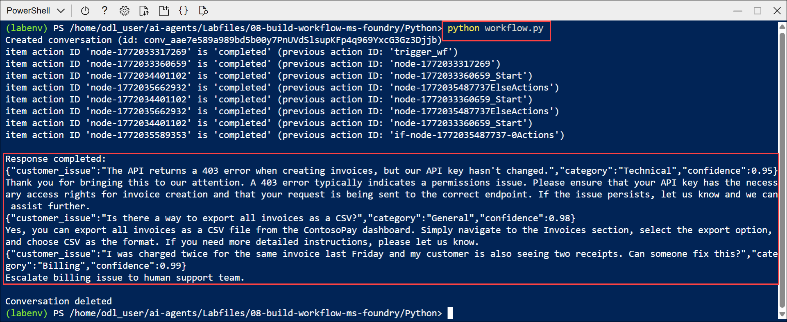

1. In the Cloud Shell window, select the **Close (X)** icon to exit Cloud Shell before proceeding to the next lab.

## Summary

In this lab, you created a sequential workflow in Microsoft Foundry to process customer support tickets. You implemented conditional logic and configured AI agents to generate structured, JSON-formatted outputs. The workflow classified each ticket using an AI agent, handled low-confidence classifications by requesting additional information, and generated recommended responses for non-billing issues. Finally, you validated the workflow to ensure it correctly processed and responded to support requests.

### You have successfully completed the lab. Click on **Next >>** to proceed with the next Lab.

   