# Lab 10: Build a workflow in Microsoft Foundry

### Estimated Duration: 60 Minutes

## Overview

In this lab, you will build a customer support triage workflow using Microsoft Foundry. You will create a sequential workflow that processes support tickets, classifies them using an AI agent, and applies conditional logic based on confidence scores and categories. The workflow routes billing issues for escalation and generates automated responses for other cases. Finally, you will integrate and run the workflow using a Python client application to validate end-to-end execution.

**Workflow overview**

- Collect incoming support tickets
    
    The workflow starts with a predefined array of customer support issues. Each item in the array represents an individual support ticket submitted to ContosoPay.

- Process tickets one at a time
    
    A for-each loop iterates over the array, ensuring each support ticket is handled independently while using the same workflow logic.

- Classify each ticket with an AI agent
    
    For each ticket, the workflow invokes a Triage Agent to classify the issue as Billing, Technical, or General, along with a confidence score.

- Handle uncertainty with conditional logic
    
    If the confidence score is below a defined threshold, the workflow recommends additional info for that ticket.

- Route based on issue category
    
    Billing issues are flagged for escalation and removed from the automated resolution path.
    Technical and General issues continue through automated handling.

- Generate a recommended response
    
    For non-billing tickets, the workflow invokes a Resolution Agent to draft a category-appropriate support response.

    > **Note:** The workflow builder in Microsoft Foundry is currently in preview. You may experience some unexpected behavior, warnings, or errors.

## Lab Objectives

- **Task 1:** Create a Foundry project

- **Task 2:** Create a customer support triage workflow

- **Task 3:** Install the Microsoft Foundry VS Code extension

- **Task 4:** Sign in to Azure and set the Foundry project

- **Task 5:** Clone the starter code repository

- **Task 6:** Connect to the workflow and run it

- **Task 7:** Sign into Azure and run the app

## Task 1: Create a Foundry project

In this task, you will sign in to the Microsoft Foundry portal and create a new project in Microsoft Azure. You will then deploy the GPT-4.1 model and configure AI agents that will be used in the workflow.

1. Open a new tab in the browser, right-click on the following link [Foundry portal](https://ai.azure.com), then **Copy link** and paste it in a browser tab to log in to **Microsoft Foundry portal**.

1. Click on **Sign in**.
 
    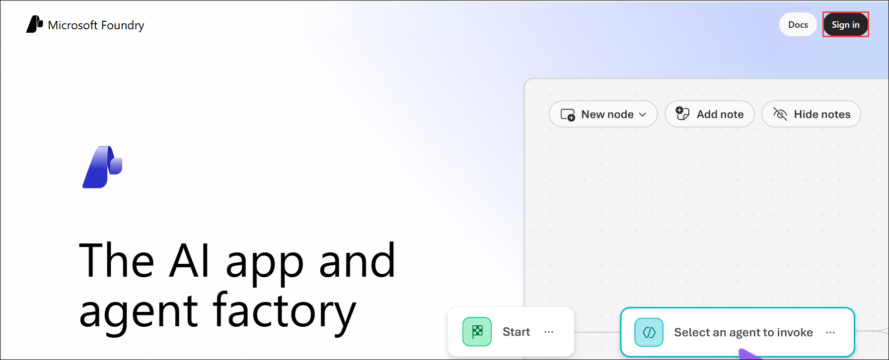

1. If prompted, provide the credentials below:
 
   - **Email/Username:** <inject key="AzureAdUserEmail"></inject>
    
     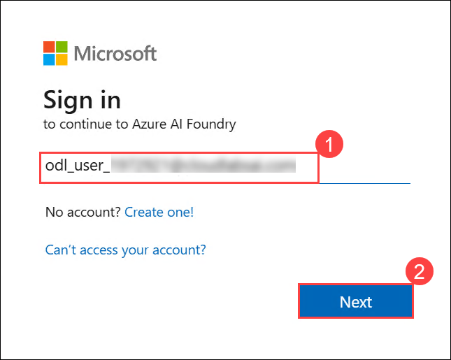

   - **Password:** <inject key="AzureAdUserPassword"></inject>
    
     

1. When the **Stay signed in?** window appears, select **No**.

    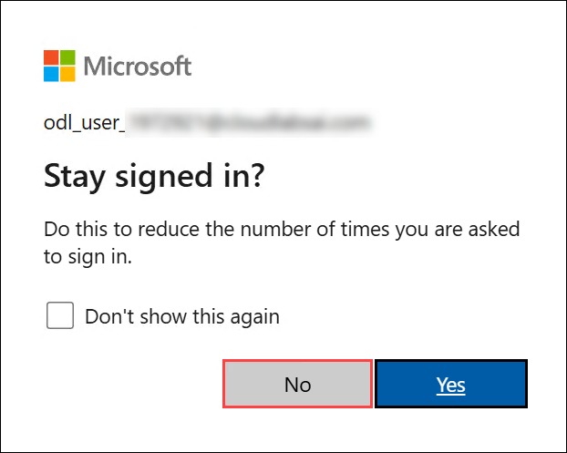
    
    >**Note:** Close any tips or quick start panes that are opened the first time you sign in, and if necessary use the **Foundry** logo at the top left to navigate to the home page, which looks similar to the following image (close the **Help** pane if it's open):

1. At the top of the **Microsoft Foundry** portal, enable the **New Foundry toggle (1)** to switch to the latest Foundry user interface.

1. From the **Select a project to continue** dialog, click the drop-down under **Select or search for a project**, and then select **Create a new project (2)**.

     

1. In the **Create a project** window, enter **Myproject<inject key="DeploymentID"></inject> (1)** as the project name. Open the **Advanced options (2)** drop-down, fill in the following details, and then click **Create (7)**:

    * Subscription: **Choose Default Subscription (3)**
    * Resource group: **AI-3026-RG8 (4)**
    * Microsoft Foundry resource: **Keep as Default (5)**
    * Region: **<inject key="Region"></inject> (6)**

      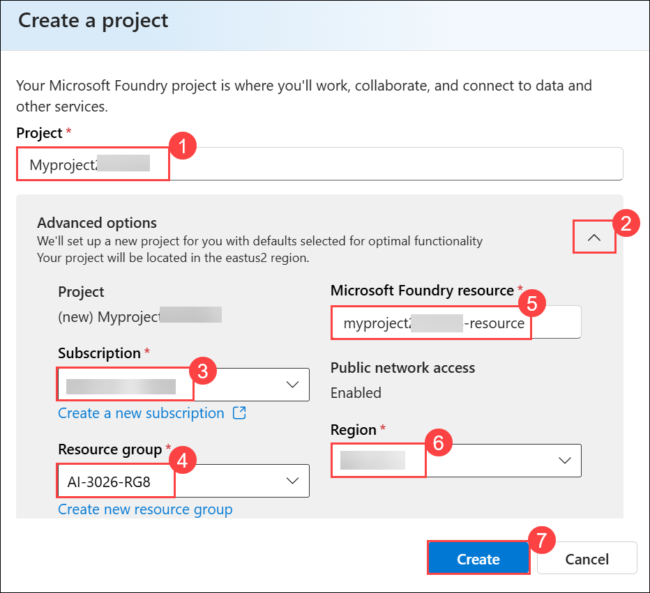

      >**Note:**  Some Azure AI resources are constrained by regional model quotas. In the event of a quota limit being exceeded later in the exercise, there's a possibility you may need to create another resource in a different region.

1. Wait for your project created. It may take a few minutes.

1. On the **Microsoft Foundry** home page, click **Start building (1)**, and then select **Browse models (2)** from the drop-down menu.

     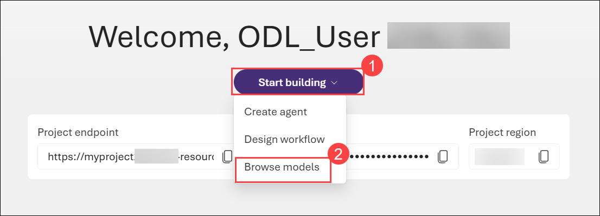

1. On the **Models** page, search for **gpt-4.1 (1)** in the search bar, and then select the **gpt-4.1 (2)** model from the search results.

     

1. On the **gpt-4.1** model details page, click **Deploy (1)**, and then select **Default settings (2)** to deploy the model using the standard configuration.

    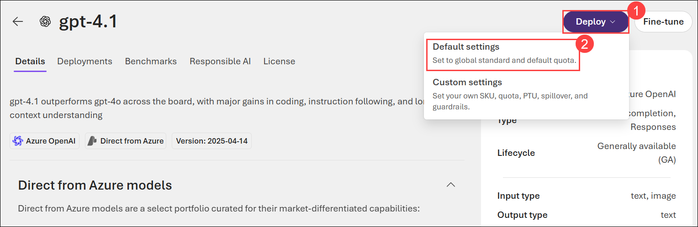

    - After the model is deployed, the playground for the model is displayed.

1. Select **Save as agent (1)**, enter **Triage-Agent (2)** as the *Agent name*, and then select **Create (3)**.

    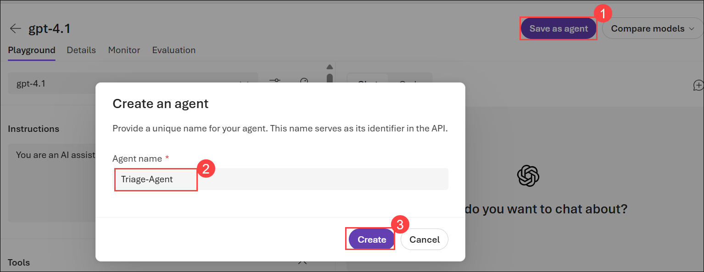

1. Select **Agents (1)**, choose **Create agent (2)**, enter **Resolution-Agent (3)** as the *Agent name*, and then select **Create (4)**.

    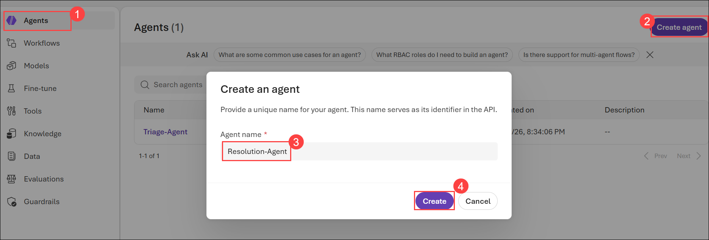

1. In the navigation bar on the left, select **Microsoft Foundry** to return to the Foundry home page.

     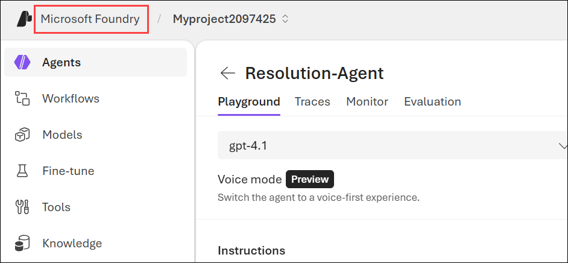

1. Copy the **Project endpoint** value to a notepad, as you'll use them to connect to your project in a client application.

    


> **Congratulations** on completing the task! Now, it's time to validate it. Here are the steps:
>
> - Hit the Validate button for the corresponding task. If you receive a success message, you can proceed to the next task.
> - If not, carefully read the error message and retry the step, following the instructions in the lab guide.
> - If you need any assistance, please contact us at cloudlabs-support@spektrasystems.com. We are available 24/7 to help.
 
<validation step="50166eb4-241b-47fd-bbc7-795014988b07" />

## Task 2: Create a customer support triage workflow

In this task, you will create a sequential customer support triage workflow in Microsoft Foundry that uses AI agents to classify and respond to support tickets for ContosoPay.

1. On the Foundry portal home page, select **Build** from the toolbar menu.

     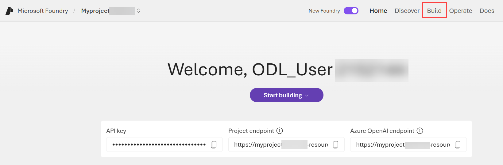

1. In the **Agents** page, select **Workflows (1)**, then choose **Create (2)** > **Blank workflow (3)** to create a new blank workflow.

    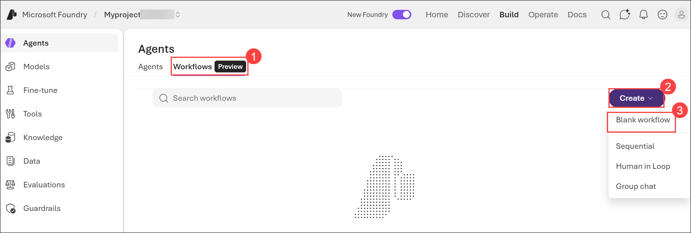

    - The type of workflow you'll create in this exercise is a sequential workflow. However, starting with a blank workflow will simplify the process of adding the necessary nodes.

1. Select **Save (1)** in the visualizer to save your new workflow. In the dialog box, copy and use the **following name (2)**, then select **Save (3)**.

    ```
    ContosoPay-Customer-Support-Triage
    ```

    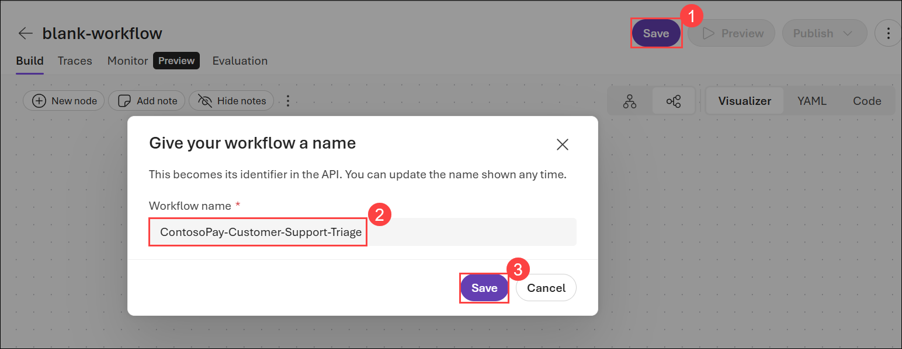

### Task 2.1: Create a ticket array variable

In this task, you will initialize a support ticket array variable in the workflow to simulate incoming customer requests for automated processing in Microsoft Foundry.

1. In the workflow visualizer, select the **+** (plus) **(1)** icon to add a new node.

1. In the workflow actions menu, under **Data transformation**, select **Set variable (2)** to add a node that initializes an array of support tickets.

    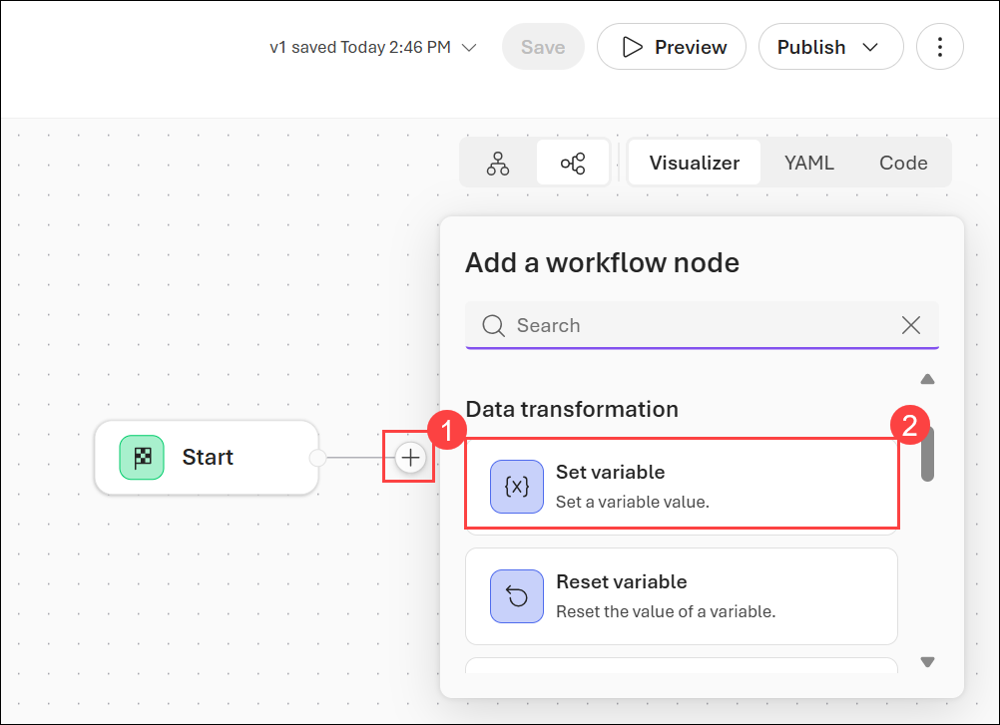

1. In the **Set variable** node editor, create a new variable by entering **SupportTickets (1)** and selecting **Create new variable** from drop down.

    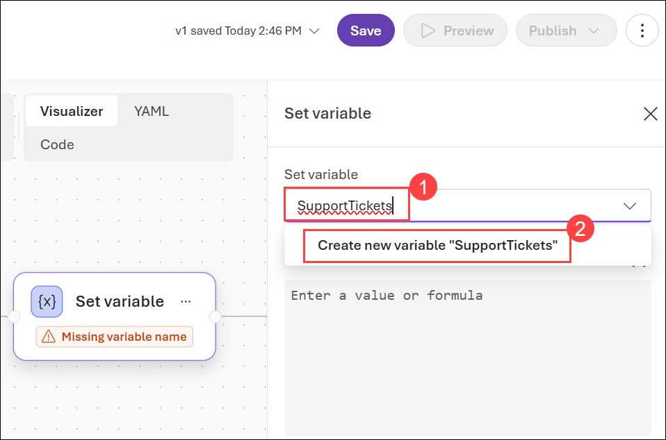

    - The new variable should appear as `Local.SupportTickets`.

1. In the **To value (1)** field, enter the following array that contains sample support tickets:

    ```output
   [ 
    "The API returns a 403 error when creating invoices, but our API key hasn't changed.", 
    "Is there a way to export all invoices as a CSV?", 
    "I was charged twice for the same invoice last Friday and my customer is also seeing two receipts. Can someone fix this?"]
    ```

1. Select **Done (2)** to save the node.

    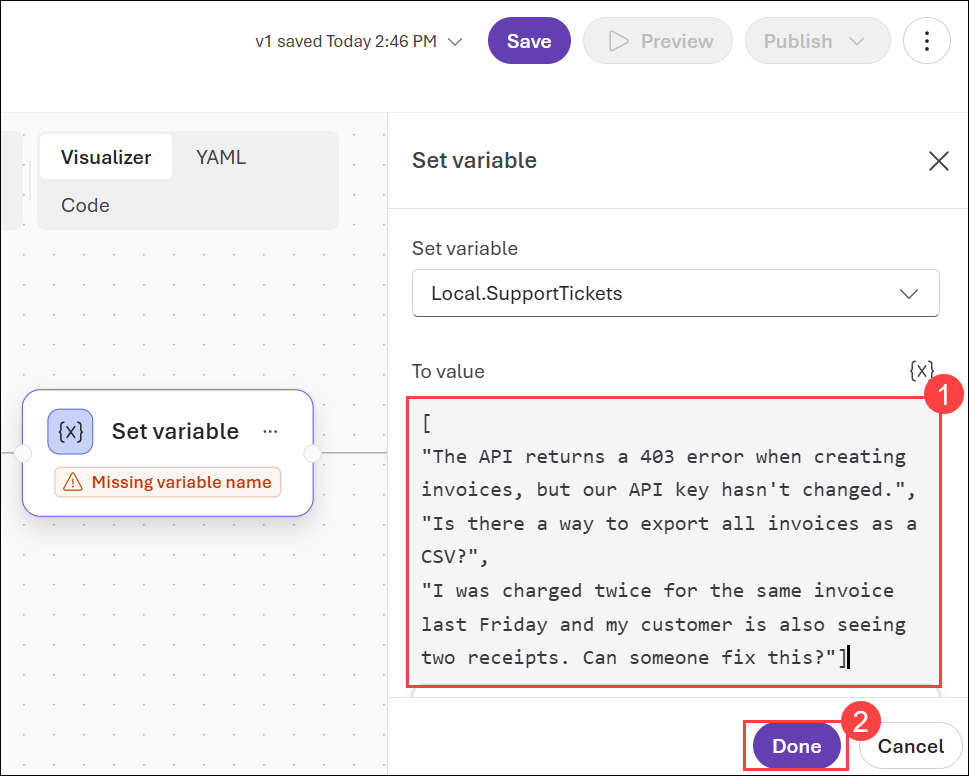

### Task 2.2: Add a for-each loop to process tickets

In this task, you will configure a for-each loop to iterate through each support ticket and process them individually within the workflow.

1. Select the **+ (1)** icon next to **Set variable**, scroll under **Flow**, and then choose **For each (2)** to add a loop for processing each support ticket.

     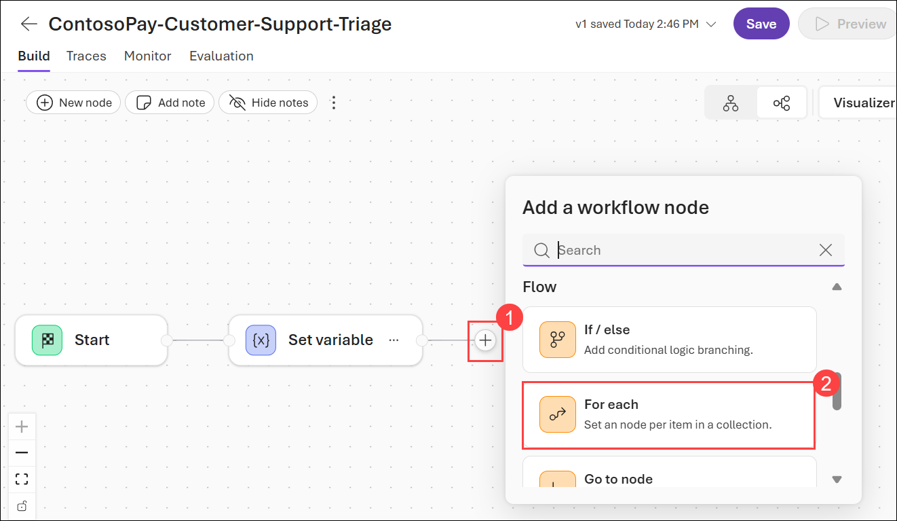

1. In the **For each** node editor, set **Select the items to loop for each (1)** to `Local.SupportTickets`, enter **CurrentTicket (2)** in the **Loop Value Variable** field, and then select **Create new variable "CurrentTicket" (3)**.

    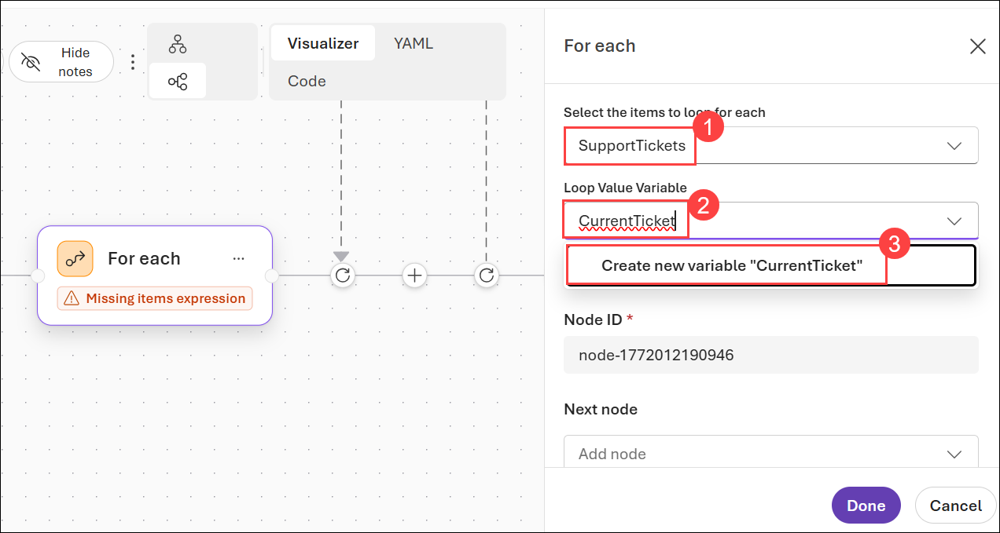

1. Select **Done** to save the node.

    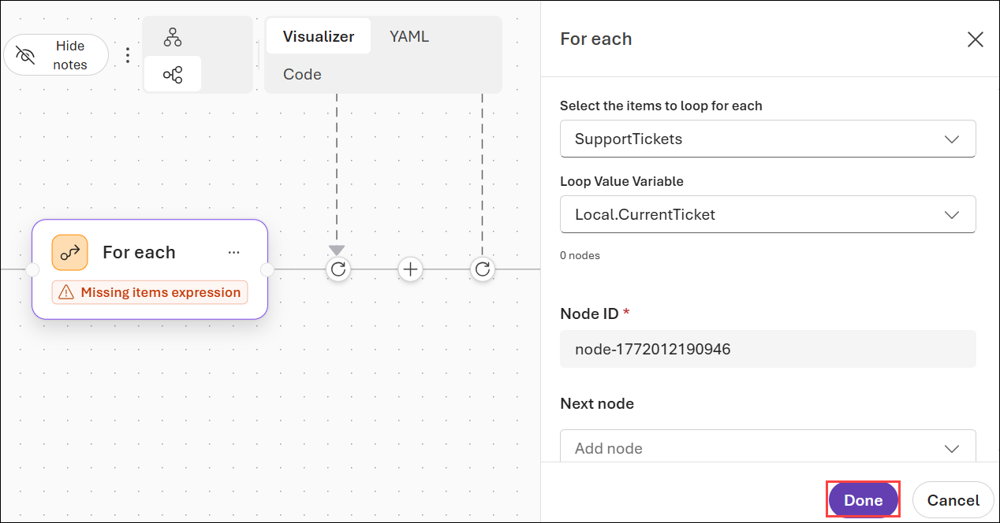

### Task 2.3: Invoke an agent to classify the ticket

In this task, you will invoke the Triage Agent to classify each support ticket into a category and generate a confidence score using structured JSON output.

1. Select the **+** (plus) **(1)** icon within the **For each** node to add a new node that classifies the current support ticket.

1. In the workflow actions menu, under **Invoke**, select **Agent (2)** to add an agent node.

    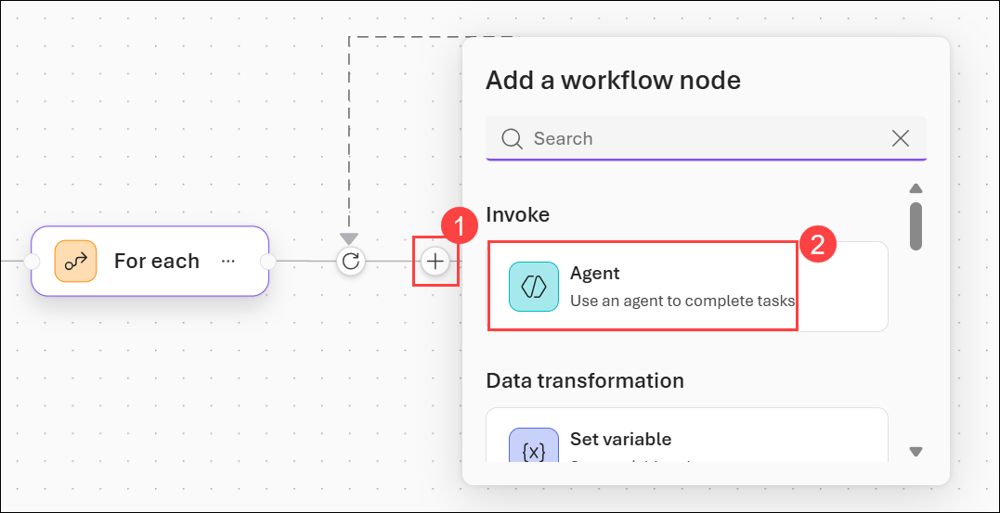

1. In the **Agent** node pane, open the **Select an agent (1)** dropdown, and then choose **Triage-Agent (2)**.

    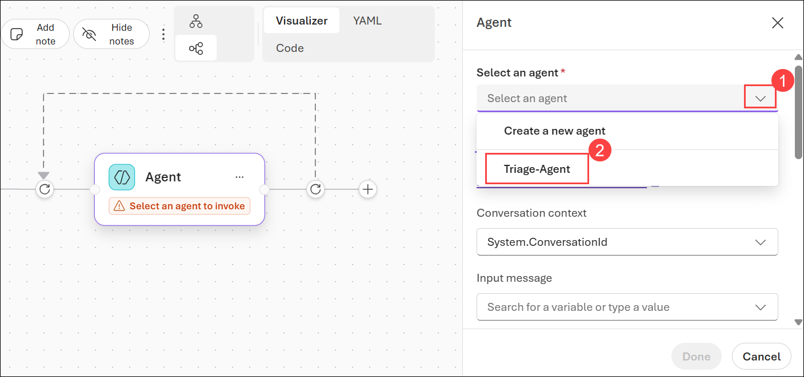

1. In the **Details (1)** tab, select the **Parameters (2)** icon next to the model name.

    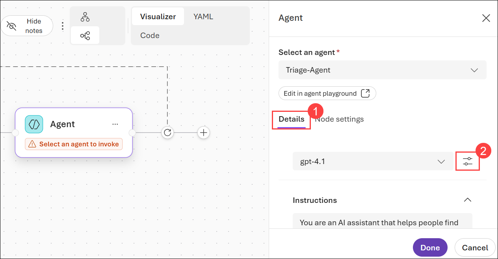

1. In the **Parameters** pane, open the **Text format (1)** dropdown, and then select **JSON Schema (2)**.

    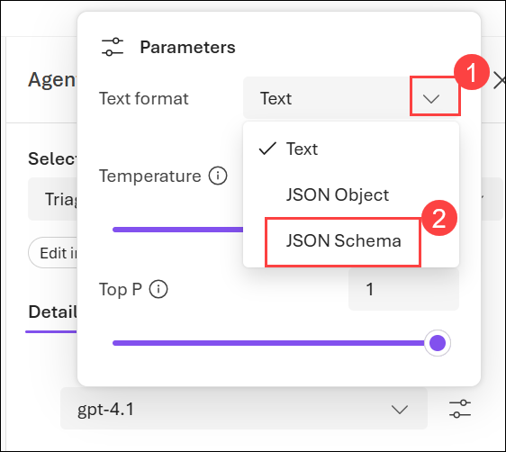

1. In the **Add response format** pane, enter the following definition **(1)** and select **Save (2)**:

    ```json
    {
    "name": "category_response",
    "schema": {
        "type": "object",
        "properties": {
            "customer_issue": {
                "type": "string"
            },
            "category": {
                "type": "string"
            },
            "confidence": {
                "type": "number"
            }
        },
        "additionalProperties": false,
        "required": [
            "customer_issue",
            "category",
            "confidence"
        ]
    },
    "strict": true
    }
    ```

    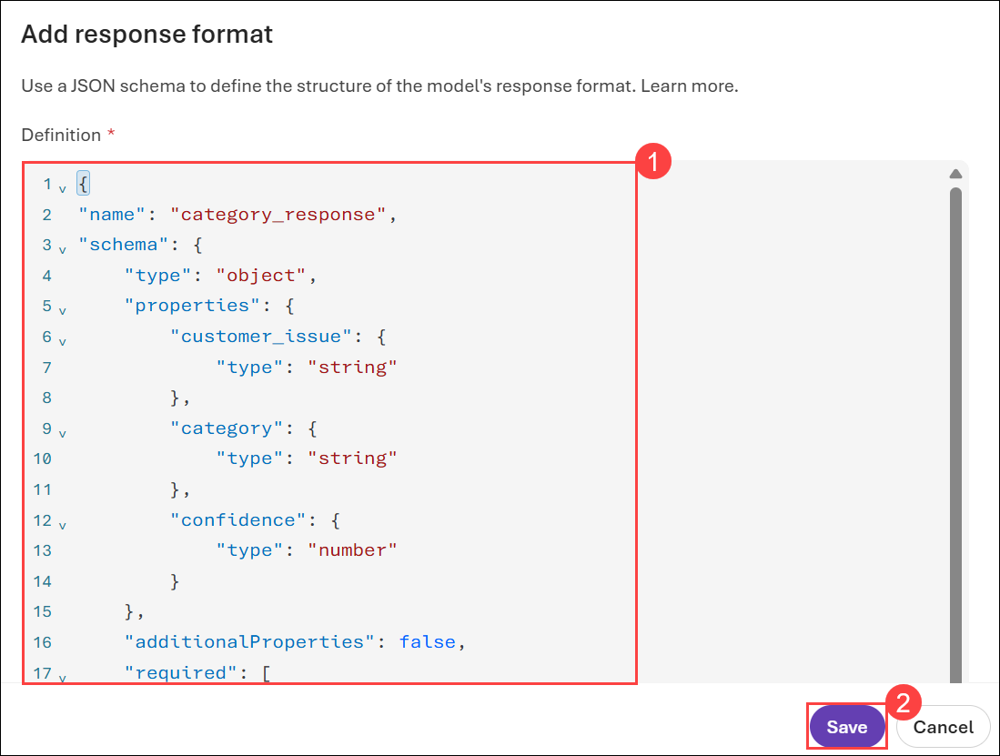

1. In the Agent **Details** pane, set the **Instructions (1)** field to the following prompt:

    ```output
    Classify the user's problem description into exactly ONE category from the list below. Provide a confidence score from 0 to 1.

    Billing
    - Charges, refunds, duplicate payments
    - Missing or incorrect payouts
    - Subscription pricing or invoices being charged

    Technical
    - API errors, integrations, webhooks
    - Platform bugs or unexpected behavior

    General
    - How-to questions
    - Feature availability
    - Data exports, reports, or UI navigation

    Important rules
    - Questions about exporting, viewing, or downloading invoices are General, not Billing
    - Billing ONLY applies when money was charged, refunded, or paid incorrectly
    ```

1. Select **Node settings (2)** to configure the input and output of the agent.

    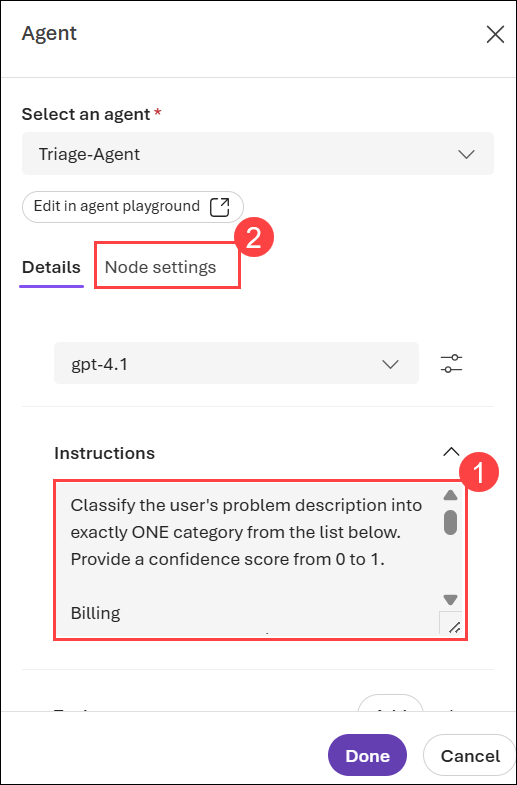

1. Set the **Input message** field to the  `Local.CurrentTicket` **(2)** variable.

    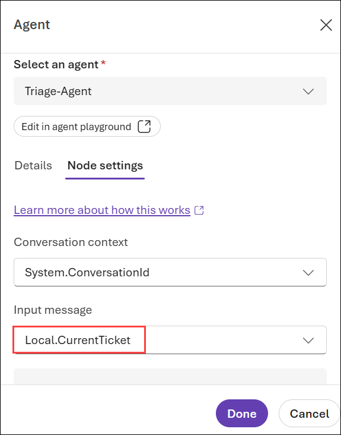

1. Under **Save agent output message as**, create a new variable by entering `TriageOutputText` **(1)** and select **Create new variable (2)** from drop down.

    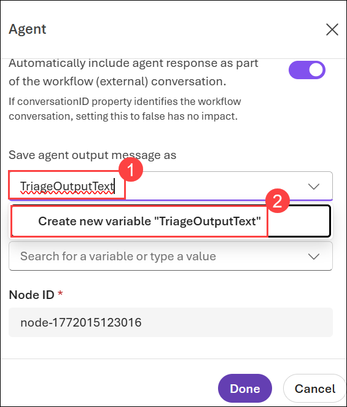

1. Under **Save the output json_object as**, create a new variable by entering `TriageOutputJson` **(1)** and select **Create new variable (2)** from drop down.

    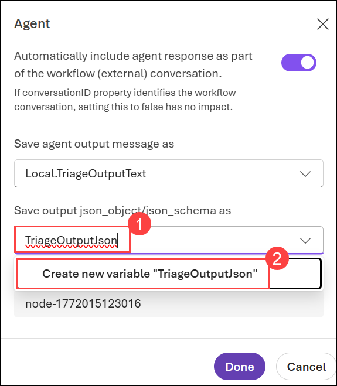

1. Select **Done** to save the node.

    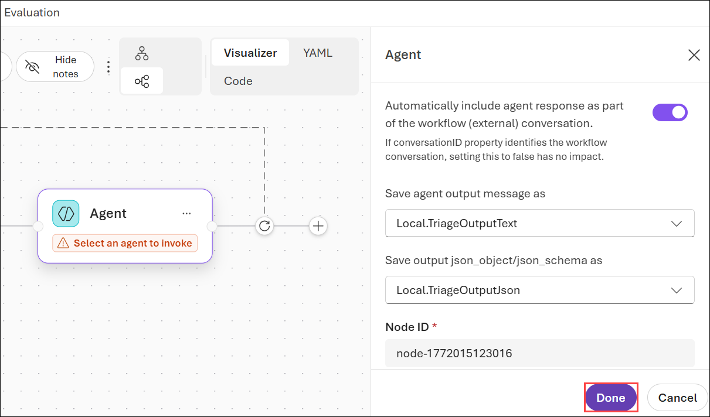

## Task 2.4: Handle low-confidence classifications

In this task, you will add conditional logic to evaluate the confidence score and determine whether the ticket classification is reliable for further automated processing.

1. Select the **+** (plus) icon below the **Invoke agent** node to add a new node that handles low-confidence classifications.

1. In the workflow actions menu, under **Flow**, select **If/Else** to add a conditional logic node.

1. Select the **+ (1)** icon next to **Triage-Agent**, and then choose **If / else (2)** under **Flow** to add a conditional logic node for handling low-confidence classifications.

    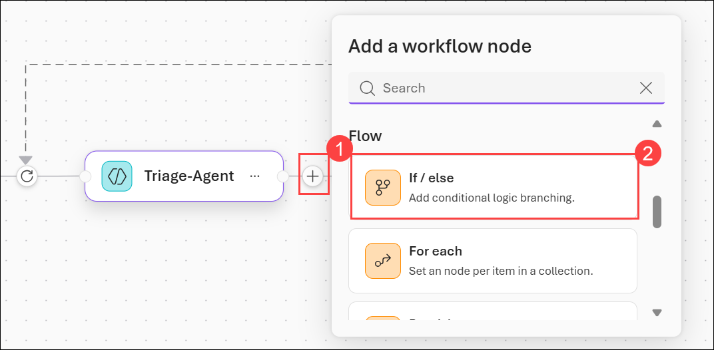

1. In the **If/Else** node editor, select **+ Add a path (1**), then click the **Edit (2)** (pencil) icon.

    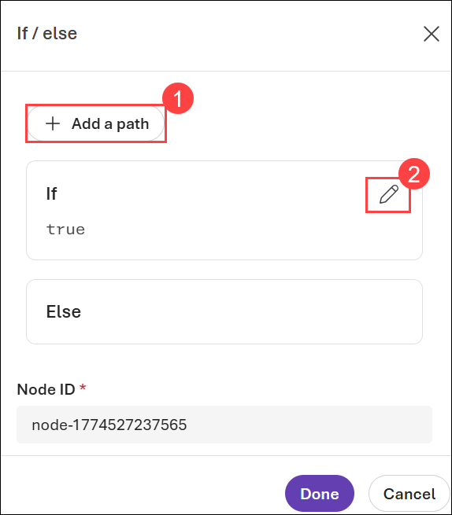

1. Clear the current value in the condition field, then enter the **following expression in Condition (1)** field to check if the confidence score is above 0.6. After that, select **Done (2)** to save the node:

    ```output
   Local.TriageOutputJson.confidence > 0.6
    ```

    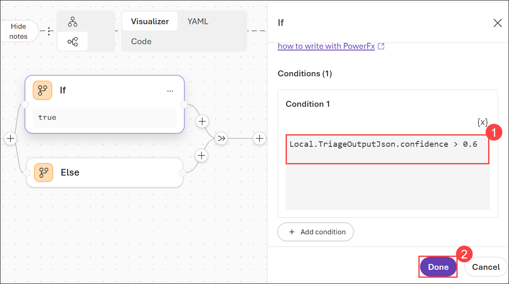

## Task 2.5: Recommend additional info for low-confidence tickets

In this task, you will configure the workflow to request additional details from the customer when the ticket classification confidence is low.

1. In the visualizer, under the **Else** branch of the **If/Else condition** node, select the **+** (plus) **(1)** icon to add a new node that recommends additional information for low-confidence tickets.

1. In the workflow actions menu, under **Basics**, select **Deliver message (3)** to add a send message activity.

    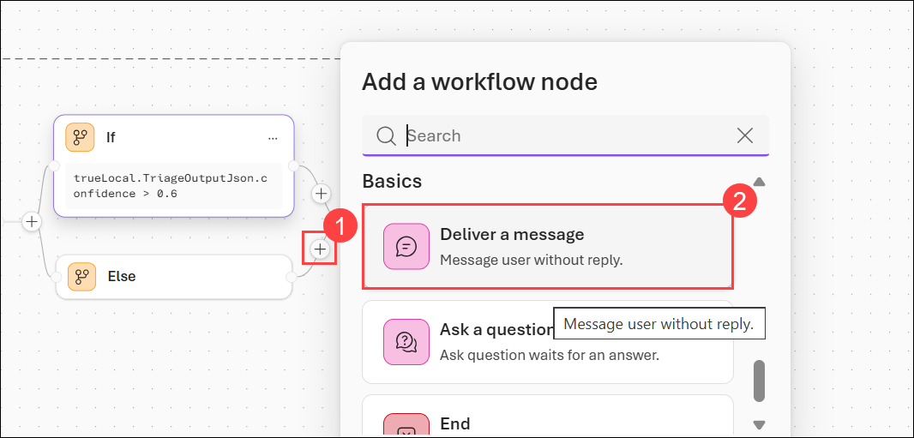

1. In the **Deliver message** node editor, set the **Message to send (1)** field to the following response and slect **Done (2)**:

    ```output
   The support ticket classification has low confidence. Requesting more details about the issue: "{Local.CurrentTicket}"
    ```

    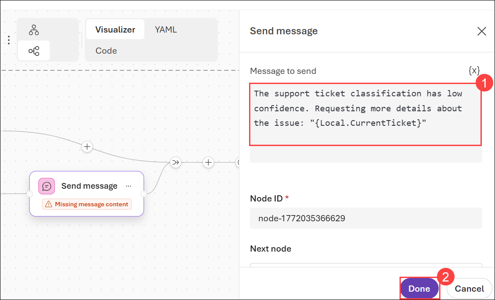

### Task 2.6: Route the ticket based on category

In this task, you will add routing logic to identify billing issues and escalate them to the human support team while allowing other categories to continue through automation.

1. In the visualizer, under the **If** branch of the **If/Else condition** node, select the **+** (plus) **(1)** icon to add a new node that routes the ticket based on its category.

1. In the workflow actions menu, under **Flow**, select **If/Else (2)** to add another conditional logic node.

    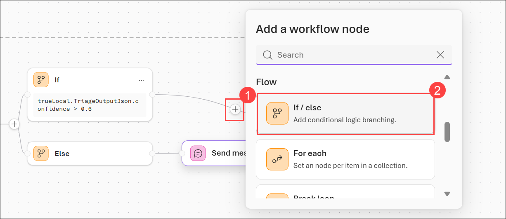

1. In the **If/Else** node editor, select **+ Add a path (1**), then click the **Edit (2)** (pencil) icon.

    

1. Clear the current value in the condition field, then enter the **following expression in Condition (1)** field to check if the ticket category is **"Billing"**. After that, select **Done (2)** to save the node:

    ```output
    Local.TriageOutputJson.category = "Billing"
    ```

    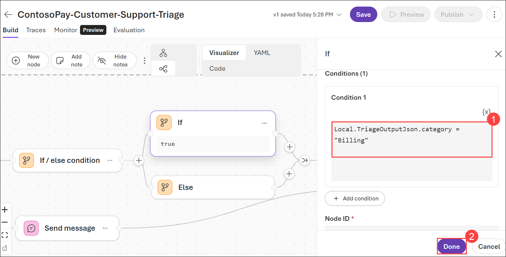

1. Select the **+** (plus) **(1)** icon under the **If** branch of the **If/Else** node to add a new node that drafts a response for non-billing tickets.

1. In the workflow actions menu, under **Basics**, select **Deliver message (2)** to add a send message activity.

    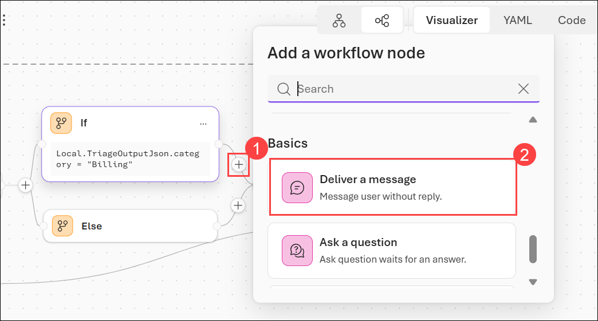

1. In the **Deliver message** node editor, set the **Message to send (1)** to the following response:

    ```output
   Escalate billing issue to human support team.
    ```

1. Select **Done (2)** to save the node.

    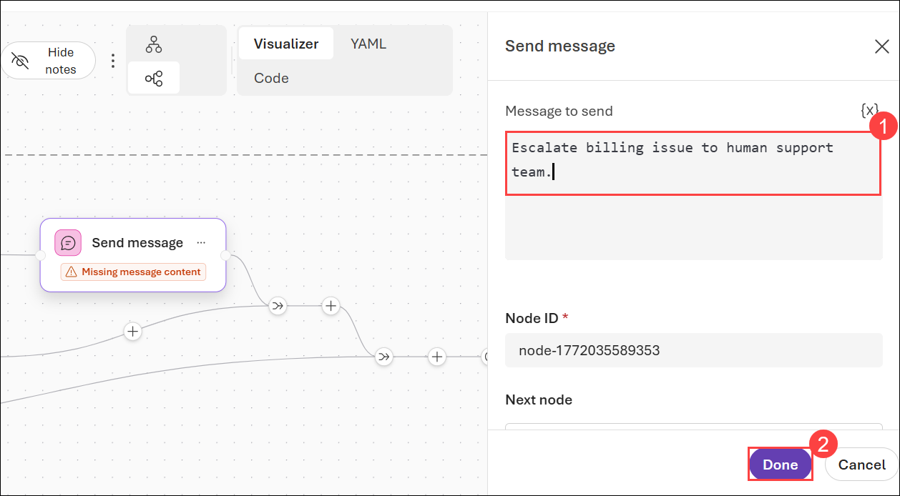

### Task 2.7: Generate a recommended response

In this task, you will invoke the Resolution Agent to automatically generate a professional support response for non-billing tickets based on the classified category.

1. In the visualizer, select the **+** (plus) **(1)** icon under the **Else** branch of the second **If/Else** node to add a new node that drafts a response for non-billing tickets.

1. In the workflow actions menu, under **Invoke**, select **Agent (2)** to add an agent node.

    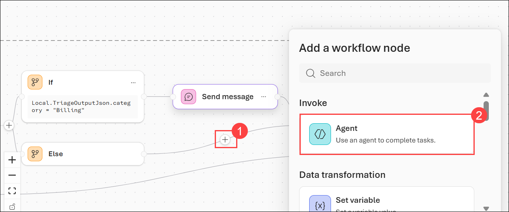

1. In the **Agent** node pane, select **Resolution-Agent (1)**, and then choose the **Details (2)** tab.

    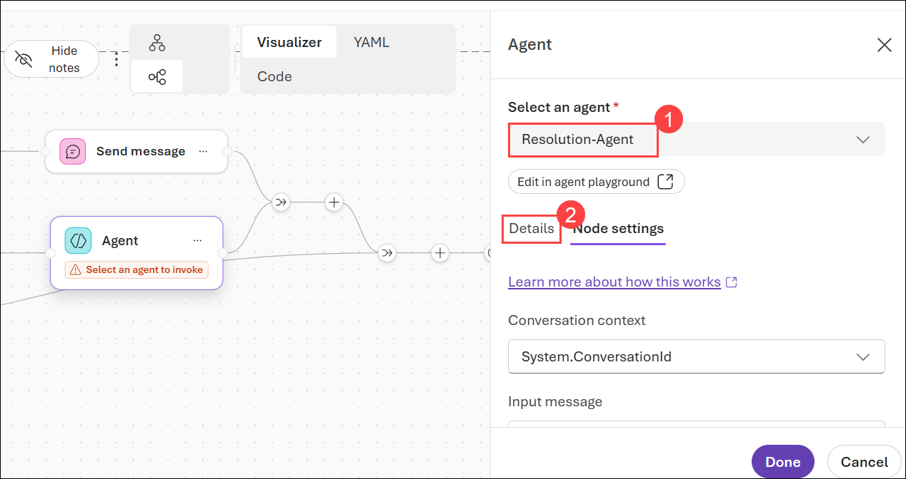

1. In the agent editor, set the **Instructions (1)** field to the following prompt:

    ```output
    You are a customer support resolution assistant for ContosoPay, a B2B payments and invoicing platform.

    Your task is to draft a clear, professional, and friendly support response based on the issue category and customer message.

    Guidelines:
    If the issue category is Technical:
    Suggest 1–2 common troubleshooting steps at a high level.

    Avoid asking for logs, credentials, or sensitive data.

    Do not imply fault by the customer.
    If the issue category is General:
    Provide a concise, helpful explanation or guidance.
    Keep the response under 5 sentences.

    Tone:
    Professional, calm, and supportive
    Clear and concise
    No emojis

    Output:
    Return only the drafted response text.
    Do not include internal reasoning or analysis.
    ```

1. Select **Node settings (2)** to configure the input and output of the agent.

    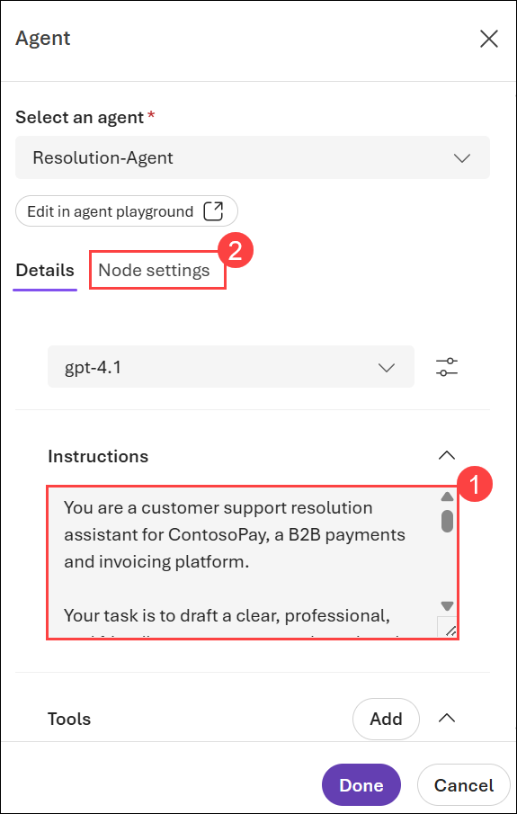

1. Set the **Input message** field to the `Local.TriageOutputText` variable.

    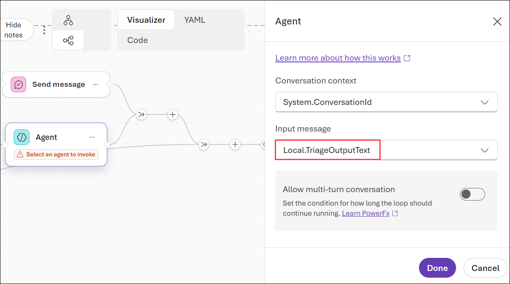

1. Under **Save agent output message as**, create a new variable by entering `ResolutionOutputText` **(1)** and select **Create new variable (2)** from drop down.

1. Select **Done (3)** to save the node.

    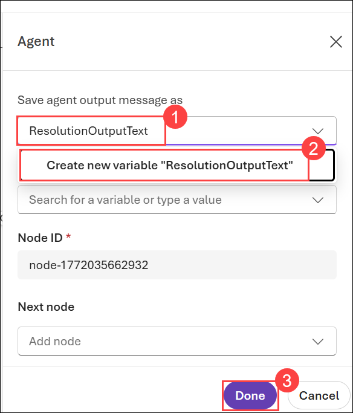

### Task 2.8: Preview the workflow

In this task, you will test and validate the workflow by running a preview to observe how support tickets are processed, classified, escalated, and resolved automatically in Microsoft Foundry.

1. Select the **Save** button to save all changes to your workflow.

    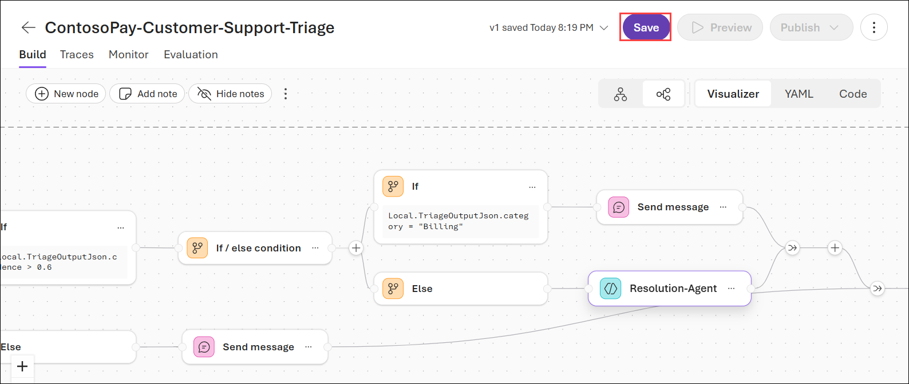

1. Select the **Preview** button to start the workflow.

    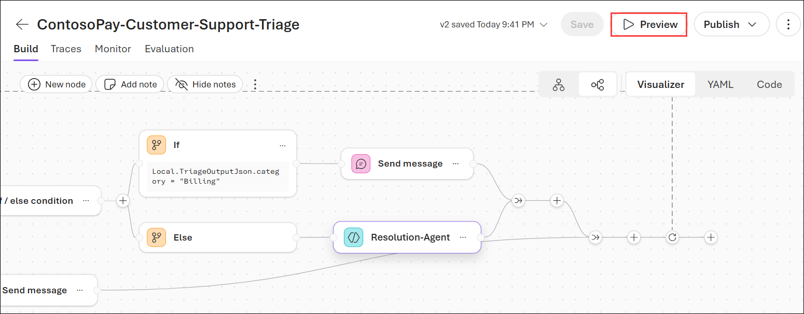

1. In the **Preview** pane,  enter some text to trigger the workflow `Start processing support tickets.` in the message box (1), and then select the **Send (2)** icon.

    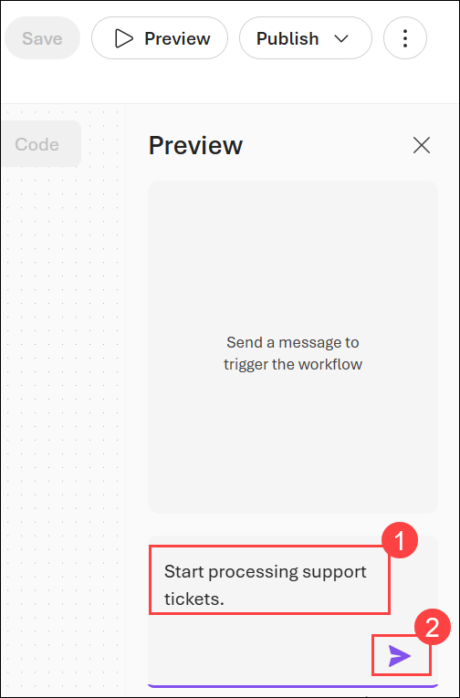

1. Observe the workflow as it processes each support ticket in sequence. Review the messages generated by the workflow in the chat window.

    You should see some output indicating that billing issues are being escalated, while technical and general issues receive drafted responses. For example:

    ```output
    Current Ticket:
    The API returns a 403 error when creating invoices, but our API key hasn't changed.


    Copilot said:
    Thank you for reaching out about the 403 error when creating invoices. This error typically indicates a permissions or access issue. 
    Please ensure that your API key has the necessary permissions for invoice creation and that your request is being sent to the correct endpoint. 
    If the issue persists, try regenerating your API key and updating it in your integration to see if that resolves the problem.
    ```

    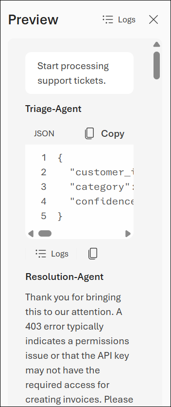

## Task 3: Install the Microsoft Foundry VS Code extension

In this task, you'll install and verify the Microsoft Foundry extension in Visual Studio Code, enabling you to create, manage, and interact with Foundry projects and agents directly within the VS Code environment.

1. Open the **Visual Studio Code** from the desktop.

    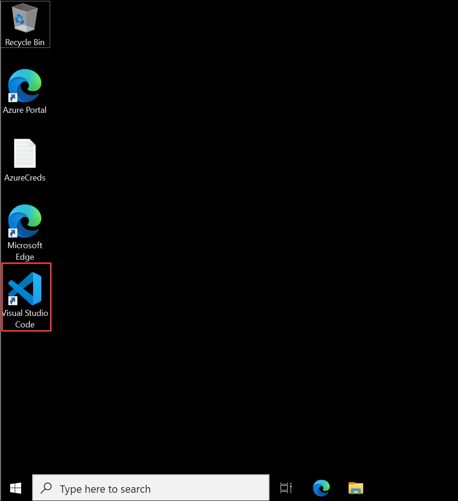

1. In Visual Studio Code, select **Extensions (1)** from the left pane, search for **Microsoft Foundry (2)**, choose the **Microsoft Foundry (3)** extension by Microsoft, and then click **Install (4)**.

    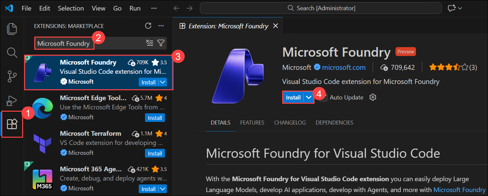

1. After installation is complete, verify the extension appears in the primary navigation bar on the left side of Visual Studio Code.

    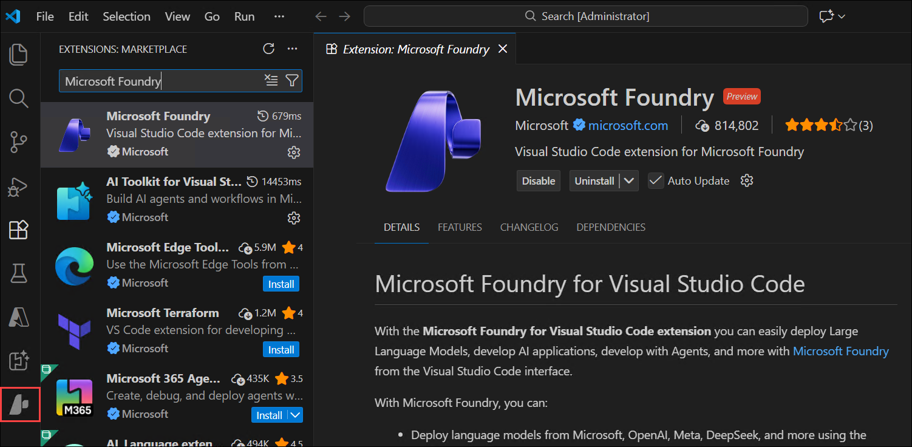

    > **Note:** If you already have the extension installed, make sure the version is at least **v0.16.0** to follow along with the instructions in this exercise.

## Task 4: Sign in to Azure and set the Foundry project

In this task, you will sign in to Azure using the Microsoft Foundry extension in Visual Studio Code and set your project as the default for development.

1. In the VS Code sidebar, select the **Microsoft Foundry (1)** extension icon.

1. In the Resources view, choose **Set Default Project (2)**, and when prompted, select **Sign in to Azure (3)** to authenticate.

    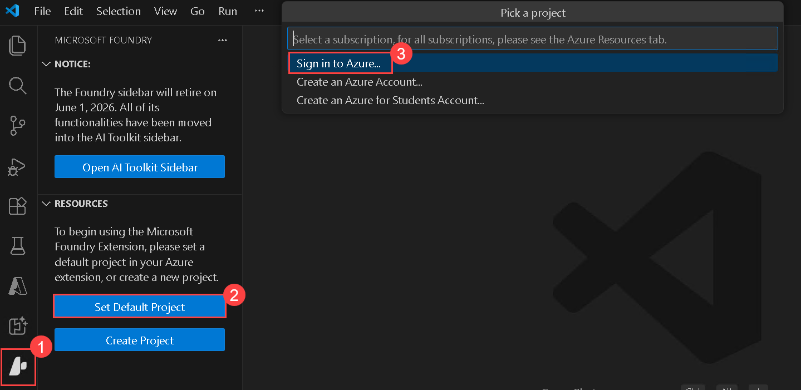

1. In the **Azure Resources wants to sign in using Microsoft** dialog, select **Allow**.

    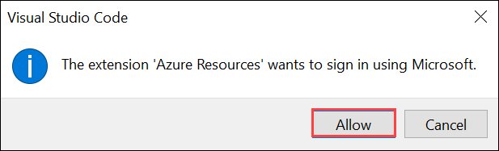

1. On the **Sign in** page, provide the credentials below:
 
    - **Email/Username:** <inject key="AzureAdUserEmail"></inject>
    
      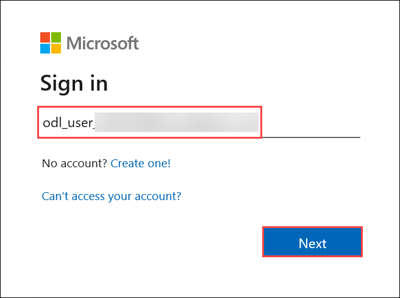

    - **Password:** <inject key="AzureAdUserPassword"></inject>
    
      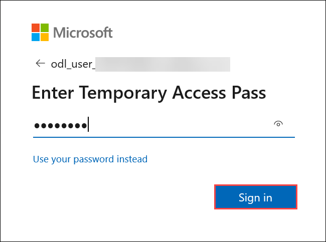

1. On the **Sign in to all apps, websites, and services on this device?** page, select **Yes**.

    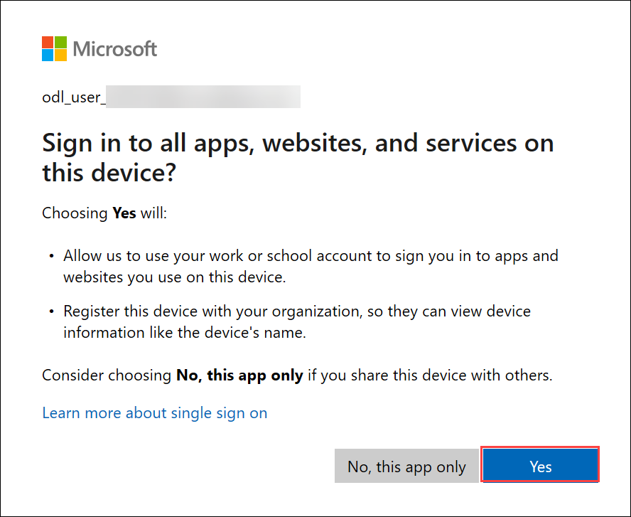

1. On the **Account added to this device** page, select **Done**.

    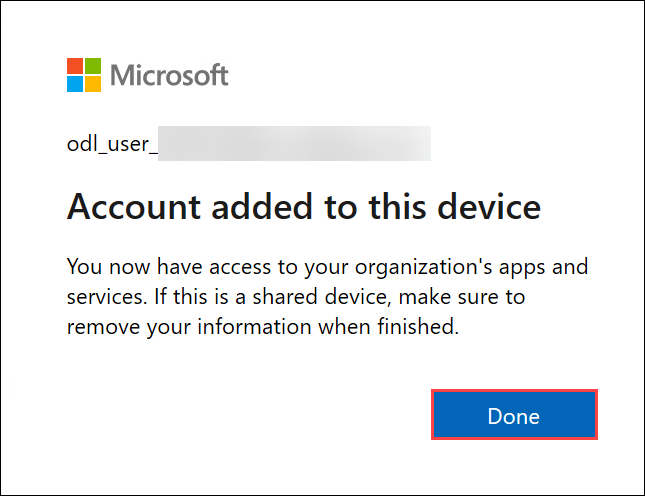

1. In the **Pick a project** dialog, select **Myproject<inject key="DeploymentID" enableCopy="false"/>**.

    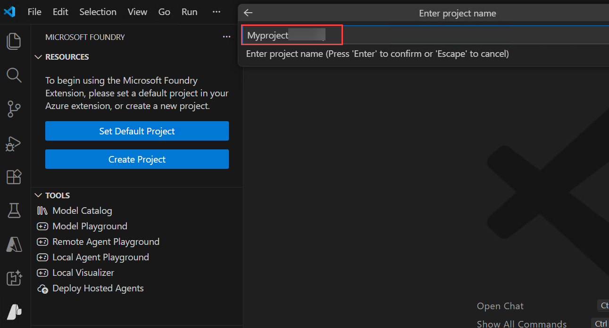

1. In the VS Code Activity Bar, under the **Resources** section expand and right-click your project **Myproject (2)**, and choose **Copy Project Endpoint (3)** to copy the endpoint.

    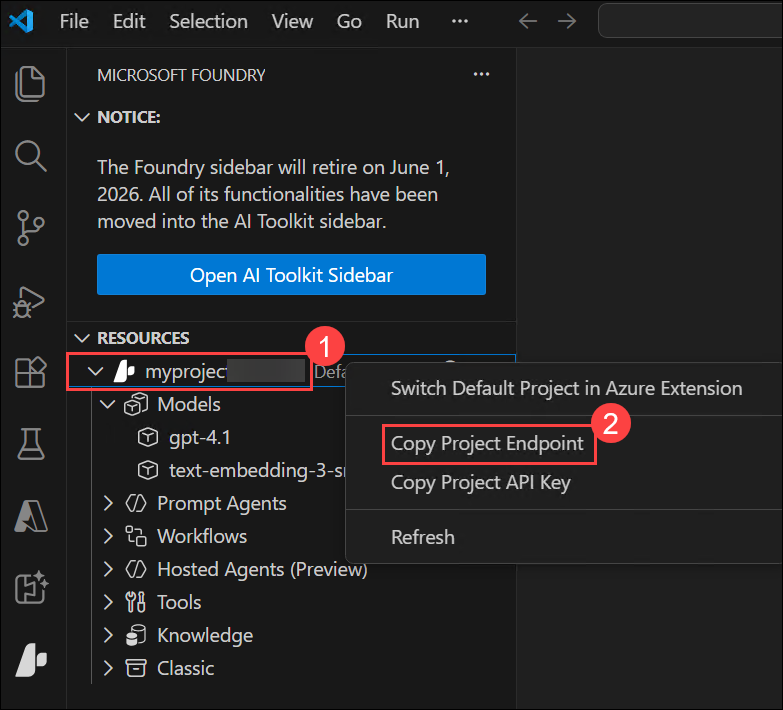

    > **Note:** Copy and save the **Project endpoint** in a notepad, as it will be required in upcoming task.

## Task 5: Clone the starter code repository

In this task, you'll clone the provided GitHub repository, set up a Python virtual environment, install required dependencies, and configure environment variables to prepare your local development setup.

1. Navigate to the **Welcome** page in VS Code by selecting the ellipsis **(...) (1)** from the top bar, then **Help (2)**, and finally **Welcome (3)**.

    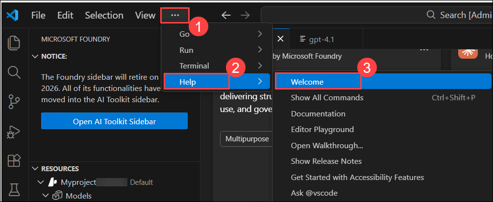

1. On the **Get Started** page, select **Mark Done (1)** to complete this step and proceed.

    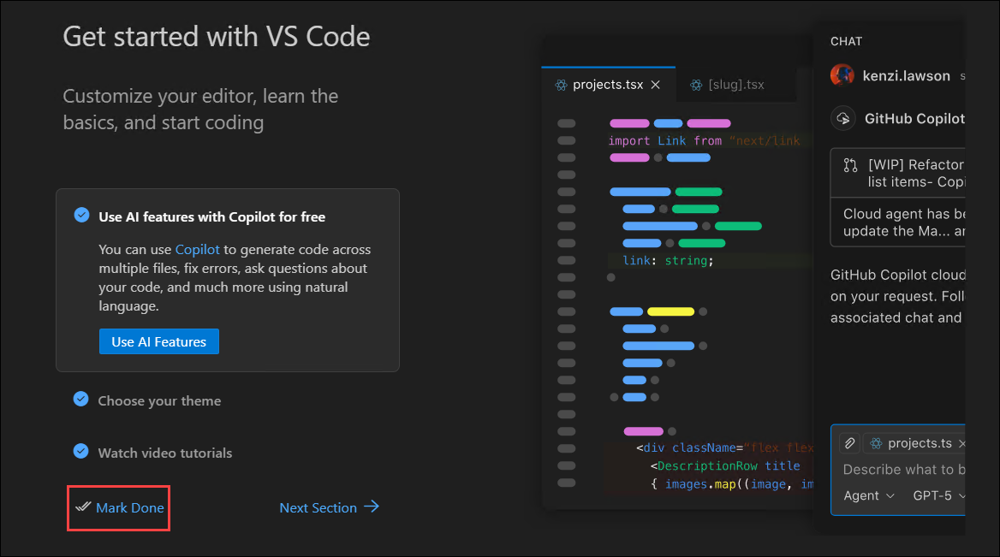

1. Select **Clone Git Repository... (1)**, paste the repository URL **(2)** `https://github.com/MicrosoftLearning/mslearn-ai-agents.git`, and then choose **Clone from URL (3)** to proceed.

    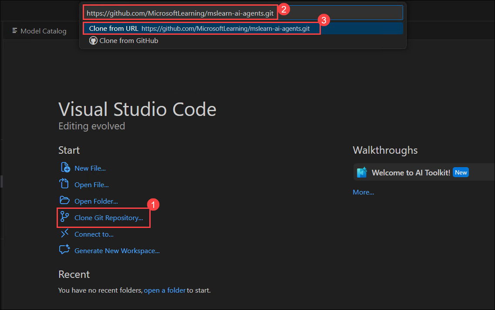

1. Select the destination folder **C:\LabFiles (1)** and click **Select as Repository Destination (2)** to proceed.

    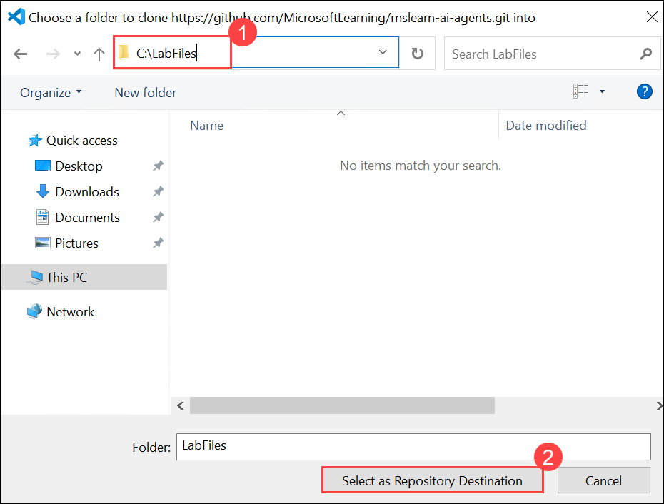

1. When prompted, select **Open (1)** to open the cloned repository.

    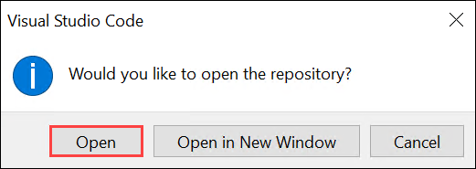

1. In the trust prompt, select **Yes, I trust the authors (1)** to continue.

    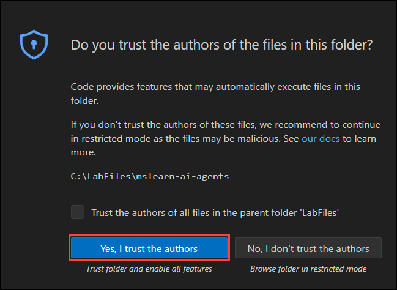

1. In the Explorer view, navigate to the **Labfiles (1)** and then select **08-build-workflow-ms-foundry/Python (2)** folder to find the starter code for this exercise.

    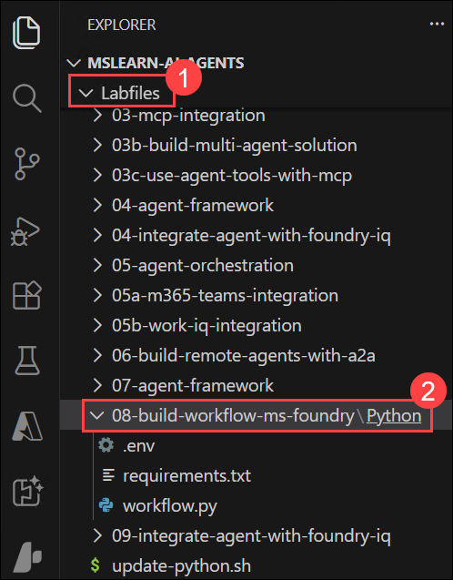

1. Right-click on the **requirements.txt (1)** file and select **Open in Integrated Terminal (2)**.

    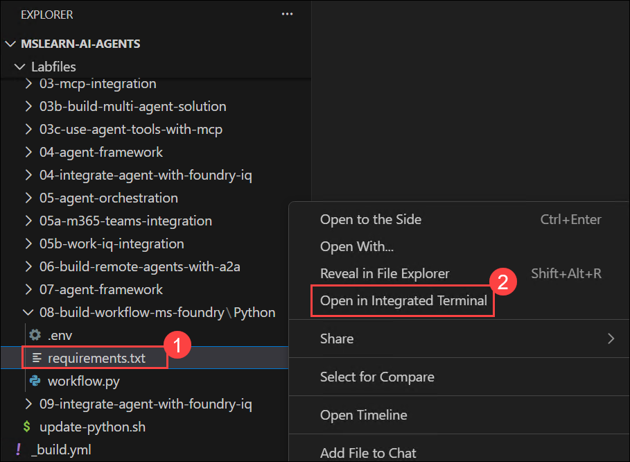

1. In the terminal, enter the following command to install the required Python packages in a virtual environment:

    ```
    python -m venv labenv
    .\labenv\Scripts\Activate.ps1
    pip install -r requirements.txt
    ```

1. From the left navigation menu, under **08-build-workflow-ms-foundry/Python** folder, open the **.env (1)** file. Paste the copied project endpoint into the **PROJECT_ENDPOINT (2)** field, and verify that the **MODEL_DEPLOYMENT_NAME (3)** is set to `gpt-4.1` (or the name of your deployed model). Once done, press **Ctrl+S** to save the changes.

    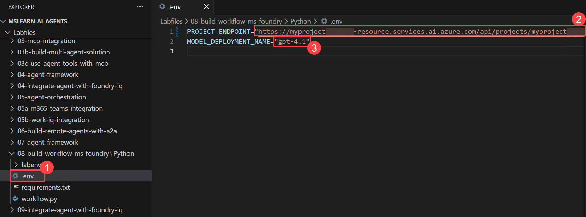

## Task 6: Connect to the workflow and run it

In this task, you will connect to the created workflow using a Python application and execute it to process support tickets and observe the workflow output.

> **Tip:** As you add code, be sure to maintain the correct indentation. Use the comment indentation levels as a guide.

1. Open the **workflow.py** file in the code editor.

    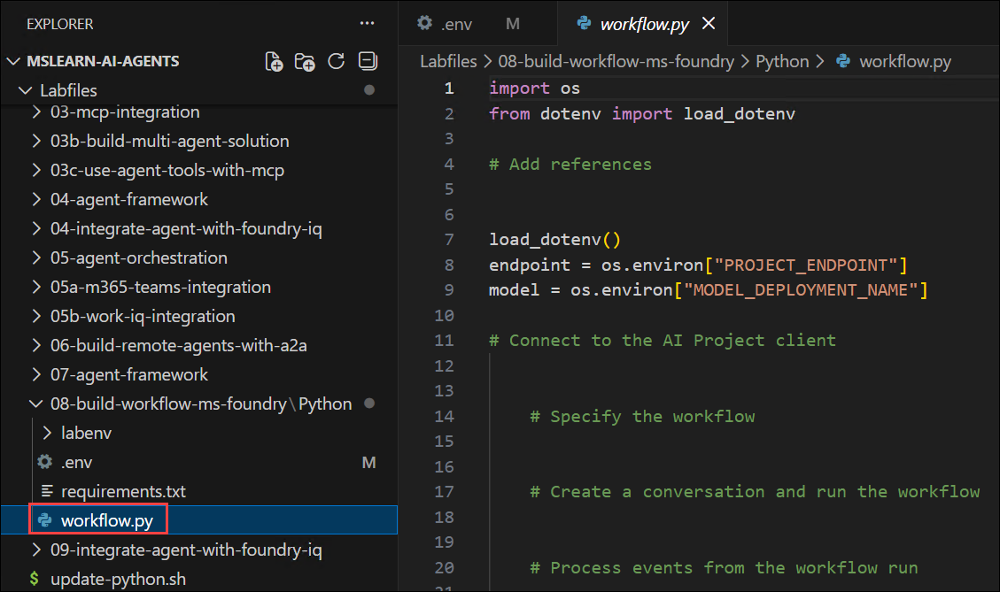

1. Review the code in the file, noting that it contains strings for each agent name and instructions.

1. Find the comment **Add references** and add the following code to import the classes you'll need:

    ```python
   # Add references
   from azure.identity import DefaultAzureCredential
   from azure.ai.projects import AIProjectClient
   from azure.ai.projects.models import ItemType
    ```

    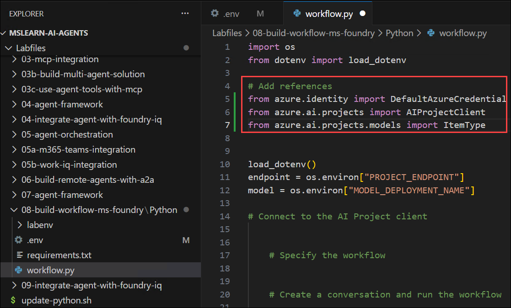

1. Note that code to load the project endpoint and model name from your environment variables has been provided.

1. Find the comment **Connect to the agents client**, and add the following code to create an AgentsClient connected to your project:

    ```python
   # Connect to the AI Project client
   with (
       DefaultAzureCredential() as credential,
       AIProjectClient(endpoint=endpoint, credential=credential) as project_client,
       project_client.get_openai_client() as openai_client,
   ):
    ```

    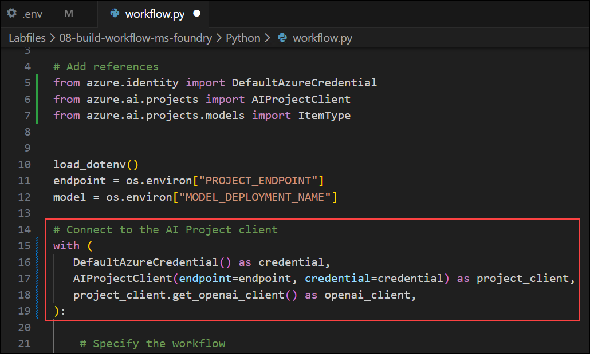

    Now you'll add code that uses the AgentsClient to create multiple agents, each with a specific role to play in processing a support ticket.

    > **Tip:** When adding subsequent code, be sure to maintain the right level of indentation.

1. Find the comment **Specify the workflow** and the following code:

    ```python
   # Specify the workflow
    workflow = {
        "name": "ContosoPay-Customer-Support-Triage",
        "version": "1",
    }
    ```

    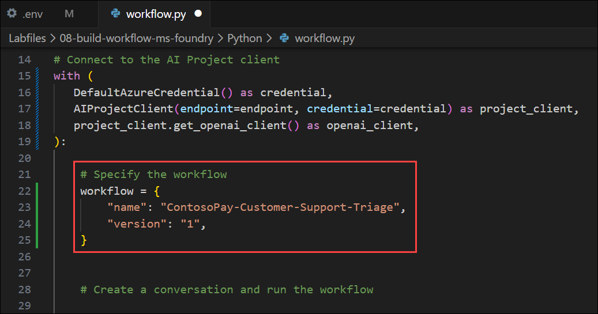

    Be sure to use the name and version of the workflow you created in the Foundry portal.

1. Find the comment **Create a conversation and run the workflow**, and add the following code to create a conversation and invoke your workflow:

    ```python
    # Create a conversation and run the workflow
    conversation = openai_client.conversations.create()
    print(f"Created conversation (id: {conversation.id})")

    stream = openai_client.responses.create(
        conversation=conversation.id,
        extra_body={"agent": {"name": workflow["name"], "type": "agent_reference"}},
        input="Start",
        stream=True,
        metadata={"x-ms-debug-mode-enabled": "1"},
    )
    ```

    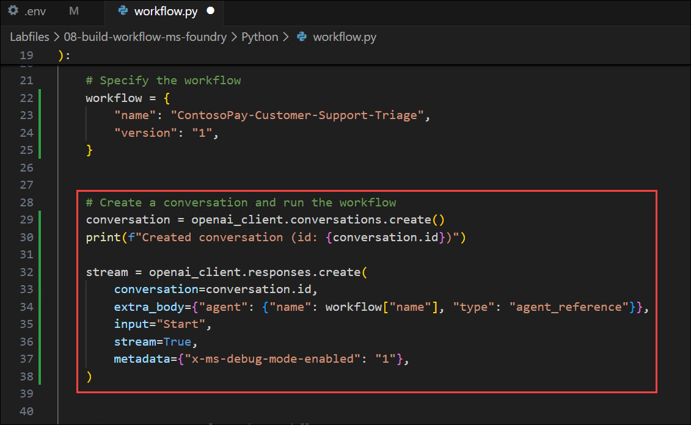

    This code will stream the output of the workflow execution to the console, allowing you to see the flow of messages as the workflow processes each ticket.

1. Find the comment **Process events from the workflow run**, and add the following code to process the streamed output and print messages to the console:

    ```python
    # Process events from the workflow run
    for event in stream:
        if (event.type == "response.completed"):
            print("\nResponse completed:")
            for message in event.response.output:
                if message.content:
                    for content_item in message.content:
                        if content_item.type == 'output_text':
                            print(content_item.text)
        if (event.type == "response.output_item.done") and event.item.type == ItemType.WORKFLOW_ACTION:
            print(f"item action ID '{event.item.action_id}' is '{event.item.status}' (previous action ID: '{event.item.previous_action_id}')")
    ```

    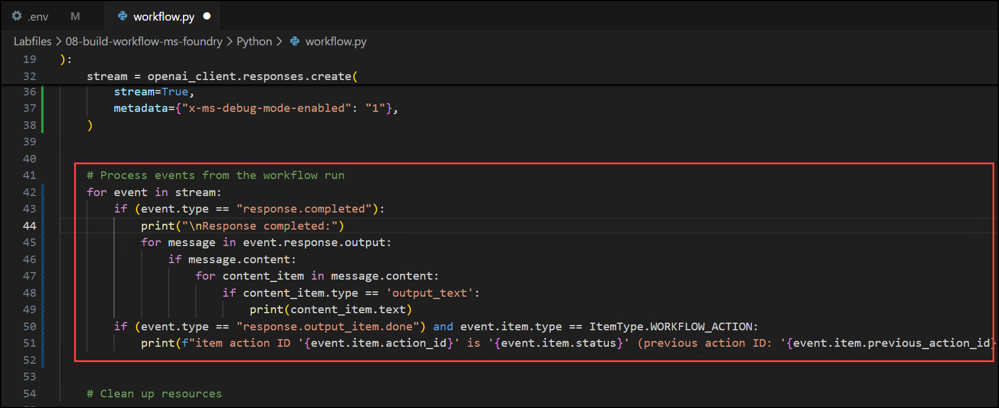

1. Find the comment **Clean up resources**, and enter the following code to delete the conversation when it is longer required:

    ```python
   # Clean up resources
   openai_client.conversations.delete(conversation_id=conversation.id)
   print("\nConversation deleted")
    ```

    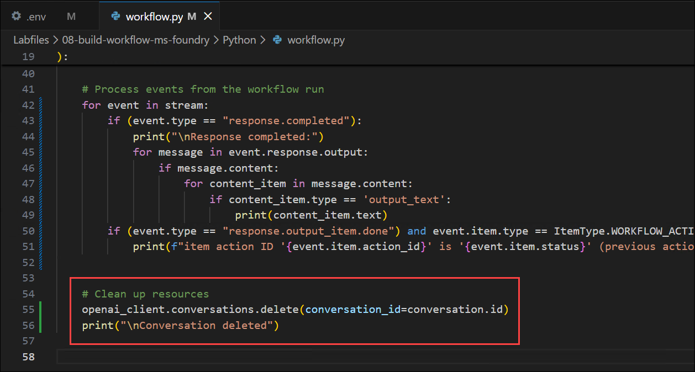

1. Use the **CTRL+S** command to save your changes to the code file.

## Task 7: Sign into Azure and run the app

In this task, you will authenticate to Azure and run the Python application to execute the workflow and validate the end-to-end processing of support tickets.

1. In the terminal, run `Connect-AzAccount` to initiate the Azure sign-in process.

    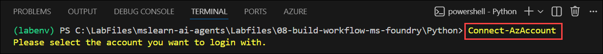

    >**Note:** If you have closed the terminal, right-click on the **08-build-workflow-ms-foundry \ Python** folder and select **Open in Integrated Terminal**. Then run the command `.\labenv\Scripts\Activate.ps1` to activate the virtual environment before proceeding.

1. In the sign-in window, select your account **<inject key="AzureAdUserEmail"></inject> (1)** and click **Continue (2)** to proceed with authentication.

    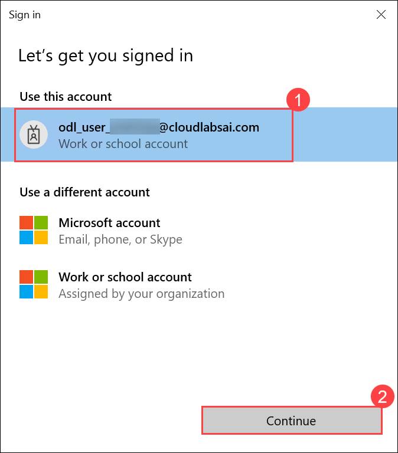

1. After successful sign-in, wait for the subscriptions to load and verify that your subscription is listed in the terminal.

    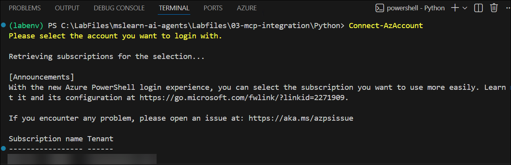

1. In the integrated terminal, enter the following command to run the application:

    ```
   python workflow.py
    ```

1. Wait a moment for the workflow to process the tickets. As the workflow runs, you should see output in the console indicating the progress of the workflow, including messages generated by the agents and status updates for each action in the workflow.

1. When the workflow completes, you should see some output similar to the following:

    ```output
    Created conversation (id: {id})
    item action ID 'action-{id}' is 'completed' (previous action ID: 'trigger_id')
    item action ID 'action-{id}' is 'completed' (previous action ID: 'action-{id}')
    item action ID 'action-{id}' is 'completed' (previous action ID: 'action-{id}_Start')
    ...

    Response completed:
    ...
    Current Ticket:
    I was charged twice for the same invoice last Friday and my customer is also seeing two receipts. Can someone fix this?
    {"customer_issue":"I was charged twice for the same invoice last Friday and my customer is also seeing two receipts. Can someone fix this?","category":"Billing","confidence":1}
    Escalation required
    ```

    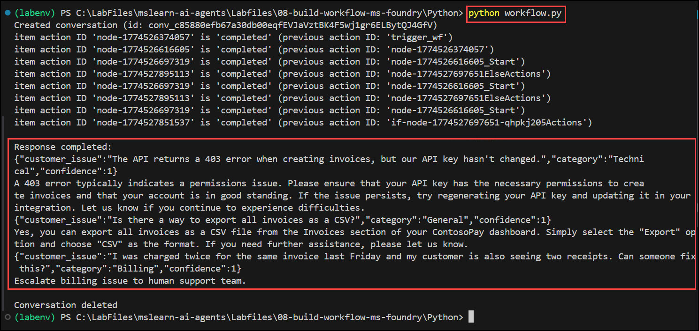

    In the output, you can see the how the workflow completes each step, including the classification of each ticket and the recommended response or escalation. Great work!

1. When you're finished, enter `deactivate` in the terminal to exit the Python virtual environment.


## Summary

In this lab, you created a sequential workflow in Microsoft Foundry that processes customer support tickets. You used conditional logic and configured AI agents to produce JSON-formatted outputs. Your workflow classified each ticket using an AI agent, handled low-confidence classifications with conditional logic, and generated recommended responses for non-billing issues. Great job!

### You have successfully completed the Hands-on Lab!