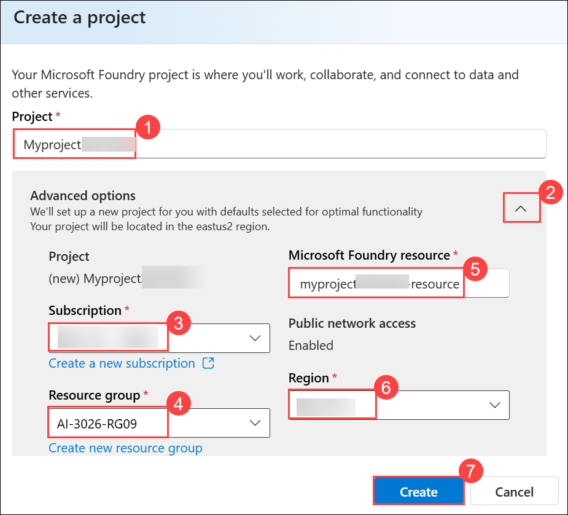
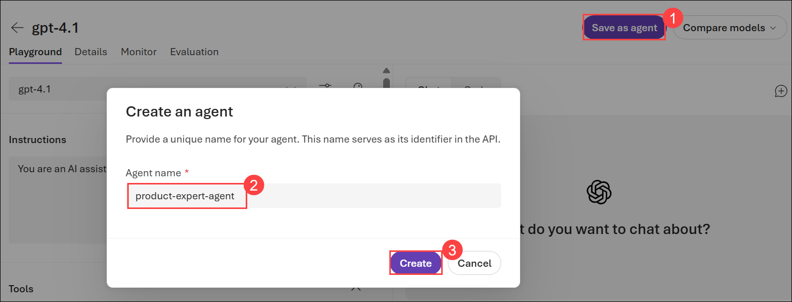
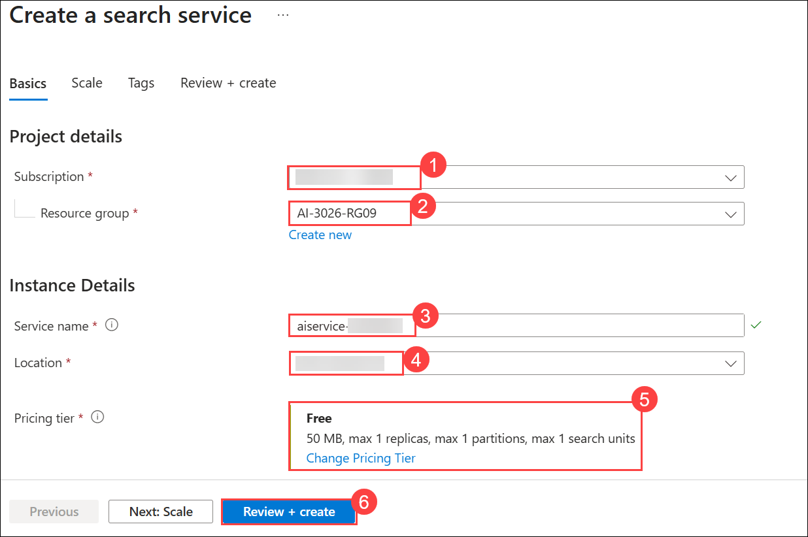
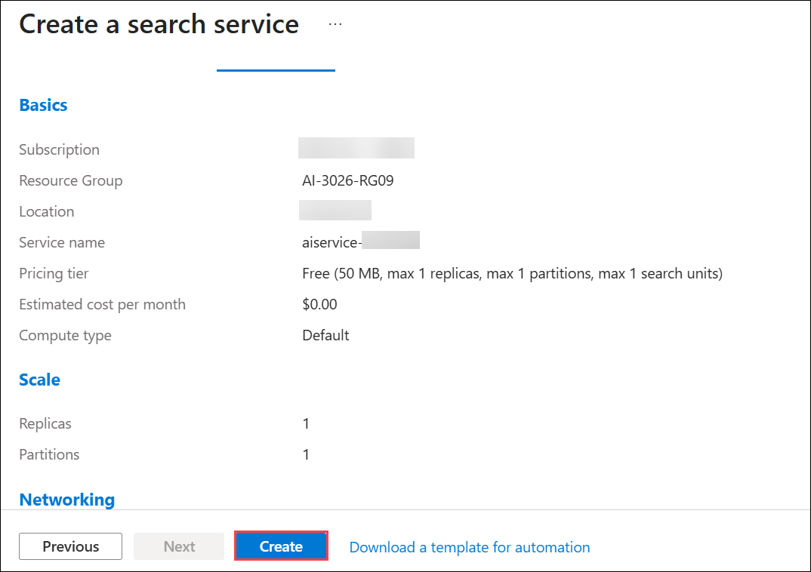
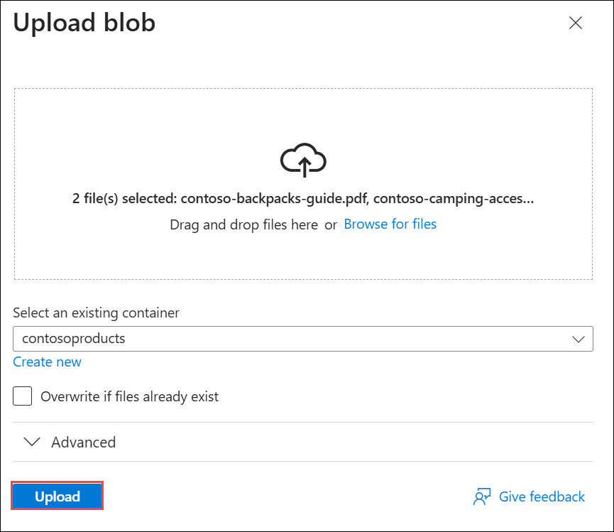

# Lab 09: Integrate an AI agent with Foundry IQ

### Estimated Duration: 30 Minutes

## Overview

In this exercise, you'll use Azure AI Foundry portal to create an agent that integrates with Foundry IQ to search and retrieve information from knowledge bases. You'll create a search resource, configure a knowledge base with sample data, build an agent in the portal, and then connect to it from Visual Studio Code to interact programmatically.

> **Tip**: The code used in this exercise is based on the Microsoft Foundry SDK for Python. You can develop similar solutions using the SDKs for Microsoft .NET, JavaScript, and Java. Refer to [Microsoft Foundry SDK client libraries](https://learn.microsoft.com/azure/ai-foundry/how-to/develop/sdk-overview) for details.

This exercise should take approximately **45** minutes to complete.

> **Note**: Some of the technologies used in this exercise are in preview or in active development. You may experience some unexpected behavior, warnings, or errors.

## Task1: Create a Foundry project

Let's start by creating a Foundry project with the new Foundry experience.

1. Open a new tab in the browser, right-click on the following link [Foundry portal](https://ai.azure.com), then **Copy link** and paste it in a browser tab to log in to **Microsoft Foundry portal**.

1. Click on **Sign in**.
 
    

1. If prompted, provide the credentials below:
 
   - **Email/Username:** <inject key="AzureAdUserEmail"></inject>
    
     

   - **Password:** <inject key="AzureAdUserPassword"></inject>
    
     

1. When the **Stay signed in?** window appears, select **No**.

    
    
    >**Note:** Close any tips or quick start panes that are opened the first time you sign in, and if necessary use the **Foundry** logo at the top left to navigate to the home page, which looks similar to the following image (close the **Help** pane if it's open):

1. At the top of the **Microsoft Foundry** portal, enable the **New Foundry toggle (1)** to switch to the latest Foundry user interface.

1. From the **Select a project to continue** dialog, click the drop-down under **Select or search for a project**, and then select **Create a new project (2)**.

     

1. In the **Create a project** window, enter **Myproject<inject key="DeploymentID"></inject> (1)** as the project name. Open the **Advanced options (2)** drop-down, fill in the following details, and then click **Create (7)**:

    * Subscription: **Choose Default Subscription (3)**
    * Resource group: **AI-3026-RG09 (4)**
    * Microsoft Foundry resource: **Keep as Default (5)**
    * Region: **<inject key="Region"></inject> (6)**

      

      >**Note:** Some Azure AI resources are constrained by regional model quotas. In the event of a quota limit being exceeded later in the exercise, there's a possibility you may need to create another resource in a different region.

1. Wait for your project created. It may take a few minutes.

1. On the **Microsoft Foundry** home page, click **Start building (1)**, and then select **Browse models (2)** from the drop-down menu.

     

1. On the **Models** page, search for **gpt-4.1 (1)** in the search bar, and then select the **gpt-4.1 (2)** model from the search results.

     

1. On the **gpt-4.1** model details page, click **Deploy (1)**, and then select **Default settings (2)** to deploy the model using the standard configuration.

    

    - After the model is deployed, the playground for the model is displayed.

1. Select **Save as agent (1)**, enter **product-expert-agent (2)** as the *Agent name*, and then select **Create (3)**.

    

## Task 2: Configure your data and Foundry IQ

Now you'll configure your agent that uses Foundry IQ to search the knowledge base.

1. First, give your agent the following instructions **(1)**:
    
    ```
    You are a helpful AI assistant for Contoso, specializing in outdoor camping and hiking products. 
    You must ALWAYS search the knowledge base to answer questions about our products or product 
    catalog. Provide detailed, accurate information and always cite your sources.
    If you don't find relevant information in the knowledge base, say so clearly.
    ```

1. Select **Save (2)** to save your current agent configuration.

    

1. Then, in the **Knowledge** section, expand **(1)** the **Add (2)** dropdown, and select **Connect to Foundry IQ (3)**.

    

1. In the Foundry IQ setup window, select **Connect to an AI Search resource** and then **Create new resource** which should open up the Azure portal in a new tab.

    

    

1. Create a search resource with the following settings and click **Review + create (6)**
    - **Subscription**: Select default subscription **(1)**
    - **Resource group**: select **AI-3026-RG09 (2)**
    - **Service name**: Enter **aiservice-<inject key="DeploymentID"></inject> (3)**
    - **Location**: Select **<inject key="Region"></inject> (4)**
    - **Pricing tier**: Select *Free* if available, otherwise choose *Basic* **(5)**

      

      - Now you'll upload sample product information documents to connect to with Foundry IQ.

1. On the **Create a search service** page, review the configuration to ensure the **Pricing tier** is set to **Free**, and then select **Create**.

    

1. Download the sample product information files by opening a new browser tab and navigating to `https://github.com/MicrosoftLearning/mslearn-ai-agents/raw/main/Labfiles/09-integrate-agent-with-foundry-iq/data/contoso-products.zip`

1. Extract the files from the zip, which should be 3 PDFs detailing the products from Contoso.

1. In the Azure Portal tab, in the top search bar, search fo **Storage accounts (1)** and select **Storage accounts (2)** from the services section.

    

1. In the **Storage center | Blob Storage** page, select **Create** to start creating a new storage account.

1. Create a storage account with the following settings and click **Review + create (8)**
    - **Subscription:** Select default subscription **(1)**
    - **Resource group:** **AI-3026-RG09 (2)**
    - **Storage account name**: **storage<inject key="DeploymentID"></inject> (3)**
    - **Region**: Select **<inject key="Region"></inject> (4)**
    - **Preferred storage type**: *Azure Blob Storage or Azure Data Lake Storage Gen 2* **(5)**
    - **Performance**: *Standard* **(6)**
    - **Redundancy**: *Locally-redundant storage (LRS)* **(7)**

      

1. On the **Review + create** tab, verify that **Performance** is set to **Standard** and **Replication** is set to **Locally-redundant storage (LRS)**, and then select **Create**.

    

1. When the deployment is complete and the **Your deployment is complete** message appears, select **Go to resource**.

    

1. Once created, go to the storage account you created and select **Upload** from the top bar.

    

1. In the **Upload blob** blade, create a new container named `contosoproducts`.

    

    

1. Browse for the files extracted from the zip file, select all 3 PDF files, and select **Upload**.

    

1. Once your files are uploaded, close the Azure Portal tab and navigate back to the Foundry IQ page in Microsoft Foundry and refresh the page.

1. Select your search service, and click **Connect**.

    

1. On the Foundry IQ page, select **Create a knowledge base**, choosing **Azure Blob Storage** as your knowledge source, then select **Connect**.

    

    

1. Configure your knowledge source with the following settings:
    - **Name**: `ks-contosoproducts` **(1)**
    - **Description**: `Contoso product catalog items` **(2)**
    - **Storage account name**: **storage<inject key="DeploymentID"></inject> (3)**
    - **Container name**: `contosoproducts` **(4)**
    - **Authentication type**: *API Key* **(5)**
    - **Content extraction mode**: *minimal* **(6)** 
    - **Include embedding model**: *Selected* **(7)**
    - **Embedding model**: *Select the available deployed model, likely text-embedding-3-small* **(8)**
    - **Chat completions model**: *Select the available deployed model, likely gpt-4.1* **(9)**
1. Select **Create (10)**.

    

1. On the knowledge base creation page, select the `gpt-4.1` **(1)** model from the **Chat completions model** dropdown, leaving the rest of the optional fields as is.

1. Select **Save knowledge base (2)**, and then refresh your browser to verify the knowledge source status is *active*. If it isn't yet, wait a minute and refresh your page until it is.

    

1. On the top right, expand the **Use in an agent** dropdown, and select your `product-expert-agent`.

## Task3: Test the Agent in the playground

Before connecting from code, test your agent in the portal playground.

1. In the agent page, you should see a playground tab selected and your knowledge base listed in the knowledge section.
1. Try the following test queries to verify the agent can retrieve information from the knowledge base:
    - `What types of tents does Contoso offer?`
    - `Tell me about which backpacks are available in XL.`
    - `What camping accessories are available?`
    
1. Review the responses and notice:
    - The agent provides specific information from the knowledge base
    - Citations or references to the source documents may be included
    - The agent stays focused on product information

1. You can also try interacting with your agent in the **Preview agent** for a more refined webapp experience.

1. In the agent details page, locate and copy the following information to a notepad (you'll need these later):
    - **Agent name**: This is the name you created (`product-expert-agent`)
    - **Project endpoint**: Found in the project settings or overview page

## Connect to Your Agent from a Client Application

Now you'll create a Python application to interact with your agent programmatically. Starter files have been provided in the GitHub repository to help you get started quickly.

### Clone the repo containing the application code

1. Open a new browser tab (keeping the Foundry portal open in the existing tab). Then in the new tab, browse to the [Azure portal](https://portal.azure.com) at `https://portal.azure.com`; signing in with your Azure credentials if prompted.

    Close any welcome notifications to see the Azure portal home page.

1. Use the **[\>_]** button to the right of the search bar at the top of the page to create a new Cloud Shell in the Azure portal, selecting a ***PowerShell*** environment with no storage in your subscription.

    The cloud shell provides a command-line interface in a pane at the bottom of the Azure portal. You can resize or maximize this pane to make it easier to work in.

    > **Note**: If you have previously created a cloud shell that uses a *Bash* environment, switch it to ***PowerShell***.

1. In the cloud shell toolbar, in the **Settings** menu, select **Go to Classic version** (this is required to use the code editor).

    **<font color="red">Ensure you've switched to the classic version of the cloud shell before continuing.</font>**

1. In the cloud shell pane, enter the following commands to clone the GitHub repo containing the code files for this exercise (type the command, or copy it to the clipboard and then right-click in the command line and paste as plain text):

    ```
   rm -r ai-agents -f
   git clone https://github.com/MicrosoftLearning/mslearn-ai-agents ai-agents
    ```

    > **Tip**: As you enter commands into the cloudshell, the output may take up a large amount of the screen buffer and the cursor on the current line may be obscured. You can clear the screen by entering the `cls` command to make it easier to focus on each task.

1. Enter the following command to change the working directory to the folder containing the code files and list them all.

    ```
   cd ai-agents/Labfiles/09-integrate-agent-with-foundry-iq/Python
   ls -a -l
    ```

    The provided files include application code, configuration settings, and the agent client starter code.

### Configure the application settings

1. In the cloud shell command-line pane, enter the following command to install the libraries you'll use:

    ```
   python -m venv labenv
   ./labenv/bin/Activate.ps1
   pip install -r requirements.txt
    ```

    >**Note:** You can ignore any warning or error messages displayed during the library installation.

1. Enter the following command to edit the configuration file that has been provided:

    ```
   code .env
    ```

    The file is opened in a code editor.

1. In the code file, replace the **your_project_endpoint** placeholder with the endpoint for your project (copied from the project **Overview** page in the Foundry portal) and ensure that the AGENT_NAME variable is set to your agent name (which should be *product-expert-agent*).
1. After you've replaced the placeholder, use the **CTRL+S** command to save your changes and then use the **CTRL+Q** command to close the code editor while keeping the cloud shell command line open.

### Complete the agent client code

> **Tip**: As you add code, be sure to maintain the correct indentation. Use the comment indentation levels as a guide.

1. Enter the following command to edit the agent code file:

    ```
   code agent_client.py
    ```

1. Review the starter code that has been provided, including:
    - Import statements and configuration loading
    - The `send_message_to_agent()` function structure
    - The `display_conversation_history()` function
    - The main program loop

1. Find the first **TODO** comment and add the following code to connect to the project, get the OpenAI client, retrieve the agent, and create a new conversation:

    > **Tip**: Be careful to maintain the correct indentation level.

    ```python
    # Connect to the project and agent
    credential = DefaultAzureCredential(
        exclude_environment_credential=True,
        exclude_managed_identity_credential=True
    )
    project_client = AIProjectClient(
        credential=credential,
        endpoint=project_endpoint
    )

    # Get the OpenAI client
    openai_client = project_client.get_openai_client()

    # Get the agent
    agent = project_client.agents.get(agent_name=agent_name)
    print(f"Connected to agent: {agent.name} (id: {agent.id})\n")

    # Create a new conversation
    conversation = openai_client.conversations.create(items=[])
    print(f"Created conversation (id: {conversation.id})\n")
    ```

1. Find the second **TODO** comment inside the `send_message_to_agent()` function and add the following code to send messages and handle responses, including MCP approval requests:

    ```python
    # Add user message to the conversation
    openai_client.conversations.items.create(
        conversation_id=conversation.id,
        items=[{"type": "message", "role": "user", "content": user_message}],
    )
    
    # Store in conversation history (client-side)
    conversation_history.append({
        "role": "user",
        "content": user_message
    })
    
    # Create a response using the agent
    response = openai_client.responses.create(
        conversation=conversation.id,
        extra_body={"agent": {"name": agent.name, "type": "agent_reference"}},
        input=""
    )

    # Check if the response output contains an MCP approval request
    approval_request = None
    if hasattr(response, 'output') and response.output:
        for item in response.output:
            if hasattr(item, 'type') and item.type == 'mcp_approval_request':
                approval_request = item
                break
    
    # Handle approval request if present
    if approval_request:
        print(f"[Approval required for: {approval_request.name}]\n")
        print(f"Server: {approval_request.server_label}")
        
        # Parse and display the arguments (optional, for transparency)
        import json
        try:
            args = json.loads(approval_request.arguments)
            print(f"Arguments: {json.dumps(args, indent=2)}\n")
        except:
            print(f"Arguments: {approval_request.arguments}\n")
        
        # Prompt user for approval
        approval_input = input("Approve this action? (yes/no): ").strip().lower()
        
        if approval_input in ['yes', 'y']:
            print("Approving action...\n")
            
            # Create approval response item
            approval_response = {
                "type": "mcp_approval_response",
                "approval_request_id": approval_request.id,
                "approve": True
            }
        else:
            print("Action denied.\n")
            
            # Create denial response item
            approval_response = {
                "type": "mcp_approval_response",
                "approval_request_id": approval_request.id,
                "approve": False
            }
        
        # Add the approval response to the conversation
        openai_client.conversations.items.create(
            conversation_id=conversation.id,
            items=[approval_response]
        )
        
        # Get the actual response after approval/denial
        response = openai_client.responses.create(
            conversation=conversation.id,
            extra_body={"agent": {"name": agent.name, "type": "agent_reference"}},
            input=""
        )
    
    ```

1. After you've added the code, use the **CTRL+S** command to save your changes. 

1. Review the code now uses the conversations API to manage interactions with your agent, where:
    - A conversation is created and tracked by its ID
    - User messages are added to the conversation using `conversations.items.create()`
    - Responses are generated using `responses.create()` with an agent reference
    - **MCP approval handling**: When the agent needs to access Foundry IQ, it requests approval by returning an `mcp_approval_request` in the response output
    - The code prompts you to approve or deny the action before proceeding
    - After approval/denial, an `mcp_approval_response` is added to the conversation and a new response is generated
    - The agent retrieves information from Foundry IQ based on your approval decision

1. Use the **CTRL+Q** command to close the code editor while keeping the cloud shell command line open.

## Test the Integration

Now you'll run your application and test the agent's ability to retrieve information from the knowledge base.

1. In the cloud shell command-line pane, enter the following command to sign into Azure.

    ```
    az login
    ```

    **<font color="red">You must sign into Azure - even though the cloud shell session is already authenticated.</font>**

    > **Note**: In most scenarios, just using *az login* will be sufficient. However, if you have subscriptions in multiple tenants, you may need to specify the tenant by using the *--tenant* parameter. See [Sign into Azure interactively using the Azure CLI](https://learn.microsoft.com/cli/azure/authenticate-azure-cli-interactively) for details.

1. When prompted, follow the instructions to open the sign-in page in a new tab and enter the authentication code provided and your Azure credentials. Then complete the sign in process in the command line, selecting the subscription containing your Foundry resource if prompted.

1. In the cloud shell command-line pane, run your application:

    ```
   python agent_client.py
    ```

1. When the application starts, test the agent with the following queries:

    **Query 1 - Product Categories:**
    ```
    What types of outdoor products does Contoso offer?
    ```
    
    When prompted for approval, type **yes** to allow the agent to search the knowledge base. Observe how the agent retrieves information from multiple documents in the knowledge base.

    **Query 2 - Specific Product Details:**
    ```
    Tell me about the weatherproof features of your tents.
    ```
    
    Approve the request and notice how the agent provides specific details from the tents catalog.

    **Query 3 - Product Comparisons:**
    ```
    What's the difference between your daypacks and expedition backpacks?
    ```
    
    Approve the request and see how the agent can synthesize information from the backpacks guide.

    **Query 4 - Accessories and Add-ons:**
    ```
    What camping accessories would you recommend for a weekend hiking trip?
    ```
    
    Approve the request and observe the agent's ability to provide recommendations based on the knowledge base.

    **Query 5 - Follow-up Question:**
    ```
    How much do those items typically cost?
    ```
    
    Notice how the agent maintains conversation context from your previous query.

1. Type `history` to view the complete conversation history.

1. Type `quit` when you're done testing.

### Review the results

Consider the following aspects of the agent's responses:

- **MCP Approval Flow**: Each time the agent needs to access the knowledge base, it requests approval, giving you control over external tool usage
- **Accuracy**: The agent provides information directly from the knowledge base documents
- **Citations**: The agent may include source references or document IDs
- **Context awareness**: The agent remembers previous messages in the conversation
- **Grounding**: The agent indicates when it cannot find relevant information in the knowledge base
- **Error handling**: The application gracefully handles errors and connection issues

## Summary

In this exercise, you:

- Created a Foundry project and agent with the new Foundry UI
- Built a knowledge base with product information documents
- Configured an agent in the portal with Foundry IQ enabled
- Connected to your agent from Azure Cloud Shell using the Python SDK
- Implemented a client application with MCP approval handling, conversation history, and error handling
- Tested the agent's ability to retrieve and synthesize information from the knowledge base with user-controlled approval for external tool access

This demonstrates how to integrate AI agents with Foundry IQ to create intelligent applications that can search and retrieve information from enterprise knowledge bases while maintaining conversational context.

## Clean up

If you've finished exploring Azure AI Agent Service and Foundry IQ, you should delete the resources you have created in this exercise to avoid incurring unnecessary Azure costs.

1. Close the Cloud Shell browser tab.
1. Return to your browser and open the [Azure portal](https://portal.azure.com) at `https://portal.azure.com`.
1. Navigate to the resource group containing your Foundry resource and AI Search resources.
1. On the toolbar, select **Delete resource group**.
1. Enter the resource group name and confirm that you want to delete it.

