# AI-102: Develop AI agents on Azure Workshop

Welcome to your AI-3026: Develop AI Agents on Azure workshop! We’re excited to guide you through hands-on learning with Azure AI services using Microsoft Foundry and the Azure portal. In this workshop, you’ll build, configure, and test intelligent AI agents using Microsoft Foundry.

### Overall Estimated Duration: 7 Hours

## Overview

In this hands-on lab, you will build intelligent AI solutions using Microsoft Azure AI Foundry, Azure AI Agent Service, and the Microsoft Agent Framework SDK. You will create Foundry projects, deploy foundation models like GPT-4.1, and develop AI agents using the portal and Python SDK in Azure Cloud Shell. You will design agents for expense processing, customer support, ticket triage, and feedback analysis. The labs include grounding agents with enterprise data using Azure AI Search and Blob Storage. You will connect agents to external systems using the Model Context Protocol (MCP) and implement custom function tools for real-world automation. You will also build multi-agent solutions using sequential orchestration and A2A communication. By the end, you will understand how to develop, integrate, and automate enterprise AI workflows end-to-end.

## Objectives

By the end of this lab, you will be able to:

1. **Create a project and agent in Microsoft Foundry:** Set up a new Foundry project and create an AI agent with a deployed model ready for configuration.

2. **Configure an AI agent with knowledge and tools:** Define system instructions, upload an expense policy document for grounding, and enable tools such as file search and code interpreter.

3. **Test and validate the agent in the playground:** Interact with the agent by asking policy-related questions, submit an expense claim, and download and review the generated claim file.

4. **Build and configure an AI agent using the SDK:** Implement code to connect to the Foundry project, define agent instructions, and enable the built-in Code Interpreter tool.

5. **Develop and configure custom function tools:** Build functions such as generating support tickets and register them for use by the agent.

6. **Build AI agents for support ticket triage:** Create specialized agents to evaluate ticket priority, assign tickets to the appropriate team, and estimate the effort required.

7. **Connect an AI agent to an MCP server:** Integrate a Microsoft Foundry agent with a remote **Model Context Protocol (MCP) server** and configure MCP function tools for accessing trusted documentation.

8. **Build a sequential orchestration**: Define a workflow where each agent’s output feeds into the next, forming a multi-agent pipeline.

9. **Implement discoverable A2A agents:** Define skills, agent cards, and executors to enable message handling and make agents interoperable through the A2A protocol.

10. **Implement intelligent routing logic**: Classify tickets with structured JSON output, handle low-confidence cases, escalate billing issues, and automate responses for other categories.

11. **Ground an agent with enterprise knowledge**: Connect the agent to Azure AI Search and configure a knowledge base using documents stored in Azure Blob Storage.

## Pre-requisites

* Basic knowledge of the Azure portal.
* Understanding of Model Context Protocol (MCP) concepts and function tools.
* Familiarity with AI concepts such as agents, grounding data, and actions.
* An active Azure subscription with access to **Microsoft Foundry**.
* Basic knowledge of Python programming.
* Basic knowledge of Python and working in **Cloud Shell** or similar terminal environments.
* Permission to create and manage resources in the assigned resource group (for example, Azure AI User role).

## Architecture

The lab architecture demonstrates how a Microsoft Foundry project enables AI agent development for expense management:

1. **Microsoft Foundry Portal & Project Workspace:** Central hub for creating projects, deploying models, configuring agents, and testing in the playground with system instructions, tools, and AI-enhanced search.
   
2. **Knowledge Base Layer:** Grounds agent responses using uploaded documents (e.g., expense policies) via File Search / Azure AI Search indexing, ensuring accurate, policy-compliant replies stored in Azure Blob Storage.

3. **Multi-Agent Orchestration Layer:** Manages complex workflows with multi-agent systems, specialized agents, agent-to-agent (A2A) communication, and grounded response generation via the Agent Control Plane (ACP).
 
4. **Tools and Security Layer:** Handles secure tool invocation through the Model Context Protocol (MCP), approval workflows, and dynamic Python code execution (via Code Interpreter) for tasks like generating expense claims.
   
5. **Client Application Integration Layer:**  Enables embedding the agent into client apps using Python SDK, MCP for context management, and persistent storage in Azure Blob.

## Architecture Diagram

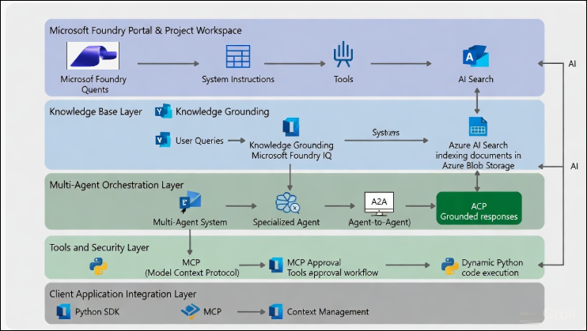

## Explanation of Components

1. **Microsoft Foundry Portal & Project Workspace:**
The primary interface (formerly Azure AI Studio) where developers create Foundry projects, deploy foundation models, configure AI agents, define system instructions, attach tools, and test interactions in the Agents Playground. It supports AI-enhanced queries and serves as the entry point for building expense management agents.

2. **Knowledge Base Layer / Knowledge Grounding:**
User queries and uploaded documents (e.g., company expense policy PDFs) are processed via Knowledge Grounding and Microsoft Foundry IQ (evolution of Azure AI Search). Relevant content is retrieved and indexed in Azure Blob Storage, enabling the agent to provide accurate, cited, and policy-grounded responses instead of hallucinated information.

3. **Multi-Agent Orchestration Layer:**
Handles coordination of multiple agents: a Multi-Agent System delegates tasks to Specialized Agents (e.g., one for policy lookup, another for calculations). Agent-to-Agent (A2A) communication enables collaboration, while the Agent Control Plane (ACP) ensures grounded, reliable final responses for expense-related tasks like validation or claim preparation.

4. **Tools and Security Layer:**
Tools are invoked securely via the Model Context Protocol (MCP), which standardizes tool calling and context passing. This includes MCP Approval workflows for governance (e.g., human-in-the-loop or policy checks), leading to approved tool execution. The Dynamic Python code execution (Code Interpreter tool) allows the agent to generate/run Python scripts on-the-fly — for example, to calculate totals, format data, or create downloadable expense claim files (CSV/PDF).

5. **Client Application Integration Layer:**
Once tested in the playground, the agent integrates into production applications via the Python SDK and MCP for context management. This enables seamless embedding (e.g., in web apps, Teams, or custom tools), with conversation state and data persisted in Azure Blob Storage for continuity and auditability.

# Getting Started with lab

Welcome to your AI-3026: Develop AI Agents on Azure workshop! We’ve prepared an interactive environment to help you explore how to design, build, and deploy intelligent AI agents using Microsofts Foundry.

## Accessing Your Lab Environment
 
Once you're ready to dive in, your virtual machine and **Guide** will be right at your fingertips within your web browser.
 
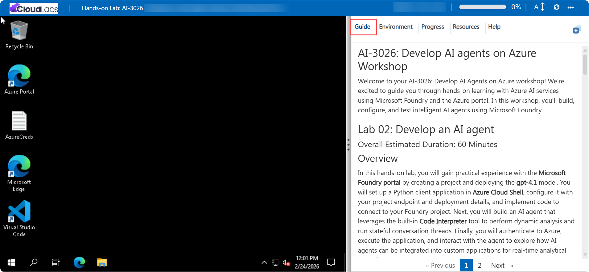

### Virtual Machine & Lab Guide
 
Your virtual machine is your workhorse throughout the workshop. The lab guide is your roadmap to success.

## Exploring Your Lab Resources
 
To get a better understanding of your lab resources and credentials, navigate to the **Environment** tab.
 
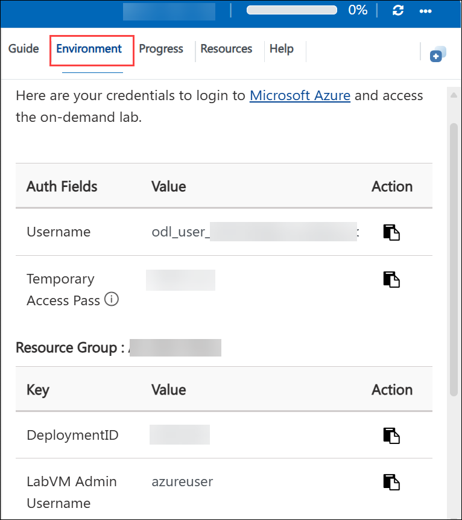

## Utilizing the Split Window Feature
 
For convenience, you can open the lab guide in a separate window by selecting the **Split Window** button from the top right corner.
 
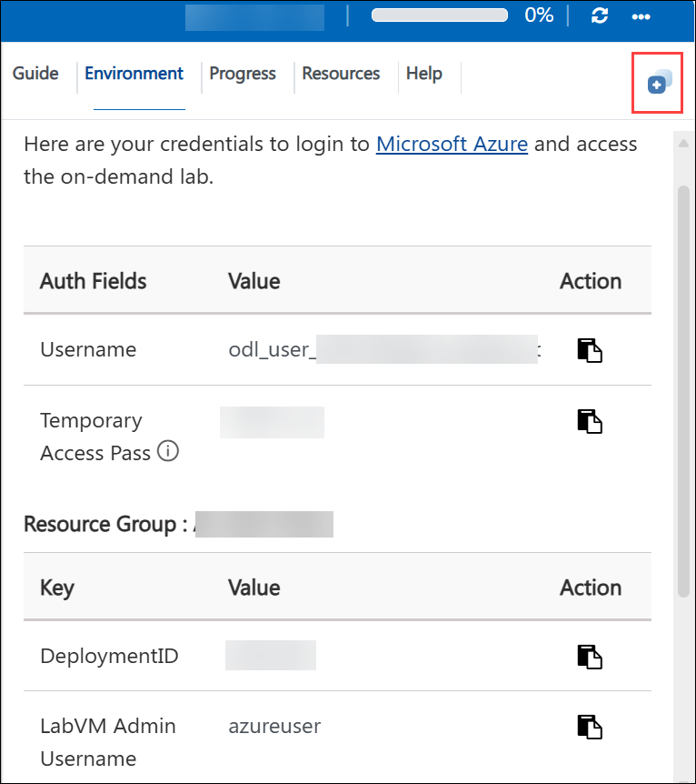

## Lab Guide Zoom In/Zoom Out
 
To adjust the zoom level for the environment page, click the **A↕: 100%** icon located next to the timer in the lab environment.

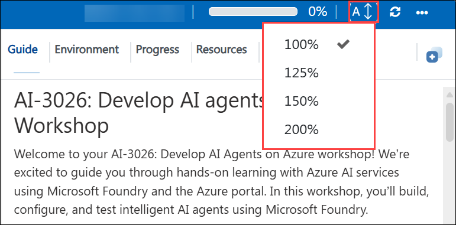

## Lab Progress

You can use the **Progress** tab to track your progress while working on the lab. A score will be provided after successful validation.

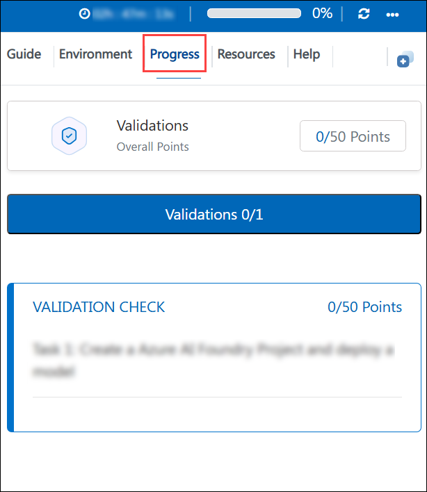

## Managing Your Virtual Machine
 
Feel free to **Start, Restart, or Stop (2)** your virtual machine as needed from the **Resources (1)** tab. Your experience is in your hands!
 
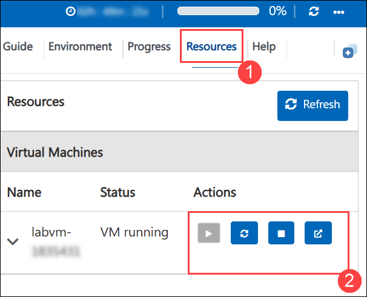

## Let's Get Started with Azure Portal
 
1. On your virtual machine, click on the **Azure Portal** icon as shown below:
 
   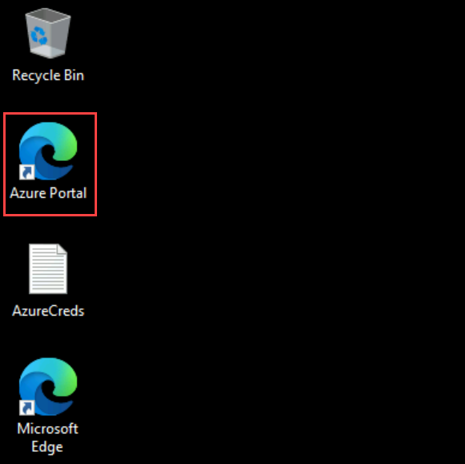

1. In the sign-in window, kindly sign in using the provided Azure credentials

    - **Email/Username:** <inject key="AzureAdUserEmail"></inject>

        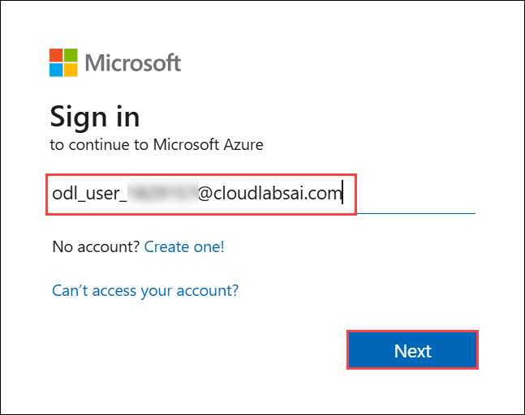

    - **Temporary Access Pass:** <inject key="AzureAdUserPassword"></inject>

        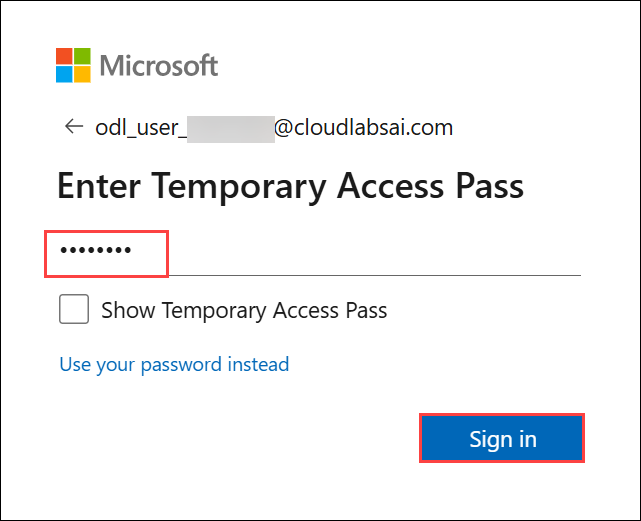

1. If prompted to **Stay signed in?**, you can click **No**.

    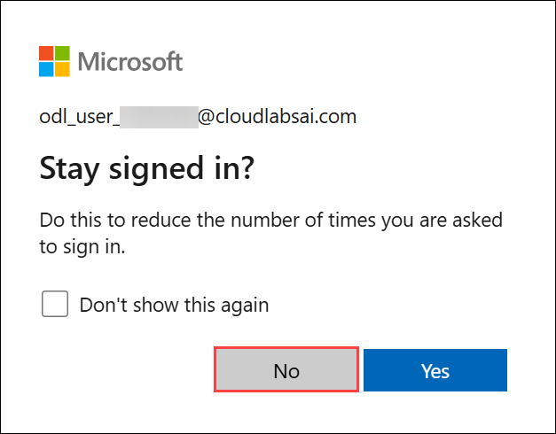

1. If a **Welcome to Microsoft Azure** pop-up window appears, simply click **Maybe later** to skip the tour.

    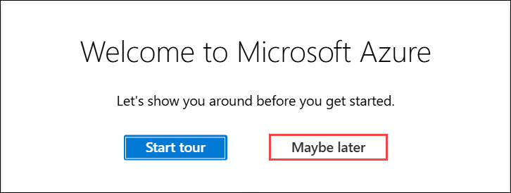

## Support Contact
 
The CloudLabs support team is available 24/7, 365 days a year, via email and live chat to ensure seamless assistance at any time. We offer dedicated support channels explicitly tailored for both learners and instructors, ensuring that all your needs are promptly and efficiently addressed.
 
Learner Support Contacts:
 
- Email Support: cloudlabs-support@spektrasystems.com
- Live Chat Support: https://cloudlabs.ai/labs-support

Click on **Next** from the lower right corner to move on to the next page.

   

## Happy Learning !!
