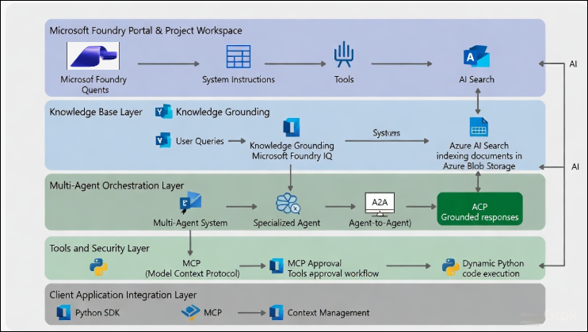
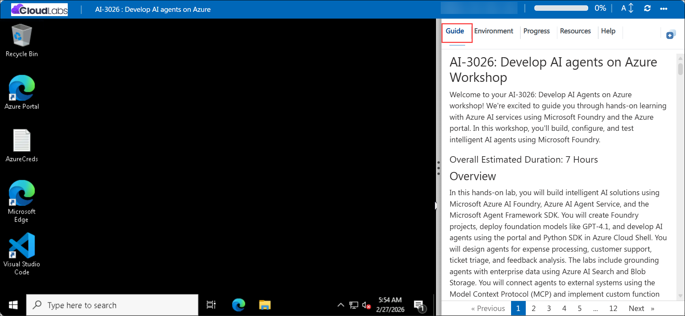

# AI-3026: Develop AI agents on Azure Workshop

Welcome to your AI-3026: Develop AI Agents on Azure workshop! We’re excited to guide you through hands-on learning with Azure AI services using Microsoft Foundry and the Azure portal. In this workshop, you’ll build, configure, and test intelligent AI agents using Microsoft Foundry.

### Overall Estimated Duration: 6 Hours

## Overview

In this hands-on lab, you will build intelligent AI solutions using Microsoft Foundry and Azure AI Agent Service. You will create Foundry projects, deploy foundation models such as GPT-4.1, and develop AI agents using the portal and Python SDK in Azure Cloud Shell. You will design conversational and tool-enabled agents capable of automating real-world tasks and workflows. The labs include grounding agents with enterprise data using Azure AI Search and Azure Blob Storage for accurate, context-aware responses. You will also integrate agents with external systems using the Model Context Protocol (MCP) and implement custom function tools for automation. Finally, you will build multi-agent and distributed solutions using orchestration patterns and the A2A protocol to enable collaboration between agents. By the end of this lab, you will understand how to design, integrate, and automate enterprise-grade AI workflows end to end.

## Objectives

By the end of this lab, you will be able to:

1. **Create a project and agent in Microsoft Foundry:** Set up a new Foundry project and create an AI agent with a deployed model ready for configuration.

2. **Configure an AI agent with knowledge and tools:** Define system instructions, upload an expense policy document for grounding, and enable tools such as file search and code interpreter.

3. **Test and validate the agent in the playground:** Interact with the agent by asking policy-related questions, submit an expense claim, and download and review the generated claim file.

4. **Build and configure an AI agent using the SDK:** Implement code to connect to the Foundry project, define agent instructions, and enable the built-in Code Interpreter tool.

5. **Develop and configure custom function tools:** Build functions such as generating support tickets and register them for use by the agent.

6. **Connect an AI agent to an MCP server:** Integrate a Microsoft Foundry agent with a remote **Model Context Protocol (MCP) server** and configure MCP function tools for accessing trusted documentation.

7. **Build a sequential orchestration**: Define a workflow where each agent’s output feeds into the next, forming a multi-agent pipeline.

8. **Implement discoverable A2A agents:** Define skills, agent cards, and executors to enable message handling and make agents interoperable through the A2A protocol.

9. **Implement intelligent routing logic**: Classify tickets with structured JSON output, handle low-confidence cases, escalate billing issues, and automate responses for other categories.

10. **Ground an agent with enterprise knowledge**: Connect the agent to Azure AI Search and configure a knowledge base using documents stored in Azure Blob Storage.

## Pre-requisites

* Basic knowledge of the Azure portal.
* Familiarity with AI concepts such as agents, grounding data, and actions.
* An active Azure subscription with access to **Microsoft Foundry**.
* Understanding of Model Context Protocol (MCP) concepts and function tools.
* Basic knowledge of Python programming.

## Architecture

The lab architecture demonstrates how a Microsoft Foundry project enables AI agent developments.

1. **Microsoft Foundry Portal & Project Workspace:** Central hub for creating projects, deploying models, configuring agents, and testing in the playground with system instructions, tools, and AI-enhanced search.
   
2. **Custom Functions and Tooling Layer:** Enhances agents with custom function tools to automate business logic, process structured inputs, and execute real-world tasks, enabling agents to go beyond conversational capabilities.

3. **External Tool Connectivity Layer (MCP)** Connects AI agents securely to external systems and services using the Model Context Protocol (MCP), enabling structured tool invocation and controlled interaction with enterprise applications.
 
4. **Multi-Agent and Workflow Orchestration Layer:** Supports collaboration between multiple specialized agents using orchestration patterns, workflow automation, and Agent-to-Agent (A2A) communication for distributed and scalable solutions.
   
5. **Enterprise Knowledge and Grounding Layer:** Grounds agent responses using enterprise data through Azure AI Search and document storage in Azure Blob Storage, ensuring accurate, context-aware, and trusted responses.

6. **Client Application and SDK Integration Layer:** Enables embedding agents into client applications using the Microsoft Agent Framework Python SDK, supporting programmatic configuration, remote communication, and persistent context management.

## Architecture Diagram

## Explanation of Components

1. **Microsoft Foundry Portal:** The central environment used to explore AI agent development, create projects, deploy foundation models such as GPT-4.1, configure system instructions, and test agents in the playground. It serves as the starting point for building and managing intelligent conversational and task-oriented agents.

2. **Custom Functions and Tool Integration:** Agents are extended with custom function tools that allow structured input handling, automation of business logic, and execution of real-world operations. This enables agents to move beyond conversations and perform actionable tasks such as processing requests and generating structured outputs.

3. **Model Context Protocol (MCP):** The Model Context Protocol enables secure and standardized connectivity between AI agents and external systems. It supports context sharing, structured tool invocation, and controlled access to enterprise services and trusted data sources.

4. **Microsoft Agent Framework SDK and Python:** The Microsoft Agent Framework with Python enables programmatic agent development, configuration, and integration into applications. Developers use it to build scalable agents, manage workflows, and automate interactions within enterprise solutions.

5. **Multi-Agent Collaboration and Workflow Automation:** Multiple specialized agents collaborate using orchestration patterns, sequential pipelines, and distributed communication such as A2A. Workflow automation enables structured multi-step processes where outputs from one agent or step feed into the next.

6. **Enterprise Knowledge Grounding and Responsible AI:** Agents are grounded using enterprise data through Azure AI Search and Azure Blob Storage via Foundry IQ. This ensures accurate, context-aware responses while supporting responsible AI, governance, and secure enterprise deployment.

# Getting Started with lab

Welcome to your AI-3026: Develop AI Agents on Azure workshop! We’ve prepared an interactive environment to help you explore how to design, build, and deploy intelligent AI agents using Microsofts Foundry.

## Accessing Your Lab Environment
 
Once you're ready to dive in, your virtual machine and **Guide** will be right at your fingertips within your web browser.
 

### Virtual Machine & Lab Guide
 
Your virtual machine is your workhorse throughout the workshop. The lab guide is your roadmap to success.

## Exploring Your Lab Resources
 
To get a better understanding of your lab resources and credentials, navigate to the **Environment** tab.
 

## Utilizing the Split Window Feature
 
For convenience, you can open the lab guide in a separate window by selecting the **Split Window** button from the top right corner.
 

## Lab Guide Zoom In/Zoom Out
 
To adjust the zoom level for the environment page, click the **A↕: 100%** icon located next to the timer in the lab environment.

## Lab Progress

You can use the **Progress** tab to track your progress while working on the lab. A score will be provided after successful validation.

## Managing Your Virtual Machine
 
Feel free to **Start, Restart, or Stop (2)** your virtual machine as needed from the **Resources (1)** tab. Your experience is in your hands!
 

## Let's Get Started with Azure Portal
 
1. On your virtual machine, click on the **Azure Portal** icon as shown below:
 
   

1. In the sign-in window, kindly sign in using the provided Azure credentials

    - **Email/Username:** <inject key="AzureAdUserEmail"></inject>

        

    - **Temporary Access Pass:** <inject key="AzureAdUserPassword"></inject>

        

1. If prompted to **Stay signed in?**, you can click **No**.

    

1. If a **Welcome to Microsoft Azure** pop-up window appears, simply click **Maybe later** to skip the tour.

    

## Support Contact
 
The CloudLabs support team is available 24/7, 365 days a year, via email and live chat to ensure seamless assistance at any time. We offer dedicated support channels explicitly tailored for both learners and instructors, ensuring that all your needs are promptly and efficiently addressed.
 
Learner Support Contacts:
 
- Email Support: cloudlabs-support@spektrasystems.com
- Live Chat Support: https://cloudlabs.ai/labs-support

Click on **Next** from the lower right corner to move on to the next page.

   

## Happy Learning !!