# AI-3026: Develop AI agents on Azure Workshop

Welcome to your AI-3026: Develop AI Agents on Azure workshop! We’re excited to guide you through hands-on learning with Azure AI services using Microsoft Foundry and the Azure portal. In this workshop, you’ll build, configure, and test intelligent AI agents using Microsoft Foundry.

### Overall Estimated Duration: 3 Hours

## Overview

In this hands-on lab, you will build intelligent AI solutions using Microsoft Foundry and Azure AI Agent Service. You will create Foundry projects, deploy foundation models such as GPT-4.1, and develop AI agents using the portal and Python SDK in Azure Cloud Shell. You will design conversational and tool-enabled agents capable of automating real-world tasks and workflows. The labs include grounding agents with enterprise data using Azure AI Search and Azure Blob Storage for accurate, context-aware responses. You will also integrate agents with external systems using the Model Context Protocol (MCP) and implement custom function tools for automation. Finally, you will build multi-agent and distributed solutions using orchestration patterns and the A2A protocol to enable collaboration between agents. By the end of this lab, you will understand how to design, integrate, and automate enterprise-grade AI workflows end to end.

## Objectives

By the end of this lab, you will be able to:

1. **Explore AI Agent development:** In this hands-on lab, participants will use the Microsoft Foundry portal to build an AI agent for handling employee expense claims. They will configure agent instructions, ground the agent using an expense policy document, and test it in the playground, including generating a downloadable expense claim file.

2. **Integrate an AI agent with Foundry IQ:** In this hands-on lab, participants will create an AI agent in Microsoft Foundry and integrate it with Foundry IQ for enterprise knowledge grounding. They will configure the agent using product documents from Azure Blob Storage and Azure AI Search, test it in the playground, and connect it via a Python client to send queries and retrieve knowledge-driven responses.

3. **Build a workflow in Microsoft Foundry:** In this hands-on lab, participants will design and implement a sequential workflow for automated customer support ticket processing. They will create AI agents to classify tickets, manage escalations, and generate responses, and then connect the workflow to Python using the Azure AI Projects SDK for programmatic validation.

4. **Develop a multi-agent solution with Microsoft Agent Framework (Optional):** In this hands-on lab, participants will build a multi-agent solution using the Microsoft Agent Framework SDK. They will implement a sequential orchestration pattern where multiple agents collaborate in a pipeline to process inputs and generate meaningful outputs.

## Pre-requisites

* Basic knowledge of the Azure portal.
* Familiarity with AI concepts such as agents, grounding data, and actions.
* An active Azure subscription with access to **Microsoft Foundry**.

# Getting Started with lab

Welcome to your AI-3026: Develop AI Agents on Azure workshop! We’ve prepared an interactive environment to help you explore how to design, build, and deploy intelligent AI agents using Microsofts Foundry.

## Accessing Your Lab Environment
 
Once you're ready to dive in, your virtual machine and **Guide** will be right at your fingertips within your web browser.
 
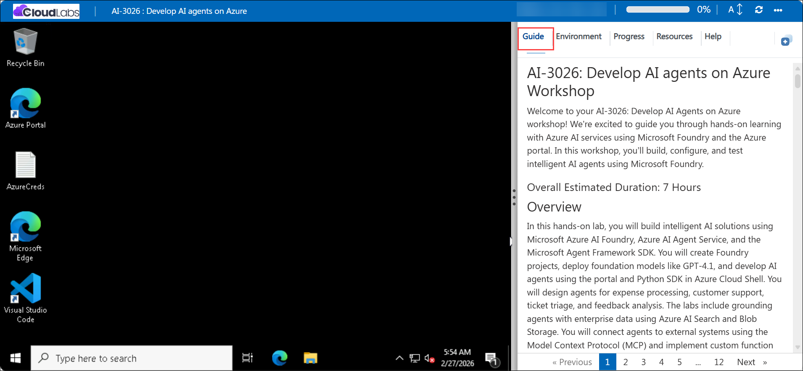

### Virtual Machine & Lab Guide
 
Your virtual machine is your workhorse throughout the workshop. The lab guide is your roadmap to success.

## Exploring Your Lab Resources
 
To get a better understanding of your lab resources and credentials, navigate to the **Environment** tab.
 
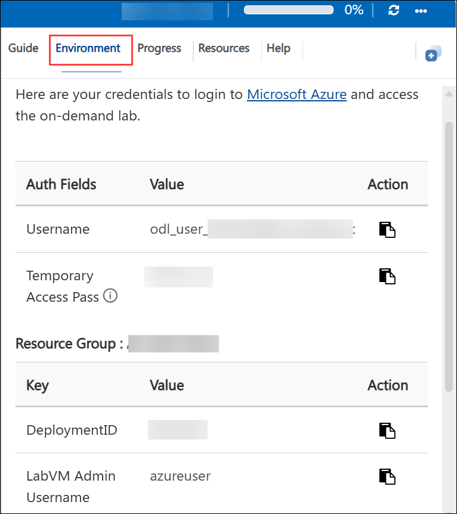

## Utilizing the Split Window Feature
 
For convenience, you can open the lab guide in a separate window by selecting the **Split Window** button from the top right corner.
 
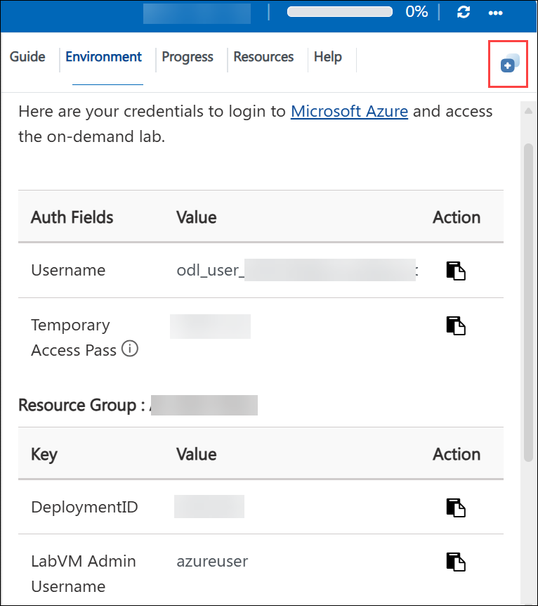

## Lab Guide Zoom In/Zoom Out
 
To adjust the zoom level for the environment page, click the **A↕: 100%** icon located next to the timer in the lab environment.

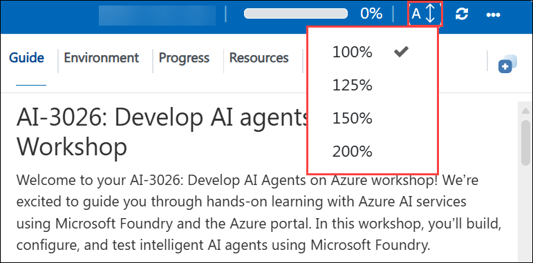

## Lab Progress

You can use the **Progress** tab to track your progress while working on the lab. A score will be provided after successful validation.

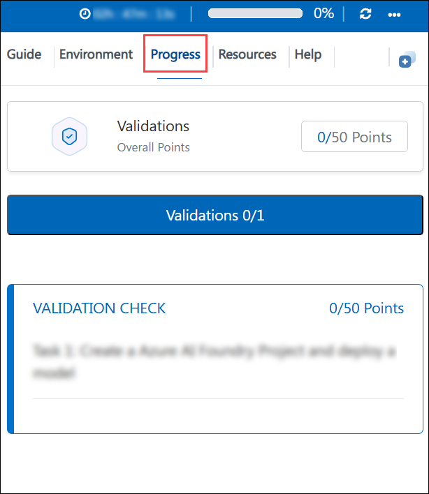

## Managing Your Virtual Machine
 
Feel free to **Start, Restart, or Stop (2)** your virtual machine as needed from the **Resources (1)** tab. Your experience is in your hands!
 
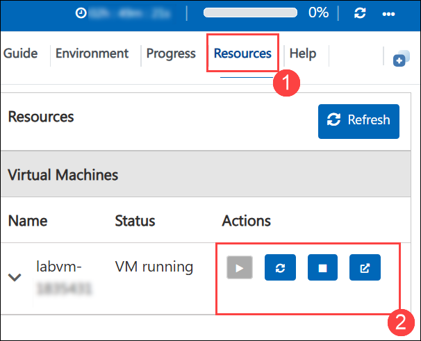

## Let's Get Started with Azure Portal
 
1. On your virtual machine, click on the **Azure Portal** icon as shown below:
 
   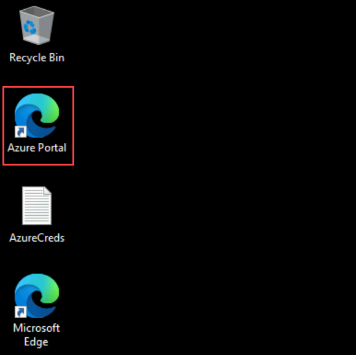

1. In the sign-in window, kindly sign in using the provided Azure credentials

    - **Email/Username:** <inject key="AzureAdUserEmail"></inject>

        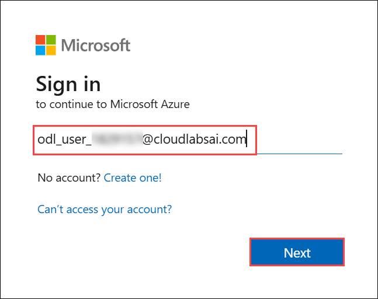

    - **Temporary Access Pass:** <inject key="AzureAdUserPassword"></inject>

        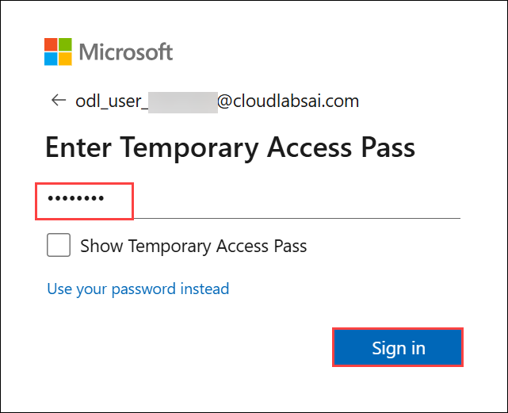

1. If prompted to **Stay signed in?**, you can click **No**.

    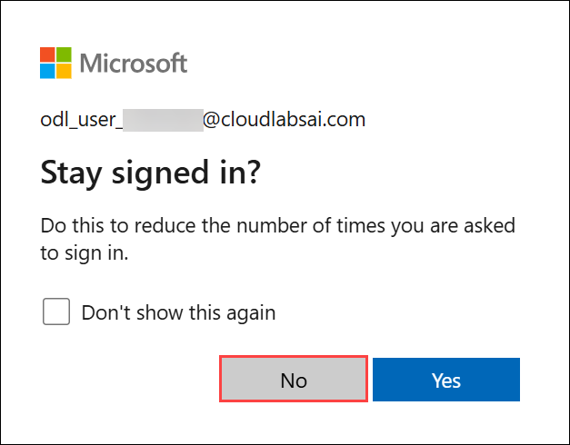

1. If a **Welcome to Microsoft Azure** pop-up window appears, simply click **Maybe later** to skip the tour.

    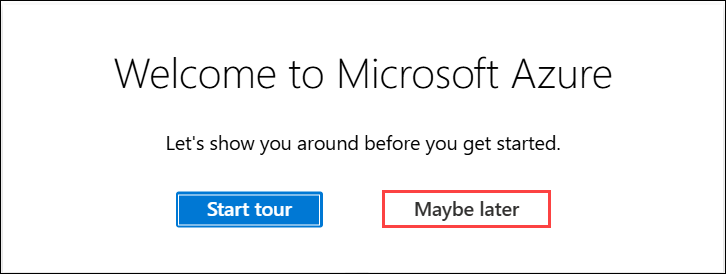

## Support Contact
 
The CloudLabs support team is available 24/7, 365 days a year, via email and live chat to ensure seamless assistance at any time. We offer dedicated support channels explicitly tailored for both learners and instructors, ensuring that all your needs are promptly and efficiently addressed.
 
Learner Support Contacts:
 
- Email Support: cloudlabs-support@spektrasystems.com
- Live Chat Support: https://cloudlabs.ai/labs-support

Click on **Next** from the lower right corner to move on to the next page.

   

## Happy Learning !!
