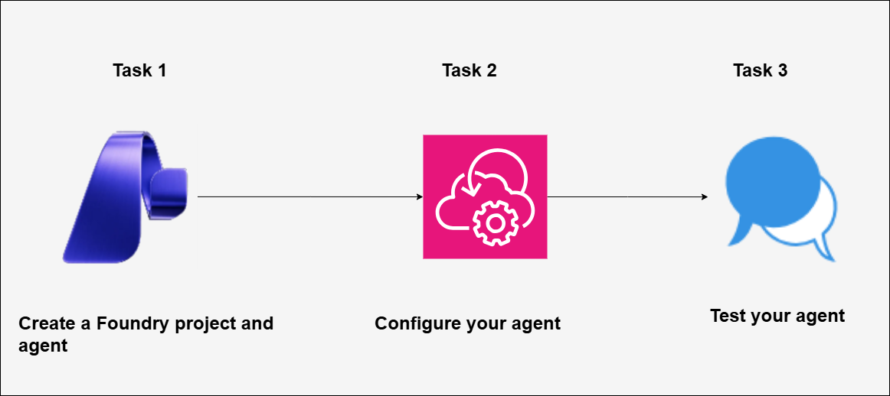

# AI-102: Develop AI agents on Azure Workshop Workshop

Welcome to your AI-3026: Develop AI Agents on Azure workshop! We’re excited to guide you through hands-on learning with Azure AI services using Microsoft Foundry and the Azure portal. In this workshop, you’ll build, configure, and test intelligent AI agents using Microsoft Foundry.

# Lab 01: Explore AI Agent development

### Overall Estimated Duration: 30 Minutes

## Overview

In this hands-on lab, you will gain practical experience with the Microsoft Foundry portal by creating a project and building an AI agent. You will configure the agent with system instructions and upload a corporate expenses policy document as a knowledge source. Next, you’ll enable the code interpreter tool and test the agent in the playground by asking questions and submitting an expense claim. Finally, you’ll download and review the generated claim file to see how AI agents can support real business processes.

## Objectives

By the end of this lab, you will be able to:

1. **Create a project and agent in Microsoft Foundry:** Set up a new Foundry project and create an AI agent with a deployed model ready for configuration.

2. **Configure an AI agent with knowledge and tools:** Define system instructions, upload an expense policy document for grounding, and enable tools such as file search and code interpreter.

3. **Test and validate the agent in the playground:** Interact with the agent by asking policy-related questions, submit an expense claim, and download and review the generated claim file.

## Pre-requisites

* Basic knowledge of the Azure portal.
* Familiarity with AI concepts such as agents, grounding data, and actions.
* An active Azure subscription with access to **Microsoft Foundry**.
* Permission to create and manage resources in the assigned resource group (for example, Azure AI User role).

## Architecture

The lab architecture demonstrates how a Microsoft Foundry project enables AI agent development for expense management:

1. **Microsoft Foundry Project and Deployed Model:** A workspace created in the Microsoft Foundry portal where a foundation model is deployed to power the AI agent’s conversational and task-based responses.

2. **AI Agent Configuration:** An agent created in the playground with defined system instructions that control its behavior and response logic.

3. **Grounding Data and Tools:** An uploaded expense policy document attached using File Search for contextual grounding, along with the Code Interpreter tool to enable dynamic actions such as generating downloadable expense claim files.

4. **Agents Playground Interface:** An interactive testing environment where users send prompts, validate grounded responses, trigger tool-based actions, and review generated outputs before integrating the agent into applications.

## Architecture Diagram

## Explanation of Components

1. **Microsoft Foundry Project and Deployed Model:** The project serves as the central workspace in the Microsoft Foundry portal where AI resources are managed. Within this project, a foundation model is deployed to process user prompts and generate responses that power the AI agent.

2. **AI Agent Configuration:** The agent encapsulates the deployed model along with system instructions that define its purpose assisting employees with expense-related queries. These instructions control tone, scope, and task-handling logic during interactions.

3. **Knowledge Source (Expense Policy Document):** The uploaded expense policy document acts as the agent’s knowledge base. Using File Search, the agent retrieves relevant policy information to provide accurate, context-aware responses grounded in company guidelines.

4. **Code Interpreter and Playground Interaction:** The Code Interpreter tool enables the agent to generate and execute Python code for performing actions such as creating downloadable expense claim files. The Agents Playground provides the interactive interface where users test prompts, trigger actions, and validate outputs in real time.

# Getting Started with lab

Welcome to your AI-3026: Develop AI Agents on Azure workshop! We’ve prepared an interactive environment to help you explore how to design, build, and deploy intelligent AI agents using Microsofts Foundry.

## Accessing Your Lab Environment
 
Once you're ready to dive in, your virtual machine and **Guide** will be right at your fingertips within your web browser.
 

### Virtual Machine & Lab Guide
 
Your virtual machine is your workhorse throughout the workshop. The lab guide is your roadmap to success.

## Exploring Your Lab Resources
 
To get a better understanding of your lab resources and credentials, navigate to the **Environment** tab.
 

## Utilizing the Split Window Feature
 
For convenience, you can open the lab guide in a separate window by selecting the **Split Window** button from the top right corner.
 

## Lab Guide Zoom In/Zoom Out
 
To adjust the zoom level for the environment page, click the **A↕: 100%** icon located next to the timer in the lab environment.

## Lab Progress

You can use the **Progress** tab to track your progress while working on the lab. A score will be provided after successful validation.

## Managing Your Virtual Machine
 
Feel free to **Start, Restart, or Stop (2)** your virtual machine as needed from the **Resources (1)** tab. Your experience is in your hands!
 

## Let's Get Started with Azure Portal
 
1. On your virtual machine, click on the **Azure Portal** icon as shown below:
 
   

1. In the sign-in window, kindly sign in using the provided Azure credentials

    - **Email/Username:** <inject key="AzureAdUserEmail"></inject>

        

    - **Temporary Access Pass:** <inject key="AzureAdUserPassword"></inject>

        

1. If prompted to **Stay signed in?**, you can click **No**.

    

1. If a **Welcome to Microsoft Azure** pop-up window appears, simply click **Maybe later** to skip the tour.

    

## Support Contact
 
The CloudLabs support team is available 24/7, 365 days a year, via email and live chat to ensure seamless assistance at any time. We offer dedicated support channels explicitly tailored for both learners and instructors, ensuring that all your needs are promptly and efficiently addressed.
 
Learner Support Contacts:
 
- Email Support: cloudlabs-support@spektrasystems.com
- Live Chat Support: https://cloudlabs.ai/labs-support

Click on **Next** from the lower right corner to move on to the next page.

   

## Happy Learning !!
