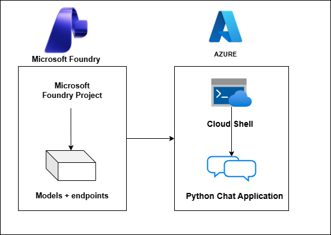

# AI-3026: Develop AI agents on Azure Workshop

Welcome to your AI-3026: Develop AI Agents on Azure workshop! We’re excited to guide you through hands-on learning with Azure AI services using Microsoft Foundry and the Azure portal. In this workshop, you’ll build, configure, and test intelligent AI agents using Microsoft Foundry.

# Lab 02: Develop an AI agent

### Overall Estimated Duration: 60 Minutes

## Overview

In this hands-on lab, you will gain practical experience with the **Microsoft Foundry portal** by creating a project and deploying the **gpt-4.1** model. You will set up a Python client application in **Azure Cloud Shell**, configure it with your project endpoint and deployment details, and implement code to connect to your Foundry project. Next, you will build an AI agent that leverages the built-in **Code Interpreter** tool to perform dynamic analysis and run stateful conversation threads. Finally, you will authenticate to Azure, execute the application, and interact with the agent to explore how AI agents can be integrated into custom applications for real-time analytical scenarios.

## Objectives

By the end of this lab, you will be able to:

1. **Create a project and deploy a model in the Microsoft Foundry portal:** Set up a new project, deploy the gpt-4.1 model, and prepare it for agent development.

2. **Set up and configure a Python client application:** Prepare the Azure Cloud Shell environment, install dependencies, and update application settings with project details.

3. **Build and configure an AI agent using the SDK:** Implement code to connect to the Foundry project, define agent instructions, and enable the built-in Code Interpreter tool.

4. **Authenticate and test the agent:** Sign in to Azure, run the application, interact with the agent through prompts, and validate its analytical and conversational capabilities.

## Pre-requisites

* Basic knowledge of the Azure portal.
* Familiarity with AI concepts such as agents, grounding data, and code interpreter actions.
* An active Azure subscription with access to **Microsoft Foundry portal**.
* Permission to create and manage resources in the assigned resource group (for example, Azure AI User role).

## Architecture

This lab demonstrates how a Microsoft Foundry project enables AI agent development through SDK-based integration and tool-enabled execution.

1. **Microsoft Foundry Project:** A workspace created in the Microsoft Foundry portal where you deploy models and manage agent configurations.

2. **Deployed Foundation Model (gpt-4.1):** A model deployed within the project that processes prompts and powers the AI agent’s analytical and conversational responses.

3. **AI Agent with Code Interpreter Tool:** An agent defined programmatically using the Microsoft Foundry SDK, configured with instructions and the built-in Code Interpreter tool to execute dynamic Python code.

4. **Python Client Application (Azure Cloud Shell):** A client application that connects to the project endpoint, authenticates using Azure credentials, sends prompts, manages stateful conversations, and retrieves responses.

5. **Azure CLI Authentication:** Provides secure access to the Foundry project and allows the application to interact with deployed models and agents programmatically.

## Architecture Diagram

## Explanation of Components

1. **Microsoft Foundry Project:** The central workspace created in the Microsoft Foundry portal where you deploy models and manage agent configurations for SDK-based integration.

2. **Deployed Model (gpt-4.1):** The foundation model deployed within the project that processes prompts and generates analytical and conversational responses.

3. **AI Agent (SDK-defined):** An agent created programmatically using the Microsoft Foundry SDK, configured with instructions and linked to the deployed model for task-specific behavior.

4. **Code Interpreter Tool:** A built-in tool enabled for the agent that allows execution of dynamic Python code to perform calculations, statistical analysis, and generate structured outputs.

5. **Python Client Application with Azure Authentication:** A Cloud Shell–based application that authenticates using Azure CLI, connects to the project endpoint, manages stateful conversations, and interacts with the agent programmatically.

# Getting Started with lab

Welcome to your AI-102: Azure AI Engineer Associate workshop! We’ve prepared an interactive environment for you to explore generative AI concepts and work with Microsoft Azure services like Azure AI Foundry, Document Intelligence, Custom Vision, Language Service, etc. Let’s get started and make the most of this hands-on experience.

## Accessing Your Lab Environment
 
Once you're ready to dive in, your virtual machine and **Guide** will be right at your fingertips within your web browser.
 

### Virtual Machine & Lab Guide
 
Your virtual machine is your workhorse throughout the workshop. The lab guide is your roadmap to success.

## Exploring Your Lab Resources
 
To get a better understanding of your lab resources and credentials, navigate to the **Environment** tab.
 

## Utilizing the Split Window Feature
 
For convenience, you can open the lab guide in a separate window by selecting the **Split Window** button from the top right corner.
 

## Lab Guide Zoom In/Zoom Out
 
To adjust the zoom level for the environment page, click the **A↕: 100%** icon located next to the timer in the lab environment.

## Lab Progress

You can use the **Progress** tab to track your progress while working on the lab. A score will be provided after successful validation.

## Managing Your Virtual Machine
 
Feel free to **Start, Restart, or Stop (2)** your virtual machine as needed from the **Resources (1)** tab. Your experience is in your hands!
 

## Let's Get Started with Azure Portal
 
1. On your virtual machine, click on the **Azure Portal** icon as shown below:
 
   

1. In the sign-in window, kindly sign in using the provided Azure credentials

    - **Email/Username:** <inject key="AzureAdUserEmail"></inject>

        

    - **Temporary Access Pass:** <inject key="AzureAdUserPassword"></inject>

        

1. If prompted to **Stay signed in?**, you can click **No**.

    

1. If a **Welcome to Microsoft Azure** pop-up window appears, simply click **Maybe later** to skip the tour.

    

## Support Contact
 
The CloudLabs support team is available 24/7, 365 days a year, via email and live chat to ensure seamless assistance at any time. We offer dedicated support channels explicitly tailored for both learners and instructors, ensuring that all your needs are promptly and efficiently addressed.
 
Learner Support Contacts:
 
- Email Support: cloudlabs-support@spektrasystems.com
- Live Chat Support: https://cloudlabs.ai/labs-support

Click on **Next** from the lower right corner to move on to the next page.

   

## Happy Learning !!

