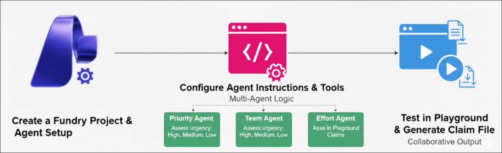

# AI-3026: Develop AI agents on Azure Workshop

Welcome to your AI-3026: Develop AI Agents on Azure workshop! We’re excited to guide you through hands-on learning with Azure AI services using Microsoft Foundry and the Azure portal. In this workshop, you’ll build, configure, and test intelligent AI agents using Microsoft Foundry.

# Lab 05: Develop a multi-agent solution with Microsoft Foundry

### Overall Estimated Duration: 30 Minutes

## Overview

In this hands-on lab, you will build a multi-agent AI solution using the Microsoft Foundry Agent Service to automate support ticket triage. You will create a Foundry project, deploy the gpt-4.1 model, and set up a Python client application in Azure Cloud Shell. Next, you will create multiple AI agents, each responsible for evaluating ticket priority, recommending the appropriate team, and estimating the required effort. You will orchestrate these agents using a primary triage agent, run the application, and observe how the agents collaborate to provide structured ticket assessments in real-time scenarios.

## Objectives

By the end of this lab, you will be able to:

1. **Create a Foundry project and deploy a model:** Set up a Microsoft Foundry project and deploy the gpt-4.1 model for agent use.

2. **Set up a Python client application:** Configure the client app in Azure Cloud Shell with your project endpoint and model deployment details.

3. **Build AI agents for support ticket triage:** Create specialized agents to evaluate ticket priority, assign tickets to the appropriate team, and estimate effort required.

4. **Implement agent orchestration:** Use a primary triage agent to coordinate communication between the individual support agents for collaborative processing.

5. **Test and validate multi-agent collaboration:** Run the Python application, submit support tickets, and observe how the agents work together to generate structured ticket assessments.

## Pre-requisites

* Basic knowledge of the Azure portal.
* Familiarity with AI agent concepts, including agent roles and multi-agent collaboration.
* An active Azure subscription with access to **Microsoft Foundry portal**.
* Basic knowledge of **Python** programming.

## Architecture

The lab architecture demonstrates how multiple AI agents collaborate to triage support tickets in a Microsoft Foundry project:

1. **Microsoft Foundry Project:** The workspace where you deploy the gpt-4.1 model and manage project endpoints. All agents and the client application connect to this project.

2. **Priority Agent:** Evaluates the urgency of a support ticket and assigns a priority level (High, Medium, Low).

3. **Team Agent:** Determines the appropriate team to handle the ticket (Frontend, Backend, Infrastructure, Marketing).

4. **Effort Agent:** Estimates the effort required to resolve the ticket (Small, Medium, Large).

5. **Triage Agent:** Orchestrates the workflow by connecting to the other three agents using connected tools. It routes prompts and aggregates their responses into a final ticket assessment.

6. **Client Application:** A Python app (`agent_triage.py`) that interacts with the triage agent, sends support ticket prompts, and displays the consolidated results.

## Architecture Diagram

## Explanation of Components

1. **Microsoft Foundry Project:** The workspace where you create and manage your AI project. It hosts the deployed **gpt-4.1** model and provides the project endpoint that the client app and agents use for communication.

2. **Model Deployment (gpt-4.1):** The language model deployed in your Foundry project. It powers the Priority, Team, and Effort Agents, enabling them to analyze support tickets and generate responses.

3. **Priority Agent:** An AI agent that evaluates the urgency of a support ticket and outputs a priority level—High, Medium, or Low—along with a brief explanation.

4. **Team Agent:** An AI agent that decides which team should handle the ticket, choosing from Frontend, Backend, Infrastructure, or Marketing, based on the ticket content.

5. **Effort Agent:** An AI agent that estimates how much work a ticket will require—Small, Medium, or Large—and provides a brief justification.

6. **Triage Agent:** The orchestrator agent that coordinates the other three agents using connected tools. It routes user prompts, collects responses, and produces a final structured ticket assessment.

7. **Client Application (`agent_triage.py`):** A Python app that launches the agents, sends support ticket prompts to the triage agent, and displays the consolidated responses from all agents to the user.

# Getting Started with lab

Welcome to your AI-3026: Develop AI Agents on Azure workshop! We’ve prepared an interactive environment to help you explore how to design, build, and deploy intelligent AI agents using Microsofts Foundry.

## Accessing Your Lab Environment
 
Once you're ready to dive in, your virtual machine and **Guide** will be right at your fingertips within your web browser.
 

### Virtual Machine & Lab Guide
 
Your virtual machine is your workhorse throughout the workshop. The lab guide is your roadmap to success.

## Exploring Your Lab Resources
 
To get a better understanding of your lab resources and credentials, navigate to the **Environment** tab.
 

## Utilizing the Split Window Feature
 
For convenience, you can open the lab guide in a separate window by selecting the **Split Window** button from the top right corner.
 

## Lab Guide Zoom In/Zoom Out
 
To adjust the zoom level for the environment page, click the **A↕: 100%** icon located next to the timer in the lab environment.

## Lab Progress

You can use the **Progress** tab to track your progress while working on the lab. A score will be provided after successful validation.

## Managing Your Virtual Machine
 
Feel free to **Start, Restart, or Stop (2)** your virtual machine as needed from the **Resources (1)** tab. Your experience is in your hands!
 

## Let's Get Started with Azure Portal
 
1. On your virtual machine, click on the **Azure Portal** icon as shown below:
 
   

1. In the sign-in window, kindly sign in using the provided Azure credentials

    - **Email/Username:** <inject key="AzureAdUserEmail"></inject>

        

    - **Temporary Access Pass:** <inject key="AzureAdUserPassword"></inject>

        

1. If prompted to **Stay signed in?**, you can click **No**.

    

1. If a **Welcome to Microsoft Azure** pop-up window appears, simply click **Maybe later** to skip the tour.

    

## Support Contact
 
The CloudLabs support team is available 24/7, 365 days a year, via email and live chat to ensure seamless assistance at any time. We offer dedicated support channels explicitly tailored for both learners and instructors, ensuring that all your needs are promptly and efficiently addressed.
 
Learner Support Contacts:
 
- Email Support: cloudlabs-support@spektrasystems.com
- Live Chat Support: https://cloudlabs.ai/labs-support

Click on **Next** from the lower right corner to move on to the next page.

   

## Happy Learning !!

