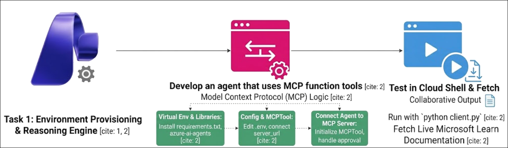

# AI-3026: Develop AI agents on Azure Workshop

Welcome to your AI-3026: Develop AI Agents on Azure workshop! We’re excited to guide you through hands-on learning with Azure AI services using Microsoft Foundry and the Azure portal. In this workshop, you’ll build, configure, and test intelligent AI agents using Microsoft Foundry.

# Lab 06: Connect AI agents to tools using Model Context Protocol (MCP)

### Overall Estimated Duration: 30 Minutes

## Overview

In this hands-on lab, you will gain practical experience with Microsoft Foundry by creating a project and deploying the gpt-4.1 model. You will set up a Python client application in Azure Cloud Shell, configure it with your project endpoint and model deployment, and clone the GitHub repository containing the MCP-based agent code. Next, you will connect an AI agent to a remote Model Context Protocol (MCP) server with MCP function tools to retrieve trusted technical documentation in real time. Finally, you will authenticate to Azure, run the application, and observe how the agent leverages MCP tools to answer developer queries accurately.

## Objectives

By the end of this lab, you will be able to:

1. **Create a Microsoft Foundry project:** Set up a new project in the Foundry portal and deploy the **gpt-4.1** model.

2. **Configure a Python client application:** Prepare the development environment in Azure Cloud Shell, install dependencies, and update configuration files with your project endpoint and model deployment.

3. **Connect an AI agent to an MCP server:** Integrate a Microsoft Foundry agent with a remote **Model Context Protocol (MCP) server** and configure MCP function tools for accessing trusted documentation.

4. **Run and test the agent application:** Authenticate to Azure, execute the Python client, trigger the MCP tools, and validate that the agent retrieves accurate information to answer developer queries.

## Pre-requisites

* Basic knowledge of the Azure portal.
* Understanding of Model Context Protocol (MCP) concepts and function tools.
* Basic knowledge of Python programming.

## Architecture

The lab architecture demonstrates how an AI agent interacts with a remote MCP server within a Microsoft Foundry project:

1. **Microsoft Foundry Project:** Hosts the deployed **gpt-4.1** model and provides the project endpoint used by the client application.

2. **Python Client Application:** Connects to the Foundry project, defines the agent, and manages interactions with the MCP server.

3. **AI Agent:** Configured with instructions and MCP tools to query trusted technical documentation.

4. **MCP Server (Remote):** Provides real-time access to official Microsoft Learn resources, enabling the agent to retrieve accurate and up-to-date information.

5. **Agent-Tool Interaction:** The agent sends queries to the MCP server, processes approval requests if needed, and uses the retrieved data to generate precise responses.

## Architecture Diagram

## Explanation of Components

1. **Microsoft Foundry Project:** The workspace where you create and manage your AI project. It hosts the deployed **gpt-4.1** model and provides the project endpoint used by the client application and agent.

2. **Python Client Application:** A Python-based app that connects to the Foundry project, initializes the AI agent, and manages the conversation thread between the user and the agent.

3. **AI Agent:** Configured with instructions and MCP tools, the agent can query external resources, process approval requests, and generate accurate responses based on the retrieved data.

4. **MCP Tool:** A Model Context Protocol (MCP) function tool integrated with the agent. It enables secure, real-time access to trusted technical documentation from the MCP server.

5. **Remote MCP Server:** A cloud-hosted service providing up-to-date Microsoft Learn resources. The agent interacts with this server to fetch documentation and answer developer queries accurately.

6. **Agent-Tool Interaction:** The agent sends requests to the MCP server, handles any approval workflows if required, and uses the retrieved information to respond to user queries effectively.

# Getting Started with lab

Welcome to your AI-3026: Develop AI Agents on Azure workshop! We’ve prepared an interactive environment to help you explore how to design, build, and deploy intelligent AI agents using Microsofts Foundry.

## Accessing Your Lab Environment
 
Once you're ready to dive in, your virtual machine and **Guide** will be right at your fingertips within your web browser.
 

### Virtual Machine & Lab Guide
 
Your virtual machine is your workhorse throughout the workshop. The lab guide is your roadmap to success.

## Exploring Your Lab Resources
 
To get a better understanding of your lab resources and credentials, navigate to the **Environment** tab.
 

## Utilizing the Split Window Feature
 
For convenience, you can open the lab guide in a separate window by selecting the **Split Window** button from the top right corner.
 

## Lab Guide Zoom In/Zoom Out
 
To adjust the zoom level for the environment page, click the **A↕: 100%** icon located next to the timer in the lab environment.

## Lab Progress

You can use the **Progress** tab to track your progress while working on the lab. A score will be provided after successful validation.

## Managing Your Virtual Machine
 
Feel free to **Start, Restart, or Stop (2)** your virtual machine as needed from the **Resources (1)** tab. Your experience is in your hands!
 

## Let's Get Started with Azure Portal
 
1. On your virtual machine, click on the **Azure Portal** icon as shown below:
 
   

1. In the sign-in window, kindly sign in using the provided Azure credentials

    - **Email/Username:** <inject key="AzureAdUserEmail"></inject>

        

    - **Temporary Access Pass:** <inject key="AzureAdUserPassword"></inject>

        

1. If prompted to **Stay signed in?**, you can click **No**.

    

1. If a **Welcome to Microsoft Azure** pop-up window appears, simply click **Maybe later** to skip the tour.

    

## Support Contact
 
The CloudLabs support team is available 24/7, 365 days a year, via email and live chat to ensure seamless assistance at any time. We offer dedicated support channels explicitly tailored for both learners and instructors, ensuring that all your needs are promptly and efficiently addressed.
 
Learner Support Contacts:
 
- Email Support: cloudlabs-support@spektrasystems.com
- Live Chat Support: https://cloudlabs.ai/labs-support

Click on **Next** from the lower right corner to move on to the next page.

   

## Happy Learning !!
