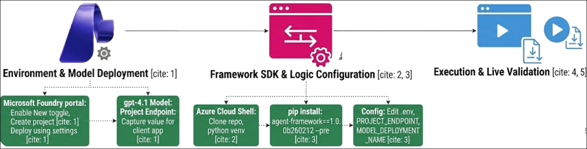

# AI-3026: Develop AI agents on Azure Workshop

Welcome to your AI-3026: Develop AI Agents on Azure workshop! We’re excited to guide you through hands-on learning with Azure AI services using Microsoft Foundry and the Azure portal. In this workshop, you’ll build, configure, and test intelligent AI agents using Microsoft Foundry.

# Lab 04: Develop an Azure AI chat agent with the Microsoft Agent Framework SDK

### Overall Estimated Duration: 30 Minutes

## Overview

In this hands-on lab, you will gain practical experience with the Microsoft Agent Framework SDK by creating an AI agent for processing expense claims. You will deploy the gpt-4.1 model in a Microsoft Foundry project, set up a Python client application in Azure Cloud Shell, and configure it with your project endpoint and deployment details. Next, you will define a custom tool to simulate sending emails and integrate it into the agent’s workflow. Finally, you will run the agent, interact with it to submit expense claims, and verify that it generates the expected email outputs based on the provided data.

## Objectives

By the end of this lab, you will be able to:

1. **Deploy a model in Microsoft Foundry:** Create a project in **Microsoft Foundry** and deploy the gpt-4.1 model with default or customized settings.

2. **Build an agent application:** Set up a Python client app using the **Microsoft Agent Framework SDK** to process expense claims.

3. **Configure and extend the app:** Connect the application to your project endpoint and model deployment using environment variables, and implement a custom tool to simulate sending expense-claim emails.

4. **Run and validate the agent:** Authenticate with Azure, execute the agent against expense data, and confirm the structured response and simulated email output.

## Pre-requisites

* Basic knowledge of the Azure portal.
* Familiarity with Microsoft Agent Framework SDK concepts such as tools and orchestration.
* Basic knowledge of Python programming.

## Architecture

The lab architecture demonstrates how an AI agent is deployed and executed inside a **Microsoft Foundry** project:.

1. **Microsoft Foundry Project**: Provides the environment to deploy the gpt-4.1 model, host the project endpoint, and manage agent experiments.

2. **Model Deployment (gpt-4.1):** The large language model endpoint used by the agent to interpret expense data, generate structured claims, and provide responses.

3. **Agent Framework SDK Agent with Tool:** An agent created in Python using the **Microsoft Agent Framework SDK**, extended with a custom tool that simulates sending expense-claim emails.

4. **Client Application (Python in Cloud Shell):** A script that connects to the Foundry project, loads expense data, and runs the agent, producing structured output and simulated email results.

## Architecture Diagram

## Explanation of Components

1. **Microsoft Foundry Project**: Central workspace that hosts the gpt-4.1 deployment, exposes the Project Endpoint, and tracks deployments and experiments your client app connects to.

2. **Model Deployment (gpt-4.1)**: The language model endpoint used by the agent to analyze expense data and generate structured claims.

3. **Agent Framework SDK Agent with Tool:** The Python agent defined with the **Microsoft Agent Framework SDK**, extended with a custom tool to simulate sending expense-claim emails.

4. **Azure Identity & Client App:** A Python script running in Cloud Shell, authenticated with AzureCliCredential, that loads expense data, calls the agent, and displays results.

5. **Expense Data Input:** Sample file containing expenses, used by the agent to build and output the structured claim for validation.

# Getting Started with lab

Welcome to your AI-3026: Develop AI Agents on Azure workshop! We’ve prepared an interactive environment to help you explore how to design, build, and deploy intelligent AI agents using Microsofts Foundry.

## Accessing Your Lab Environment
 
Once you're ready to dive in, your virtual machine and **Guide** will be right at your fingertips within your web browser.
 

### Virtual Machine & Lab Guide
 
Your virtual machine is your workhorse throughout the workshop. The lab guide is your roadmap to success.

## Exploring Your Lab Resources
 
To get a better understanding of your lab resources and credentials, navigate to the **Environment** tab.
 

## Utilizing the Split Window Feature
 
For convenience, you can open the lab guide in a separate window by selecting the **Split Window** button from the top right corner.
 

## Lab Guide Zoom In/Zoom Out
 
To adjust the zoom level for the environment page, click the **A↕: 100%** icon located next to the timer in the lab environment.

## Lab Progress

You can use the **Progress** tab to track your progress while working on the lab. A score will be provided after successful validation.

## Managing Your Virtual Machine
 
Feel free to **Start, Restart, or Stop (2)** your virtual machine as needed from the **Resources (1)** tab. Your experience is in your hands!
 

## Let's Get Started with Azure Portal
 
1. On your virtual machine, click on the **Azure Portal** icon as shown below:
 
   

1. In the sign-in window, kindly sign in using the provided Azure credentials

    - **Email/Username:** <inject key="AzureAdUserEmail"></inject>

        

    - **Temporary Access Pass:** <inject key="AzureAdUserPassword"></inject>

        

1. If prompted to **Stay signed in?**, you can click **No**.

    

1. If a **Welcome to Microsoft Azure** pop-up window appears, simply click **Maybe later** to skip the tour.

    

## Support Contact
 
The CloudLabs support team is available 24/7, 365 days a year, via email and live chat to ensure seamless assistance at any time. We offer dedicated support channels explicitly tailored for both learners and instructors, ensuring that all your needs are promptly and efficiently addressed.
 
Learner Support Contacts:
 
- Email Support: cloudlabs-support@spektrasystems.com
- Live Chat Support: https://cloudlabs.ai/labs-support

Click on **Next** from the lower right corner to move on to the next page.

   

## Happy Learning !!
