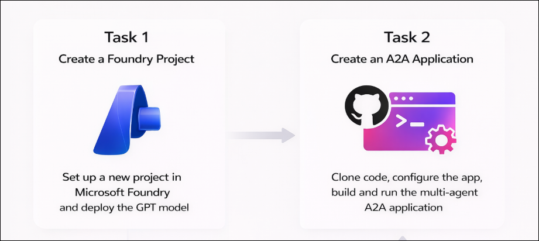

# AI-3026: Develop AI agents on Azure Workshop

Welcome to your AI-3026: Develop AI Agents on Azure workshop! We’re excited to guide you through hands-on learning with Azure AI services using Microsoft Foundry and the Azure portal. In this workshop, you’ll build, configure, and test intelligent AI agents using Microsoft Foundry.

# Lab 09: Connect to remote agents with A2A protocol

### Overall Estimated Duration: 30 Minutes

## Overview

In this hands-on lab, you will gain practical experience with the Microsoft Foundry portal by creating a project and deploying the gpt-4.1 model. You will set up a Python client application in Azure Cloud Shell, configure it with your project endpoint and model deployment details, and clone the provided GitHub repository containing the agent code. Next, you will create discoverable remote agents, including a Title Agent and an Outline Agent, and implement a Routing Agent to orchestrate communication using the A2A protocol. Finally, you will authenticate to Azure, run the multi-agent application, and interact with the agents to generate article titles and outlines.

## Objectives

By the end of this lab, you will be able to:

1. **Create and deploy a Microsoft Foundry project:** Set up a new project, deploy the gpt-4.1 model, and copy the project endpoint for use in your client application.

2. **Configure the application environment:** Set up project resources, connect the client application, and update configuration files with your project endpoint and model deployment.

3. **Implement discoverable A2A agents:** Define skills, agent cards, and executors to enable message handling and make agents interoperable through the A2A protocol.

4. **Validate multi-agent collaboration:** Run the client application, submit prompts, and confirm that agents interact and respond collaboratively.

## Pre-requisites

* Basic knowledge of the Azure portal.
* Familiarity with the Azure AI Agent Service concepts, including agents, skills, agent cards, and executors.
* Basic knowledge of Python and working in Cloud Shell or similar terminal environments.

## Architecture

The lab architecture demonstrates how multiple AI agents collaborate using the A2A protocol within a Microsoft Foundry project:

1. **Microsoft Foundry Project:** Provides the workspace to host the model deployment (*gpt-4.1*), manage endpoints, and authenticate agents.

2. **Title Agent:** Generates blog post titles based on user prompts and exposes its skills via an A2A-compatible agent card.

3. **Outline Agent:** Expands the generated title into a structured article outline and is discoverable through the A2A protocol.

4. **Routing Agent:** Orchestrates communication between agents, routes user prompts to the appropriate remote agent, and returns the combined output.

5. **Client Application:** Sends prompts to the routing agent, receives coordinated responses from the agents, and displays the results.

## Architecture Diagram

## Explanation of Components

1. **Microsoft Foundry Project:** The workspace where you create and manage your AI project. It hosts the deployed *gpt-4.1* model and provides the project endpoint that agents and client applications use for communication.

2. **Model Deployment (gpt-4.1):** The language model deployed in the Microsoft Foundry project. It powers the Title and Outline Agents, enabling them to generate content when prompted.

3. **Title and Outline Agents (A2A):** Two agents that collaborate through the A2A protocol. The Title Agent generates catchy blog post titles, while the Outline Agent expands them into structured outlines. Both agents register their skills and are discoverable via agent cards, allowing the Routing Agent to invoke them.

4. **Routing Agent (A2A server):** The orchestrator that receives prompts from the client application, discovers the Title and Outline Agents using A2A, routes messages between them, and aggregates the responses into a final result.

5. **Client Application (`run_all.py`):** A Python application that launches all agents, manages A2A-based communication, and handles end-to-end interaction. It sends prompts to the Routing Agent, enables agent-to-agent message exchange, and displays the combined output (generated title and matching outline) to the user.

# Getting Started with lab

Welcome to your AI-3026: Develop AI Agents on Azure workshop! We’ve prepared an interactive environment to help you explore how to design, build, and deploy intelligent AI agents using Microsofts Foundry.

## Accessing Your Lab Environment
 
Once you're ready to dive in, your virtual machine and **Guide** will be right at your fingertips within your web browser.
 

### Virtual Machine & Lab Guide
 
Your virtual machine is your workhorse throughout the workshop. The lab guide is your roadmap to success.

## Exploring Your Lab Resources
 
To get a better understanding of your lab resources and credentials, navigate to the **Environment** tab.
 

## Utilizing the Split Window Feature
 
For convenience, you can open the lab guide in a separate window by selecting the **Split Window** button from the top right corner.
 

## Lab Guide Zoom In/Zoom Out
 
To adjust the zoom level for the environment page, click the **A↕: 100%** icon located next to the timer in the lab environment.

## Lab Progress

You can use the **Progress** tab to track your progress while working on the lab. A score will be provided after successful validation.

## Managing Your Virtual Machine
 
Feel free to **Start, Restart, or Stop (2)** your virtual machine as needed from the **Resources (1)** tab. Your experience is in your hands!
 

## Let's Get Started with Azure Portal
 
1. On your virtual machine, click on the **Azure Portal** icon as shown below:
 
   

1. In the sign-in window, kindly sign in using the provided Azure credentials

    - **Email/Username:** <inject key="AzureAdUserEmail"></inject>

        

    - **Temporary Access Pass:** <inject key="AzureAdUserPassword"></inject>

        

1. If prompted to **Stay signed in?**, you can click **No**.

    

1. If a **Welcome to Microsoft Azure** pop-up window appears, simply click **Maybe later** to skip the tour.

    

## Support Contact
 
The CloudLabs support team is available 24/7, 365 days a year, via email and live chat to ensure seamless assistance at any time. We offer dedicated support channels explicitly tailored for both learners and instructors, ensuring that all your needs are promptly and efficiently addressed.
 
Learner Support Contacts:
 
- Email Support: cloudlabs-support@spektrasystems.com
- Live Chat Support: https://cloudlabs.ai/labs-support

Click on **Next** from the lower right corner to move on to the next page.

   

## Happy Learning !!
