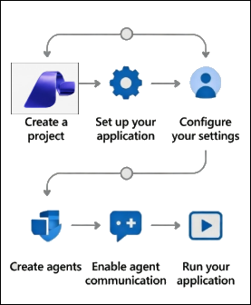

# AI-3026: Develop AI agents on Azure Workshop

Welcome to your AI-3026: Develop AI Agents on Azure workshop! We’re excited to guide you through hands-on learning with Azure AI services using Microsoft Foundry and the Azure portal. In this workshop, you’ll build, configure, and test intelligent AI agents using Microsoft Foundry.

# Lab 03:  Develop an AI agent with VS Code extension

### Overall Estimated Duration: 45 Minutes

## Overview

In this hands-on lab, you will develop and deploy an AI agent using the VS Code extension. You will sign in to Azure, create a project, and deploy a GPT-4.1 model to power the agent. Using the designer view, you will configure the agent’s instructions and integrate an MCP server tool to access external APIs. Finally, you will test the agent in the Playground and generate sample SDK code for programmatic integration.

## Objectives

By the end of this lab, you will be able to:

1. **Deploy and configure a model in Microsoft Foundry**: Create a project using the *gpt-4.1* model in the VS Code extension and deploy it for agent integration.

2. **Set up the Microsoft Foundry VS Code environment**: Install and configure the *Microsoft Foundry* extension, sign in to Azure, and connect to your project resources.

3. **Create and configure an AI agent**: Build the *data-research-agent* using the designer view, define its system instructions, and associate it with the deployed model.

4. **Integrate MCP Server tools**: Add an *MCP Server* tool to enable the agent to access external APIs and real-time documentation sources.

5. **Deploy and validate the agent workflow**: Deploy the agent to Microsoft Foundry, test it in the *Agent Playground*, and verify tool usage, responses, and conversation threads.

## Pre-requisites

* Basic knowledge of the Azure portal.
* Familiarity with the Azure AI Agent Service concepts, including agents, skills, agent cards, and executors.
* Basic knowledge of Visual Studio Code.

## Architecture

The lab architecture demonstrates how the Microsoft Foundry VS Code extension enables AI agent development with external tool integration:

1. **Microsoft Foundry Project and Deployed Model:** A project created through the Microsoft Foundry VS Code extension where the gpt-4.1 model is deployed to power the AI agent’s responses.

2. **AI Agent Configuration:** An agent configured locally in VS Code using the visual designer, where system instructions define its research-focused behavior and response strategy.

3. **MCP Server Tool Integration:** A Model Context Protocol (MCP) server connected to the agent, enabling access to external APIs and Azure documentation repositories for real-time information retrieval.

4. **Agent Deployment to Microsoft Foundry:** The configured agent is deployed to Microsoft Foundry, making it accessible as a managed cloud resource.

5. **Agents Playground Interface:** An interactive testing environment inside VS Code where users submit prompts, approve tool usage, observe MCP server calls, and review agent responses along with annotations and execution details.

## Architecture Diagram

## Explanation of Components

1. **Microsoft Foundry Project and Deployed Model:** The project acts as the central workspace created via the Microsoft Foundry extension in VS Code. Within this project, the *gpt-4.1* model is deployed and serves as the reasoning engine that processes user prompts and generates intelligent responses.

2. **AI Agent Configuration:** The agent is created using the designer interface in VS Code. It includes system instructions that define its purpose — researching information using external tools. The agent links directly to the deployed model.

3. **MCP Server Tool:** The MCP Server enables the agent to access external data sources such as Azure REST API specifications. Instead of relying only on pre-trained knowledge, the agent dynamically retrieves up-to-date documentation and API information.

4. **Agent Deployment:** After configuration, the agent is deployed to Microsoft Foundry. This makes it a managed cloud resource that can be tested in the Playground or accessed programmatically via generated SDK code.

5. **Agents Playground and Thread Monitoring:** The Playground allows interactive testing of the agent. Users can submit queries, approve MCP tool usage, and view annotations showing external data sources used. The Threads section provides execution logs and detailed run information for monitoring and validation.

# Getting Started with lab

Welcome to your AI-3026: Develop AI Agents on Azure workshop! We’ve prepared an interactive environment to help you explore how to design, build, and deploy intelligent AI agents using Microsofts Foundry.

## Accessing Your Lab Environment
 
Once you're ready to dive in, your virtual machine and **Guide** will be right at your fingertips within your web browser.
 

### Virtual Machine & Lab Guide
 
Your virtual machine is your workhorse throughout the workshop. The lab guide is your roadmap to success.

## Exploring Your Lab Resources
 
To get a better understanding of your lab resources and credentials, navigate to the **Environment** tab.
 

## Utilizing the Split Window Feature
 
For convenience, you can open the lab guide in a separate window by selecting the **Split Window** button from the top right corner.
 

## Lab Guide Zoom In/Zoom Out
 
To adjust the zoom level for the environment page, click the **A↕: 100%** icon located next to the timer in the lab environment.

## Lab Progress

You can use the **Progress** tab to track your progress while working on the lab. A score will be provided after successful validation.

## Managing Your Virtual Machine
 
Feel free to **Start, Restart, or Stop (2)** your virtual machine as needed from the **Resources (1)** tab. Your experience is in your hands!
 

## Let's Get Started with Azure Portal
 
1. On your virtual machine, click on the **Azure Portal** icon as shown below:
 
   

1. In the sign-in window, kindly sign in using the provided Azure credentials

    - **Email/Username:** <inject key="AzureAdUserEmail"></inject>

        

    - **Temporary Access Pass:** <inject key="AzureAdUserPassword"></inject>

        

1. If prompted to **Stay signed in?**, you can click **No**.

    

1. If a **Welcome to Microsoft Azure** pop-up window appears, simply click **Maybe later** to skip the tour.

    

## Support Contact
 
The CloudLabs support team is available 24/7, 365 days a year, via email and live chat to ensure seamless assistance at any time. We offer dedicated support channels explicitly tailored for both learners and instructors, ensuring that all your needs are promptly and efficiently addressed.
 
Learner Support Contacts:
 
- Email Support: cloudlabs-support@spektrasystems.com
- Live Chat Support: https://cloudlabs.ai/labs-support

Click on **Next** from the lower right corner to move on to the next page.

   

## Happy Learning !!

