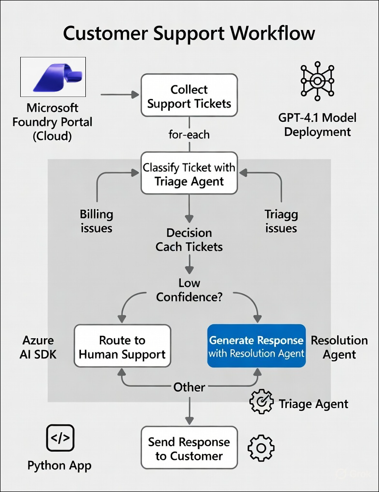

# AI-3026: Develop AI agents on Azure Workshop

Welcome to your AI-3026: Develop AI Agents on Azure workshop! We’re excited to guide you through hands-on learning with Azure AI services using Microsoft Foundry and the Azure portal. In this workshop, you’ll build, configure, and test intelligent AI agents using Microsoft Foundry.

# Lab 08: Build a workflow in Microsoft Foundry

### Overall Estimated Duration: 30 Minutes

## Overview

In this hands-on lab, you will gain hands-on experience with the end-to-end customer support automation workflow using Microsoft Foundry and Azure AI services. You will create a Foundry project, deploy the gpt-4.1 model, and configure AI agents to classify and respond to support tickets. Using the visual workflow builder, you will implement conditional logic to handle low-confidence classifications, escalate billing-related issues, and automatically generate responses for technical and general queries. Finally, you will integrate the workflow with a Python application using the Azure AI Projects SDK and execute it programmatically to simulate a real-world AI-powered support automation scenario.

## Objectives

By the end of this lab, you will be able to:

1. **Create and configure a Microsoft Foundry project**: Set up a new Foundry project, deploy the *gpt-4.1* model, and create AI agents for ticket classification and resolution.

2. **Build a sequential AI workflow**: Design a customer support triage workflow using variables, loops, agent invocation, and conditional logic in the Foundry workflow builder.

3. **Implement intelligent routing and escalation logic**: Classify support tickets, evaluate confidence scores, escalate billing issues, and automate responses for technical and general queries.

4. **Generate structured and dynamic responses using AI agents**: Configure agents to return structured JSON outputs and draft professional customer support responses.

5. **Integrate and execute the workflow using Python**: Connect to the workflow programmatically using the Azure AI Projects SDK, run it from Azure Cloud Shell, and validate end-to-end execution.

## Pre-requisites

* Basic knowledge of the Azure portal and Azure Cloud Shell.  
* Familiarity with Microsoft Foundry concepts such as projects, agents, and workflows.  
* Basic understanding of AI agent workflows and conditional logic.  
* Basic knowledge of Python and running scripts from a command-line environment. 

## Architecture

The lab architecture demonstrateshow a Microsoft Foundry project enables AI-powered customer support automation through SDK-based agent orchestration, intelligent ticket classification, confidence-based routing, and automated response generation:

1. **Microsoft Foundry Project:** A workspace created in the Microsoft Foundry portal where you deploy foundation models and manage AI agent configurations for customer support automation.

2. **Deployment Model (gpt- 4.1):** A model deployed within the project that processes support ticket prompts, performs classification, evaluates confidence levels, and generates conversational responses.

3. **Triage Agent (SDK-Defined):** An agent defined programmatically using the Azure AI SDK, configured with instructions to analyze incoming tickets, classify issues, and determine routing decisions.

4. **Resolution Agent:** An AI agent responsible for generating automated responses for high-confidence tickets using the deployed GPT-4.1 model.

5. **Confidence-Based Decision Logic:** A routing mechanism that evaluates the model’s confidence score and determines whether to automate the response or escalate the ticket.

6. **Human Support Escalation:** A fallback process that routes low-confidence tickets to human agents to ensure accuracy and quality control.

## Architecture Diagram

## Explanation of Components

1. **Microsoft Foundry Project:** The central cloud workspace where foundation models are deployed, and AI agents are configured to handle the customer support workflow.

2. **Deployment Model (gpt- 4.1):** The core language model that interprets ticket content, performs reasoning, assigns classifications, and generates contextual responses.

3. **Triage Agent (SDK-Defined):** A programmatically created agent that reviews each incoming ticket, categorizes the issue type, and evaluates confidence for routing decisions.

4. **Resolution Agent:** An AI agent that prepares customer-ready responses for tickets that meet the required confidence threshold.

5. **Confidence-Based Decision Logic:** A control mechanism that determines whether a ticket should be automatically resolved or forwarded for human review.

6. **Human Support Escalation:** A safeguard step that transfers uncertain or complex cases to human representatives for manual handling.

# Getting Started with lab

Welcome to your AI-3026: Develop AI Agents on Azure workshop! We’ve prepared an interactive environment to help you explore how to design, build, and deploy intelligent AI agents using Microsoft's Foundry.

## Accessing Your Lab Environment
 
Once you're ready to dive in, your virtual machine and **Guide** will be right at your fingertips within your web browser.
 

### Virtual Machine & Lab Guide
 
Your virtual machine is your workhorse throughout the workshop. The lab guide is your roadmap to success.

## Exploring Your Lab Resources
 
To get a better understanding of your lab resources and credentials, navigate to the **Environment** tab.
 

## Utilizing the Split Window Feature
 
For convenience, you can open the lab guide in a separate window by selecting the **Split Window** button from the top right corner.
 

## Lab Guide Zoom In/Zoom Out
 
To adjust the zoom level for the environment page, click the **A↕: 100%** icon located next to the timer in the lab environment.

## Lab Progress

You can use the **Progress** tab to track your progress while working on the lab. A score will be provided after successful validation.

## Managing Your Virtual Machine
 
Feel free to **Start, Restart, or Stop (2)** your virtual machine as needed from the **Resources (1)** tab. Your experience is in your hands!
 

## Let's Get Started with Azure Portal
 
1. On your virtual machine, click on the **Azure Portal** icon as shown below:
 
   

1. In the sign-in window, kindly sign in using the provided Azure credentials

    - **Email/Username:** <inject key="AzureAdUserEmail"></inject>

        

    - **Temporary Access Pass:** <inject key="AzureAdUserPassword"></inject>

        

1. If prompted to **Stay signed in?**, you can click **No**.

    

1. If a **Welcome to Microsoft Azure** pop-up window appears, simply click **Maybe later** to skip the tour.

    

## Support Contact
 
The CloudLabs support team is available 24/7, 365 days a year, via email and live chat to ensure seamless assistance at any time. We offer dedicated support channels explicitly tailored for both learners and instructors, ensuring that all your needs are promptly and efficiently addressed.
 
Learner Support Contacts:
 
- Email Support: cloudlabs-support@spektrasystems.com
- Live Chat Support: https://cloudlabs.ai/labs-support

Click on **Next** from the lower right corner to move on to the next page.

   

## Happy Learning !!

