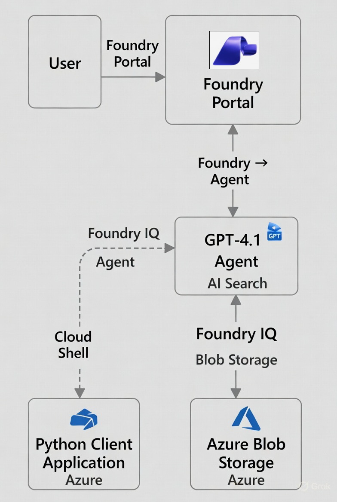

# AI-3026: Develop AI agents on Azure Workshop

Welcome to your AI-3026: Develop AI Agents on Azure workshop! We’re excited to guide you through hands-on learning with Azure AI services using Microsoft Foundry and the Azure portal. In this workshop, you’ll build, configure, and test intelligent AI agents using Microsoft Foundry.

# Lab 09: Integrate an AI agent with Foundry IQ

### Overall Estimated Duration: 60 Minutes

## Overview

In this hands-on lab, you will use Microsoft Azure AI Foundry to build an intelligent agent integrated with Foundry IQ for enterprise knowledge retrieval. You will create and deploy a GPT–4.1–based agent, connect it to an Azure AI Search–powered knowledge base, and ground it with product documents stored in Azure Blob Storage. You will then test the agent in the Foundry playground and connect to it programmatically using the Python SDK from Azure Cloud Shell. This lab demonstrates how to build conversational AI solutions that can search and retrieve enterprise knowledge while maintaining context.

## Objectives

By the end of this lab, you will be able to:

1. **Create and configure a Foundry project**: Set up a new project in Microsoft Azure AI Foundry and deploy the *gpt-4.1* model as an intelligent agent.

2. **Integrate Foundry IQ with enterprise data**: Connect the agent to Azure AI Search and ground it using product documents stored in Azure Blob Storage.

3. **Create and manage a knowledge base**: Configure a knowledge source, enable embeddings, and associate the knowledge base with the deployed agent.

4. **Test and validate the agent in the playground**: Verify that the agent retrieves accurate, cited information from enterprise documents while maintaining conversation context.

5. **Connect to the agent programmatically using Python**: Clone a GitHub repository, configure environment settings, implement agent client logic, handle MCP approval workflows, and execute the solution from Azure Cloud Shell.

## Pre-requisites

* Basic knowledge of the Azure portal and Azure Cloud Shell.  
* Familiarity with Microsoft Azure AI Foundry concepts such as projects, agents, and model deployments.  
* Basic understanding of Azure AI Search and Azure Blob Storage.  
* Basic knowledge of Python and running scripts from a command-line environment.  

## Architecture

The lab architecture demonstrates how a Microsoft Foundry project integrates GPT-4.1 with Foundry IQ and Azure Blob Storage to enable intelligent document retrieval and AI-powered search using SDK-based interaction:

1. **Microsoft Foundry Project:** A workspace created in the Microsoft Foundry portal where models, agents, and AI Search configurations are deployed and managed.

2. **Deployment Model (gpt- 4.1):** A model deployed within the project that processes user queries and generates intelligent responses based on retrieved knowledge.

3. **Foundry IQ:** A knowledge integration layer that connects the AI agent with indexed content stored in Azure Blob Storage for retrieval-based responses.

4. **Azure Blob Storage:** A cloud storage service used to store documents and data that are indexed and accessed by Foundry IQ for AI search.

5. **Python Client Application:** A client application that connects to the Foundry project endpoint, authenticates using Azure credentials, sends user queries, and retrieves AI-generated responses.

## Architecture Diagram

## Explanation of Components

1. **Microsoft Foundry Project:** The central cloud workspace where foundation models are deployed, and AI agents are configured to handle the customer support workflow.

2. **Deployment Model (gpt- 4.1):** The core AI agent that processes queries and uses AI Search capabilities to generate informed responses.

3. **Foundry IQ:** A retrieval mechanism that indexes and fetches relevant content from connected storage to support grounded responses..

4. **Azure Blob Storage:** The data repository that stores documents and structured files used for knowledge retrieval.

5. **Python Client Application:** A Cloud Shell–based application that programmatically sends queries to the agent and receives generated outputs.

# Getting Started with lab

Welcome to your AI-3026: Develop AI Agents on Azure workshop! We’ve prepared an interactive environment to help you explore how to design, build, and deploy intelligent AI agents using Microsoft's Foundry.

## Accessing Your Lab Environment
 
Once you're ready to dive in, your virtual machine and **Guide** will be right at your fingertips within your web browser.
 

### Virtual Machine & Lab Guide
 
Your virtual machine is your workhorse throughout the workshop. The lab guide is your roadmap to success.

## Exploring Your Lab Resources
 
To get a better understanding of your lab resources and credentials, navigate to the **Environment** tab.
 

## Utilizing the Split Window Feature
 
For convenience, you can open the lab guide in a separate window by selecting the **Split Window** button from the top right corner.
 

## Lab Guide Zoom In/Zoom Out
 
To adjust the zoom level for the environment page, click the **A↕: 100%** icon located next to the timer in the lab environment.

## Lab Progress

You can use the **Progress** tab to track your progress while working on the lab. A score will be provided after successful validation.

## Managing Your Virtual Machine
 
Feel free to **Start, Restart, or Stop (2)** your virtual machine as needed from the **Resources (1)** tab. Your experience is in your hands!
 

## Let's Get Started with Azure Portal
 
1. On your virtual machine, click on the **Azure Portal** icon as shown below:
 
   

1. In the sign-in window, kindly sign in using the provided Azure credentials

    - **Email/Username:** <inject key="AzureAdUserEmail"></inject>

        

    - **Temporary Access Pass:** <inject key="AzureAdUserPassword"></inject>

        

1. If prompted to **Stay signed in?**, you can click **No**.

    

1. If a **Welcome to Microsoft Azure** pop-up window appears, simply click **Maybe later** to skip the tour.

    

## Support Contact
 
The CloudLabs support team is available 24/7, 365 days a year, via email and live chat to ensure seamless assistance at any time. We offer dedicated support channels explicitly tailored for both learners and instructors, ensuring that all your needs are promptly and efficiently addressed.
 
Learner Support Contacts:
 
- Email Support: cloudlabs-support@spektrasystems.com
- Live Chat Support: https://cloudlabs.ai/labs-support

Click on **Next** from the lower right corner to move on to the next page.

   

## Happy Learning !!
